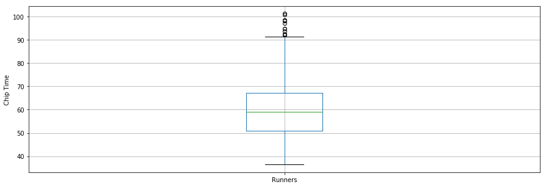
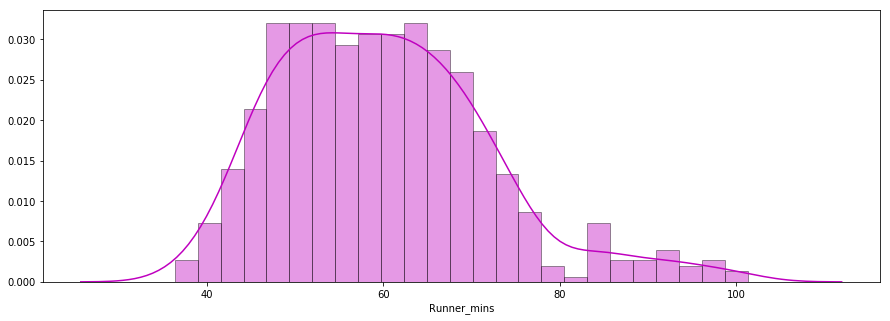
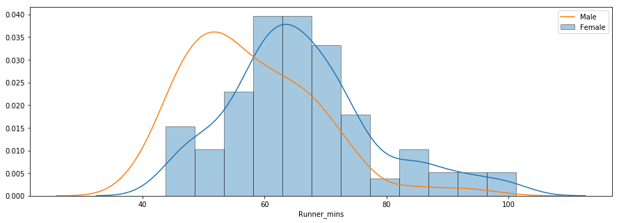
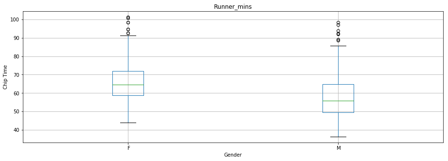

```python
import pandas as pd
import numpy as np
import matplotlib.pyplot as plt
import seaborn as sns
%matplotlib inline
```


```python
from urllib.request import urlopen
from bs4 import BeautifulSoup
```


```python
url = "http://www.hubertiming.com/results/2017GPTR10K"
html = urlopen(url)
```


```python
soup = BeautifulSoup(html, 'lxml')
type(soup)
```


    bs4.BeautifulSoup


```python
# Get the title
title = soup.title
print(title)
```

    <title>2017 Intel Great Place to Run 10K \ Urban Clash Games Race Results</title>
    


```python
# print out the text
text = soup.get_text()
print(text)
```

    
    
    
    
    
    
    
    2017 Intel Great Place to Run 10K \ Urban Clash Games Race Results
    
    
    
    
    
    
            @media print {
                .noprint {
                    display: none;
                }
    
                .dataTables_filter {
                    display: none;
                }
            }
            #individualResults tbody tr {
                cursor: pointer;
            }
            .video-container {
                position: relative;
                padding-bottom: 56.25%; /* 16:9 */
                padding-top: 25px;
                height: 0;
            }
            .video-container iframe {
                position: absolute;
                top: 0;
                left: 0;
                width: 100%;
                height: 100%;
            }
            .dataTables_wrapper .dataTables_paginate {
                float: right;
                text-align: right;
                padding-top: 0.25em;
            }
            .dataTables_wrapper .dataTables_paginate .paginate_button {
                    box-sizing: border-box;
                    display: inline-block;
                    min-width: 1.5em;
                    padding: 0.5em 1em;
                    margin-left: 2px;
                    text-align: center;
                    text-decoration: none !important;
                    cursor: pointer;
                    *cursor: hand;
                    color: #333333 !important;
                    border: 1px solid transparent;
                }
    
            .dataTables_wrapper .dataTables_paginate .paginate_button.current, .dataTables_wrapper .dataTables_paginate .paginate_button.current:hover {
                    color: #333333 !important;
                    border: 1px solid #cacaca;
                    background-color: white;
                    background: -webkit-gradient(linear, left top, left bottom, color-stop(0%, white), color-stop(100%, gainsboro));
                    /* Chrome,Safari4+ */
                    background: -webkit-linear-gradient(top, white 0%, gainsboro 100%);
                    /* Chrome10+,Safari5.1+ */
                    background: -moz-linear-gradient(top, white 0%, gainsboro 100%);
                    /* FF3.6+ */
                    background: -ms-linear-gradient(top, white 0%, gainsboro 100%);
                    /* IE10+ */
                    background: -o-linear-gradient(top, white 0%, gainsboro 100%);
                    /* Opera 11.10+ */
                    background: linear-gradient(to bottom, white 0%, gainsboro 100%);
                    /* W3C */
                }
    
                .dataTables_wrapper .dataTables_paginate .paginate_button.disabled, .dataTables_wrapper .dataTables_paginate .paginate_button.disabled:hover, .dataTables_wrapper .dataTables_paginate .paginate_button.disabled:active {
                    cursor: default;
                    color: #666 !important;
                    border: 1px solid transparent;
                    background: transparent;
                    box-shadow: none;
                }
    
                .dataTables_wrapper .dataTables_paginate .paginate_button:hover {
                    color: white !important;
                    border: 1px solid #111111;
                    background-color: #585858;
                    background: -webkit-gradient(linear, left top, left bottom, color-stop(0%, #585858), color-stop(100%, #111111));
                    /* Chrome,Safari4+ */
                    background: -webkit-linear-gradient(top, #585858 0%, #111111 100%);
                    /* Chrome10+,Safari5.1+ */
                    background: -moz-linear-gradient(top, #585858 0%, #111111 100%);
                    /* FF3.6+ */
                    background: -ms-linear-gradient(top, #585858 0%, #111111 100%);
                    /* IE10+ */
                    background: -o-linear-gradient(top, #585858 0%, #111111 100%);
                    /* Opera 11.10+ */
                    background: linear-gradient(to bottom, #585858 0%, #111111 100%);
                    /* W3C */
                }
    
                .dataTables_wrapper .dataTables_paginate .paginate_button:active {
                    outline: none;
                    background-color: #2b2b2b;
                    background: -webkit-gradient(linear, left top, left bottom, color-stop(0%, #2b2b2b), color-stop(100%, #0c0c0c));
                    /* Chrome,Safari4+ */
                    background: -webkit-linear-gradient(top, #2b2b2b 0%, #0c0c0c 100%);
                    /* Chrome10+,Safari5.1+ */
                    background: -moz-linear-gradient(top, #2b2b2b 0%, #0c0c0c 100%);
                    /* FF3.6+ */
                    background: -ms-linear-gradient(top, #2b2b2b 0%, #0c0c0c 100%);
                    /* IE10+ */
                    background: -o-linear-gradient(top, #2b2b2b 0%, #0c0c0c 100%);
                    /* Opera 11.10+ */
                    background: linear-gradient(to bottom, #2b2b2b 0%, #0c0c0c 100%);
                    /* W3C */
                    box-shadow: inset 0 0 3px #111;
                }
    
            .dataTables_wrapper .dataTables_processing {
                position: absolute;
                top: 50%;
                left: 50%;
                width: 100%;
                height: 40px;
                margin-left: -50%;
                margin-top: -25px;
                padding-top: 20px;
                text-align: center;
                font-size: 1.2em;
                background-color: white;
                background: -webkit-gradient(linear, left top, right top, color-stop(0%, rgba(255, 255, 255, 0)), color-stop(25%, rgba(255, 255, 255, 0.9)), color-stop(75%, rgba(255, 255, 255, 0.9)), color-stop(100%, rgba(255, 255, 255, 0)));
                /* Chrome,Safari4+ */
                background: -webkit-linear-gradient(left, rgba(255, 255, 255, 0) 0%, rgba(255, 255, 255, 0.9) 25%, rgba(255, 255, 255, 0.9) 75%, rgba(255, 255, 255, 0) 100%);
                /* Chrome10+,Safari5.1+ */
                background: -moz-linear-gradient(left, rgba(255, 255, 255, 0) 0%, rgba(255, 255, 255, 0.9) 25%, rgba(255, 255, 255, 0.9) 75%, rgba(255, 255, 255, 0) 100%);
                /* FF3.6+ */
                background: -ms-linear-gradient(left, rgba(255, 255, 255, 0) 0%, rgba(255, 255, 255, 0.9) 25%, rgba(255, 255, 255, 0.9) 75%, rgba(255, 255, 255, 0) 100%);
                /* IE10+ */
                background: -o-linear-gradient(left, rgba(255, 255, 255, 0) 0%, rgba(255, 255, 255, 0.9) 25%, rgba(255, 255, 255, 0.9) 75%, rgba(255, 255, 255, 0) 100%);
                /* Opera 11.10+ */
                background: linear-gradient(to right, rgba(255, 255, 255, 0) 0%, rgba(255, 255, 255, 0.9) 25%, rgba(255, 255, 255, 0.9) 75%, rgba(255, 255, 255, 0) 100%);
                /* W3C */
            }
    
            .dataTables_wrapper .dataTables_length,
            .dataTables_wrapper .dataTables_filter,
            .dataTables_wrapper .dataTables_info,
            .dataTables_wrapper .dataTables_processing,
            .dataTables_wrapper .dataTables_paginate {
                color: #333333;
            }
    
        
    
    
            body {
                margin: 0;
                font-family: "Helvetica Neue",Helvetica,Arial,sans-serif;
                font-size: 16px;
                line-height: 18px;
                color: #333;
                background-color: #fff;
            }
    
    
            .ui-widget {
                font-family: "Helvetica Neue",Helvetica,Arial,sans-serif;
                font-size: 16px;
            }
    
            /* Should consider switching to font awesome icons so they appear larger */
            #tabs li .ui-icon-close {
                float: left;
                margin: 10px 0px 0px 0px;
                cursor: pointer;
            }
    
            .ui-state-default, .ui-widget-content .ui-state-default, .ui-widget-header .ui-state-default {
                font-weight: bold;
                color: #ffffff;
            }
    
            /* Remove border. Make this work a little better on mobile devices. Not true responsive though.*/
            .ui-widget-content {
                border: none;
            }
    
            .alert-info {
                margin-bottom:0;
                width: 100%;
            }
            .table td {
                padding: .5rem;
            }
        
    
    
    
    
    
    
    
    
    
    5K
    10K
    
    
    
    
     2017 Intel Great Place to Run 10K \ Urban Clash Games
     Hillsboro Stadium, Hillsboro, OR
     June 2nd, 2017
    
                            
    
    
    
    
    
    Huber Timing Home
    
    
    Finishers:577
    Male:414
    Female:163
    
    
    
    
    
    
    
                [Individual Results]
                [Team Results] 
    
    
                    Email timing@hubertiming.com with any questions or corrections. Please include your bib number if you have it.
    
    
    
    
    
    Results
    
    
    
    
    
    
    
    Place
    Bib
    Name
    Gender
    City
    State
    Chip Time
    Chip Pace
    Gender Place
    Age Group
    Age Group Place
    Time to Start
    Gun Time
    Team
    
    
    
    
    1
    814
    JARED WILSON
    M
    TIGARD
    OR
    00:36:21
    05:51
    1 of 414
    M 36-45
    1 of 152
    00:00:03
    00:36:24
    
    
    
    2
    573
    NATHAN A SUSTERSIC
    M
    PORTLAND
    OR
    00:36:42
    05:55
    2 of 414
    M 26-35
    1 of 154
    00:00:03
    00:36:45
    INTEL TEAM F
    
    
    3
    687
    FRANCISCO MAYA
    M
    PORTLAND
    OR
    00:37:44
    06:05
    3 of 414
    M 46-55
    1 of 64
    00:00:04
    00:37:48
    
    
    
    4
    623
    PAUL MORROW
    M
    BEAVERTON
    OR
    00:38:34
    06:13
    4 of 414
    M 36-45
    2 of 152
    00:00:03
    00:38:37
    
    
    
    5
    569
    DEREK G OSBORNE
    M
    HILLSBORO
    OR
    00:39:21
    06:20
    5 of 414
    M 26-35
    2 of 154
    00:00:03
    00:39:24
    INTEL TEAM F
    
    
    6
    642
    JONATHON TRAN
    M
    PORTLAND
    OR
    00:39:49
    06:25
    6 of 414
    M 18-25
    1 of 34
    00:00:06
    00:39:55
    
    
    
    7
    144
    GEORGE TOTONCHY
    M
    PORTLAND
    OR
    00:40:04
    06:27
    7 of 414
    M 36-45
    3 of 152
    00:00:13
    00:40:17
    
    
    
    8
    395
    BENJAMIN C CHAFFIN
    M
    PORTLAND
    OR
    00:40:05
    06:27
    8 of 414
    M 36-45
    4 of 152
    00:00:04
    00:40:09
    
    
    
    9
    7
    BRANDON THOMAS
    M
    
    
    00:40:17
    06:29
    9 of 414
    M 26-35
    3 of 154
    00:00:07
    00:40:24
    COLUMBIA TEAM B
    
    
    10
    3
    ERIK BJORNSTAD
    M
    
    
    00:40:21
    06:30
    10 of 414
    M 36-45
    5 of 152
    00:00:04
    00:40:25
    COLUMBIA TEAM A
    
    
    11
    68
    WITALI SPULING
    M
    PORTLAND
    OR
    00:40:28
    06:31
    11 of 414
    M 26-35
    4 of 154
    00:00:12
    00:40:40
    DTNA1
    
    
    12
    788
    ANDY WEDAM
    M
    PORTLAND
    OR
    00:40:36
    06:33
    12 of 414
    M 36-45
    6 of 152
    00:00:06
    00:40:42
    DTNA2
    
    
    13
    729
    MICHAEL P GEORGE
    M
    PORTLAND
    OR
    00:40:43
    06:34
    13 of 414
    M 18-25
    2 of 34
    00:00:07
    00:40:50
    
    
    
    14
    151
    ETHAN JORDAN
    M
    PORTLAND
    OR
    00:41:01
    06:37
    14 of 414
    M 36-45
    7 of 152
    00:00:12
    00:41:13
    
    
    
    15
    758
    FLAVIO GRIGGIO
    M
    PORTLAND
    OR
    00:41:19
    06:39
    15 of 414
    M 26-35
    5 of 154
    00:00:05
    00:41:24
    
    
    
    16
    868
    WILLIAM BARRY
    M
    BEAVERTON
    OR
    00:41:43
    06:43
    16 of 414
    M 46-55
    2 of 64
    00:00:06
    00:41:49
    INTEL TEAM K
    
    
    17
    2
    JIM DROZDOWSKI
    M
    
    
    00:41:59
    06:46
    17 of 414
    M 46-55
    3 of 64
    00:00:03
    00:42:02
    COLUMBIA TEAM A
    
    
    18
    362
    BRITON BARKER
    M
    HILLSBORO
    OR
    00:42:23
    06:50
    18 of 414
    M 36-45
    8 of 152
    00:00:05
    00:42:28
    
    
    
    19
    755
    NEILANJAN DUTTA
    M
    HILLSBORO
    OR
    00:42:29
    06:51
    19 of 414
    M 26-35
    6 of 154
    00:00:05
    00:42:34
    
    
    
    20
    543
    KENNETH KLOTZ
    M
    EUGENE
    OR
    00:42:35
    06:52
    20 of 414
    M 26-35
    7 of 154
    00:00:13
    00:42:48
    
    
    
    21
    401
    EDDIE J FRIE
    M
    HILLSBORO
    OR
    00:42:36
    06:52
    21 of 414
    M 46-55
    4 of 64
    00:00:16
    00:42:52
    INTEL TEAM K
    
    
    22
    155
    JARED PAGER
    M
    PORTLAND
    OR
    00:42:37
    06:52
    22 of 414
    M 26-35
    8 of 154
    00:00:21
    00:42:58
    
    
    
    23
    781
    DAVID HERRON
    M
    PORTLAND
    OR
    00:42:56
    06:55
    23 of 414
    M 26-35
    9 of 154
    00:00:08
    00:43:04
    FXG1
    
    
    24
    468
    TIMOTHY WESLEY
    M
    NOT SPECIFIED
    OR
    00:43:26
    07:00
    24 of 414
    M 18-25
    3 of 34
    00:00:10
    00:43:36
    
    
    
    25
    882
    MONROE SULLIVAN
    M
    PORTLAND
    OR
    00:43:27
    07:00
    25 of 414
    M 46-55
    5 of 64
    00:00:03
    00:43:30
    
    
    
    26
    236
    VINCENT OLSEN
    M
    BOISE
    ID
    00:43:40
    07:02
    26 of 414
    M 36-45
    9 of 152
    00:00:03
    00:43:43
    
    
    
    27
    742
    LEONARD NEIBERG
    M
    PORTLAND
    OR
    00:43:42
    07:02
    27 of 414
    M 46-55
    6 of 64
    00:00:19
    00:44:01
    
    
    
    28
    344
    BENJAMIN JANN
    M
    HILLSBORO
    OR
    00:43:43
    07:03
    28 of 414
    M 36-45
    10 of 152
    00:00:09
    00:43:52
    
    
    
    29
    732
    ANDREW HUNTER
    M
    BEAVERTON
    OR
    00:43:46
    07:03
    29 of 414
    M 36-45
    11 of 152
    00:00:05
    00:43:51
    
    
    
    30
    253
    SAMANTHA BAGLEY
    F
    HILLSBORO
    OR
    00:43:46
    07:03
    1 of 163
    F 18-25
    1 of 21
    00:00:07
    00:43:53
    INTEL TEAM K
    
    
    31
    674
    TAYSEER MAHDI
    F
    HILLSBORO
    OR
    00:43:47
    07:03
    2 of 163
    F 26-35
    1 of 59
    00:00:05
    00:43:52
    
    
    
    32
    761
    CHEN-GUAN LEE
    M
    PORTLAND
    OR
    00:43:47
    07:03
    30 of 414
    M 26-35
    10 of 154
    00:00:05
    00:43:52
    
    
    
    33
    560
    LEONARDO PEREZ
    M
    HILLSBORO
    OR
    00:44:04
    07:06
    31 of 414
    M 26-35
    11 of 154
    00:00:06
    00:44:10
    
    
    
    34
    789
    VASILIOS TSIRIMIAGOS
    M
    PORTLAND
    OR
    00:44:05
    07:06
    32 of 414
    M 36-45
    12 of 152
    00:00:07
    00:44:12
    DTNA2
    
    
    35
    807
    DAN CAMPBELL
    M
    HILLSBORO
    OR
    00:44:06
    07:06
    33 of 414
    M 36-45
    13 of 152
    00:00:12
    00:44:18
    
    
    
    36
    646
    JANELLE M KLASER
    F
    PORTLAND
    OR
    00:44:07
    07:06
    3 of 163
    F 36-45
    1 of 56
    00:00:10
    00:44:17
    
    
    
    37
    740
    YOSHIYASU YAMAKAWA
    M
    PORTLAND
    OR
    00:44:23
    07:09
    34 of 414
    M 36-45
    14 of 152
    00:00:06
    00:44:29
    
    
    
    38
    874
    JONATHAN M MARTIN
    M
    PORTLAND
    OR
    00:44:38
    07:12
    35 of 414
    M 18-25
    4 of 34
    00:00:31
    00:45:09
    
    
    
    39
    361
    RICHARD FLORES
    M
    PORTLAND
    OR
    00:44:41
    07:12
    36 of 414
    M 36-45
    15 of 152
    00:00:29
    00:45:10
    
    
    
    40
    710
    DAVID W GAIBLER
    M
    PORTLAND
    OR
    00:44:42
    07:12
    37 of 414
    M 36-45
    16 of 152
    00:00:04
    00:44:46
    
    
    
    41
    791
    ANDRE RAUCH
    M
    PORTLAND
    OR
    00:44:48
    07:13
    38 of 414
    M 26-35
    12 of 154
    00:00:13
    00:45:01
    DTNA2
    
    
    42
    867
    JOSHUA FEDDERLY
    M
    BEAVERTON
    OR
    00:45:03
    07:15
    39 of 414
    M 36-45
    17 of 152
    00:00:43
    00:45:46
    
    
    
    43
    142
    TONDERAI NEMARUNDWE
    M
    BEAVERTON
    OR
    00:45:05
    07:16
    40 of 414
    M 26-35
    13 of 154
    00:00:04
    00:45:09
    
    
    
    44
    787
    JONATHAN PARSONS
    M
    PORTLAND
    OR
    00:45:10
    07:17
    41 of 414
    M 18-25
    5 of 34
    00:00:12
    00:45:22
    DTNA2
    
    
    45
    673
    PIETER ROWLETTE
    M
    PORTLAND
    OR
    00:45:11
    07:17
    42 of 414
    M 36-45
    18 of 152
    00:00:19
    00:45:30
    
    
    
    46
    746
    RAMON CALDERER
    M
    PORTLAND
    OR
    00:45:11
    07:17
    43 of 414
    M 26-35
    14 of 154
    00:00:07
    00:45:18
    
    
    
    47
    770
    JONATHAN M HATFIELD
    M
    PORTLAND
    OR
    00:45:13
    07:17
    44 of 414
    M 36-45
    19 of 152
    00:00:22
    00:45:35
    
    
    
    48
    622
    DAVID N GOLDSTEIN
    M
    BEAVERTON
    OR
    00:45:14
    07:17
    45 of 414
    M 36-45
    20 of 152
    00:00:18
    00:45:32
    
    
    
    49
    625
    GREGORY M RUTTER
    M
    HILLSBORO
    OR
    00:45:15
    07:17
    46 of 414
    M 26-35
    15 of 154
    00:00:11
    00:45:26
    
    
    
    50
    635
    STEFAN MEISTER
    M
    NOT SPECIFIED
    OR
    00:45:17
    07:18
    47 of 414
    M 36-45
    21 of 152
    00:00:07
    00:45:24
    
    
    
    51
    765
    MATT TRAVERSO
    M
    HILLSBORO
    OR
    00:45:27
    07:19
    48 of 414
    M 26-35
    16 of 154
    00:00:26
    00:45:53
    
    
    
    52
    438
    KEN W GILDERSLEEVE
    M
    PORTLAND
    OR
    00:45:28
    07:20
    49 of 414
    M 26-35
    17 of 154
    00:00:06
    00:45:34
    
    
    
    53
    582
    ANDREW L HERTEL
    M
    HILLSBORO
    OR
    00:45:29
    07:20
    50 of 414
    M 26-35
    18 of 154
    00:00:13
    00:45:42
    INTEL TEAM A
    
    
    54
    696
    CHRISTOPHER L QUAM
    M
    PORTLAND
    OR
    00:45:36
    07:21
    51 of 414
    M 26-35
    19 of 154
    00:00:55
    00:46:31
    
    
    
    55
    580
    SICELO MASANGO
    M
    HILLSBORO
    OR
    00:45:36
    07:21
    52 of 414
    M 26-35
    20 of 154
    00:00:41
    00:46:17
    
    
    
    56
    558
    CHAD MUSZYNSKI
    M
    HILLSBORO
    OR
    00:45:40
    07:22
    53 of 414
    M 36-45
    22 of 152
    00:00:19
    00:45:59
    
    
    
    57
    47
    FUMIE K WEIBY
    F
    PORTLAND
    OR
    00:45:40
    07:22
    4 of 163
    F 36-45
    2 of 56
    00:00:22
    00:46:02
    
    
    
    58
    303
    AURELIEN T MOZIPO
    M
    BEAVERTON
    OR
    00:45:49
    07:23
    54 of 414
    M 46-55
    7 of 64
    00:00:08
    00:45:57
    
    
    
    59
    271
    KYLE H AMBERT
    M
    TIGARD
    OR
    00:45:55
    07:24
    55 of 414
    M 36-45
    23 of 152
    00:00:10
    00:46:05
    INTEL TEAM I
    
    
    60
    39
    BRANDON LADICK
    M
    PORTLAND
    OR
    00:46:02
    07:25
    56 of 414
    M 26-35
    21 of 154
    00:00:05
    00:46:07
    
    
    
    61
    223
    ADRIAN POP
    M
    WEST LINN
    OR
    00:46:13
    07:27
    57 of 414
    M 36-45
    24 of 152
    00:00:03
    00:46:16
    
    
    
    62
    671
    AARON G JOHNSON
    M
    HILLSBORO
    OR
    00:46:20
    07:28
    58 of 414
    M 26-35
    22 of 154
    00:00:19
    00:46:39
    
    
    
    63
    574
    MATTHEW BROWN
    M
    ALOHA
    OR
    00:46:23
    07:28
    59 of 414
    M 36-45
    25 of 152
    00:00:05
    00:46:28
    
    
    
    64
    349
    EDMONDO MAZZULLI
    M
    HILLSBORO
    OR
    00:46:26
    07:29
    60 of 414
    M 26-35
    23 of 154
    00:00:07
    00:46:33
    INTEL TEAM B
    
    
    65
    423
    MILES F SCHWARTZ
    M
    PORTLAND
    OR
    00:46:33
    07:30
    61 of 414
    M 36-45
    26 of 152
    00:00:25
    00:46:58
    
    
    
    66
    783
    LEO SOTO
    M
    PORTLAND
    OR
    00:46:35
    07:30
    62 of 414
    M 26-35
    24 of 154
    00:01:26
    00:48:01
    FXG1
    
    
    67
    13
    NICHOLAS FISCHER
    M
    
    
    00:46:41
    07:31
    63 of 414
    M 36-45
    27 of 152
    00:00:21
    00:47:02
    COLUMBIA TEAM D
    
    
    68
    327
    CHASE MCCLOSKEY
    M
    HILLSBORO
    OR
    00:46:42
    07:32
    64 of 414
    M 18-25
    6 of 34
    00:00:11
    00:46:53
    
    
    
    69
    67
    INGA ANDREYEVA
    F
    PORTLAND
    OR
    00:46:45
    07:32
    5 of 163
    F 18-25
    2 of 21
    00:00:12
    00:46:57
    DTNA1
    
    
    70
    283
    THOR SEWELL
    M
    BEAVERTON
    OR
    00:46:46
    07:32
    65 of 414
    M 46-55
    8 of 64
    00:00:20
    00:47:06
    
    
    
    71
    153
    TODD HARRIS
    M
    PORTLAND
    OR
    00:46:47
    07:32
    66 of 414
    M 46-55
    9 of 64
    00:00:13
    00:47:00
    
    
    
    72
    606
    ABHIRAM MURALIDHAR
    M
    HILLSBORO
    OR
    00:46:49
    07:33
    67 of 414
    M 26-35
    25 of 154
    00:01:00
    00:47:49
    
    
    
    73
    841
    JACK E LUBY
    M
    PORTLAND
    OR
    00:46:49
    07:33
    68 of 414
    M 18-25
    7 of 34
    00:00:07
    00:46:56
    
    
    
    74
    49
    AURORE LARIVEN
    F
    PORTLAND
    CA
    00:46:52
    07:33
    6 of 163
    F 36-45
    3 of 56
    00:00:17
    00:47:09
    
    
    
    75
    704
    RYAN MANIS
    M
    BEAVERTON
    OR
    00:46:55
    07:34
    69 of 414
    M 26-35
    26 of 154
    00:01:59
    00:48:54
    
    
    
    76
    393
    LUCAS M JENISON
    M
    BEAVERTON
    OR
    00:46:56
    07:34
    70 of 414
    M 36-45
    28 of 152
    00:00:36
    00:47:32
    
    
    
    77
    858
    RICHARD M STEGER
    M
    BEAVERTON
    OR
    00:47:00
    07:34
    71 of 414
    M 46-55
    10 of 64
    00:00:21
    00:47:21
    
    
    
    78
    536
    GERMAN VILLALOBOS
    M
    HILLSBORO
    OR
    00:47:02
    07:35
    72 of 414
    M 36-45
    29 of 152
    00:00:08
    00:47:10
    
    
    
    79
    811
    MICHAEL BEALE
    M
    HILLSBORO
    OR
    00:47:05
    07:35
    73 of 414
    M 36-45
    30 of 152
    00:00:32
    00:47:37
    
    
    
    80
    6
    RANIER EVANS
    M
    
    
    00:47:05
    07:35
    74 of 414
    M 18-25
    8 of 34
    00:00:08
    00:47:13
    COLUMBIA TEAM B
    
    
    81
    893
    BRAD STEFANELLI
    M
    PORTLAND
    OR
    00:47:08
    07:36
    75 of 414
    M 36-45
    31 of 152
    00:00:33
    00:47:41
    
    
    
    82
    656
    MALLORY TYLER
    F
    PORTLAND
    OR
    00:47:09
    07:36
    7 of 163
    F 18-25
    3 of 21
    00:00:21
    00:47:30
    
    
    
    83
    697
    ANIRUDH MODI
    M
    PORTLAND
    OR
    00:47:27
    07:39
    76 of 414
    M 36-45
    32 of 152
    00:01:01
    00:48:28
    
    
    
    84
    256
    BRAD CHADDICK
    M
    PORTLAND
    OR
    00:47:29
    07:39
    77 of 414
    M 46-55
    11 of 64
    00:00:16
    00:47:45
    
    
    
    85
    227
    LYNNETTE NGUYEN
    F
    PORTLAND
    OR
    00:47:31
    07:39
    8 of 163
    F 36-45
    4 of 56
    00:00:05
    00:47:36
    
    
    
    86
    764
    REBECCA JENSEN
    F
    HILLSBORO
    OR
    00:47:35
    07:40
    9 of 163
    F 26-35
    2 of 59
    00:00:24
    00:47:59
    
    
    
    87
    333
    JIMMY E CASSIS
    M
    HILLSBORO
    OR
    00:47:42
    07:41
    78 of 414
    M 26-35
    27 of 154
    00:00:13
    00:47:55
    
    
    
    88
    17
    BENJAMIN HODGDON
    M
    
    
    00:47:45
    07:42
    79 of 414
    M 36-45
    33 of 152
    00:00:27
    00:48:12
    COLUMBIA TEAM D
    
    
    89
    230
    JONATHAN THACH
    M
    HILLSBORO
    OR
    00:47:49
    07:42
    80 of 414
    M 18-25
    9 of 34
    00:00:12
    00:48:01
    
    
    
    90
    548
    DOUGLAS GRESHAM
    M
    PORTLAND
    OR
    00:47:50
    07:42
    81 of 414
    M 36-45
    34 of 152
    00:00:13
    00:48:03
    
    
    
    91
    862
    CARLOS M VIVAS
    M
    PORTLAND
    OR
    00:47:55
    07:43
    82 of 414
    M 36-45
    35 of 152
    00:00:14
    00:48:09
    
    
    
    92
    347
    TEAL HAND
    M
    OTHER
    OR
    00:47:56
    07:43
    83 of 414
    M 18-25
    10 of 34
    00:00:13
    00:48:09
    INTEL TEAM D
    
    
    93
    359
    AI SSA CHAI
    F
    PORTLAND
    OR
    00:47:56
    07:43
    10 of 163
    F 36-45
    5 of 56
    00:00:13
    00:48:09
    
    
    
    94
    31
    SHAHAR TSAMERET
    F
    PORTLAND
    OR
    00:47:58
    07:44
    11 of 163
    F Under 18
    1 of 3
    00:00:08
    00:48:06
    
    
    
    95
    715
    SHAOPENG WANG
    M
    HILLSBORO
    OR
    00:47:59
    07:44
    84 of 414
    M 46-55
    12 of 64
    00:01:04
    00:49:03
    
    
    
    96
    323
    CONNOR SMITH
    M
    HILLSBORO
    OR
    00:48:09
    07:45
    85 of 414
    M 18-25
    11 of 34
    00:00:11
    00:48:20
    
    
    
    97
    415
    CHRISTOPHER MOZAK
    M
    PORTLAND
    OR
    00:48:13
    07:46
    86 of 414
    M 36-45
    36 of 152
    00:00:14
    00:48:27
    
    
    
    98
    435
    TODD BAIRD
    M
    BEAVERTON
    OR
    00:48:18
    07:47
    87 of 414
    M 46-55
    13 of 64
    00:00:48
    00:49:06
    
    
    
    99
    541
    WENDY HEUSSNER
    F
    PORTLAND
    OR
    00:48:18
    07:47
    12 of 163
    F 46-55
    1 of 22
    00:00:38
    00:48:56
    
    
    
    100
    538
    ASSAF SHAIM
    M
    HILLSBORO
    OR
    00:48:20
    07:47
    88 of 414
    M 36-45
    37 of 152
    00:00:20
    00:48:40
    
    
    
    101
    62
    MICHAEL E TURK
    M
    HILLSBORO
    OR
    00:48:21
    07:48
    89 of 414
    M 26-35
    28 of 154
    00:00:37
    00:48:58
    
    
    
    102
    852
    CHRISTOPHER M ROMAN
    M
    HILLSBORO
    OR
    00:48:29
    07:49
    90 of 414
    
    1 of 6
    00:00:34
    00:49:03
    
    
    
    103
    601
    ILAN TSAMERET
    M
    PORTLAND
    OR
    00:48:30
    07:49
    91 of 414
    M 46-55
    14 of 64
    00:00:08
    00:48:38
    
    
    
    104
    820
    TRAVIS FURRER
    M
    OTHER
    OR
    00:48:37
    07:50
    92 of 414
    M 36-45
    38 of 152
    00:00:59
    00:49:36
    
    
    
    105
    587
    BRIAN WIESENAUER
    M
    PORTLAND
    OR
    00:48:38
    07:50
    93 of 414
    M 26-35
    29 of 154
    00:00:16
    00:48:54
    
    
    
    106
    591
    ERIN F WIESENAUER
    F
    PORTLAND
    OR
    00:48:39
    07:50
    13 of 163
    F 26-35
    3 of 59
    00:00:17
    00:48:56
    INTEL TEAM N
    
    
    107
    849
    PAUL H HONEYMAN-COLVIN
    M
    PORTLAND
    OR
    00:48:40
    07:51
    94 of 414
    M 46-55
    15 of 64
    00:00:34
    00:49:14
    
    
    
    108
    458
    SATOSHI SUZUKI
    M
    HILLSBORO
    OR
    00:48:42
    07:51
    95 of 414
    M 26-35
    30 of 154
    00:00:30
    00:49:12
    
    
    
    109
    728
    JORGE MUNOZ
    M
    BEAVERTON
    OR
    00:48:43
    07:51
    96 of 414
    M 26-35
    31 of 154
    00:00:32
    00:49:15
    
    
    
    110
    572
    JUN TAKEI
    M
    PORTLAND
    OR
    00:48:44
    07:51
    97 of 414
    M 46-55
    16 of 64
    00:00:21
    00:49:05
    INTEL TEAM B
    
    
    111
    461
    REAGAN LOPEZ
    M
    HILLSBORO
    OR
    00:48:49
    07:52
    98 of 414
    M 26-35
    32 of 154
    00:00:04
    00:48:53
    INTEL TEAM A
    
    
    112
    880
    STEVEN R CECH
    M
    PORTLAND
    OR
    00:48:56
    07:53
    99 of 414
    M 36-45
    39 of 152
    00:00:58
    00:49:54
    
    
    
    113
    126
    BENJAMIN R PORTER
    M
    HILLSBORO
    OR
    00:49:03
    07:54
    100 of 414
    M 26-35
    33 of 154
    00:00:19
    00:49:22
    INTEL TEAM D
    
    
    114
    339
    BEN BORGSTEDE
    M
    HILLSBORO
    OR
    00:49:09
    07:55
    101 of 414
    M 18-25
    12 of 34
    00:00:52
    00:50:01
    
    
    
    115
    270
    KISHOR KHARBAS
    M
    HILLSBORO
    OR
    00:49:12
    07:56
    102 of 414
    M 26-35
    34 of 154
    00:00:25
    00:49:37
    INTEL TEAM E
    
    
    116
    752
    TERENCE LEE
    M
    PORTLAND
    OR
    00:49:18
    07:57
    103 of 414
    M 26-35
    35 of 154
    00:00:08
    00:49:26
    
    
    
    117
    660
    OCTAVIO RAMOS
    M
    PORTLAND
    OR
    00:49:23
    07:57
    104 of 414
    M 36-45
    40 of 152
    00:00:06
    00:49:29
    
    
    
    118
    255
    MARK SAVOY
    M
    HILLSBORO
    OR
    00:49:26
    07:58
    105 of 414
    M 36-45
    41 of 152
    00:00:17
    00:49:43
    
    
    
    119
    373
    TONY SALAZAR
    M
    BEAVERTON
    OR
    00:49:30
    07:59
    106 of 414
    M 46-55
    17 of 64
    00:00:33
    00:50:03
    
    
    
    120
    42
    MEGAN M GOODSON
    F
    PORTLAND
    OR
    00:49:32
    07:59
    14 of 163
    F 46-55
    2 of 22
    00:00:20
    00:49:52
    INTEL TEAM A
    
    
    121
    331
    VIVEKANANTHAN SANJEEPAN
    M
    HILLSBORO
    OR
    00:49:35
    07:59
    107 of 414
    M 36-45
    42 of 152
    00:00:58
    00:50:33
    
    
    
    122
    550
    TREY GUNNELL
    M
    SALT LAKE CITY
    UT
    00:49:42
    08:01
    108 of 414
    M 26-35
    36 of 154
    00:00:15
    00:49:57
    
    
    
    123
    298
    BENJAMIN BRADEA
    M
    HILLSBORO
    OR
    00:49:44
    08:01
    109 of 414
    M 26-35
    37 of 154
    00:00:01
    00:49:45
    
    
    
    124
    449
    RAHULDEVA GHOSH
    M
    PORTLAND
    OR
    00:49:44
    08:01
    110 of 414
    M 36-45
    43 of 152
    00:00:20
    00:50:04
    
    
    
    125
    676
    TSUAN-CHUNG CHANG
    M
    PORTLAND
    OR
    00:49:51
    08:02
    111 of 414
    M 46-55
    18 of 64
    00:00:59
    00:50:50
    
    
    
    126
    855
    RODNEY B STEWART
    M
    TIGARD
    OR
    00:49:54
    08:03
    112 of 414
    M 46-55
    19 of 64
    00:00:40
    00:50:34
    
    
    
    127
    683
    MYRON LEE
    M
    BEAVERTON
    OR
    00:49:58
    08:03
    113 of 414
    M 26-35
    38 of 154
    00:01:24
    00:51:22
    
    
    
    128
    798
    JEFF BENDER
    M
    BEAVERTON
    OR
    00:50:07
    08:05
    114 of 414
    M 36-45
    44 of 152
    00:01:22
    00:51:29
    
    
    
    129
    711
    ADAM J SCHAFER
    M
    PORTLAND
    OR
    00:50:12
    08:05
    115 of 414
    M 36-45
    45 of 152
    00:00:53
    00:51:05
    
    
    
    130
    598
    DRAGOS SEGHETE
    M
    PORTLAND
    OR
    00:50:15
    08:06
    116 of 414
    M 36-45
    46 of 152
    00:01:14
    00:51:29
    
    
    
    131
    16
    JEN KELLER
    F
    
    
    00:50:18
    08:06
    15 of 163
    F 36-45
    6 of 56
    00:00:27
    00:50:45
    COLUMBIA TEAM D
    
    
    132
    18
    GREG LAWRENCE
    M
    
    
    00:50:19
    08:07
    117 of 414
    M 46-55
    20 of 64
    00:00:26
    00:50:45
    COLUMBIA TEAM E
    
    
    133
    249
    DUSTIN WILLIAMS
    M
    NOT SPECIFIED
    OR
    00:50:22
    08:07
    118 of 414
    M 36-45
    47 of 152
    00:00:21
    00:50:43
    
    
    
    134
    265
    RICHARD DORRANCE
    M
    PORTLAND
    OR
    00:50:24
    08:07
    119 of 414
    M 26-35
    39 of 154
    00:00:05
    00:50:29
    
    
    
    135
    226
    VINA HOANG
    F
    BEAVERTON
    OR
    00:50:26
    08:08
    16 of 163
    F 36-45
    7 of 56
    00:00:13
    00:50:39
    
    
    
    136
    790
    AUSTIN WIPF
    M
    PORTLAND
    OR
    00:50:29
    08:08
    120 of 414
    M 26-35
    40 of 154
    00:00:16
    00:50:45
    DTNA3
    
    
    137
    654
    JEREMY GUTTMAN
    M
    PORTLAND
    OR
    00:50:36
    08:09
    121 of 414
    M 18-25
    13 of 34
    00:00:25
    00:51:01
    
    
    
    138
    167
    TERRY C CUTLER
    M
    BEAVERTON
    OR
    00:50:38
    08:10
    122 of 414
    M 36-45
    48 of 152
    00:00:49
    00:51:27
    
    
    
    139
    355
    STEPHEN P BRUSS
    M
    PORTLAND
    OR
    00:50:39
    08:10
    123 of 414
    M 46-55
    21 of 64
    00:02:11
    00:52:50
    
    
    
    140
    592
    AVIV SHAI
    M
    PORTLAND
    OR
    00:50:40
    08:10
    124 of 414
    M 46-55
    22 of 64
    00:00:17
    00:50:57
    
    
    
    141
    260
    AARON P LINDSEY
    M
    HILLSBORO
    OR
    00:50:41
    08:10
    125 of 414
    M 18-25
    14 of 34
    00:00:36
    00:51:17
    
    
    
    142
    263
    TIM NGUYEN
    M
    BEAVERTON
    OR
    00:50:43
    08:10
    126 of 414
    M 46-55
    23 of 64
    00:00:15
    00:50:58
    
    
    
    143
    857
    ALISON M FRIDAY
    F
    PORTLAND
    OR
    00:50:46
    08:11
    17 of 163
    F 36-45
    8 of 56
    00:00:11
    00:50:57
    
    
    
    144
    883
    BRANDON PARSIANI
    M
    PORTLAND
    OR
    00:50:51
    08:12
    127 of 414
    M 18-25
    15 of 34
    00:00:07
    00:50:58
    
    
    
    145
    620
    SANGHYUN SEO
    M
    PORTLAND
    OR
    00:51:00
    08:13
    128 of 414
    M 36-45
    49 of 152
    00:00:41
    00:51:41
    
    
    
    146
    738
    CORY E WEBER
    M
    HILLSBORO
    OR
    00:51:02
    08:14
    129 of 414
    M 36-45
    50 of 152
    00:00:23
    00:51:25
    
    
    
    147
    372
    SRINIDHI N KAUSHIK
    M
    BEAVERTON
    OR
    00:51:05
    08:14
    130 of 414
    M 26-35
    41 of 154
    00:00:17
    00:51:22
    
    
    
    148
    685
    ERIC CHEN
    M
    PORTLAND
    OR
    00:51:06
    08:14
    131 of 414
    M 46-55
    24 of 64
    00:01:00
    00:52:06
    
    
    
    149
    383
    KEALOHA OYER
    M
    HILLSBORO
    OR
    00:51:08
    08:14
    132 of 414
    M 36-45
    51 of 152
    00:00:10
    00:51:18
    
    
    
    150
    563
    CAMERON R WAGNER
    M
    BEAVERTON
    OR
    00:51:08
    08:14
    133 of 414
    M 36-45
    52 of 152
    00:00:07
    00:51:15
    
    
    
    151
    261
    JUSTON LI
    M
    OTHER
    OR
    00:51:10
    08:15
    134 of 414
    M 18-25
    16 of 34
    00:00:34
    00:51:44
    INTEL TEAM D
    
    
    152
    161
    JAIMIEY I SEARS
    M
    HILLSBORO
    OR
    00:51:12
    08:15
    135 of 414
    M 18-25
    17 of 34
    00:00:16
    00:51:28
    
    
    
    153
    799
    MANOJ ATHAWALE
    M
    HILLSBORO
    OR
    00:51:18
    08:16
    136 of 414
    M 36-45
    53 of 152
    00:01:01
    00:52:19
    
    
    
    154
    277
    MALLIKARJUNA CHILAKALA
    M
    HILLSBORO
    OR
    00:51:20
    08:16
    137 of 414
    M 36-45
    54 of 152
    00:00:32
    00:51:52
    INTEL TEAM I
    
    
    155
    368
    JAYADEV MUNIMALLAPPA
    M
    PORTLAND
    OR
    00:51:22
    08:17
    138 of 414
    M 36-45
    55 of 152
    00:00:31
    00:51:53
    
    
    
    156
    176
    ANDREW WENDLANDT
    M
    HILLSBORO
    OR
    00:51:24
    08:17
    139 of 414
    M 26-35
    42 of 154
    00:00:42
    00:52:06
    
    
    
    157
    422
    TRISTAN WOEHRLE
    M
    BEAVERTON
    OR
    00:51:34
    08:19
    140 of 414
    M 26-35
    43 of 154
    00:00:07
    00:51:41
    
    
    
    158
    276
    PAUL HACK
    M
    PORTLAND
    OR
    00:51:35
    08:19
    141 of 414
    M 46-55
    25 of 64
    00:00:39
    00:52:14
    
    
    
    159
    595
    JIANREN TAI
    M
    PORTLAND
    OR
    00:51:38
    08:19
    142 of 414
    M 36-45
    56 of 152
    00:00:22
    00:52:00
    
    
    
    160
    159
    EUGENE LUHAVY
    M
    PORTLAND
    OR
    00:51:41
    08:20
    143 of 414
    M 26-35
    44 of 154
    00:00:50
    00:52:31
    
    
    
    161
    221
    REET CHATTERJEE
    M
    BEAVERTON
    OR
    00:51:43
    08:20
    144 of 414
    M Under 18
    1 of 2
    00:00:27
    00:52:10
    
    
    
    162
    4
    BHASKAR MANDALA
    M
    
    
    00:51:49
    08:21
    145 of 414
    M 36-45
    57 of 152
    00:00:21
    00:52:10
    COLUMBIA TEAM A
    
    
    163
    757
    JOSE MAURICIO MARULANDA
    M
    HILLSBORO
    OR
    00:51:52
    08:21
    146 of 414
    M 26-35
    45 of 154
    00:00:18
    00:52:10
    
    
    
    164
    571
    MARC STEVENSON SO
    M
    BEAVERTON
    OR
    00:51:54
    08:22
    147 of 414
    M 36-45
    58 of 152
    00:00:17
    00:52:11
    
    
    
    165
    805
    TRISTAN HANSON
    M
    FOREST GROVE
    OR
    00:52:15
    08:25
    148 of 414
    M 26-35
    46 of 154
    00:00:30
    00:52:45
    
    
    
    166
    398
    DEREK R COLLIER
    M
    PORTLAND
    OR
    00:52:17
    08:25
    149 of 414
    M 46-55
    26 of 64
    00:00:24
    00:52:41
    
    
    
    167
    389
    DANIEL P GARUBBA
    M
    HILLSBORO
    OR
    00:52:25
    08:27
    150 of 414
    M 26-35
    47 of 154
    00:01:08
    00:53:33
    
    
    
    168
    856
    AARON J WOODS
    M
    ALOHA
    OR
    00:52:26
    08:27
    151 of 414
    M 36-45
    59 of 152
    00:00:08
    00:52:34
    
    
    
    169
    748
    JAMES GREALISH
    M
    HILLSBORO
    OR
    00:52:34
    08:28
    152 of 414
    M 55+
    1 of 4
    00:00:44
    00:53:18
    
    
    
    170
    627
    LUCAS P BEVERLIN
    M
    HILLSBORO
    OR
    00:52:34
    08:28
    153 of 414
    M 36-45
    60 of 152
    00:00:20
    00:52:54
    
    
    
    171
    885
    BRIAN HINTZMAN
    M
    PORTLAND
    OR
    00:52:35
    08:29
    154 of 414
    M 46-55
    27 of 64
    00:00:07
    00:52:42
    
    
    
    172
    542
    JUSTINE BONNER
    F
    PORTLAND
    OR
    00:52:35
    08:29
    18 of 163
    F 46-55
    3 of 22
    00:00:34
    00:53:09
    
    
    
    173
    304
    VANESSA R BRITT
    F
    PORTLAND
    OR
    00:52:36
    08:29
    19 of 163
    F 26-35
    4 of 59
    00:00:25
    00:53:01
    
    
    
    174
    709
    RICHMOND B STURGILL
    M
    TIGARD
    OR
    00:52:38
    08:29
    155 of 414
    M 36-45
    61 of 152
    00:00:17
    00:52:55
    
    
    
    175
    9
    BETH UNGER
    F
    
    
    00:52:38
    08:29
    20 of 163
    F 26-35
    5 of 59
    00:00:30
    00:53:08
    COLUMBIA TEAM C
    
    
    176
    44
    BINAY SINGH
    M
    HILLSBORO
    OR
    00:52:41
    08:29
    156 of 414
    M 36-45
    62 of 152
    00:00:23
    00:53:04
    
    
    
    177
    332
    VASUDEV RUPANAGUNTLA
    M
    HILLSBORO
    OR
    00:52:43
    08:30
    157 of 414
    M 18-25
    18 of 34
    00:00:08
    00:52:51
    
    
    
    178
    584
    CODY L COVEY
    M
    HILLSBORO
    OR
    00:52:47
    08:30
    158 of 414
    M 26-35
    48 of 154
    00:00:05
    00:52:52
    INTEL TEAM F
    
    
    179
    21
    VINOTHKUMAR RADHAKRISHNAN
    M
    PORTLAND
    OR
    00:52:48
    08:31
    159 of 414
    M 26-35
    49 of 154
    00:00:14
    00:53:02
    
    
    
    180
    337
    DEEPAK RAJENDRAKUMARAN
    M
    HILLSBORO
    OR
    00:52:50
    08:31
    160 of 414
    M 26-35
    50 of 154
    00:00:32
    00:53:22
    
    
    
    181
    459
    JOHN HAMILTON
    M
    PORTLAND
    OR
    00:52:55
    08:32
    161 of 414
    M 46-55
    28 of 64
    00:00:29
    00:53:24
    INTEL TEAM K
    
    
    182
    444
    VARUN K SETLUR
    M
    HILLSBORO
    OR
    00:52:55
    08:32
    162 of 414
    M 26-35
    51 of 154
    00:00:56
    00:53:51
    
    
    
    183
    211
    NAHOM YEMANE
    M
    BEAVERTON
    OR
    00:52:58
    08:32
    163 of 414
    M 18-25
    19 of 34
    00:00:32
    00:53:30
    
    
    
    184
    55
    ERNIE KHAW
    M
    HILLSBORO
    OR
    00:53:02
    08:33
    164 of 414
    M 46-55
    29 of 64
    00:00:16
    00:53:18
    
    
    
    185
    613
    ANTON RODRIGUEZ-DMITRIEV
    M
    PORTLAND
    OR
    00:53:05
    08:33
    165 of 414
    M 26-35
    52 of 154
    00:01:06
    00:54:11
    
    
    
    186
    129
    KARL H AMSPACHER
    M
    HILLSBORO
    OR
    00:53:06
    08:34
    166 of 414
    M 26-35
    53 of 154
    00:00:38
    00:53:44
    
    
    
    187
    599
    XIAODONG1 YANG
    M
    PORTLAND
    OR
    00:53:09
    08:34
    167 of 414
    M 36-45
    63 of 152
    00:01:02
    00:54:11
    INTEL TEAM J
    
    
    188
    652
    CURTIS J HOFFMAN
    M
    ALOHA
    OR
    00:53:12
    08:34
    168 of 414
    M 36-45
    64 of 152
    00:00:55
    00:54:07
    
    
    
    189
    731
    ROBERT HEUSSNER
    M
    PORTLAND
    OR
    00:53:16
    08:35
    169 of 414
    M 46-55
    30 of 64
    00:00:38
    00:53:54
    
    
    
    190
    767
    ROBERT EHLERT
    M
    PORTLAND
    OR
    00:53:23
    08:36
    170 of 414
    M 36-45
    65 of 152
    00:00:30
    00:53:53
    
    
    
    191
    170
    JAYCEE SLACK
    F
    BEAVERTON
    OR
    00:53:26
    08:37
    21 of 163
    F 18-25
    4 of 21
    00:00:34
    00:54:00
    
    
    
    192
    610
    YATHIN PISSAY
    M
    HILLSBORO
    OR
    00:53:31
    08:38
    171 of 414
    M 26-35
    54 of 154
    00:00:21
    00:53:52
    
    
    
    193
    36
    AJITHPRASADJAIN ADALAGEREJWALANNA
    M
    BEAVERTON
    OR
    00:53:32
    08:38
    172 of 414
    M 26-35
    55 of 154
    00:00:20
    00:53:52
    
    
    
    194
    707
    CANDICE L YUCA
    F
    BEAVERTON
    OR
    00:53:33
    08:38
    22 of 163
    F 36-45
    9 of 56
    00:00:31
    00:54:04
    
    
    
    195
    763
    THIERRY TAMBE
    M
    HILLSBORO
    OR
    00:53:37
    08:38
    173 of 414
    M 26-35
    56 of 154
    00:00:38
    00:54:15
    
    
    
    196
    817
    ERIC GREGORY
    M
    PORTLAND
    OR
    00:53:44
    08:40
    174 of 414
    M 46-55
    31 of 64
    00:01:01
    00:54:45
    
    
    
    197
    881
    MICHELLE G DINSMOOR
    F
    PORTLAND
    OR
    00:53:45
    08:40
    23 of 163
    F 36-45
    10 of 56
    00:00:13
    00:53:58
    
    
    
    198
    280
    NIKHIL TALPALLIKAR
    M
    PORTLAND
    OR
    00:53:49
    08:40
    175 of 414
    M 26-35
    57 of 154
    00:00:29
    00:54:18
    INTEL TEAM B
    
    
    199
    760
    PAUL S MCCARTHY
    M
    HILLSBORO
    OR
    00:53:53
    08:41
    176 of 414
    M 26-35
    58 of 154
    00:00:59
    00:54:52
    
    
    
    200
    875
    KRISTINA M HIERSCHE
    F
    BEAVERTON
    OR
    00:53:56
    08:42
    24 of 163
    F 26-35
    6 of 59
    00:00:19
    00:54:15
    
    
    
    201
    10
    MIKE HIRT
    M
    
    
    00:53:58
    08:42
    177 of 414
    M 46-55
    32 of 64
    00:00:25
    00:54:23
    COLUMBIA TEAM C
    
    
    202
    589
    BUM SOO KIM
    M
    NOT SPECIFIED
    OR
    00:53:59
    08:42
    178 of 414
    M 36-45
    66 of 152
    00:00:10
    00:54:09
    
    
    
    203
    780
    TONY GONZALEZ
    M
    PORTLAND
    OR
    00:53:59
    08:42
    179 of 414
    M 36-45
    67 of 152
    00:00:56
    00:54:55
    FXG1
    
    
    204
    741
    BLAKE ADKINS
    M
    PORTLAND
    OR
    00:54:05
    08:43
    180 of 414
    M 26-35
    59 of 154
    00:01:06
    00:55:11
    
    
    
    205
    69
    KEATON WEISENBORN
    M
    PORTLAND
    OR
    00:54:09
    08:44
    181 of 414
    M 26-35
    60 of 154
    00:00:16
    00:54:25
    DTNA1
    
    
    206
    70
    MAISIE WEISENBORN
    F
    PORTLAND
    OR
    00:54:10
    08:44
    25 of 163
    F 26-35
    7 of 59
    00:00:15
    00:54:25
    DTNA1
    
    
    207
    48
    LOUISE R DUNNE
    F
    PORTLAND
    OR
    00:54:16
    08:45
    26 of 163
    F 26-35
    8 of 59
    00:00:36
    00:54:52
    
    
    
    208
    714
    CLAYTON A BROWN
    M
    HILLSBORO
    OR
    00:54:17
    08:45
    182 of 414
    M 46-55
    33 of 64
    00:00:47
    00:55:04
    
    
    
    209
    851
    HONG NHUNG T TRAN
    F
    BEAVERTON
    OR
    00:54:17
    08:45
    27 of 163
    F 26-35
    9 of 59
    00:00:49
    00:55:06
    
    
    
    210
    586
    JOHN S SUMMERS
    M
    PORTLAND
    OR
    00:54:20
    08:45
    183 of 414
    M 26-35
    61 of 154
    00:01:21
    00:55:41
    
    
    
    211
    289
    HAREESH KHATTRI
    M
    NOT SPECIFIED
    OR
    00:54:21
    08:45
    184 of 414
    M 26-35
    62 of 154
    00:00:34
    00:54:55
    
    
    
    212
    664
    ABHISHEK JAIN
    M
    HILLSBORO
    OR
    00:54:29
    08:47
    185 of 414
    M 36-45
    68 of 152
    00:01:00
    00:55:29
    
    
    
    213
    386
    BENJAMIN D MOORE
    M
    BEAVERTON
    OR
    00:54:38
    08:48
    186 of 414
    M 46-55
    34 of 64
    00:00:33
    00:55:11
    
    
    
    214
    643
    MEAGEN A GILLISPIE
    F
    HILLSBORO
    OR
    00:54:41
    08:49
    28 of 163
    F 36-45
    11 of 56
    00:01:24
    00:56:05
    
    
    
    215
    428
    CHRIS LORD
    M
    PORTLAND
    OR
    00:54:41
    08:49
    187 of 414
    M 46-55
    35 of 64
    00:01:48
    00:56:29
    
    
    
    216
    242
    SARAT V DASAKA
    M
    PORTLAND
    OR
    00:54:43
    08:49
    188 of 414
    M 36-45
    69 of 152
    00:00:39
    00:55:22
    
    
    
    217
    845
    SUMANT PATANKAR
    M
    BEAVERTON
    OR
    00:54:44
    08:49
    189 of 414
    M 26-35
    63 of 154
    00:00:33
    00:55:17
    
    
    
    218
    41
    VIVEK PARANJAPE
    M
    PORTLAND
    OR
    00:54:46
    08:50
    190 of 414
    M 46-55
    36 of 64
    00:00:12
    00:54:58
    
    
    
    219
    425
    HOWARD HECK
    M
    BEAVERTON
    OR
    00:54:50
    08:50
    191 of 414
    M 46-55
    37 of 64
    00:00:18
    00:55:08
    
    
    
    220
    267
    DANIEL NGUYEN
    M
    HILLSBORO
    OR
    00:54:53
    08:51
    192 of 414
    M 26-35
    64 of 154
    00:01:12
    00:56:05
    
    
    
    221
    873
    HAYDEN LOCKHART
    M
    HILLSBORO
    OR
    00:55:00
    08:52
    193 of 414
    M 18-25
    20 of 34
    00:00:51
    00:55:51
    
    
    
    222
    698
    JEYASEKAR MARIMUTHU
    M
    PORTLAND
    OR
    00:55:00
    08:52
    194 of 414
    M 36-45
    70 of 152
    00:00:11
    00:55:11
    
    
    
    223
    802
    NICK LINDERT
    M
    PORTLAND
    OR
    00:55:00
    08:52
    195 of 414
    M 36-45
    71 of 152
    00:01:02
    00:56:02
    
    
    
    224
    713
    RAVI K SARIPALLI
    M
    PORTLAND
    OR
    00:55:00
    08:52
    196 of 414
    M 46-55
    38 of 64
    00:00:22
    00:55:22
    
    
    
    225
    750
    RAJKUMAR GOVINDARAJAN
    M
    HILLSBORO
    OR
    00:55:00
    08:52
    197 of 414
    M 26-35
    65 of 154
    00:00:46
    00:55:46
    
    
    
    226
    35
    DAMON MAPES
    M
    HILLSBORO
    OR
    00:55:05
    08:53
    198 of 414
    M 46-55
    39 of 64
    00:00:38
    00:55:43
    
    
    
    227
    701
    JAINAVEEN SUNDARAM
    M
    BEAVERTON
    OR
    00:55:12
    08:54
    199 of 414
    M 26-35
    66 of 154
    00:00:24
    00:55:36
    
    
    
    228
    134
    ZACHARY L NESBITT
    M
    PORTLAND
    OR
    00:55:16
    08:54
    200 of 414
    M 26-35
    67 of 154
    00:00:27
    00:55:43
    
    
    
    229
    246
    JOHN V KIM
    M
    BEAVERTON
    OR
    00:55:19
    08:55
    201 of 414
    M 18-25
    21 of 34
    00:00:07
    00:55:26
    INTEL TEAM C
    
    
    230
    675
    BAMIDELE ADISA
    M
    PORTLAND
    OR
    00:55:23
    08:56
    202 of 414
    M 36-45
    72 of 152
    00:00:20
    00:55:43
    
    
    
    231
    371
    PAUL A JONES
    M
    OTHER
    OR
    00:55:28
    08:56
    203 of 414
    M 26-35
    68 of 154
    00:00:36
    00:56:04
    
    
    
    232
    243
    SHANE R MARTIN
    M
    HILLSBORO
    OR
    00:55:29
    08:57
    204 of 414
    M 36-45
    73 of 152
    00:00:54
    00:56:23
    
    
    
    233
    769
    SIVAKUMAR P MUDANAI
    M
    LAKE OSWEGO
    OR
    00:55:33
    08:57
    205 of 414
    M 36-45
    74 of 152
    00:01:01
    00:56:34
    
    
    
    234
    753
    XIAOSHU ZHAO
    M
    LAKE OSWEGO
    OR
    00:55:42
    08:59
    206 of 414
    M 46-55
    40 of 64
    00:00:15
    00:55:57
    
    
    
    235
    650
    PAVEL GHOSH
    M
    BEAVERTON
    OR
    00:55:45
    08:59
    207 of 414
    M 36-45
    75 of 152
    00:01:04
    00:56:49
    
    
    
    236
    605
    ERIC POZZI
    M
    HILLSBORO
    OR
    00:55:50
    09:00
    208 of 414
    M 26-35
    69 of 154
    00:00:41
    00:56:31
    INTEL TEAM G
    
    
    237
    464
    ISHAAN BISWAS
    M
    HILLSBORO
    OR
    00:55:56
    09:01
    209 of 414
    M 26-35
    70 of 154
    00:00:08
    00:56:04
    
    
    
    238
    655
    ANNE HAO
    F
    PORTLAND
    OR
    00:56:00
    09:02
    29 of 163
    F 36-45
    12 of 56
    00:00:16
    00:56:16
    
    
    
    239
    784
    YUNFENG PI
    M
    PORTLAND
    OR
    00:56:06
    09:02
    210 of 414
    M 36-45
    76 of 152
    00:00:22
    00:56:28
    DTNA3
    
    
    240
    342
    PRAMOD PESARA
    M
    NOT SPECIFIED
    OR
    00:56:13
    09:04
    211 of 414
    M 36-45
    77 of 152
    00:01:02
    00:57:15
    
    
    
    241
    53
    JOHN R AYERS
    M
    PORTLAND
    OR
    00:56:19
    09:05
    212 of 414
    M 46-55
    41 of 64
    00:00:09
    00:56:28
    
    
    
    242
    32
    KYLE DEGENHARDT
    M
    PORTLAND
    OR
    00:56:20
    09:05
    213 of 414
    M 36-45
    78 of 152
    00:01:08
    00:57:28
    
    
    
    243
    564
    JARED M SCHULZ
    M
    HILLSBORO
    OR
    00:56:26
    09:06
    214 of 414
    M 26-35
    71 of 154
    00:00:38
    00:57:04
    
    
    
    244
    25
    MINDEE HARDIN
    F
    BEAVERTON
    OR
    00:56:30
    09:06
    30 of 163
    F 36-45
    13 of 56
    00:00:40
    00:57:10
    
    
    
    245
    315
    ROY MUNOZ
    M
    HILLSBORO
    OR
    00:56:31
    09:06
    215 of 414
    M 26-35
    72 of 154
    00:00:32
    00:57:03
    
    
    
    246
    175
    SCOTT HARDIN
    M
    BEAVERTON
    OR
    00:56:33
    09:07
    216 of 414
    M 36-45
    79 of 152
    00:00:39
    00:57:12
    
    
    
    247
    177
    CHRIS K HART
    F
    HILLSBORO
    OR
    00:56:38
    09:08
    31 of 163
    F 46-55
    4 of 22
    00:00:36
    00:57:14
    
    
    
    248
    597
    CODY G XIU
    M
    PORTLAND
    OR
    00:56:48
    09:09
    217 of 414
    M 26-35
    73 of 154
    00:00:46
    00:57:34
    
    
    
    249
    436
    FRED COOPER
    M
    PORTLAND
    OR
    00:56:55
    09:10
    218 of 414
    M 46-55
    42 of 64
    00:00:34
    00:57:29
    
    
    
    250
    456
    KARTHIK RAMAN
    M
    BEAVERTON
    OR
    00:56:56
    09:11
    219 of 414
    M 26-35
    74 of 154
    00:00:17
    00:57:13
    
    
    
    251
    203
    MARIAH JEFFERY
    F
    HILLSBORO
    OR
    00:56:58
    09:11
    32 of 163
    F 36-45
    14 of 56
    00:01:05
    00:58:03
    
    
    
    252
    381
    CASEY M JEFFERY
    M
    HILLSBORO
    OR
    00:56:58
    09:11
    220 of 414
    M 36-45
    80 of 152
    00:01:06
    00:58:04
    
    
    
    253
    399
    JAY ESPENIDA
    M
    HILLSBORO
    OR
    00:57:03
    09:12
    221 of 414
    M 36-45
    81 of 152
    00:01:13
    00:58:16
    
    
    
    254
    835
    KEVIN KURSCHNER
    M
    BEAVERTON
    OR
    00:57:05
    09:12
    222 of 414
    M 18-25
    22 of 34
    00:00:07
    00:57:12
    
    
    
    255
    888
    HALADY ARPIT RAO
    M
    HILLSBORO
    OR
    00:57:05
    09:12
    223 of 414
    M 18-25
    23 of 34
    00:00:41
    00:57:46
    
    
    
    256
    410
    KIRTI DEVI
    F
    HILLSBORO
    OR
    00:57:05
    09:12
    33 of 163
    F 46-55
    5 of 22
    00:00:27
    00:57:32
    
    
    
    257
    356
    LUIS D CONEJO ALPIZAR
    M
    HILLSBORO
    OR
    00:57:13
    09:13
    224 of 414
    M 36-45
    82 of 152
    00:01:12
    00:58:25
    
    
    
    258
    575
    VIRAJ P MODAK
    M
    NOT SPECIFIED
    OR
    00:57:16
    09:14
    225 of 414
    M 26-35
    75 of 154
    00:00:34
    00:57:50
    INTEL TEAM F
    
    
    259
    137
    DON P BADIE
    M
    BEAVERTON
    OR
    00:57:17
    09:14
    226 of 414
    M 46-55
    43 of 64
    00:00:44
    00:58:01
    
    
    
    260
    397
    STEWART CHANG
    M
    PORTLAND
    OR
    00:57:31
    09:16
    227 of 414
    M 36-45
    83 of 152
    00:00:33
    00:58:04
    
    
    
    261
    385
    KAYLA SEAGER
    F
    OTHER
    OR
    00:57:31
    09:16
    34 of 163
    F 26-35
    10 of 59
    00:00:41
    00:58:12
    
    
    
    262
    690
    STEPHANIE H MAYA
    F
    PORTLAND
    OR
    00:57:33
    09:17
    35 of 163
    F 36-45
    15 of 56
    00:00:34
    00:58:07
    
    
    
    263
    340
    TIMOTHY L KIRKHAM
    M
    TIGARD
    OR
    00:57:33
    09:17
    228 of 414
    M 26-35
    76 of 154
    00:00:23
    00:57:56
    
    
    
    264
    556
    TOD PAULY
    M
    WINLOCK
    WA
    00:57:36
    09:17
    229 of 414
    M 36-45
    84 of 152
    00:01:16
    00:58:52
    
    
    
    265
    637
    PRANAV NAKATE
    M
    HILLSBORO
    OR
    00:57:38
    09:17
    230 of 414
    M 26-35
    77 of 154
    00:00:25
    00:58:03
    INTEL TEAM B
    
    
    266
    872
    GABRIEL A WILLARD
    M
    TIGARD
    OR
    00:57:42
    09:18
    231 of 414
    M 26-35
    78 of 154
    00:00:57
    00:58:39
    
    
    
    267
    466
    HIMANSHU JAIN
    M
    HILLSBORO
    OR
    00:57:43
    09:18
    232 of 414
    M 26-35
    79 of 154
    00:00:15
    00:57:58
    
    
    
    268
    782
    ARINDA SCHRUM
    F
    PORTLAND
    OR
    00:57:45
    09:18
    36 of 163
    F 26-35
    11 of 59
    00:00:56
    00:58:41
    FXG1
    
    
    269
    404
    NEETA DAMAHE
    F
    HILLSBORO
    OR
    00:57:51
    09:19
    37 of 163
    F 36-45
    16 of 56
    00:00:05
    00:57:56
    
    
    
    270
    745
    ROSS GIDDINGS
    M
    NOT SPECIFIED
    OR
    00:58:01
    09:21
    233 of 414
    M 46-55
    44 of 64
    00:01:02
    00:59:03
    
    
    
    271
    348
    RAQUEL KUSTERS
    F
    NOT SPECIFIED
    OR
    00:58:02
    09:21
    38 of 163
    F 18-25
    5 of 21
    00:00:32
    00:58:34
    
    
    
    272
    445
    PRAVEEN BALAJI THANGAMANI BALASUBRAMANIAN
    M
    HILLSBORO
    OR
    00:58:13
    09:23
    234 of 414
    M 26-35
    80 of 154
    00:00:18
    00:58:31
    
    
    
    273
    712
    ATUL J SHAH
    M
    HILLSBORO
    OR
    00:58:15
    09:23
    235 of 414
    M 36-45
    85 of 152
    00:00:31
    00:58:46
    
    
    
    274
    733
    MARK A BYRAM
    M
    PORTLAND
    OR
    00:58:22
    09:24
    236 of 414
    M 36-45
    86 of 152
    00:00:15
    00:58:37
    
    
    
    275
    215
    RENE LORIA
    M
    PORTLAND
    OR
    00:58:28
    09:25
    237 of 414
    M 46-55
    45 of 64
    00:00:19
    00:58:47
    
    
    
    276
    274
    RENE LORIA BARRIENTOS
    M
    BEAVERTON
    OR
    00:58:28
    09:25
    238 of 414
    M 46-55
    46 of 64
    00:00:19
    00:58:47
    
    
    
    277
    632
    RUDRAJIT DATTA
    M
    PORTLAND
    OR
    00:58:30
    09:26
    239 of 414
    M 26-35
    81 of 154
    00:01:04
    00:59:34
    
    
    
    278
    281
    JEFF V TRAN
    M
    HILLSBORO
    OR
    00:58:33
    09:26
    240 of 414
    M 36-45
    87 of 152
    00:00:13
    00:58:46
    
    
    
    279
    287
    MANASI D NAVARE
    F
    PORTLAND
    OR
    00:58:35
    09:27
    39 of 163
    F 26-35
    12 of 59
    00:00:09
    00:58:44
    INTEL TEAM L
    
    
    280
    294
    LIZA PMD CAD JONES
    F
    PORTLAND
    OR
    00:58:39
    09:27
    40 of 163
    F 46-55
    6 of 22
    00:01:10
    00:59:49
    
    
    
    281
    11
    MICHELLE MIDDLETON
    F
    
    
    00:58:40
    09:27
    41 of 163
    F 36-45
    17 of 56
    00:00:31
    00:59:11
    COLUMBIA TEAM C
    
    
    282
    166
    BRIAN N TALBOTT
    M
    PORTLAND
    OR
    00:58:45
    09:28
    241 of 414
    M 46-55
    47 of 64
    00:00:24
    00:59:09
    
    
    
    283
    609
    JONATHAN J BURK
    M
    PORTLAND
    OR
    00:58:47
    09:28
    242 of 414
    M 26-35
    82 of 154
    00:01:28
    01:00:15
    
    
    
    284
    317
    AJAY CHINTALAPATI
    M
    HILLSBORO
    OR
    00:58:51
    09:29
    243 of 414
    M 18-25
    24 of 34
    00:00:22
    00:59:13
    
    
    
    285
    768
    BIBICHE M GEUSKENS
    F
    BEAVERTON
    OR
    00:58:51
    09:29
    42 of 163
    F 46-55
    7 of 22
    00:00:24
    00:59:15
    INTEL TEAM H
    
    
    286
    657
    KALEIGH OBRIEN
    F
    PORTLAND
    OR
    00:58:58
    09:30
    43 of 163
    F 18-25
    6 of 21
    00:00:21
    00:59:19
    
    
    
    287
    258
    PEI-FANG SUNG
    F
    HILLSBORO
    OR
    00:58:59
    09:30
    44 of 163
    F 26-35
    13 of 59
    00:01:29
    01:00:28
    
    
    
    288
    583
    DANIELLE CASILLAS
    F
    PORTLAND
    OR
    00:58:59
    09:30
    45 of 163
    F 26-35
    14 of 59
    00:01:28
    01:00:27
    INTEL TEAM M
    
    
    289
    354
    JOHNNIE L BIRCH JR
    M
    NOT SPECIFIED
    OR
    00:59:01
    09:31
    244 of 414
    M 36-45
    88 of 152
    00:00:36
    00:59:37
    
    
    
    290
    705
    ANDRES MALDONADO
    M
    BEAVERTON
    OR
    00:59:02
    09:31
    245 of 414
    M 26-35
    83 of 154
    00:00:23
    00:59:25
    
    
    
    291
    668
    JIE HUANG1
    F
    PORTLAND
    OR
    00:59:11
    09:32
    46 of 163
    F 46-55
    8 of 22
    00:00:57
    01:00:08
    
    
    
    292
    621
    ZEENATH R TADISINA
    M
    HILLSBORO
    OR
    00:59:19
    09:34
    246 of 414
    M 36-45
    89 of 152
    00:00:27
    00:59:46
    
    
    
    293
    143
    NICOLAS LANGLEY
    M
    PORTLAND
    OR
    00:59:27
    09:35
    247 of 414
    M 18-25
    25 of 34
    00:00:54
    01:00:21
    
    
    
    294
    470
    ALLYSON HEILINGER
    F
    HILLSBORO
    OR
    00:59:27
    09:35
    47 of 163
    F 26-35
    15 of 59
    00:01:09
    01:00:36
    
    
    
    295
    860
    PAUL STEARNS
    M
    OTHER
    OR
    00:59:29
    09:35
    248 of 414
    M 36-45
    90 of 152
    00:00:43
    01:00:12
    
    
    
    296
    248
    JAMES A HEILINGER
    M
    HILLSBORO
    OR
    00:59:29
    09:35
    249 of 414
    M 26-35
    84 of 154
    00:01:09
    01:00:38
    
    
    
    297
    819
    ALAN HATFIELD
    M
    BEAVERTON
    OR
    00:59:30
    09:35
    250 of 414
    M 46-55
    48 of 64
    00:00:45
    01:00:15
    
    
    
    298
    171
    VENU KARUMURU
    M
    PORTLAND
    OR
    00:59:31
    09:36
    251 of 414
    M 46-55
    49 of 64
    00:00:35
    01:00:06
    
    
    
    299
    329
    KELLY DEFACCI
    F
    PORTLAND
    OR
    00:59:32
    09:36
    48 of 163
    F 18-25
    7 of 21
    00:00:40
    01:00:12
    
    
    
    300
    380
    SRIKANTH RAGAM
    M
    PORTLAND
    OR
    00:59:40
    09:37
    252 of 414
    M 36-45
    91 of 152
    00:00:14
    00:59:54
    
    
    
    301
    803
    SYDNEY WHALEY
    F
    BRIDGEWATER
    NJ
    00:59:41
    09:37
    49 of 163
    F 18-25
    8 of 21
    00:00:40
    01:00:21
    
    
    
    302
    451
    DANIEL S TOZAKI
    M
    HILLSBORO
    OR
    00:59:43
    09:38
    253 of 414
    M 26-35
    85 of 154
    00:00:57
    01:00:40
    
    
    
    303
    328
    RISHANKA PRABHU
    F
    HILLSBORO
    OR
    00:59:47
    09:38
    50 of 163
    F 26-35
    16 of 59
    00:00:20
    01:00:07
    
    
    
    304
    26
    KOUNG CHHIM
    F
    HILLSBORO
    OR
    00:59:52
    09:39
    51 of 163
    F 46-55
    9 of 22
    00:00:15
    01:00:07
    
    
    
    305
    578
    DAVID J DESROCHER
    M
    PORTLAND
    OR
    00:59:53
    09:39
    254 of 414
    M 36-45
    92 of 152
    00:00:50
    01:00:43
    
    
    
    306
    71
    CHRISTINA HUNTER
    F
    BEAVERTON
    OR
    00:59:55
    09:39
    52 of 163
    F 46-55
    10 of 22
    00:00:14
    01:00:09
    
    
    
    307
    716
    PRASANNA A GOWDA
    M
    PORTLAND
    OR
    01:00:01
    09:40
    255 of 414
    M 36-45
    93 of 152
    00:01:06
    01:01:07
    
    
    
    308
    269
    STANSLAUS W MWAKALEBELA
    M
    PORTLAND
    OR
    01:00:03
    09:41
    256 of 414
    M 36-45
    94 of 152
    00:01:14
    01:01:17
    
    
    
    309
    640
    ANIL KAZA
    M
    HILLSBORO
    OR
    01:00:12
    09:42
    257 of 414
    M 36-45
    95 of 152
    00:00:29
    01:00:41
    
    
    
    310
    561
    MARIA PATLA
    F
    FOREST GROVE
    OR
    01:00:12
    09:42
    53 of 163
    F 36-45
    18 of 56
    00:00:37
    01:00:49
    
    
    
    311
    747
    LAWRENCE HEYWOOD
    M
    PORTLAND
    OR
    01:00:13
    09:42
    258 of 414
    M 46-55
    50 of 64
    00:00:55
    01:01:08
    
    
    
    312
    718
    SETH PATLA
    M
    NOT SPECIFIED
    OR
    01:00:13
    09:42
    259 of 414
    M 36-45
    96 of 152
    00:00:38
    01:00:51
    
    
    
    313
    163
    ALEXIS GREGERSON
    F
    PORTLAND
    OR
    01:00:18
    09:43
    54 of 163
    F 18-25
    9 of 21
    00:00:53
    01:01:11
    
    
    
    314
    775
    JASKARAN KHURANA
    M
    HILLSBORO
    OR
    01:00:18
    09:43
    260 of 414
    M 26-35
    86 of 154
    00:00:11
    01:00:29
    
    
    
    315
    884
    YOSHIKAZU KAWASE
    M
    BEAVERTON
    OR
    01:00:18
    09:43
    261 of 414
    M 26-35
    87 of 154
    00:01:13
    01:01:31
    
    
    
    316
    653
    RAGHUVIR RAMACHANDRAN
    M
    PORTLAND
    OR
    01:00:19
    09:43
    262 of 414
    M 36-45
    97 of 152
    00:00:42
    01:01:01
    
    
    
    317
    130
    BRENDAN MORTON
    M
    HILLSBORO
    OR
    01:00:20
    09:43
    263 of 414
    M 36-45
    98 of 152
    00:00:59
    01:01:19
    
    
    
    318
    629
    RANJITH KUMAR
    M
    BEAVERTON
    OR
    01:00:23
    09:44
    264 of 414
    M 26-35
    88 of 154
    00:00:52
    01:01:15
    
    
    
    319
    346
    JULIE MAAS
    F
    BEAVERTON
    OR
    01:00:24
    09:44
    55 of 163
    F 36-45
    19 of 56
    00:01:08
    01:01:32
    INTEL TEAM N
    
    
    320
    210
    CAROLINA DE AGUIAR MARTINS
    F
    HILLSBORO
    OR
    01:00:39
    09:46
    56 of 163
    F 26-35
    17 of 59
    00:01:08
    01:01:47
    
    
    
    321
    350
    RAFAEL MISOCZKI
    M
    HILLSBORO
    OR
    01:00:41
    09:47
    265 of 414
    M 26-35
    89 of 154
    00:01:10
    01:01:51
    
    
    
    322
    455
    HABTEAB L YEMANE
    M
    BEAVERTON
    OR
    01:00:42
    09:47
    266 of 414
    M 36-45
    99 of 152
    00:00:31
    01:01:13
    
    
    
    323
    577
    JOHN H EPPLE
    M
    NOT SPECIFIED
    OR
    01:00:47
    09:48
    267 of 414
    M 36-45
    100 of 152
    00:00:50
    01:01:37
    
    
    
    324
    147
    MEETA A BHATE
    F
    HILLSBORO
    OR
    01:00:49
    09:48
    57 of 163
    F 36-45
    20 of 56
    00:00:27
    01:01:16
    INTEL TEAM N
    
    
    325
    876
    RUTH NEILL-JONES
    F
    BEAVERTON
    OR
    01:00:56
    09:49
    58 of 163
    F 36-45
    21 of 56
    00:00:28
    01:01:24
    
    
    
    326
    321
    BILLY FLEMING
    M
    BEAVERTON
    OR
    01:00:59
    09:50
    268 of 414
    M 26-35
    90 of 154
    00:01:14
    01:02:13
    
    
    
    327
    437
    THOMAS A BUSSELL
    M
    PORTLAND
    OR
    01:01:01
    09:50
    269 of 414
    M 26-35
    91 of 154
    00:00:29
    01:01:30
    
    
    
    328
    450
    JAY JUSTICE
    M
    BEAVERTON
    OR
    01:01:10
    09:52
    270 of 414
    M 36-45
    101 of 152
    00:01:11
    01:02:21
    
    
    
    329
    27
    THAMILSELVAN NADARAJAH
    M
    FOREST GROVE
    OR
    01:01:18
    09:53
    271 of 414
    M 36-45
    102 of 152
    00:00:09
    01:01:27
    
    
    
    330
    209
    SERIN BUSSELL
    F
    PORTLAND
    OR
    01:01:19
    09:53
    59 of 163
    F 26-35
    18 of 59
    00:00:28
    01:01:47
    
    
    
    331
    446
    HRISHIKESH KANITKAR
    M
    PORTLAND
    OR
    01:01:21
    09:53
    272 of 414
    M 26-35
    92 of 154
    00:00:45
    01:02:06
    
    
    
    332
    140
    KSHITZ GUPTA
    M
    PORTLAND
    OR
    01:01:22
    09:53
    273 of 414
    M 18-25
    26 of 34
    00:00:49
    01:02:11
    
    
    
    333
    45
    KRISHNA DRONAVAJJALA
    M
    NOT SPECIFIED
    OR
    01:01:22
    09:54
    274 of 414
    M 36-45
    103 of 152
    00:00:19
    01:01:41
    
    
    
    334
    65
    AMANDA K SHARP
    F
    PORTLAND
    OR
    01:01:27
    09:54
    60 of 163
    F 46-55
    11 of 22
    00:00:55
    01:02:22
    
    
    
    335
    568
    MICHELLE R MARTIN
    F
    HILLSBORO
    OR
    01:01:30
    09:55
    61 of 163
    F 46-55
    12 of 22
    00:00:54
    01:02:24
    
    
    
    336
    462
    THOMAS V TRIMELONI
    M
    NOT SPECIFIED
    OR
    01:01:30
    09:55
    275 of 414
    M 26-35
    93 of 154
    00:00:34
    01:02:04
    
    
    
    337
    469
    JOSEPH BROUSSARD
    M
    HILLSBORO
    OR
    01:01:32
    09:55
    276 of 414
    M 26-35
    94 of 154
    00:00:31
    01:02:03
    
    
    
    338
    847
    HIMANSHU SARODE
    M
    HILLSBORO
    OR
    01:01:35
    09:55
    277 of 414
    M 26-35
    95 of 154
    00:01:11
    01:02:46
    
    
    
    339
    262
    AARON C TERSTEEG
    M
    PORTLAND
    OR
    01:01:48
    09:58
    278 of 414
    M 46-55
    51 of 64
    00:00:53
    01:02:41
    
    
    
    340
    375
    SHANTESH R PINGE
    M
    BEAVERTON
    OR
    01:01:48
    09:58
    279 of 414
    M 26-35
    96 of 154
    00:01:45
    01:03:33
    
    
    
    341
    206
    CESAR MARTINEZ SPESSOT
    M
    HILLSBORO
    OR
    01:01:48
    09:58
    280 of 414
    M 36-45
    104 of 152
    00:00:53
    01:02:41
    
    
    
    342
    292
    LINJIA CHANG
    F
    HILLSBORO
    OR
    01:01:49
    09:58
    62 of 163
    F 18-25
    10 of 21
    00:00:31
    01:02:20
    INTEL TEAM L
    
    
    343
    590
    EILEEN M HASSETT
    F
    NOT SPECIFIED
    OR
    01:02:04
    10:00
    63 of 163
    F 26-35
    19 of 59
    00:00:15
    01:02:19
    
    
    
    344
    454
    LIDIA A KUSNADI
    F
    PORTLAND
    OR
    01:02:05
    10:00
    64 of 163
    F 26-35
    20 of 59
    00:00:41
    01:02:46
    
    
    
    345
    628
    SAGAR SUTHRAM
    M
    PORTLAND
    OR
    01:02:05
    10:00
    281 of 414
    M 26-35
    97 of 154
    00:00:41
    01:02:46
    
    
    
    346
    367
    RAMYA MERUVA
    F
    HILLSBORO
    OR
    01:02:06
    10:01
    65 of 163
    F 26-35
    21 of 59
    00:00:23
    01:02:29
    INTEL TEAM M
    
    
    347
    546
    TYLER GERDIN
    M
    TIGARD
    OR
    01:02:10
    10:01
    282 of 414
    M 26-35
    98 of 154
    00:00:16
    01:02:26
    
    
    
    348
    806
    BRANDON VANCE
    M
    TIGARD
    OR
    01:02:18
    10:03
    283 of 414
    M 26-35
    99 of 154
    00:00:14
    01:02:32
    
    
    
    349
    773
    FRANK CHIOU
    M
    BEAVERTON
    OR
    01:02:21
    10:03
    284 of 414
    M 18-25
    27 of 34
    00:00:12
    01:02:33
    
    
    
    350
    665
    ERIC S HIPONIA
    M
    HILLSBORO
    OR
    01:02:22
    10:03
    285 of 414
    M 36-45
    105 of 152
    00:01:23
    01:03:45
    
    
    
    351
    326
    AVINASH K GUDAGI
    M
    HILLSBORO
    OR
    01:02:25
    10:04
    286 of 414
    M 26-35
    100 of 154
    00:00:40
    01:03:05
    
    
    
    352
    661
    CARINA E HAHN
    F
    HILLSBORO
    OR
    01:02:29
    10:04
    66 of 163
    F 18-25
    11 of 21
    00:00:14
    01:02:43
    
    
    
    353
    244
    SANDEEP CHIPPADA
    M
    PORTLAND
    OR
    01:02:30
    10:04
    287 of 414
    M 26-35
    101 of 154
    00:01:07
    01:03:37
    
    
    
    354
    756
    VEERESH A HONGAL
    M
    HILLSBORO
    OR
    01:02:36
    10:05
    288 of 414
    M 26-35
    102 of 154
    00:01:06
    01:03:42
    
    
    
    355
    658
    RAVINDRA HOSKOTE
    M
    PORTLAND
    OR
    01:02:39
    10:06
    289 of 414
    M 36-45
    106 of 152
    00:01:03
    01:03:42
    
    
    
    356
    850
    SHASHIKIRAN KONNUR SAMPATHKUMAR
    M
    HILLSBORO
    OR
    01:02:41
    10:06
    290 of 414
    M 26-35
    103 of 154
    00:00:50
    01:03:31
    
    
    
    357
    608
    MAITHREYI GOPALAKRISHNAN
    F
    HILLSBORO
    OR
    01:02:43
    10:07
    67 of 163
    F 18-25
    12 of 21
    00:01:11
    01:03:54
    
    
    
    358
    376
    SREENIVAS KASTURI
    M
    TIGARD
    OR
    01:02:44
    10:07
    291 of 414
    M 36-45
    107 of 152
    00:01:07
    01:03:51
    
    
    
    359
    406
    JEFFREY K SCIPIO
    M
    BEAVERTON
    OR
    01:02:47
    10:07
    292 of 414
    M 46-55
    52 of 64
    00:00:31
    01:03:18
    
    
    
    360
    229
    MEENAKSHI MAMUNURU
    F
    TIGARD
    OR
    01:02:48
    10:07
    68 of 163
    F 26-35
    22 of 59
    00:01:08
    01:03:56
    
    
    
    361
    699
    LEE L THAMMAVONG
    M
    PORTLAND
    OR
    01:02:48
    10:07
    293 of 414
    M 36-45
    108 of 152
    00:00:47
    01:03:35
    
    
    
    362
    314
    AMANDA DEVASTO
    F
    PORTLAND
    OR
    01:02:48
    10:07
    69 of 163
    F 26-35
    23 of 59
    00:00:32
    01:03:20
    
    
    
    363
    679
    HSIAO-AN SAMMY WANG
    M
    HILLSBORO
    OR
    01:03:02
    10:10
    294 of 414
    M 36-45
    109 of 152
    00:01:00
    01:04:02
    
    
    
    364
    818
    HAO SHANG
    M
    PORTLAND
    OR
    01:03:03
    10:10
    295 of 414
    M 36-45
    110 of 152
    00:00:56
    01:03:59
    
    
    
    365
    800
    ERIN MORLAN
    F
    PORTLAND
    OR
    01:03:08
    10:11
    70 of 163
    F 26-35
    24 of 59
    00:00:57
    01:04:05
    
    
    
    366
    432
    BRIAN SCHENCK
    M
    NOT SPECIFIED
    OR
    01:03:17
    10:12
    296 of 414
    M 46-55
    53 of 64
    00:01:05
    01:04:22
    
    
    
    367
    570
    LOICE CHINGOZHA
    F
    HILLSBORO
    OR
    01:03:19
    10:12
    71 of 163
    F 26-35
    25 of 59
    00:00:26
    01:03:45
    
    
    
    368
    61
    AMANDA L HINSDALE
    F
    PORTLAND
    OR
    01:03:34
    10:15
    72 of 163
    F 36-45
    22 of 56
    00:00:49
    01:04:23
    
    
    
    369
    737
    HEIDI N BARNABY
    F
    OTHER
    OR
    01:03:34
    10:15
    73 of 163
    F 36-45
    23 of 56
    00:00:49
    01:04:23
    
    
    
    370
    615
    SEAN P DELCAMBRE
    M
    PORTLAND
    OR
    01:03:36
    10:15
    297 of 414
    M 26-35
    104 of 154
    00:00:32
    01:04:08
    
    
    
    371
    859
    ERIN MCKALIP
    F
    PORTLAND
    OR
    01:03:44
    10:16
    74 of 163
    F 26-35
    26 of 59
    00:00:19
    01:04:03
    
    
    
    372
    309
    BHARADWAJ THANDRA
    M
    HILLSBORO
    OR
    01:03:44
    10:16
    298 of 414
    M 18-25
    28 of 34
    00:00:08
    01:03:52
    
    
    
    373
    725
    GENE H LANDREVILLE
    M
    HILLSBORO
    OR
    01:03:49
    10:17
    299 of 414
    M 46-55
    54 of 64
    00:01:07
    01:04:56
    
    
    
    374
    678
    RITU ARORA
    F
    HILLSBORO
    OR
    01:03:51
    10:17
    75 of 163
    F 26-35
    27 of 59
    00:00:29
    01:04:20
    
    
    
    375
    343
    JAYAKUMARAN RAVI
    M
    HILLSBORO
    OR
    01:03:51
    10:18
    300 of 414
    M 26-35
    105 of 154
    00:00:43
    01:04:34
    
    
    
    376
    131
    ASHLEY DURHAM
    F
    HILLSBORO
    OR
    01:03:53
    10:18
    76 of 163
    F 36-45
    24 of 56
    00:00:45
    01:04:38
    
    
    
    377
    854
    JESSE T HARRIS
    M
    LAKE OSWEGO
    OR
    01:04:07
    10:20
    301 of 414
    M 36-45
    111 of 152
    00:00:43
    01:04:50
    
    
    
    378
    638
    GAGAN D MALLARAPU
    M
    HILLSBORO
    OR
    01:04:09
    10:20
    302 of 414
    M 26-35
    106 of 154
    00:00:17
    01:04:26
    
    
    
    379
    565
    CHANDRAMOULI V KASHYAP
    M
    PORTLAND
    OR
    01:04:09
    10:20
    303 of 414
    M 46-55
    55 of 64
    00:01:02
    01:05:11
    
    
    
    380
    566
    NANDAKISHORE V KURUGANTI
    M
    HILLSBORO
    OR
    01:04:10
    10:21
    304 of 414
    M 36-45
    112 of 152
    00:01:01
    01:05:11
    
    
    
    381
    228
    MATTHEW MAAS
    M
    BEAVERTON
    OR
    01:04:11
    10:21
    305 of 414
    M 36-45
    113 of 152
    00:01:09
    01:05:20
    
    
    
    382
    836
    DAWN HARRIS
    F
    LAKE OSWEGO
    OR
    01:04:16
    10:22
    77 of 163
    F 36-45
    25 of 56
    00:00:43
    01:04:59
    
    
    
    383
    644
    JIAYIN LIN
    F
    HILLSBORO
    OR
    01:04:19
    10:22
    78 of 163
    F 26-35
    28 of 59
    00:00:56
    01:05:15
    
    
    
    384
    5
    KENDRA DONLIN
    F
    
    
    01:04:19
    10:22
    79 of 163
    F 26-35
    29 of 59
    00:00:32
    01:04:51
    COLUMBIA TEAM B
    
    
    385
    60
    LILI WEI
    F
    PORTLAND
    OR
    01:04:22
    10:22
    80 of 163
    F 36-45
    26 of 56
    00:00:09
    01:04:31
    
    
    
    386
    325
    PARKER RIDD
    M
    HILLSBORO
    OR
    01:04:25
    10:23
    306 of 414
    M 18-25
    29 of 34
    00:00:14
    01:04:39
    
    
    
    387
    413
    PAUL C GEORGE
    M
    BEAVERTON
    OR
    01:04:28
    10:23
    307 of 414
    M 36-45
    114 of 152
    00:01:07
    01:05:35
    
    
    
    388
    581
    JAVIER E SALVATIERRA
    M
    NOT SPECIFIED
    OR
    01:04:30
    10:24
    308 of 414
    M 36-45
    115 of 152
    00:00:55
    01:05:25
    
    
    
    389
    603
    KELLY M HERWICK
    F
    OTHER
    OR
    01:04:33
    10:24
    81 of 163
    F 36-45
    27 of 56
    00:00:12
    01:04:45
    
    
    
    390
    869
    PRIYARANGA KOSWATTA
    M
    BEAVERTON
    OR
    01:04:35
    10:25
    309 of 414
    M 26-35
    107 of 154
    00:00:47
    01:05:22
    INTEL TEAM H
    
    
    391
    202
    GAURI KAMBHATLA
    F
    PORTLAND
    OR
    01:04:37
    10:25
    82 of 163
    F 18-25
    13 of 21
    00:00:35
    01:05:12
    
    
    
    392
    706
    ROHIT KULKARNI
    M
    HILLSBORO
    OR
    01:04:40
    10:25
    310 of 414
    M 26-35
    108 of 154
    00:00:29
    01:05:09
    
    
    
    393
    63
    ERIN M MCDONNELL
    F
    ALOHA
    OR
    01:04:44
    10:26
    83 of 163
    F 26-35
    30 of 59
    00:00:20
    01:05:04
    
    
    
    394
    808
    ROSINA ZEVALLOS
    F
    PORTLAND
    OR
    01:04:48
    10:27
    84 of 163
    F 36-45
    28 of 56
    00:00:36
    01:05:24
    
    
    
    395
    54
    MICHAEL J JACKSON
    M
    PORTLAND
    OR
    01:04:51
    10:27
    311 of 414
    M 26-35
    109 of 154
    00:00:30
    01:05:21
    
    
    
    396
    391
    SARAH M GORE
    F
    HILLSBORO
    OR
    01:04:55
    10:28
    85 of 163
    F 36-45
    29 of 56
    00:00:45
    01:05:40
    
    
    
    397
    40
    DENISE HERNANDEZ
    F
    BEAVERTON
    OR
    01:04:56
    10:28
    86 of 163
    F 26-35
    31 of 59
    00:00:45
    01:05:41
    
    
    
    398
    567
    STACIE L COLLINS
    F
    PORTLAND
    OR
    01:04:57
    10:28
    87 of 163
    F 26-35
    32 of 59
    00:00:46
    01:05:43
    
    
    
    399
    30
    BAPPADITYA SAMANTA
    M
    PORTLAND
    OR
    01:04:59
    10:28
    312 of 414
    M 26-35
    110 of 154
    00:00:27
    01:05:26
    
    
    
    400
    463
    SAMATHA GAVVA
    F
    HILLSBORO
    OR
    01:05:12
    10:31
    88 of 163
    F 18-25
    14 of 21
    00:00:25
    01:05:37
    
    
    
    401
    290
    CHINNA PRUDVI
    M
    PORTLAND
    OR
    01:05:13
    10:31
    313 of 414
    M 46-55
    56 of 64
    00:00:49
    01:06:02
    INTEL TEAM C
    
    
    402
    222
    VEENA CHANDRANNA
    F
    PORTLAND
    OR
    01:05:14
    10:31
    89 of 163
    F 36-45
    30 of 56
    00:00:41
    01:05:55
    
    
    
    403
    724
    TAYLOR EVANS
    M
    TUALATIN
    OR
    01:05:16
    10:31
    314 of 414
    M 26-35
    111 of 154
    00:00:30
    01:05:46
    
    
    
    404
    224
    KATIE SCARLETT KIMBALL
    F
    PORTLAND
    OR
    01:05:16
    10:31
    90 of 163
    F 26-35
    33 of 59
    00:01:14
    01:06:30
    
    
    
    405
    700
    RAGHUVEER DEVULAPALLI
    M
    HILLSBORO
    OR
    01:05:16
    10:31
    315 of 414
    M 26-35
    112 of 154
    00:00:59
    01:06:15
    
    
    
    406
    693
    CALEIGH J FEENY
    F
    PORTLAND
    OR
    01:05:19
    10:32
    91 of 163
    F 18-25
    15 of 21
    00:00:21
    01:05:40
    
    
    
    407
    299
    VIJAYA C YADAV
    M
    HILLSBORO
    OR
    01:05:21
    10:32
    316 of 414
    M 26-35
    113 of 154
    00:00:18
    01:05:39
    
    
    
    408
    430
    KENT C LUSTED
    M
    BEAVERTON
    OR
    01:05:27
    10:33
    317 of 414
    M 36-45
    116 of 152
    00:01:17
    01:06:44
    
    
    
    409
    771
    PATRICK GOTTSACKER
    M
    PORTLAND
    OR
    01:05:33
    10:34
    318 of 414
    M 36-45
    117 of 152
    00:00:22
    01:05:55
    INTEL TEAM J
    
    
    410
    408
    LYLE LU
    M
    HILLSBORO
    OR
    01:05:37
    10:35
    319 of 414
    M 55+
    2 of 4
    00:00:50
    01:06:27
    
    
    
    411
    801
    MUSTAFA JAMA
    M
    PORTLAND
    OR
    01:05:44
    10:36
    320 of 414
    M 46-55
    57 of 64
    00:00:37
    01:06:21
    
    
    
    412
    285
    FRED BARBEE
    M
    TIGARD
    OR
    01:05:48
    10:36
    321 of 414
    M 46-55
    58 of 64
    00:01:17
    01:07:05
    
    
    
    413
    682
    HADAR SHAIM
    F
    HILLSBORO
    OR
    01:05:53
    10:37
    92 of 163
    F 36-45
    31 of 56
    00:00:23
    01:06:16
    
    
    
    414
    537
    JEEVAN MADDALA
    M
    20746 SW MABEL ST
    OR
    01:06:04
    10:39
    322 of 414
    M 26-35
    114 of 154
    00:00:59
    01:07:03
    
    
    
    415
    305
    NIKET D CHOKSI
    M
    HILLSBORO
    OR
    01:06:14
    10:41
    323 of 414
    M 26-35
    115 of 154
    00:01:06
    01:07:20
    
    
    
    416
    23
    DANIEL LOSEKE
    M
    HILLSBORO
    OR
    01:06:19
    10:41
    324 of 414
    M 26-35
    116 of 154
    00:01:17
    01:07:36
    
    
    
    417
    720
    AMANDA S BRACKEN
    F
    BEAVERTON
    OR
    01:06:28
    10:43
    93 of 163
    F 36-45
    32 of 56
    00:01:23
    01:07:51
    
    
    
    418
    419
    AJAY JAGARLAMUDI
    M
    HILLSBORO
    OR
    01:06:32
    10:44
    325 of 414
    M 26-35
    117 of 154
    00:00:38
    01:07:10
    
    
    
    419
    721
    KARIN SUNG
    F
    NOT SPECIFIED
    OR
    01:06:38
    10:44
    94 of 163
    F 26-35
    34 of 59
    00:00:46
    01:07:24
    
    
    
    420
    666
    VIVEK THIRTHA
    M
    BEAVERTON
    OR
    01:06:41
    10:45
    326 of 414
    M 36-45
    118 of 152
    00:00:33
    01:07:14
    
    
    
    421
    433
    CHRIS NORMAN
    M
    HILLSBORO
    OR
    01:06:43
    10:45
    327 of 414
    M 46-55
    59 of 64
    00:00:51
    01:07:34
    
    
    
    422
    636
    ROHAN R PATIL
    M
    HILLSBORO
    OR
    01:06:45
    10:46
    328 of 414
    M 26-35
    118 of 154
    00:01:12
    01:07:57
    
    
    
    423
    726
    MARK C GIOVANNOZZI
    M
    OUT OF STATE
    WA
    01:06:46
    10:46
    329 of 414
    M 46-55
    60 of 64
    00:01:14
    01:08:00
    
    
    
    424
    297
    HUANG JIN
    M
    NOT SPECIFIED
    OR
    01:06:50
    10:46
    330 of 414
    M 36-45
    119 of 152
    00:00:32
    01:07:22
    
    
    
    425
    8
    MARIE-PIERRE VIGNE
    F
    
    
    01:06:51
    10:47
    95 of 163
    F 36-45
    33 of 56
    00:00:28
    01:07:19
    COLUMBIA TEAM B
    
    
    426
    604
    INDRI ADISOEMARTA
    F
    PORTLAND
    OR
    01:06:52
    10:47
    96 of 163
    F 18-25
    16 of 21
    00:01:10
    01:08:02
    
    
    
    427
    148
    FRAZER TEE
    M
    HILLSBORO
    OR
    01:06:53
    10:47
    331 of 414
    M 18-25
    30 of 34
    00:00:36
    01:07:29
    
    
    
    428
    842
    SHIVARAMAN RAMACHANDRAN
    M
    HILLSBORO
    OR
    01:06:55
    10:47
    332 of 414
    M 36-45
    120 of 152
    00:00:32
    01:07:27
    INTEL TEAM J
    
    
    429
    641
    VENKATA ADITYA ADDEPALLI
    M
    HILLSBORO
    OR
    01:07:04
    10:49
    333 of 414
    M 18-25
    31 of 34
    00:00:26
    01:07:30
    
    
    
    430
    669
    CHAITANYA YADDANAPUDI VENKATA
    M
    HILLSBORO
    OR
    01:07:14
    10:50
    334 of 414
    M 26-35
    119 of 154
    00:00:25
    01:07:39
    
    
    
    431
    33
    ROBERT ROBINSON
    M
    HILLSBORO
    OR
    01:07:14
    10:50
    335 of 414
    M 18-25
    32 of 34
    00:00:26
    01:07:40
    
    
    
    432
    611
    ADITYA KASUKURTI
    M
    HILLSBORO
    OR
    01:07:16
    10:51
    336 of 414
    M 26-35
    120 of 154
    00:01:00
    01:08:16
    
    
    
    433
    34
    REBECCA LATIOLAIT
    F
    HILLSBORO
    OR
    01:07:16
    10:51
    97 of 163
    F 26-35
    35 of 59
    00:00:24
    01:07:40
    
    
    
    434
    663
    VINEET V NAIR
    M
    HILLSBORO
    OR
    01:07:16
    10:51
    337 of 414
    M 26-35
    121 of 154
    00:00:38
    01:07:54
    
    
    
    435
    369
    ANNE C MCEWAN
    F
    PORTLAND
    OR
    01:07:18
    10:51
    98 of 163
    F 46-55
    13 of 22
    00:00:54
    01:08:12
    
    
    
    436
    400
    KERI A CARKEEK
    F
    PORTLAND
    OR
    01:07:18
    10:51
    99 of 163
    F 46-55
    14 of 22
    00:00:54
    01:08:12
    
    
    
    437
    877
    VICKY L ESPIASSE
    F
    HILLSBORO
    OR
    01:07:23
    10:52
    100 of 163
    F 46-55
    15 of 22
    00:00:05
    01:07:28
    
    
    
    438
    379
    EDBERG LIONEL STEPHEN CHARLES
    M
    PORTLAND
    OR
    01:07:25
    10:52
    338 of 414
    M 26-35
    122 of 154
    00:00:50
    01:08:15
    
    
    
    439
    878
    DAVID N ARBOW
    M
    BEAVERTON
    OR
    01:07:28
    10:52
    339 of 414
    M 36-45
    121 of 152
    00:00:51
    01:08:19
    
    
    
    440
    301
    SUDHEER MOGILAPPAGARI
    M
    HILLSBORO
    OR
    01:07:35
    10:54
    340 of 414
    M 36-45
    122 of 152
    00:00:53
    01:08:28
    
    
    
    441
    302
    KARTHIKK SRIDHARAN
    M
    PORTLAND
    OR
    01:07:41
    10:55
    341 of 414
    M 26-35
    123 of 154
    00:00:45
    01:08:26
    
    
    
    442
    252
    SKYLAR BROWN
    M
    HILLSBORO
    OR
    01:07:46
    10:55
    342 of 414
    M 26-35
    124 of 154
    00:00:36
    01:08:22
    
    
    
    443
    254
    KIRSTIN M BROWN
    F
    HILLSBORO
    OR
    01:07:51
    10:56
    101 of 163
    F 18-25
    17 of 21
    00:00:35
    01:08:26
    
    
    
    444
    405
    ABHISHEK PILLAI
    M
    BEAVERTON
    OR
    01:07:52
    10:56
    343 of 414
    M 36-45
    123 of 152
    00:00:57
    01:08:49
    
    
    
    445
    616
    OMKAR R PARAJULI
    M
    BEAVERTON
    OR
    01:07:56
    10:57
    344 of 414
    M 36-45
    124 of 152
    00:00:51
    01:08:47
    
    
    
    446
    588
    JINPYO HONG
    M
    BEAVERTON
    OR
    01:08:07
    10:59
    345 of 414
    M 26-35
    125 of 154
    00:00:10
    01:08:17
    INTEL TEAM G
    
    
    447
    659
    GOUTHAM BATTULA
    M
    HILLSBORO
    OR
    01:08:11
    10:59
    346 of 414
    M 18-25
    33 of 34
    00:00:23
    01:08:34
    
    
    
    448
    318
    PADMA M CHILAKALA
    F
    TIGARD
    OR
    01:08:12
    11:00
    102 of 163
    
    2 of 6
    00:00:41
    01:08:53
    
    
    
    449
    259
    VISHNU V RAVI
    M
    HILLSBORO
    OR
    01:08:16
    11:00
    347 of 414
    M 26-35
    126 of 154
    00:00:30
    01:08:46
    
    
    
    450
    667
    CHANAKYA KOPPOLU
    M
    HILLSBORO
    OR
    01:08:17
    11:00
    348 of 414
    M 36-45
    125 of 152
    00:01:03
    01:09:20
    
    
    
    451
    551
    STACIE HYMAS
    F
    TUALATIN
    OR
    01:08:18
    11:00
    103 of 163
    F 26-35
    36 of 59
    00:00:29
    01:08:47
    
    
    
    452
    363
    KEITH OSOWSKI
    M
    BEAVERTON
    OR
    01:08:22
    11:01
    349 of 414
    M 36-45
    126 of 152
    00:01:07
    01:09:29
    
    
    
    453
    421
    KUSHAL SREEDHAR
    M
    HILLSBORO
    OR
    01:08:33
    11:03
    350 of 414
    M 26-35
    127 of 154
    00:01:09
    01:09:42
    
    
    
    454
    22
    NAOMI HOFFMAN
    F
    BEAVERTON
    OR
    01:08:42
    11:04
    104 of 163
    F 26-35
    37 of 59
    00:00:55
    01:09:37
    
    
    
    455
    452
    VIJAY KASTURI
    M
    HILLSBORO
    OR
    01:08:47
    11:05
    351 of 414
    M 26-35
    128 of 154
    00:00:04
    01:08:51
    
    
    
    456
    66
    SONIKA JOHRI
    F
    PORTLAND
    OR
    01:08:52
    11:06
    105 of 163
    F 26-35
    38 of 59
    00:00:39
    01:09:31
    
    
    
    457
    424
    KONDAL R PURMA
    M
    PORTLAND
    OR
    01:08:54
    11:06
    352 of 414
    M 36-45
    127 of 152
    00:00:28
    01:09:22
    
    
    
    458
    306
    PHANI VADALI
    F
    HILLSBORO
    OR
    01:08:56
    11:07
    106 of 163
    F 26-35
    39 of 59
    00:00:28
    01:09:24
    
    
    
    459
    320
    SRI HARISHA SAI KASTURI
    F
    HILLSBORO
    OR
    01:08:57
    11:07
    107 of 163
    F 26-35
    40 of 59
    00:00:04
    01:09:01
    
    
    
    460
    651
    SRI PAVANI MEDAPURAM L N
    F
    HILLSBORO
    OR
    01:08:58
    11:07
    108 of 163
    F 26-35
    41 of 59
    00:00:59
    01:09:57
    
    
    
    461
    846
    SOMA V KANDULA
    M
    HILLSBORO
    OR
    01:09:04
    11:08
    353 of 414
    M 36-45
    128 of 152
    00:00:18
    01:09:22
    
    
    
    462
    217
    RAHUL PENDYALA
    M
    BEAVERTON
    OR
    01:09:06
    11:08
    354 of 414
    M 26-35
    129 of 154
    00:01:09
    01:10:15
    
    
    
    463
    365
    LIZ STAMPS
    F
    NOT SPECIFIED
    OR
    01:09:06
    11:08
    109 of 163
    F 36-45
    34 of 56
    00:01:12
    01:10:18
    
    
    
    464
    785
    ADRIAN ONG
    M
    PORTLAND
    OR
    01:09:14
    11:10
    355 of 414
    M 36-45
    129 of 152
    00:00:24
    01:09:38
    DTNA3
    
    
    465
    554
    SHALINI GUPTA
    F
    HILLSBORO
    OR
    01:09:15
    11:10
    110 of 163
    F 36-45
    35 of 56
    00:01:00
    01:10:15
    
    
    
    466
    840
    JEANNIE L MCGUIRE
    F
    PORTLAND
    OR
    01:09:16
    11:10
    111 of 163
    F 36-45
    36 of 56
    00:00:42
    01:09:58
    
    
    
    467
    396
    ASHOK RAJ
    M
    PORTLAND
    OR
    01:09:18
    11:10
    356 of 414
    M 46-55
    61 of 64
    00:00:09
    01:09:27
    
    
    
    468
    786
    RICHARD LEE
    M
    PORTLAND
    OR
    01:09:18
    11:10
    357 of 414
    M 26-35
    130 of 154
    00:00:20
    01:09:38
    DTNA3
    
    
    469
    266
    MITCH SIKAPIZYE
    M
    PORTLAND
    OR
    01:09:19
    11:10
    358 of 414
    M 26-35
    131 of 154
    00:00:26
    01:09:45
    INTEL TEAM E
    
    
    470
    596
    ARUN GANGOPADHYAY
    M
    PORTLAND
    OR
    01:09:20
    11:11
    359 of 414
    M 46-55
    62 of 64
    00:00:14
    01:09:34
    
    
    
    471
    37
    CURTIS KELLEM
    M
    HILLSBORO
    OR
    01:09:27
    11:12
    360 of 414
    M 36-45
    130 of 152
    00:00:39
    01:10:06
    
    
    
    472
    617
    COREY KUKIS
    M
    HILLSBORO
    OR
    01:09:29
    11:12
    361 of 414
    M 26-35
    132 of 154
    00:00:38
    01:10:07
    
    
    
    473
    844
    CLEMENT JOSEPH
    M
    BEAVERTON
    OR
    01:09:31
    11:12
    362 of 414
    M 36-45
    131 of 152
    00:00:56
    01:10:27
    
    
    
    474
    417
    HEMALATHA GURUMOORTHY
    F
    HILLSBORO
    OR
    01:09:49
    11:15
    112 of 163
    F 26-35
    42 of 59
    00:00:57
    01:10:46
    
    
    
    475
    162
    KARTHIK VADLA
    M
    HILLSBORO
    OR
    01:09:59
    11:17
    363 of 414
    M 26-35
    133 of 154
    00:00:13
    01:10:12
    
    
    
    476
    43
    QUANEISHA JENKINS-PENHA
    F
    PORTLAND
    OR
    01:10:01
    11:17
    113 of 163
    F 26-35
    43 of 59
    00:01:12
    01:11:13
    
    
    
    477
    677
    PIYUSH VIVEK DESHPANDE
    M
    HILLSBORO
    OR
    01:10:04
    11:18
    364 of 414
    M 26-35
    134 of 154
    00:00:24
    01:10:28
    
    
    
    478
    336
    PRIYANKA SHANKARAN
    F
    HILLSBORO
    OR
    01:10:06
    11:18
    114 of 163
    F 26-35
    44 of 59
    00:00:23
    01:10:29
    
    
    
    479
    377
    ANNAPURNA KAMBHATLA
    F
    PORTLAND
    OR
    01:10:13
    11:19
    115 of 163
    F 46-55
    16 of 22
    00:00:37
    01:10:50
    
    
    
    480
    284
    NACHIKET DESAI
    M
    PORTLAND
    OR
    01:10:37
    11:23
    365 of 414
    M 26-35
    135 of 154
    00:00:40
    01:11:17
    
    
    
    481
    774
    HARSH SHAH
    M
    HILLSBORO
    OR
    01:10:50
    11:25
    366 of 414
    M 26-35
    136 of 154
    00:00:26
    01:11:16
    INTEL TEAM G
    
    
    482
    871
    ERIC WELLINGTON
    M
    BEAVERTON
    OR
    01:10:51
    11:25
    367 of 414
    M 26-35
    137 of 154
    00:00:57
    01:11:48
    
    
    
    483
    870
    RICHARD L DAVIS
    M
    BEAVERTON
    OR
    01:10:55
    11:26
    368 of 414
    M 55+
    3 of 4
    00:00:56
    01:11:51
    
    
    
    484
    127
    ALLEN NG
    M
    HILLSBORO
    OR
    01:11:00
    11:27
    369 of 414
    M 55+
    4 of 4
    00:00:06
    01:11:06
    
    
    
    485
    214
    KARLA REYES
    F
    HILLSBORO
    OR
    01:11:01
    11:27
    116 of 163
    F 36-45
    37 of 56
    00:01:12
    01:12:13
    
    
    
    486
    312
    DIVYA SHREE VEMPARALA
    F
    HILLSBORO
    OR
    01:11:07
    11:28
    117 of 163
    F 18-25
    18 of 21
    00:00:40
    01:11:47
    
    
    
    487
    759
    JUN CHAO GOH
    M
    HILLSBORO
    OR
    01:11:09
    11:28
    370 of 414
    M 26-35
    138 of 154
    00:00:12
    01:11:21
    
    
    
    488
    429
    MELISSA BEEGLE
    F
    HILLSBORO
    OR
    01:11:10
    11:28
    118 of 163
    F 46-55
    17 of 22
    00:00:46
    01:11:56
    
    
    
    489
    804
    STEVEN BEEGLE
    M
    HILLSBORO
    OR
    01:11:10
    11:28
    371 of 414
    M 46-55
    63 of 64
    00:00:44
    01:11:54
    
    
    
    490
    633
    JHANSI PILLI
    F
    HILLSBORO
    OR
    01:11:12
    11:29
    119 of 163
    F 36-45
    38 of 56
    00:00:17
    01:11:29
    
    
    
    491
    686
    SATISH SHRIMALI
    M
    PORTLAND
    OR
    01:11:21
    11:30
    372 of 414
    M 36-45
    132 of 152
    00:00:42
    01:12:03
    
    
    
    492
    160
    JEFF NGUYEN
    M
    HILLSBORO
    OR
    01:11:31
    11:32
    373 of 414
    M 36-45
    133 of 152
    00:00:44
    01:12:15
    
    
    
    493
    138
    VIKRAM MAILARAM
    M
    PORTLAND
    OR
    01:11:39
    11:33
    374 of 414
    M 26-35
    139 of 154
    00:00:18
    01:11:57
    
    
    
    494
    887
    MARIA KHAW
    F
    HILLSBORO
    OR
    01:11:40
    11:33
    120 of 163
    F 46-55
    18 of 22
    00:00:19
    01:11:59
    
    
    
    495
    823
    NO NAME PLS EMAIL TIMER 
    M
    
    
    01:11:54
    11:35
    375 of 414
    
    3 of 6
    00:00:04
    01:11:58
    
    
    
    496
    121
    SHYAMALA PADALA
    F
    PORTLAND
    OR
    01:11:56
    11:36
    121 of 163
    
    4 of 6
    00:00:00
    01:11:56
    
    
    
    497
    205
    PRABHA VISWANATHAN
    F
    HILLSBORO
    OR
    01:11:59
    11:36
    122 of 163
    F 26-35
    45 of 59
    00:00:09
    01:12:08
    
    
    
    498
    559
    DEEPA RAO KOPPA VENKATESH
    M
    PORTLAND
    AK
    01:12:02
    11:37
    376 of 414
    M 36-45
    134 of 152
    00:01:04
    01:13:06
    
    
    
    499
    553
    JENNIFER HOWARD
    F
    PORTLAND
    OR
    01:12:08
    11:38
    123 of 163
    F 36-45
    39 of 56
    00:01:02
    01:13:10
    
    
    
    500
    692
    JOSHUA M HOWARD
    M
    PORTLAND
    OR
    01:12:09
    11:38
    377 of 414
    M 36-45
    135 of 152
    00:01:01
    01:13:10
    
    
    
    501
    272
    JESSICA Y LI
    F
    OUT OF STATE
    CA
    01:12:14
    11:39
    124 of 163
    F 18-25
    19 of 21
    00:00:16
    01:12:30
    
    
    
    502
    282
    JANE M JACKSON
    F
    BEAVERTON
    OR
    01:12:19
    11:39
    125 of 163
    F 46-55
    19 of 22
    00:00:45
    01:13:04
    INTEL TEAM N
    
    
    503
    279
    KRISTIN VANDERSCHICK
    F
    PORTLAND
    OR
    01:12:20
    11:40
    126 of 163
    F 26-35
    46 of 59
    00:00:44
    01:13:04
    
    
    
    504
    245
    CHANG-TSUNG FU
    M
    PORTLAND
    OR
    01:12:32
    11:41
    378 of 414
    M 36-45
    136 of 152
    00:00:26
    01:12:58
    
    
    
    505
    848
    DAVID SALAS
    M
    PORTLAND
    OR
    01:12:42
    11:43
    379 of 414
    M 36-45
    137 of 152
    00:00:11
    01:12:53
    
    
    
    506
    833
    MARIA CARDENAS
    F
    PORTLAND
    OR
    01:12:43
    11:43
    127 of 163
    F 36-45
    40 of 56
    00:00:10
    01:12:53
    
    
    
    507
    313
    YI1 ZHANG
    F
    PORTLAND
    OR
    01:12:53
    11:45
    128 of 163
    F 36-45
    41 of 56
    00:00:10
    01:13:03
    
    
    
    508
    345
    MANASA M KALBURGI
    F
    HILLSBORO
    OR
    01:12:55
    11:45
    129 of 163
    F 18-25
    20 of 21
    00:00:25
    01:13:20
    
    
    
    509
    157
    LAURA M HOOVER
    F
    HILLSBORO
    OR
    01:13:02
    11:46
    130 of 163
    F 26-35
    47 of 59
    00:00:43
    01:13:45
    
    
    
    510
    390
    KETKI H KANITKAR
    F
    PORTLAND
    OR
    01:13:08
    11:47
    131 of 163
    F 26-35
    48 of 59
    00:00:45
    01:13:53
    
    
    
    511
    618
    BADRI RANGARAJAN
    M
    HILLSBORO
    OR
    01:13:23
    11:50
    380 of 414
    M 36-45
    138 of 152
    00:00:20
    01:13:43
    
    
    
    512
    168
    JAMES C RAUPP
    M
    PORTLAND
    OR
    01:13:25
    11:50
    381 of 414
    M 36-45
    139 of 152
    00:00:28
    01:13:53
    
    
    
    513
    448
    MAYUR B MAHAJAN
    M
    HILLSBORO
    OR
    01:13:30
    11:51
    382 of 414
    M 26-35
    140 of 154
    00:01:05
    01:14:35
    
    
    
    514
    366
    DEVDATTA P KULKARNI
    M
    PORTLAND
    OR
    01:13:44
    11:53
    383 of 414
    M 36-45
    140 of 152
    00:00:15
    01:13:59
    
    
    
    515
    251
    DHAVAL V SHAH
    M
    HILLSBORO
    OR
    01:13:49
    11:54
    384 of 414
    M 18-25
    34 of 34
    00:00:25
    01:14:14
    INTEL TEAM D
    
    
    516
    829
    NO NAME PLS EMAIL TIMER 
    M
    
    
    01:13:49
    11:54
    385 of 414
    
    5 of 6
    00:01:17
    01:15:06
    
    
    
    517
    322
    SARJU RAJBHANDARI
    M
    HILLSBORO
    OR
    01:14:01
    11:56
    386 of 414
    M 36-45
    141 of 152
    00:00:51
    01:14:52
    
    
    
    518
    169
    AJAY GARG
    M
    PORTLAND
    OR
    01:14:10
    11:57
    387 of 414
    M 36-45
    142 of 152
    00:00:49
    01:14:59
    
    
    
    519
    607
    SWATHI DHANAVANTHRI
    F
    HILLSBORO
    OR
    01:14:13
    11:58
    132 of 163
    F 26-35
    49 of 59
    00:00:57
    01:15:10
    INTEL TEAM N
    
    
    520
    152
    AMIT CHUTANI
    M
    NOT SPECIFIED
    OR
    01:14:18
    11:59
    388 of 414
    M 26-35
    141 of 154
    00:00:49
    01:15:07
    
    
    
    521
    257
    CHRISTIAN AMOAH-KUSI
    M
    NOT SPECIFIED
    OR
    01:14:19
    11:59
    389 of 414
    M 26-35
    142 of 154
    00:01:30
    01:15:49
    
    
    
    522
    235
    EMILY RALSTON
    F
    HILLSBORO
    OR
    01:14:22
    11:59
    133 of 163
    F 26-35
    50 of 59
    00:01:20
    01:15:42
    
    
    
    523
    154
    DAVID W MENDIES
    M
    HILLSBORO
    OR
    01:14:32
    12:01
    390 of 414
    M 36-45
    143 of 152
    00:00:37
    01:15:09
    INTEL TEAM H
    
    
    524
    295
    BRUCE CHHUON
    M
    OTHER
    OR
    01:14:40
    12:02
    391 of 414
    M 26-35
    143 of 154
    00:01:11
    01:15:51
    
    
    
    525
    680
    LUIS F CEPEDA
    M
    PORTLAND
    OR
    01:14:54
    12:04
    392 of 414
    M 36-45
    144 of 152
    00:01:14
    01:16:08
    
    
    
    526
    20
    SAYALI KULKARNI
    F
    PORTLAND
    OR
    01:15:13
    12:07
    134 of 163
    F 26-35
    51 of 59
    00:00:16
    01:15:29
    
    
    
    527
    440
    VIVEK R DESHPANDE
    M
    HILLSBORO
    OR
    01:15:34
    12:11
    393 of 414
    M 26-35
    144 of 154
    00:00:28
    01:16:02
    
    
    
    528
    639
    RAYMOND NAZARIO
    M
    HILLSBORO
    OR
    01:15:38
    12:11
    394 of 414
    M 26-35
    145 of 154
    00:00:44
    01:16:22
    
    
    
    529
    879
    HOLLI K SHENFIELD
    F
    PORTLAND
    OR
    01:15:48
    12:13
    135 of 163
    F 36-45
    42 of 56
    00:01:10
    01:16:58
    
    
    
    530
    864
    AUDREY SCHAAB
    F
    BEAVERTON
    OR
    01:15:51
    12:14
    136 of 163
    F 36-45
    43 of 56
    00:01:10
    01:17:01
    
    
    
    531
    434
    SUMIT K SONI
    M
    PORTLAND
    OR
    01:15:58
    12:15
    395 of 414
    M 26-35
    146 of 154
    00:00:23
    01:16:21
    
    
    
    532
    360
    SUSHMA CHENNU
    F
    BEAVERTON
    OR
    01:16:00
    12:15
    137 of 163
    F 36-45
    44 of 56
    00:00:05
    01:16:05
    
    
    
    533
    247
    RAJESH POORNACHANDRAN
    M
    PORTLAND
    OR
    01:16:19
    12:18
    396 of 414
    M 36-45
    145 of 152
    00:00:54
    01:17:13
    INTEL TEAM H
    
    
    534
    534
    CHARLENE DE LA PAZ
    F
    HILLSBORO
    OR
    01:16:25
    12:19
    138 of 163
    F Under 18
    2 of 3
    00:00:55
    01:17:20
    
    
    
    535
    387
    GREESHMA PISHARODY
    F
    PORTLAND
    OR
    01:16:46
    12:23
    139 of 163
    F 36-45
    45 of 56
    00:00:44
    01:17:30
    
    
    
    536
    240
    MATEO GUZMAN
    M
    HILLSBORO
    OR
    01:16:48
    12:23
    397 of 414
    M 26-35
    147 of 154
    00:00:54
    01:17:42
    INTEL TEAM E
    
    
    537
    708
    RAVIRAJ M KOKIL
    M
    HILLSBORO
    OR
    01:16:52
    12:23
    398 of 414
    M 26-35
    148 of 154
    00:00:14
    01:17:06
    
    
    
    538
    447
    PALLAVI J SHINDE
    F
    HILLSBORO
    OR
    01:17:06
    12:26
    140 of 163
    F 26-35
    52 of 59
    00:00:30
    01:17:36
    INTEL TEAM M
    
    
    539
    352
    BALA NADIKATLA
    M
    TIGARD
    OR
    01:17:14
    12:27
    399 of 414
    M 26-35
    149 of 154
    00:00:40
    01:17:54
    
    
    
    540
    838
    MIKE GAULT
    M
    BEAVERTON
    OR
    01:18:08
    12:36
    400 of 414
    M 36-45
    146 of 152
    00:00:48
    01:18:56
    
    
    
    541
    843
    KRISTINA M GAULT
    F
    BEAVERTON
    OR
    01:18:09
    12:36
    141 of 163
    F 46-55
    20 of 22
    00:00:47
    01:18:56
    
    
    
    542
    555
    JANE SHU
    F
    HILLSBORO
    OR
    01:18:56
    12:43
    142 of 163
    F 36-45
    46 of 56
    00:01:01
    01:19:57
    
    
    
    543
    834
    KABILA JAYARAMAN
    F
    BEAVERTON
    OR
    01:20:46
    13:01
    143 of 163
    F 36-45
    47 of 56
    00:00:56
    01:21:42
    
    
    
    544
    38
    DEEPA CHETTY
    F
    BEAVERTON
    OR
    01:23:08
    13:24
    144 of 163
    F 36-45
    48 of 56
    00:01:05
    01:24:13
    
    
    
    545
    557
    ADITHYA CHETTY
    M
    BEAVERTON
    OR
    01:23:09
    13:24
    401 of 414
    M Under 18
    2 of 2
    00:01:04
    01:24:13
    
    
    
    546
    839
    GEORGE E MATTHEW
    M
    ALOHA
    OR
    01:23:10
    13:24
    402 of 414
    M 26-35
    150 of 154
    00:00:11
    01:23:21
    INTEL TEAM G
    
    
    547
    695
    APURVA LONKAR
    F
    HILLSBORO
    OR
    01:23:12
    13:25
    145 of 163
    F 36-45
    49 of 56
    00:00:12
    01:23:24
    
    
    
    548
    539
    JESS NICOLLS
    F
    HILLSBORO
    OR
    01:23:30
    13:28
    146 of 163
    F 26-35
    53 of 59
    00:00:40
    01:24:10
    
    
    
    549
    58
    RAMA CHAKRI
    M
    HILLSBORO
    OR
    01:23:30
    13:28
    403 of 414
    M 26-35
    151 of 154
    00:00:10
    01:23:40
    
    
    
    550
    353
    RAJYALAKSHMI BOMMARAJU
    F
    PORTLAND
    OR
    01:23:45
    13:30
    147 of 163
    F 36-45
    50 of 56
    00:00:37
    01:24:22
    
    
    
    551
    672
    SANDEEP K DEY
    M
    HILLSBORO
    OR
    01:23:54
    13:31
    404 of 414
    M 36-45
    147 of 152
    00:00:57
    01:24:51
    
    
    
    552
    216
    LAKSHMI BHUPALAM
    F
    PORTLAND
    OR
    01:24:09
    13:34
    148 of 163
    F 36-45
    51 of 56
    00:00:45
    01:24:54
    
    
    
    553
    634
    PAVAN KUMAR KOTA
    M
    HILLSBORO
    OR
    01:24:19
    13:36
    405 of 414
    M 26-35
    152 of 154
    00:00:09
    01:24:28
    
    
    
    554
    465
    NALINI MURARI
    F
    HILLSBORO
    OR
    01:25:11
    13:44
    149 of 163
    F 26-35
    54 of 59
    00:00:39
    01:25:50
    INTEL TEAM M
    
    
    555
    231
    TANISHA CHETTY
    F
    BEAVERTON
    OR
    01:25:49
    13:50
    150 of 163
    F Under 18
    3 of 3
    00:01:02
    01:26:51
    
    
    
    556
    409
    JAY CHETTY
    M
    BEAVERTON
    OR
    01:25:49
    13:50
    406 of 414
    
    6 of 6
    00:01:05
    01:26:54
    
    
    
    557
    124
    AVANTIKA DHARMAGADDA
    F
    PORTLAND
    OR
    01:26:22
    13:55
    151 of 163
    F 26-35
    55 of 59
    00:00:20
    01:26:42
    
    
    
    558
    208
    SHUNMU PONNA
    F
    PORTLAND
    OR
    01:27:08
    14:03
    152 of 163
    F 36-45
    52 of 56
    00:00:44
    01:27:52
    
    
    
    559
    540
    RUPAL SHAH
    F
    PORTLAND
    OR
    01:28:19
    14:14
    153 of 163
    F 36-45
    53 of 56
    00:00:30
    01:28:49
    
    
    
    560
    319
    RAGHA KHANDENAHALLY
    M
    HILLSBORO
    OR
    01:28:33
    14:17
    407 of 414
    M 26-35
    153 of 154
    00:00:26
    01:28:59
    
    
    
    561
    735
    WENCESLAO DE LA PAZ
    M
    HILLSBORO
    OR
    01:29:04
    14:21
    408 of 414
    M 36-45
    148 of 152
    00:00:55
    01:29:59
    
    
    
    562
    645
    CHAREL DE LA PAZ
    F
    HILLSBORO
    OR
    01:29:04
    14:21
    154 of 163
    F 36-45
    54 of 56
    00:00:55
    01:29:59
    
    
    
    563
    886
    GARGI SANT
    F
    ROCKVILLE
    MD
    01:31:20
    14:43
    155 of 163
    F 26-35
    56 of 59
    00:00:34
    01:31:54
    
    
    
    564
    1
    SURESH GAUJULA
    M
    
    
    01:32:10
    14:51
    409 of 414
    M 36-45
    149 of 152
    00:00:32
    01:32:42
    COLUMBIA TEAM A
    
    
    565
    411
    ABHILASH AKULA
    M
    BEAVERTON
    OR
    01:32:18
    14:53
    410 of 414
    M 26-35
    154 of 154
    00:01:35
    01:33:53
    
    
    
    566
    219
    BHARAT ADDALA
    M
    PORTLAND
    OR
    01:32:20
    14:53
    411 of 414
    M 36-45
    150 of 152
    00:01:31
    01:33:51
    
    
    
    567
    133
    LOLA ABDUL-JABBAR
    F
    OUT OF STATE
    OR
    01:32:28
    14:54
    156 of 163
    F 26-35
    57 of 59
    00:00:37
    01:33:05
    
    
    
    568
    51
    AIMEE TONEY-LOVINGS
    F
    BEAVERTON
    OR
    01:32:30
    14:55
    157 of 163
    F 46-55
    21 of 22
    00:00:31
    01:33:01
    
    
    
    569
    158
    NARENDER MUDUGANTI
    M
    HILLSBORO
    OR
    01:33:50
    15:08
    412 of 414
    M 36-45
    151 of 152
    00:00:04
    01:33:54
    
    
    
    570
    670
    HEMA VIJWANI
    F
    HILLSBORO
    OR
    01:34:45
    15:17
    158 of 163
    F 26-35
    58 of 59
    00:00:08
    01:34:53
    
    
    
    571
    357
    USHA K KETINENI
    F
    PORTLAND
    OR
    01:34:48
    15:17
    159 of 163
    F 36-45
    55 of 56
    00:00:39
    01:35:27
    
    
    
    572
    293
    SPASS O STOIANTSCHEWSKY
    M
    PORTLAND
    OR
    01:37:10
    15:40
    413 of 414
    M 46-55
    64 of 64
    00:01:23
    01:38:33
    
    
    
    573
    273
    RACHEL L VANEY
    F
    OTHER
    OR
    01:38:17
    15:51
    160 of 163
    F 18-25
    21 of 21
    00:00:17
    01:38:34
    
    
    
    574
    467
    ROHIT B DSOUZA
    M
    PORTLAND
    OR
    01:38:31
    15:53
    414 of 414
    M 36-45
    152 of 152
    00:02:01
    01:40:32
    INTEL TEAM I
    
    
    575
    471
    CENITA D'SOUZA
    F
    PORTLAND
    OR
    01:38:32
    15:53
    161 of 163
    F 46-55
    22 of 22
    00:02:02
    01:40:34
    
    
    
    576
    338
    PRANAVI APPANA
    F
    HILLSBORO
    OR
    01:40:47
    16:15
    162 of 163
    F 26-35
    59 of 59
    00:01:14
    01:42:01
    
    
    
    577
    443
    LIBBY B MITCHELL
    F
    HILLSBORO
    OR
    01:41:18
    16:20
    163 of 163
    F 36-45
    56 of 56
    00:00:52
    01:42:10
    
    
    
    
    
    Team Results
    
    
    
    
    Award
    Name
    Combined Time
    12341ST
    DTNA2
    02:54:41
    00:40:36 - ANDY WEDAM00:44:05 - VASILIOS TSIRIMIAGOS00:44:48 - ANDRE RAUCH00:45:10 - JONATHAN PARSONS2ND
    INTEL TEAM K
    03:01:02
    00:41:43 - WILLIAM BARRY00:42:36 - EDDIE J FRIE00:43:46 - SAMANTHA BAGLEY00:52:55 - JOHN HAMILTON3RD
    INTEL TEAM F
    03:06:06
    00:36:42 - NATHAN A SUSTERSIC00:39:21 - DEREK G OSBORNE00:52:47 - CODY L COVEY00:57:16 - VIRAJ P MODAK4TH
    DTNA1
    03:15:33
    00:40:28 - WITALI SPULING00:46:45 - INGA ANDREYEVA00:54:09 - KEATON WEISENBORN00:54:10 - MAISIE WEISENBORN5TH
    FXG1
    03:21:16
    00:42:56 - DAVID HERRON00:46:35 - LEO SOTO00:53:59 - TONY GONZALEZ00:57:45 - ARINDA SCHRUM6TH
    INTEL TEAM B
    03:26:38
    00:46:26 - EDMONDO MAZZULLI00:48:44 - JUN TAKEI00:53:49 - NIKHIL TALPALLIKAR00:57:38 - PRANAV NAKATE7TH
    COLUMBIA TEAM B
    03:38:34
    00:40:17 - BRANDON THOMAS00:47:05 - RANIER EVANS01:04:19 - KENDRA DONLIN01:06:51 - MARIE-PIERRE VIGNE8TH
    INTEL TEAM D
    03:41:59
    00:47:56 - TEAL HAND00:49:03 - BENJAMIN R PORTER00:51:10 - JUSTON LI01:13:49 - DHAVAL V SHAH9TH
    COLUMBIA TEAM A
    03:46:19
    00:40:21 - ERIK BJORNSTAD00:41:59 - JIM DROZDOWSKI00:51:49 - BHASKAR MANDALA01:32:10 - SURESH GAUJULA10TH
    INTEL TEAM N
    04:02:13
    00:48:39 - ERIN F WIESENAUER01:00:24 - JULIE MAAS01:00:49 - MEETA A BHATE01:12:19 - JANE M JACKSON11TH
    DTNA3
    04:05:09
    00:50:29 - AUSTIN WIPF00:56:06 - YUNFENG PI01:09:14 - ADRIAN ONG01:09:18 - RICHARD LEE12TH
    INTEL TEAM H
    04:34:19
    00:58:51 - BIBICHE M GEUSKENS01:04:35 - PRIYARANGA KOSWATTA01:14:32 - DAVID W MENDIES01:16:19 - RAJESH POORNACHANDRAN13TH
    INTEL TEAM G
    04:37:58
    00:55:50 - ERIC POZZI01:08:07 - JINPYO HONG01:10:50 - HARSH SHAH01:23:10 - GEORGE E MATTHEW14TH
    INTEL TEAM M
    04:43:23
    00:58:59 - DANIELLE CASILLAS01:02:06 - RAMYA MERUVA01:17:06 - PALLAVI J SHINDE01:25:11 - NALINI MURARI
    
    
    
    
    
    
    Huber Timing
    
    
    
    
            <table class='table table-striped table-bordered table-condensed table-responsive'>
                <thead>
                    <tr class='header'>
                                    <th>Place</th>
                                    <th>Bib</th>
                                    <th>Name</th>
                                    <th>Gender</th>
                                    <th>City</th>
                                    <th>State</th>
                                    <th>Chip Time</th>
                                    <th>Chip Pace</th>
                                    <th>Gender Place</th>
                                    <th>Age Group</th>
                                    <th>Age Group Place</th>
                                    <th>Time to Start</th>
                                    <th>Gun Time</th>
                                    <th>Team</th>
    
                    </tr>
                </thead>
                <tbody>
                    <tr class='odd'>
                                    <td>{{_Place}}</td>
                                    <td>{{_Bib}}</td>
                                    <td>{{_Name}}</td>
                                    <td>{{_Gender}}</td>
                                    <td>{{_City}}</td>
                                    <td>{{_State}}</td>
                                    <td>{{_Chip_Time}}</td>
                                    <td>{{_Chip_Pace}}</td>
                                    <td>{{_Gender_Place}}</td>
                                    <td>{{_Age_Group}}</td>
                                    <td>{{_Age_Group_Place}}</td>
                                    <td>{{_Time_to_Start}}</td>
                                    <td>{{_Gun_Time}}</td>
                                    <td>{{_Team}}</td>
    
                    </tr>
                </tbody>
            </table>
    
    
            <span id="certDisplay" style="display: none">
                                
    
                
                <br />
                <span style="display: block; margin-right: auto; margin-left: auto; text-align: center;">
                    
                    <button id="printCert" class="btn btn-large btn-primary">Print Finisher Certificate</button>
                </span>
            </span>
        
    
    
    
    
    
    
    
    
    
        
    
    
        $(document).ready(function () {
            var eventName = '2017 Intel Great Place to Run 10K \ Urban Clash Games';
            var certName = '2017GPTR10Kv1';
            var resultsURL = 'http://www.hubertiming.com/results/2017GPTR10K';
    
                     var splitData = {};
    
    
    
            var individualResults = $('#individualResults').dataTable({
                    "bPaginate": false,
                "sDom": "f",
                
    
                "bLengthChange": false,
                        "bFilter": true,
    
                "bSort": false,
                "bInfo": false,
                "bAutoWidth": false,
                "orderClasses": false,
                
            });
    
    
            $("#individualResults tbody tr").on("click", function (event) {
                var bib = individualResults.fnGetData(this)[1];
                        splitData[bib] = [];
                        splitData[bib]._Place = individualResults.fnGetData(this)[0];
                        splitData[bib]._Bib = individualResults.fnGetData(this)[1];
                        splitData[bib]._Name = individualResults.fnGetData(this)[2];
                        splitData[bib]._Gender = individualResults.fnGetData(this)[3];
                        splitData[bib]._City = individualResults.fnGetData(this)[4];
                        splitData[bib]._State = individualResults.fnGetData(this)[5];
                        splitData[bib]._Chip_Time = individualResults.fnGetData(this)[6];
                        splitData[bib]._Chip_Pace = individualResults.fnGetData(this)[7];
                        splitData[bib]._Gender_Place = individualResults.fnGetData(this)[8];
                        splitData[bib]._Age_Group = individualResults.fnGetData(this)[9];
                        splitData[bib]._Age_Group_Place = individualResults.fnGetData(this)[10];
                        splitData[bib]._Time_to_Start = individualResults.fnGetData(this)[11];
                        splitData[bib]._Gun_Time = individualResults.fnGetData(this)[12];
                        splitData[bib]._Team = individualResults.fnGetData(this)[13];
    
    
                addTab(bib);
            });
    
    
            var tabTemplate = "<li><a style='font-size: 18px' href='#{href}'>#{label}</a> <span class='ui-icon ui-icon-close' role='presentation'>Remove Tab</span></li>";
            var tabCounter = 2;
    
            var tabs = $("#tabs").tabs({
                cache:true,
                load: function (e, ui) {
                    $(ui.panel).find(".tab-loading").remove();
                },
                beforeLoad: function (e, ui) {
                    var $panel = $(ui.panel);
    
                    if ($panel.is(":empty")) {
                        $panel.append("<div class='tab-loading'>Loading...</div>")
                    }
                }
            });
    
            // close icon: removing the tab on click
            tabs.delegate("span.ui-icon-close", "click", function () {
                var panelId = $(this).closest("li").remove().attr("aria-controls");
                $("#" + panelId).remove();
                tabBeingAdded--;
                tabs.tabs("refresh");
            });
    
    
    
            var tabBeingAdded = 1;
            function addTab(bib) {
    
    
                var data = splitData[bib];
    
                            var certURL = 'http://www.hubertiming.com/finisherCert/cert?name=' + data._Name + '&Time=' + data._Chip_Time + '&CertName=' + certName;
    
    
                var label = data._Name,
                id = "tabs-" + tabCounter,
    
                        li = $(tabTemplate.replace(/#\{href\}/g, "#" + id).replace(/#\{label\}/g, label));
                tabs.find(".ui-tabs-nav").append(li);
                tabs.append("<div id='" + id + "'>" + Mustache.to_html($('#tabTemplate').html(), data) + "</div>");
                tabs.tabs("refresh");
                tabs.tabs({ active: tabBeingAdded });
    
    
                tabBeingAdded++;
                tabCounter++;
    
                // Hide the certificate if the participant hasn't finished
                if (data._Chip_Time != "")
                    $('#' + id + ' #certDisplay').show();
                else
                    $('#' + id + ' #certDisplay').hide();
    
                $('#' + id + ' #printCert').on("click", function (event) {
                    var myWindow = window.open("", "CertWindow", "width=1000,height=800");
                    myWindow.document.write('<html><style type="text/css">@media print{ @page {size: landscape;} .noprint {display: none !important;} }</style><body><button style="display: block; margin-right: auto; margin-left: auto;" class="noprint" onClick="window.print();">Print</button></body></html>');
                });
    
                function removeLeadingZerosFromTime(time) {
                    if (time.indexOf("00:") == 0)
                        return time.substring(3);
                    else
                        return time;
                }
    
                /*
                    FB.ui({
            method: 'feed',
            name: '',
            link: window.location.href,
            caption: 'Check out my results',
            picture: imgUrl,
            description: ''
        }, function (response) {
            if (response && response.post_id) { }
            else { }
        });
            */
    
                // Overall place: '+data.Place+'. Gender place: '+data.Gender_Place+'. Age Group Place: '+data.Age_Group_Place
                $('#' + id + ' #shareCert').on("click", function (event) {
                    data._Chip_Time = removeLeadingZerosFromTime(data._Chip_Time);
                    data._Chip_Pace = removeLeadingZerosFromTime(data._Chip_Pace);
    
                    FB.ui({
                        method: 'feed',
                        name: eventName,
                        caption: data._Name + ' finished the ' + eventName + ' in ' + data._Chip_Time + ' with a pace of ' + data._Chip_Pace + ' per mile.',
                        description: data._Name + ' finished the ' + eventName + ' in ' + data._Chip_Time + ' with a pace of ' + data._Chip_Pace + ' per mile.',
                        link: resultsURL,
                        picture: certURL,
                        display: 'popup'
                    },
                    function (response) { });
                });
            }
        });
    
        var _gaq = _gaq || [];
        _gaq.push(['_setAccount', 'UA-38679873-1']);
        _gaq.push(['_trackPageview']);
        (function () {
            var ga = document.createElement('script'); ga.type = 'text/javascript'; ga.async = true;
            ga.src = ('https:' == document.location.protocol ? 'https://ssl' : 'http://www') + '.google-analytics.com/ga.js';
            var s = document.getElementsByTagName('script')[0]; s.parentNode.insertBefore(ga, s);
        })();
    
    
    
    
    


```python
#print(soup.text)
```


```python
soup.find_all('a')
```


    [<a class="btn btn-primary btn-lg" href="/results/2017GPTR" role="button" style="margin: 0px 0px 5px 5px">5K</a>,
     <a href="http://hubertiming.com/">Huber Timing Home</a>,
     <a href="#individual">Individual Results</a>,
     <a href="#team">Team Results</a>,
     <a href="mailto:timing@hubertiming.com">timing@hubertiming.com</a>,
     <a href="#tabs-1" style="font-size: 18px">Results</a>,
     <a name="individual"></a>,
     <a name="team"></a>,
     <a href="http://www.hubertiming.com/">Huber Timing</a>,
     <a href="http://facebook.com/hubertiming/"></a>]


```python
#soup.find_all('table')
```


```python
#soup.find_all('th')
```


```python
all_links = soup.find_all('a')
for link in all_links:
    print(link.get('href'))
```

    /results/2017GPTR
    http://hubertiming.com/
    #individual
    #team
    mailto:timing@hubertiming.com
    #tabs-1
    None
    None
    http://www.hubertiming.com/
    http://facebook.com/hubertiming/
    


```python
# print the first 10 rows for sanity check
rows = soup.find_all('tr')
print(rows[:10])
```

    [<tr><td>Finishers:</td><td>577</td></tr>, <tr><td>Male:</td><td>414</td></tr>, <tr><td>Female:</td><td>163</td></tr>, <tr class="header">
    <th>Place</th>
    <th>Bib</th>
    <th>Name</th>
    <th>Gender</th>
    <th>City</th>
    <th>State</th>
    <th>Chip Time</th>
    <th>Chip Pace</th>
    <th>Gender Place</th>
    <th>Age Group</th>
    <th>Age Group Place</th>
    <th>Time to Start</th>
    <th>Gun Time</th>
    <th>Team</th>
    </tr>, <tr>
    <td>1</td>
    <td>814</td>
    <td>JARED WILSON</td>
    <td>M</td>
    <td>TIGARD</td>
    <td>OR</td>
    <td>00:36:21</td>
    <td>05:51</td>
    <td>1 of 414</td>
    <td>M 36-45</td>
    <td>1 of 152</td>
    <td>00:00:03</td>
    <td>00:36:24</td>
    <td></td>
    </tr>, <tr>
    <td>2</td>
    <td>573</td>
    <td>NATHAN A SUSTERSIC</td>
    <td>M</td>
    <td>PORTLAND</td>
    <td>OR</td>
    <td>00:36:42</td>
    <td>05:55</td>
    <td>2 of 414</td>
    <td>M 26-35</td>
    <td>1 of 154</td>
    <td>00:00:03</td>
    <td>00:36:45</td>
    <td>INTEL TEAM F</td>
    </tr>, <tr>
    <td>3</td>
    <td>687</td>
    <td>FRANCISCO MAYA</td>
    <td>M</td>
    <td>PORTLAND</td>
    <td>OR</td>
    <td>00:37:44</td>
    <td>06:05</td>
    <td>3 of 414</td>
    <td>M 46-55</td>
    <td>1 of 64</td>
    <td>00:00:04</td>
    <td>00:37:48</td>
    <td></td>
    </tr>, <tr>
    <td>4</td>
    <td>623</td>
    <td>PAUL MORROW</td>
    <td>M</td>
    <td>BEAVERTON</td>
    <td>OR</td>
    <td>00:38:34</td>
    <td>06:13</td>
    <td>4 of 414</td>
    <td>M 36-45</td>
    <td>2 of 152</td>
    <td>00:00:03</td>
    <td>00:38:37</td>
    <td></td>
    </tr>, <tr>
    <td>5</td>
    <td>569</td>
    <td>DEREK G OSBORNE</td>
    <td>M</td>
    <td>HILLSBORO</td>
    <td>OR</td>
    <td>00:39:21</td>
    <td>06:20</td>
    <td>5 of 414</td>
    <td>M 26-35</td>
    <td>2 of 154</td>
    <td>00:00:03</td>
    <td>00:39:24</td>
    <td>INTEL TEAM F</td>
    </tr>, <tr>
    <td>6</td>
    <td>642</td>
    <td>JONATHON TRAN</td>
    <td>M</td>
    <td>PORTLAND</td>
    <td>OR</td>
    <td>00:39:49</td>
    <td>06:25</td>
    <td>6 of 414</td>
    <td>M 18-25</td>
    <td>1 of 34</td>
    <td>00:00:06</td>
    <td>00:39:55</td>
    <td></td>
    </tr>]
    


```python
for row in rows:
    row_td = soup.find_all('td')
```


```python
print(row_td)
```

    [<td>Finishers:</td>, <td>577</td>, <td>Male:</td>, <td>414</td>, <td>Female:</td>, <td>163</td>, <td>1</td>, <td>814</td>, <td>JARED WILSON</td>, <td>M</td>, <td>TIGARD</td>, <td>OR</td>, <td>00:36:21</td>, <td>05:51</td>, <td>1 of 414</td>, <td>M 36-45</td>, <td>1 of 152</td>, <td>00:00:03</td>, <td>00:36:24</td>, <td></td>, <td>2</td>, <td>573</td>, <td>NATHAN A SUSTERSIC</td>, <td>M</td>, <td>PORTLAND</td>, <td>OR</td>, <td>00:36:42</td>, <td>05:55</td>, <td>2 of 414</td>, <td>M 26-35</td>, <td>1 of 154</td>, <td>00:00:03</td>, <td>00:36:45</td>, <td>INTEL TEAM F</td>, <td>3</td>, <td>687</td>, <td>FRANCISCO MAYA</td>, <td>M</td>, <td>PORTLAND</td>, <td>OR</td>, <td>00:37:44</td>, <td>06:05</td>, <td>3 of 414</td>, <td>M 46-55</td>, <td>1 of 64</td>, <td>00:00:04</td>, <td>00:37:48</td>, <td></td>, <td>4</td>, <td>623</td>, <td>PAUL MORROW</td>, <td>M</td>, <td>BEAVERTON</td>, <td>OR</td>, <td>00:38:34</td>, <td>06:13</td>, <td>4 of 414</td>, <td>M 36-45</td>, <td>2 of 152</td>, <td>00:00:03</td>, <td>00:38:37</td>, <td></td>, <td>5</td>, <td>569</td>, <td>DEREK G OSBORNE</td>, <td>M</td>, <td>HILLSBORO</td>, <td>OR</td>, <td>00:39:21</td>, <td>06:20</td>, <td>5 of 414</td>, <td>M 26-35</td>, <td>2 of 154</td>, <td>00:00:03</td>, <td>00:39:24</td>, <td>INTEL TEAM F</td>, <td>6</td>, <td>642</td>, <td>JONATHON TRAN</td>, <td>M</td>, <td>PORTLAND</td>, <td>OR</td>, <td>00:39:49</td>, <td>06:25</td>, <td>6 of 414</td>, <td>M 18-25</td>, <td>1 of 34</td>, <td>00:00:06</td>, <td>00:39:55</td>, <td></td>, <td>7</td>, <td>144</td>, <td>GEORGE TOTONCHY</td>, <td>M</td>, <td>PORTLAND</td>, <td>OR</td>, <td>00:40:04</td>, <td>06:27</td>, <td>7 of 414</td>, <td>M 36-45</td>, <td>3 of 152</td>, <td>00:00:13</td>, <td>00:40:17</td>, <td></td>, <td>8</td>, <td>395</td>, <td>BENJAMIN C CHAFFIN</td>, <td>M</td>, <td>PORTLAND</td>, <td>OR</td>, <td>00:40:05</td>, <td>06:27</td>, <td>8 of 414</td>, <td>M 36-45</td>, <td>4 of 152</td>, <td>00:00:04</td>, <td>00:40:09</td>, <td></td>, <td>9</td>, <td>7</td>, <td>BRANDON THOMAS</td>, <td>M</td>, <td></td>, <td></td>, <td>00:40:17</td>, <td>06:29</td>, <td>9 of 414</td>, <td>M 26-35</td>, <td>3 of 154</td>, <td>00:00:07</td>, <td>00:40:24</td>, <td>COLUMBIA TEAM B</td>, <td>10</td>, <td>3</td>, <td>ERIK BJORNSTAD</td>, <td>M</td>, <td></td>, <td></td>, <td>00:40:21</td>, <td>06:30</td>, <td>10 of 414</td>, <td>M 36-45</td>, <td>5 of 152</td>, <td>00:00:04</td>, <td>00:40:25</td>, <td>COLUMBIA TEAM A</td>, <td>11</td>, <td>68</td>, <td>WITALI SPULING</td>, <td>M</td>, <td>PORTLAND</td>, <td>OR</td>, <td>00:40:28</td>, <td>06:31</td>, <td>11 of 414</td>, <td>M 26-35</td>, <td>4 of 154</td>, <td>00:00:12</td>, <td>00:40:40</td>, <td>DTNA1</td>, <td>12</td>, <td>788</td>, <td>ANDY WEDAM</td>, <td>M</td>, <td>PORTLAND</td>, <td>OR</td>, <td>00:40:36</td>, <td>06:33</td>, <td>12 of 414</td>, <td>M 36-45</td>, <td>6 of 152</td>, <td>00:00:06</td>, <td>00:40:42</td>, <td>DTNA2</td>, <td>13</td>, <td>729</td>, <td>MICHAEL P GEORGE</td>, <td>M</td>, <td>PORTLAND</td>, <td>OR</td>, <td>00:40:43</td>, <td>06:34</td>, <td>13 of 414</td>, <td>M 18-25</td>, <td>2 of 34</td>, <td>00:00:07</td>, <td>00:40:50</td>, <td></td>, <td>14</td>, <td>151</td>, <td>ETHAN JORDAN</td>, <td>M</td>, <td>PORTLAND</td>, <td>OR</td>, <td>00:41:01</td>, <td>06:37</td>, <td>14 of 414</td>, <td>M 36-45</td>, <td>7 of 152</td>, <td>00:00:12</td>, <td>00:41:13</td>, <td></td>, <td>15</td>, <td>758</td>, <td>FLAVIO GRIGGIO</td>, <td>M</td>, <td>PORTLAND</td>, <td>OR</td>, <td>00:41:19</td>, <td>06:39</td>, <td>15 of 414</td>, <td>M 26-35</td>, <td>5 of 154</td>, <td>00:00:05</td>, <td>00:41:24</td>, <td></td>, <td>16</td>, <td>868</td>, <td>WILLIAM BARRY</td>, <td>M</td>, <td>BEAVERTON</td>, <td>OR</td>, <td>00:41:43</td>, <td>06:43</td>, <td>16 of 414</td>, <td>M 46-55</td>, <td>2 of 64</td>, <td>00:00:06</td>, <td>00:41:49</td>, <td>INTEL TEAM K</td>, <td>17</td>, <td>2</td>, <td>JIM DROZDOWSKI</td>, <td>M</td>, <td></td>, <td></td>, <td>00:41:59</td>, <td>06:46</td>, <td>17 of 414</td>, <td>M 46-55</td>, <td>3 of 64</td>, <td>00:00:03</td>, <td>00:42:02</td>, <td>COLUMBIA TEAM A</td>, <td>18</td>, <td>362</td>, <td>BRITON BARKER</td>, <td>M</td>, <td>HILLSBORO</td>, <td>OR</td>, <td>00:42:23</td>, <td>06:50</td>, <td>18 of 414</td>, <td>M 36-45</td>, <td>8 of 152</td>, <td>00:00:05</td>, <td>00:42:28</td>, <td></td>, <td>19</td>, <td>755</td>, <td>NEILANJAN DUTTA</td>, <td>M</td>, <td>HILLSBORO</td>, <td>OR</td>, <td>00:42:29</td>, <td>06:51</td>, <td>19 of 414</td>, <td>M 26-35</td>, <td>6 of 154</td>, <td>00:00:05</td>, <td>00:42:34</td>, <td></td>, <td>20</td>, <td>543</td>, <td>KENNETH KLOTZ</td>, <td>M</td>, <td>EUGENE</td>, <td>OR</td>, <td>00:42:35</td>, <td>06:52</td>, <td>20 of 414</td>, <td>M 26-35</td>, <td>7 of 154</td>, <td>00:00:13</td>, <td>00:42:48</td>, <td></td>, <td>21</td>, <td>401</td>, <td>EDDIE J FRIE</td>, <td>M</td>, <td>HILLSBORO</td>, <td>OR</td>, <td>00:42:36</td>, <td>06:52</td>, <td>21 of 414</td>, <td>M 46-55</td>, <td>4 of 64</td>, <td>00:00:16</td>, <td>00:42:52</td>, <td>INTEL TEAM K</td>, <td>22</td>, <td>155</td>, <td>JARED PAGER</td>, <td>M</td>, <td>PORTLAND</td>, <td>OR</td>, <td>00:42:37</td>, <td>06:52</td>, <td>22 of 414</td>, <td>M 26-35</td>, <td>8 of 154</td>, <td>00:00:21</td>, <td>00:42:58</td>, <td></td>, <td>23</td>, <td>781</td>, <td>DAVID HERRON</td>, <td>M</td>, <td>PORTLAND</td>, <td>OR</td>, <td>00:42:56</td>, <td>06:55</td>, <td>23 of 414</td>, <td>M 26-35</td>, <td>9 of 154</td>, <td>00:00:08</td>, <td>00:43:04</td>, <td>FXG1</td>, <td>24</td>, <td>468</td>, <td>TIMOTHY WESLEY</td>, <td>M</td>, <td>NOT SPECIFIED</td>, <td>OR</td>, <td>00:43:26</td>, <td>07:00</td>, <td>24 of 414</td>, <td>M 18-25</td>, <td>3 of 34</td>, <td>00:00:10</td>, <td>00:43:36</td>, <td></td>, <td>25</td>, <td>882</td>, <td>MONROE SULLIVAN</td>, <td>M</td>, <td>PORTLAND</td>, <td>OR</td>, <td>00:43:27</td>, <td>07:00</td>, <td>25 of 414</td>, <td>M 46-55</td>, <td>5 of 64</td>, <td>00:00:03</td>, <td>00:43:30</td>, <td></td>, <td>26</td>, <td>236</td>, <td>VINCENT OLSEN</td>, <td>M</td>, <td>BOISE</td>, <td>ID</td>, <td>00:43:40</td>, <td>07:02</td>, <td>26 of 414</td>, <td>M 36-45</td>, <td>9 of 152</td>, <td>00:00:03</td>, <td>00:43:43</td>, <td></td>, <td>27</td>, <td>742</td>, <td>LEONARD NEIBERG</td>, <td>M</td>, <td>PORTLAND</td>, <td>OR</td>, <td>00:43:42</td>, <td>07:02</td>, <td>27 of 414</td>, <td>M 46-55</td>, <td>6 of 64</td>, <td>00:00:19</td>, <td>00:44:01</td>, <td></td>, <td>28</td>, <td>344</td>, <td>BENJAMIN JANN</td>, <td>M</td>, <td>HILLSBORO</td>, <td>OR</td>, <td>00:43:43</td>, <td>07:03</td>, <td>28 of 414</td>, <td>M 36-45</td>, <td>10 of 152</td>, <td>00:00:09</td>, <td>00:43:52</td>, <td></td>, <td>29</td>, <td>732</td>, <td>ANDREW HUNTER</td>, <td>M</td>, <td>BEAVERTON</td>, <td>OR</td>, <td>00:43:46</td>, <td>07:03</td>, <td>29 of 414</td>, <td>M 36-45</td>, <td>11 of 152</td>, <td>00:00:05</td>, <td>00:43:51</td>, <td></td>, <td>30</td>, <td>253</td>, <td>SAMANTHA BAGLEY</td>, <td>F</td>, <td>HILLSBORO</td>, <td>OR</td>, <td>00:43:46</td>, <td>07:03</td>, <td>1 of 163</td>, <td>F 18-25</td>, <td>1 of 21</td>, <td>00:00:07</td>, <td>00:43:53</td>, <td>INTEL TEAM K</td>, <td>31</td>, <td>674</td>, <td>TAYSEER MAHDI</td>, <td>F</td>, <td>HILLSBORO</td>, <td>OR</td>, <td>00:43:47</td>, <td>07:03</td>, <td>2 of 163</td>, <td>F 26-35</td>, <td>1 of 59</td>, <td>00:00:05</td>, <td>00:43:52</td>, <td></td>, <td>32</td>, <td>761</td>, <td>CHEN-GUAN LEE</td>, <td>M</td>, <td>PORTLAND</td>, <td>OR</td>, <td>00:43:47</td>, <td>07:03</td>, <td>30 of 414</td>, <td>M 26-35</td>, <td>10 of 154</td>, <td>00:00:05</td>, <td>00:43:52</td>, <td></td>, <td>33</td>, <td>560</td>, <td>LEONARDO PEREZ</td>, <td>M</td>, <td>HILLSBORO</td>, <td>OR</td>, <td>00:44:04</td>, <td>07:06</td>, <td>31 of 414</td>, <td>M 26-35</td>, <td>11 of 154</td>, <td>00:00:06</td>, <td>00:44:10</td>, <td></td>, <td>34</td>, <td>789</td>, <td>VASILIOS TSIRIMIAGOS</td>, <td>M</td>, <td>PORTLAND</td>, <td>OR</td>, <td>00:44:05</td>, <td>07:06</td>, <td>32 of 414</td>, <td>M 36-45</td>, <td>12 of 152</td>, <td>00:00:07</td>, <td>00:44:12</td>, <td>DTNA2</td>, <td>35</td>, <td>807</td>, <td>DAN CAMPBELL</td>, <td>M</td>, <td>HILLSBORO</td>, <td>OR</td>, <td>00:44:06</td>, <td>07:06</td>, <td>33 of 414</td>, <td>M 36-45</td>, <td>13 of 152</td>, <td>00:00:12</td>, <td>00:44:18</td>, <td></td>, <td>36</td>, <td>646</td>, <td>JANELLE M KLASER</td>, <td>F</td>, <td>PORTLAND</td>, <td>OR</td>, <td>00:44:07</td>, <td>07:06</td>, <td>3 of 163</td>, <td>F 36-45</td>, <td>1 of 56</td>, <td>00:00:10</td>, <td>00:44:17</td>, <td></td>, <td>37</td>, <td>740</td>, <td>YOSHIYASU YAMAKAWA</td>, <td>M</td>, <td>PORTLAND</td>, <td>OR</td>, <td>00:44:23</td>, <td>07:09</td>, <td>34 of 414</td>, <td>M 36-45</td>, <td>14 of 152</td>, <td>00:00:06</td>, <td>00:44:29</td>, <td></td>, <td>38</td>, <td>874</td>, <td>JONATHAN M MARTIN</td>, <td>M</td>, <td>PORTLAND</td>, <td>OR</td>, <td>00:44:38</td>, <td>07:12</td>, <td>35 of 414</td>, <td>M 18-25</td>, <td>4 of 34</td>, <td>00:00:31</td>, <td>00:45:09</td>, <td></td>, <td>39</td>, <td>361</td>, <td>RICHARD FLORES</td>, <td>M</td>, <td>PORTLAND</td>, <td>OR</td>, <td>00:44:41</td>, <td>07:12</td>, <td>36 of 414</td>, <td>M 36-45</td>, <td>15 of 152</td>, <td>00:00:29</td>, <td>00:45:10</td>, <td></td>, <td>40</td>, <td>710</td>, <td>DAVID W GAIBLER</td>, <td>M</td>, <td>PORTLAND</td>, <td>OR</td>, <td>00:44:42</td>, <td>07:12</td>, <td>37 of 414</td>, <td>M 36-45</td>, <td>16 of 152</td>, <td>00:00:04</td>, <td>00:44:46</td>, <td></td>, <td>41</td>, <td>791</td>, <td>ANDRE RAUCH</td>, <td>M</td>, <td>PORTLAND</td>, <td>OR</td>, <td>00:44:48</td>, <td>07:13</td>, <td>38 of 414</td>, <td>M 26-35</td>, <td>12 of 154</td>, <td>00:00:13</td>, <td>00:45:01</td>, <td>DTNA2</td>, <td>42</td>, <td>867</td>, <td>JOSHUA FEDDERLY</td>, <td>M</td>, <td>BEAVERTON</td>, <td>OR</td>, <td>00:45:03</td>, <td>07:15</td>, <td>39 of 414</td>, <td>M 36-45</td>, <td>17 of 152</td>, <td>00:00:43</td>, <td>00:45:46</td>, <td></td>, <td>43</td>, <td>142</td>, <td>TONDERAI NEMARUNDWE</td>, <td>M</td>, <td>BEAVERTON</td>, <td>OR</td>, <td>00:45:05</td>, <td>07:16</td>, <td>40 of 414</td>, <td>M 26-35</td>, <td>13 of 154</td>, <td>00:00:04</td>, <td>00:45:09</td>, <td></td>, <td>44</td>, <td>787</td>, <td>JONATHAN PARSONS</td>, <td>M</td>, <td>PORTLAND</td>, <td>OR</td>, <td>00:45:10</td>, <td>07:17</td>, <td>41 of 414</td>, <td>M 18-25</td>, <td>5 of 34</td>, <td>00:00:12</td>, <td>00:45:22</td>, <td>DTNA2</td>, <td>45</td>, <td>673</td>, <td>PIETER ROWLETTE</td>, <td>M</td>, <td>PORTLAND</td>, <td>OR</td>, <td>00:45:11</td>, <td>07:17</td>, <td>42 of 414</td>, <td>M 36-45</td>, <td>18 of 152</td>, <td>00:00:19</td>, <td>00:45:30</td>, <td></td>, <td>46</td>, <td>746</td>, <td>RAMON CALDERER</td>, <td>M</td>, <td>PORTLAND</td>, <td>OR</td>, <td>00:45:11</td>, <td>07:17</td>, <td>43 of 414</td>, <td>M 26-35</td>, <td>14 of 154</td>, <td>00:00:07</td>, <td>00:45:18</td>, <td></td>, <td>47</td>, <td>770</td>, <td>JONATHAN M HATFIELD</td>, <td>M</td>, <td>PORTLAND</td>, <td>OR</td>, <td>00:45:13</td>, <td>07:17</td>, <td>44 of 414</td>, <td>M 36-45</td>, <td>19 of 152</td>, <td>00:00:22</td>, <td>00:45:35</td>, <td></td>, <td>48</td>, <td>622</td>, <td>DAVID N GOLDSTEIN</td>, <td>M</td>, <td>BEAVERTON</td>, <td>OR</td>, <td>00:45:14</td>, <td>07:17</td>, <td>45 of 414</td>, <td>M 36-45</td>, <td>20 of 152</td>, <td>00:00:18</td>, <td>00:45:32</td>, <td></td>, <td>49</td>, <td>625</td>, <td>GREGORY M RUTTER</td>, <td>M</td>, <td>HILLSBORO</td>, <td>OR</td>, <td>00:45:15</td>, <td>07:17</td>, <td>46 of 414</td>, <td>M 26-35</td>, <td>15 of 154</td>, <td>00:00:11</td>, <td>00:45:26</td>, <td></td>, <td>50</td>, <td>635</td>, <td>STEFAN MEISTER</td>, <td>M</td>, <td>NOT SPECIFIED</td>, <td>OR</td>, <td>00:45:17</td>, <td>07:18</td>, <td>47 of 414</td>, <td>M 36-45</td>, <td>21 of 152</td>, <td>00:00:07</td>, <td>00:45:24</td>, <td></td>, <td>51</td>, <td>765</td>, <td>MATT TRAVERSO</td>, <td>M</td>, <td>HILLSBORO</td>, <td>OR</td>, <td>00:45:27</td>, <td>07:19</td>, <td>48 of 414</td>, <td>M 26-35</td>, <td>16 of 154</td>, <td>00:00:26</td>, <td>00:45:53</td>, <td></td>, <td>52</td>, <td>438</td>, <td>KEN W GILDERSLEEVE</td>, <td>M</td>, <td>PORTLAND</td>, <td>OR</td>, <td>00:45:28</td>, <td>07:20</td>, <td>49 of 414</td>, <td>M 26-35</td>, <td>17 of 154</td>, <td>00:00:06</td>, <td>00:45:34</td>, <td></td>, <td>53</td>, <td>582</td>, <td>ANDREW L HERTEL</td>, <td>M</td>, <td>HILLSBORO</td>, <td>OR</td>, <td>00:45:29</td>, <td>07:20</td>, <td>50 of 414</td>, <td>M 26-35</td>, <td>18 of 154</td>, <td>00:00:13</td>, <td>00:45:42</td>, <td>INTEL TEAM A</td>, <td>54</td>, <td>696</td>, <td>CHRISTOPHER L QUAM</td>, <td>M</td>, <td>PORTLAND</td>, <td>OR</td>, <td>00:45:36</td>, <td>07:21</td>, <td>51 of 414</td>, <td>M 26-35</td>, <td>19 of 154</td>, <td>00:00:55</td>, <td>00:46:31</td>, <td></td>, <td>55</td>, <td>580</td>, <td>SICELO MASANGO</td>, <td>M</td>, <td>HILLSBORO</td>, <td>OR</td>, <td>00:45:36</td>, <td>07:21</td>, <td>52 of 414</td>, <td>M 26-35</td>, <td>20 of 154</td>, <td>00:00:41</td>, <td>00:46:17</td>, <td></td>, <td>56</td>, <td>558</td>, <td>CHAD MUSZYNSKI</td>, <td>M</td>, <td>HILLSBORO</td>, <td>OR</td>, <td>00:45:40</td>, <td>07:22</td>, <td>53 of 414</td>, <td>M 36-45</td>, <td>22 of 152</td>, <td>00:00:19</td>, <td>00:45:59</td>, <td></td>, <td>57</td>, <td>47</td>, <td>FUMIE K WEIBY</td>, <td>F</td>, <td>PORTLAND</td>, <td>OR</td>, <td>00:45:40</td>, <td>07:22</td>, <td>4 of 163</td>, <td>F 36-45</td>, <td>2 of 56</td>, <td>00:00:22</td>, <td>00:46:02</td>, <td></td>, <td>58</td>, <td>303</td>, <td>AURELIEN T MOZIPO</td>, <td>M</td>, <td>BEAVERTON</td>, <td>OR</td>, <td>00:45:49</td>, <td>07:23</td>, <td>54 of 414</td>, <td>M 46-55</td>, <td>7 of 64</td>, <td>00:00:08</td>, <td>00:45:57</td>, <td></td>, <td>59</td>, <td>271</td>, <td>KYLE H AMBERT</td>, <td>M</td>, <td>TIGARD</td>, <td>OR</td>, <td>00:45:55</td>, <td>07:24</td>, <td>55 of 414</td>, <td>M 36-45</td>, <td>23 of 152</td>, <td>00:00:10</td>, <td>00:46:05</td>, <td>INTEL TEAM I</td>, <td>60</td>, <td>39</td>, <td>BRANDON LADICK</td>, <td>M</td>, <td>PORTLAND</td>, <td>OR</td>, <td>00:46:02</td>, <td>07:25</td>, <td>56 of 414</td>, <td>M 26-35</td>, <td>21 of 154</td>, <td>00:00:05</td>, <td>00:46:07</td>, <td></td>, <td>61</td>, <td>223</td>, <td>ADRIAN POP</td>, <td>M</td>, <td>WEST LINN</td>, <td>OR</td>, <td>00:46:13</td>, <td>07:27</td>, <td>57 of 414</td>, <td>M 36-45</td>, <td>24 of 152</td>, <td>00:00:03</td>, <td>00:46:16</td>, <td></td>, <td>62</td>, <td>671</td>, <td>AARON G JOHNSON</td>, <td>M</td>, <td>HILLSBORO</td>, <td>OR</td>, <td>00:46:20</td>, <td>07:28</td>, <td>58 of 414</td>, <td>M 26-35</td>, <td>22 of 154</td>, <td>00:00:19</td>, <td>00:46:39</td>, <td></td>, <td>63</td>, <td>574</td>, <td>MATTHEW BROWN</td>, <td>M</td>, <td>ALOHA</td>, <td>OR</td>, <td>00:46:23</td>, <td>07:28</td>, <td>59 of 414</td>, <td>M 36-45</td>, <td>25 of 152</td>, <td>00:00:05</td>, <td>00:46:28</td>, <td></td>, <td>64</td>, <td>349</td>, <td>EDMONDO MAZZULLI</td>, <td>M</td>, <td>HILLSBORO</td>, <td>OR</td>, <td>00:46:26</td>, <td>07:29</td>, <td>60 of 414</td>, <td>M 26-35</td>, <td>23 of 154</td>, <td>00:00:07</td>, <td>00:46:33</td>, <td>INTEL TEAM B</td>, <td>65</td>, <td>423</td>, <td>MILES F SCHWARTZ</td>, <td>M</td>, <td>PORTLAND</td>, <td>OR</td>, <td>00:46:33</td>, <td>07:30</td>, <td>61 of 414</td>, <td>M 36-45</td>, <td>26 of 152</td>, <td>00:00:25</td>, <td>00:46:58</td>, <td></td>, <td>66</td>, <td>783</td>, <td>LEO SOTO</td>, <td>M</td>, <td>PORTLAND</td>, <td>OR</td>, <td>00:46:35</td>, <td>07:30</td>, <td>62 of 414</td>, <td>M 26-35</td>, <td>24 of 154</td>, <td>00:01:26</td>, <td>00:48:01</td>, <td>FXG1</td>, <td>67</td>, <td>13</td>, <td>NICHOLAS FISCHER</td>, <td>M</td>, <td></td>, <td></td>, <td>00:46:41</td>, <td>07:31</td>, <td>63 of 414</td>, <td>M 36-45</td>, <td>27 of 152</td>, <td>00:00:21</td>, <td>00:47:02</td>, <td>COLUMBIA TEAM D</td>, <td>68</td>, <td>327</td>, <td>CHASE MCCLOSKEY</td>, <td>M</td>, <td>HILLSBORO</td>, <td>OR</td>, <td>00:46:42</td>, <td>07:32</td>, <td>64 of 414</td>, <td>M 18-25</td>, <td>6 of 34</td>, <td>00:00:11</td>, <td>00:46:53</td>, <td></td>, <td>69</td>, <td>67</td>, <td>INGA ANDREYEVA</td>, <td>F</td>, <td>PORTLAND</td>, <td>OR</td>, <td>00:46:45</td>, <td>07:32</td>, <td>5 of 163</td>, <td>F 18-25</td>, <td>2 of 21</td>, <td>00:00:12</td>, <td>00:46:57</td>, <td>DTNA1</td>, <td>70</td>, <td>283</td>, <td>THOR SEWELL</td>, <td>M</td>, <td>BEAVERTON</td>, <td>OR</td>, <td>00:46:46</td>, <td>07:32</td>, <td>65 of 414</td>, <td>M 46-55</td>, <td>8 of 64</td>, <td>00:00:20</td>, <td>00:47:06</td>, <td></td>, <td>71</td>, <td>153</td>, <td>TODD HARRIS</td>, <td>M</td>, <td>PORTLAND</td>, <td>OR</td>, <td>00:46:47</td>, <td>07:32</td>, <td>66 of 414</td>, <td>M 46-55</td>, <td>9 of 64</td>, <td>00:00:13</td>, <td>00:47:00</td>, <td></td>, <td>72</td>, <td>606</td>, <td>ABHIRAM MURALIDHAR</td>, <td>M</td>, <td>HILLSBORO</td>, <td>OR</td>, <td>00:46:49</td>, <td>07:33</td>, <td>67 of 414</td>, <td>M 26-35</td>, <td>25 of 154</td>, <td>00:01:00</td>, <td>00:47:49</td>, <td></td>, <td>73</td>, <td>841</td>, <td>JACK E LUBY</td>, <td>M</td>, <td>PORTLAND</td>, <td>OR</td>, <td>00:46:49</td>, <td>07:33</td>, <td>68 of 414</td>, <td>M 18-25</td>, <td>7 of 34</td>, <td>00:00:07</td>, <td>00:46:56</td>, <td></td>, <td>74</td>, <td>49</td>, <td>AURORE LARIVEN</td>, <td>F</td>, <td>PORTLAND</td>, <td>CA</td>, <td>00:46:52</td>, <td>07:33</td>, <td>6 of 163</td>, <td>F 36-45</td>, <td>3 of 56</td>, <td>00:00:17</td>, <td>00:47:09</td>, <td></td>, <td>75</td>, <td>704</td>, <td>RYAN MANIS</td>, <td>M</td>, <td>BEAVERTON</td>, <td>OR</td>, <td>00:46:55</td>, <td>07:34</td>, <td>69 of 414</td>, <td>M 26-35</td>, <td>26 of 154</td>, <td>00:01:59</td>, <td>00:48:54</td>, <td></td>, <td>76</td>, <td>393</td>, <td>LUCAS M JENISON</td>, <td>M</td>, <td>BEAVERTON</td>, <td>OR</td>, <td>00:46:56</td>, <td>07:34</td>, <td>70 of 414</td>, <td>M 36-45</td>, <td>28 of 152</td>, <td>00:00:36</td>, <td>00:47:32</td>, <td></td>, <td>77</td>, <td>858</td>, <td>RICHARD M STEGER</td>, <td>M</td>, <td>BEAVERTON</td>, <td>OR</td>, <td>00:47:00</td>, <td>07:34</td>, <td>71 of 414</td>, <td>M 46-55</td>, <td>10 of 64</td>, <td>00:00:21</td>, <td>00:47:21</td>, <td></td>, <td>78</td>, <td>536</td>, <td>GERMAN VILLALOBOS</td>, <td>M</td>, <td>HILLSBORO</td>, <td>OR</td>, <td>00:47:02</td>, <td>07:35</td>, <td>72 of 414</td>, <td>M 36-45</td>, <td>29 of 152</td>, <td>00:00:08</td>, <td>00:47:10</td>, <td></td>, <td>79</td>, <td>811</td>, <td>MICHAEL BEALE</td>, <td>M</td>, <td>HILLSBORO</td>, <td>OR</td>, <td>00:47:05</td>, <td>07:35</td>, <td>73 of 414</td>, <td>M 36-45</td>, <td>30 of 152</td>, <td>00:00:32</td>, <td>00:47:37</td>, <td></td>, <td>80</td>, <td>6</td>, <td>RANIER EVANS</td>, <td>M</td>, <td></td>, <td></td>, <td>00:47:05</td>, <td>07:35</td>, <td>74 of 414</td>, <td>M 18-25</td>, <td>8 of 34</td>, <td>00:00:08</td>, <td>00:47:13</td>, <td>COLUMBIA TEAM B</td>, <td>81</td>, <td>893</td>, <td>BRAD STEFANELLI</td>, <td>M</td>, <td>PORTLAND</td>, <td>OR</td>, <td>00:47:08</td>, <td>07:36</td>, <td>75 of 414</td>, <td>M 36-45</td>, <td>31 of 152</td>, <td>00:00:33</td>, <td>00:47:41</td>, <td></td>, <td>82</td>, <td>656</td>, <td>MALLORY TYLER</td>, <td>F</td>, <td>PORTLAND</td>, <td>OR</td>, <td>00:47:09</td>, <td>07:36</td>, <td>7 of 163</td>, <td>F 18-25</td>, <td>3 of 21</td>, <td>00:00:21</td>, <td>00:47:30</td>, <td></td>, <td>83</td>, <td>697</td>, <td>ANIRUDH MODI</td>, <td>M</td>, <td>PORTLAND</td>, <td>OR</td>, <td>00:47:27</td>, <td>07:39</td>, <td>76 of 414</td>, <td>M 36-45</td>, <td>32 of 152</td>, <td>00:01:01</td>, <td>00:48:28</td>, <td></td>, <td>84</td>, <td>256</td>, <td>BRAD CHADDICK</td>, <td>M</td>, <td>PORTLAND</td>, <td>OR</td>, <td>00:47:29</td>, <td>07:39</td>, <td>77 of 414</td>, <td>M 46-55</td>, <td>11 of 64</td>, <td>00:00:16</td>, <td>00:47:45</td>, <td></td>, <td>85</td>, <td>227</td>, <td>LYNNETTE NGUYEN</td>, <td>F</td>, <td>PORTLAND</td>, <td>OR</td>, <td>00:47:31</td>, <td>07:39</td>, <td>8 of 163</td>, <td>F 36-45</td>, <td>4 of 56</td>, <td>00:00:05</td>, <td>00:47:36</td>, <td></td>, <td>86</td>, <td>764</td>, <td>REBECCA JENSEN</td>, <td>F</td>, <td>HILLSBORO</td>, <td>OR</td>, <td>00:47:35</td>, <td>07:40</td>, <td>9 of 163</td>, <td>F 26-35</td>, <td>2 of 59</td>, <td>00:00:24</td>, <td>00:47:59</td>, <td></td>, <td>87</td>, <td>333</td>, <td>JIMMY E CASSIS</td>, <td>M</td>, <td>HILLSBORO</td>, <td>OR</td>, <td>00:47:42</td>, <td>07:41</td>, <td>78 of 414</td>, <td>M 26-35</td>, <td>27 of 154</td>, <td>00:00:13</td>, <td>00:47:55</td>, <td></td>, <td>88</td>, <td>17</td>, <td>BENJAMIN HODGDON</td>, <td>M</td>, <td></td>, <td></td>, <td>00:47:45</td>, <td>07:42</td>, <td>79 of 414</td>, <td>M 36-45</td>, <td>33 of 152</td>, <td>00:00:27</td>, <td>00:48:12</td>, <td>COLUMBIA TEAM D</td>, <td>89</td>, <td>230</td>, <td>JONATHAN THACH</td>, <td>M</td>, <td>HILLSBORO</td>, <td>OR</td>, <td>00:47:49</td>, <td>07:42</td>, <td>80 of 414</td>, <td>M 18-25</td>, <td>9 of 34</td>, <td>00:00:12</td>, <td>00:48:01</td>, <td></td>, <td>90</td>, <td>548</td>, <td>DOUGLAS GRESHAM</td>, <td>M</td>, <td>PORTLAND</td>, <td>OR</td>, <td>00:47:50</td>, <td>07:42</td>, <td>81 of 414</td>, <td>M 36-45</td>, <td>34 of 152</td>, <td>00:00:13</td>, <td>00:48:03</td>, <td></td>, <td>91</td>, <td>862</td>, <td>CARLOS M VIVAS</td>, <td>M</td>, <td>PORTLAND</td>, <td>OR</td>, <td>00:47:55</td>, <td>07:43</td>, <td>82 of 414</td>, <td>M 36-45</td>, <td>35 of 152</td>, <td>00:00:14</td>, <td>00:48:09</td>, <td></td>, <td>92</td>, <td>347</td>, <td>TEAL HAND</td>, <td>M</td>, <td>OTHER</td>, <td>OR</td>, <td>00:47:56</td>, <td>07:43</td>, <td>83 of 414</td>, <td>M 18-25</td>, <td>10 of 34</td>, <td>00:00:13</td>, <td>00:48:09</td>, <td>INTEL TEAM D</td>, <td>93</td>, <td>359</td>, <td>AI SSA CHAI</td>, <td>F</td>, <td>PORTLAND</td>, <td>OR</td>, <td>00:47:56</td>, <td>07:43</td>, <td>10 of 163</td>, <td>F 36-45</td>, <td>5 of 56</td>, <td>00:00:13</td>, <td>00:48:09</td>, <td></td>, <td>94</td>, <td>31</td>, <td>SHAHAR TSAMERET</td>, <td>F</td>, <td>PORTLAND</td>, <td>OR</td>, <td>00:47:58</td>, <td>07:44</td>, <td>11 of 163</td>, <td>F Under 18</td>, <td>1 of 3</td>, <td>00:00:08</td>, <td>00:48:06</td>, <td></td>, <td>95</td>, <td>715</td>, <td>SHAOPENG WANG</td>, <td>M</td>, <td>HILLSBORO</td>, <td>OR</td>, <td>00:47:59</td>, <td>07:44</td>, <td>84 of 414</td>, <td>M 46-55</td>, <td>12 of 64</td>, <td>00:01:04</td>, <td>00:49:03</td>, <td></td>, <td>96</td>, <td>323</td>, <td>CONNOR SMITH</td>, <td>M</td>, <td>HILLSBORO</td>, <td>OR</td>, <td>00:48:09</td>, <td>07:45</td>, <td>85 of 414</td>, <td>M 18-25</td>, <td>11 of 34</td>, <td>00:00:11</td>, <td>00:48:20</td>, <td></td>, <td>97</td>, <td>415</td>, <td>CHRISTOPHER MOZAK</td>, <td>M</td>, <td>PORTLAND</td>, <td>OR</td>, <td>00:48:13</td>, <td>07:46</td>, <td>86 of 414</td>, <td>M 36-45</td>, <td>36 of 152</td>, <td>00:00:14</td>, <td>00:48:27</td>, <td></td>, <td>98</td>, <td>435</td>, <td>TODD BAIRD</td>, <td>M</td>, <td>BEAVERTON</td>, <td>OR</td>, <td>00:48:18</td>, <td>07:47</td>, <td>87 of 414</td>, <td>M 46-55</td>, <td>13 of 64</td>, <td>00:00:48</td>, <td>00:49:06</td>, <td></td>, <td>99</td>, <td>541</td>, <td>WENDY HEUSSNER</td>, <td>F</td>, <td>PORTLAND</td>, <td>OR</td>, <td>00:48:18</td>, <td>07:47</td>, <td>12 of 163</td>, <td>F 46-55</td>, <td>1 of 22</td>, <td>00:00:38</td>, <td>00:48:56</td>, <td></td>, <td>100</td>, <td>538</td>, <td>ASSAF SHAIM</td>, <td>M</td>, <td>HILLSBORO</td>, <td>OR</td>, <td>00:48:20</td>, <td>07:47</td>, <td>88 of 414</td>, <td>M 36-45</td>, <td>37 of 152</td>, <td>00:00:20</td>, <td>00:48:40</td>, <td></td>, <td>101</td>, <td>62</td>, <td>MICHAEL E TURK</td>, <td>M</td>, <td>HILLSBORO</td>, <td>OR</td>, <td>00:48:21</td>, <td>07:48</td>, <td>89 of 414</td>, <td>M 26-35</td>, <td>28 of 154</td>, <td>00:00:37</td>, <td>00:48:58</td>, <td></td>, <td>102</td>, <td>852</td>, <td>CHRISTOPHER M ROMAN</td>, <td>M</td>, <td>HILLSBORO</td>, <td>OR</td>, <td>00:48:29</td>, <td>07:49</td>, <td>90 of 414</td>, <td></td>, <td>1 of 6</td>, <td>00:00:34</td>, <td>00:49:03</td>, <td></td>, <td>103</td>, <td>601</td>, <td>ILAN TSAMERET</td>, <td>M</td>, <td>PORTLAND</td>, <td>OR</td>, <td>00:48:30</td>, <td>07:49</td>, <td>91 of 414</td>, <td>M 46-55</td>, <td>14 of 64</td>, <td>00:00:08</td>, <td>00:48:38</td>, <td></td>, <td>104</td>, <td>820</td>, <td>TRAVIS FURRER</td>, <td>M</td>, <td>OTHER</td>, <td>OR</td>, <td>00:48:37</td>, <td>07:50</td>, <td>92 of 414</td>, <td>M 36-45</td>, <td>38 of 152</td>, <td>00:00:59</td>, <td>00:49:36</td>, <td></td>, <td>105</td>, <td>587</td>, <td>BRIAN WIESENAUER</td>, <td>M</td>, <td>PORTLAND</td>, <td>OR</td>, <td>00:48:38</td>, <td>07:50</td>, <td>93 of 414</td>, <td>M 26-35</td>, <td>29 of 154</td>, <td>00:00:16</td>, <td>00:48:54</td>, <td></td>, <td>106</td>, <td>591</td>, <td>ERIN F WIESENAUER</td>, <td>F</td>, <td>PORTLAND</td>, <td>OR</td>, <td>00:48:39</td>, <td>07:50</td>, <td>13 of 163</td>, <td>F 26-35</td>, <td>3 of 59</td>, <td>00:00:17</td>, <td>00:48:56</td>, <td>INTEL TEAM N</td>, <td>107</td>, <td>849</td>, <td>PAUL H HONEYMAN-COLVIN</td>, <td>M</td>, <td>PORTLAND</td>, <td>OR</td>, <td>00:48:40</td>, <td>07:51</td>, <td>94 of 414</td>, <td>M 46-55</td>, <td>15 of 64</td>, <td>00:00:34</td>, <td>00:49:14</td>, <td></td>, <td>108</td>, <td>458</td>, <td>SATOSHI SUZUKI</td>, <td>M</td>, <td>HILLSBORO</td>, <td>OR</td>, <td>00:48:42</td>, <td>07:51</td>, <td>95 of 414</td>, <td>M 26-35</td>, <td>30 of 154</td>, <td>00:00:30</td>, <td>00:49:12</td>, <td></td>, <td>109</td>, <td>728</td>, <td>JORGE MUNOZ</td>, <td>M</td>, <td>BEAVERTON</td>, <td>OR</td>, <td>00:48:43</td>, <td>07:51</td>, <td>96 of 414</td>, <td>M 26-35</td>, <td>31 of 154</td>, <td>00:00:32</td>, <td>00:49:15</td>, <td></td>, <td>110</td>, <td>572</td>, <td>JUN TAKEI</td>, <td>M</td>, <td>PORTLAND</td>, <td>OR</td>, <td>00:48:44</td>, <td>07:51</td>, <td>97 of 414</td>, <td>M 46-55</td>, <td>16 of 64</td>, <td>00:00:21</td>, <td>00:49:05</td>, <td>INTEL TEAM B</td>, <td>111</td>, <td>461</td>, <td>REAGAN LOPEZ</td>, <td>M</td>, <td>HILLSBORO</td>, <td>OR</td>, <td>00:48:49</td>, <td>07:52</td>, <td>98 of 414</td>, <td>M 26-35</td>, <td>32 of 154</td>, <td>00:00:04</td>, <td>00:48:53</td>, <td>INTEL TEAM A</td>, <td>112</td>, <td>880</td>, <td>STEVEN R CECH</td>, <td>M</td>, <td>PORTLAND</td>, <td>OR</td>, <td>00:48:56</td>, <td>07:53</td>, <td>99 of 414</td>, <td>M 36-45</td>, <td>39 of 152</td>, <td>00:00:58</td>, <td>00:49:54</td>, <td></td>, <td>113</td>, <td>126</td>, <td>BENJAMIN R PORTER</td>, <td>M</td>, <td>HILLSBORO</td>, <td>OR</td>, <td>00:49:03</td>, <td>07:54</td>, <td>100 of 414</td>, <td>M 26-35</td>, <td>33 of 154</td>, <td>00:00:19</td>, <td>00:49:22</td>, <td>INTEL TEAM D</td>, <td>114</td>, <td>339</td>, <td>BEN BORGSTEDE</td>, <td>M</td>, <td>HILLSBORO</td>, <td>OR</td>, <td>00:49:09</td>, <td>07:55</td>, <td>101 of 414</td>, <td>M 18-25</td>, <td>12 of 34</td>, <td>00:00:52</td>, <td>00:50:01</td>, <td></td>, <td>115</td>, <td>270</td>, <td>KISHOR KHARBAS</td>, <td>M</td>, <td>HILLSBORO</td>, <td>OR</td>, <td>00:49:12</td>, <td>07:56</td>, <td>102 of 414</td>, <td>M 26-35</td>, <td>34 of 154</td>, <td>00:00:25</td>, <td>00:49:37</td>, <td>INTEL TEAM E</td>, <td>116</td>, <td>752</td>, <td>TERENCE LEE</td>, <td>M</td>, <td>PORTLAND</td>, <td>OR</td>, <td>00:49:18</td>, <td>07:57</td>, <td>103 of 414</td>, <td>M 26-35</td>, <td>35 of 154</td>, <td>00:00:08</td>, <td>00:49:26</td>, <td></td>, <td>117</td>, <td>660</td>, <td>OCTAVIO RAMOS</td>, <td>M</td>, <td>PORTLAND</td>, <td>OR</td>, <td>00:49:23</td>, <td>07:57</td>, <td>104 of 414</td>, <td>M 36-45</td>, <td>40 of 152</td>, <td>00:00:06</td>, <td>00:49:29</td>, <td></td>, <td>118</td>, <td>255</td>, <td>MARK SAVOY</td>, <td>M</td>, <td>HILLSBORO</td>, <td>OR</td>, <td>00:49:26</td>, <td>07:58</td>, <td>105 of 414</td>, <td>M 36-45</td>, <td>41 of 152</td>, <td>00:00:17</td>, <td>00:49:43</td>, <td></td>, <td>119</td>, <td>373</td>, <td>TONY SALAZAR</td>, <td>M</td>, <td>BEAVERTON</td>, <td>OR</td>, <td>00:49:30</td>, <td>07:59</td>, <td>106 of 414</td>, <td>M 46-55</td>, <td>17 of 64</td>, <td>00:00:33</td>, <td>00:50:03</td>, <td></td>, <td>120</td>, <td>42</td>, <td>MEGAN M GOODSON</td>, <td>F</td>, <td>PORTLAND</td>, <td>OR</td>, <td>00:49:32</td>, <td>07:59</td>, <td>14 of 163</td>, <td>F 46-55</td>, <td>2 of 22</td>, <td>00:00:20</td>, <td>00:49:52</td>, <td>INTEL TEAM A</td>, <td>121</td>, <td>331</td>, <td>VIVEKANANTHAN SANJEEPAN</td>, <td>M</td>, <td>HILLSBORO</td>, <td>OR</td>, <td>00:49:35</td>, <td>07:59</td>, <td>107 of 414</td>, <td>M 36-45</td>, <td>42 of 152</td>, <td>00:00:58</td>, <td>00:50:33</td>, <td></td>, <td>122</td>, <td>550</td>, <td>TREY GUNNELL</td>, <td>M</td>, <td>SALT LAKE CITY</td>, <td>UT</td>, <td>00:49:42</td>, <td>08:01</td>, <td>108 of 414</td>, <td>M 26-35</td>, <td>36 of 154</td>, <td>00:00:15</td>, <td>00:49:57</td>, <td></td>, <td>123</td>, <td>298</td>, <td>BENJAMIN BRADEA</td>, <td>M</td>, <td>HILLSBORO</td>, <td>OR</td>, <td>00:49:44</td>, <td>08:01</td>, <td>109 of 414</td>, <td>M 26-35</td>, <td>37 of 154</td>, <td>00:00:01</td>, <td>00:49:45</td>, <td></td>, <td>124</td>, <td>449</td>, <td>RAHULDEVA GHOSH</td>, <td>M</td>, <td>PORTLAND</td>, <td>OR</td>, <td>00:49:44</td>, <td>08:01</td>, <td>110 of 414</td>, <td>M 36-45</td>, <td>43 of 152</td>, <td>00:00:20</td>, <td>00:50:04</td>, <td></td>, <td>125</td>, <td>676</td>, <td>TSUAN-CHUNG CHANG</td>, <td>M</td>, <td>PORTLAND</td>, <td>OR</td>, <td>00:49:51</td>, <td>08:02</td>, <td>111 of 414</td>, <td>M 46-55</td>, <td>18 of 64</td>, <td>00:00:59</td>, <td>00:50:50</td>, <td></td>, <td>126</td>, <td>855</td>, <td>RODNEY B STEWART</td>, <td>M</td>, <td>TIGARD</td>, <td>OR</td>, <td>00:49:54</td>, <td>08:03</td>, <td>112 of 414</td>, <td>M 46-55</td>, <td>19 of 64</td>, <td>00:00:40</td>, <td>00:50:34</td>, <td></td>, <td>127</td>, <td>683</td>, <td>MYRON LEE</td>, <td>M</td>, <td>BEAVERTON</td>, <td>OR</td>, <td>00:49:58</td>, <td>08:03</td>, <td>113 of 414</td>, <td>M 26-35</td>, <td>38 of 154</td>, <td>00:01:24</td>, <td>00:51:22</td>, <td></td>, <td>128</td>, <td>798</td>, <td>JEFF BENDER</td>, <td>M</td>, <td>BEAVERTON</td>, <td>OR</td>, <td>00:50:07</td>, <td>08:05</td>, <td>114 of 414</td>, <td>M 36-45</td>, <td>44 of 152</td>, <td>00:01:22</td>, <td>00:51:29</td>, <td></td>, <td>129</td>, <td>711</td>, <td>ADAM J SCHAFER</td>, <td>M</td>, <td>PORTLAND</td>, <td>OR</td>, <td>00:50:12</td>, <td>08:05</td>, <td>115 of 414</td>, <td>M 36-45</td>, <td>45 of 152</td>, <td>00:00:53</td>, <td>00:51:05</td>, <td></td>, <td>130</td>, <td>598</td>, <td>DRAGOS SEGHETE</td>, <td>M</td>, <td>PORTLAND</td>, <td>OR</td>, <td>00:50:15</td>, <td>08:06</td>, <td>116 of 414</td>, <td>M 36-45</td>, <td>46 of 152</td>, <td>00:01:14</td>, <td>00:51:29</td>, <td></td>, <td>131</td>, <td>16</td>, <td>JEN KELLER</td>, <td>F</td>, <td></td>, <td></td>, <td>00:50:18</td>, <td>08:06</td>, <td>15 of 163</td>, <td>F 36-45</td>, <td>6 of 56</td>, <td>00:00:27</td>, <td>00:50:45</td>, <td>COLUMBIA TEAM D</td>, <td>132</td>, <td>18</td>, <td>GREG LAWRENCE</td>, <td>M</td>, <td></td>, <td></td>, <td>00:50:19</td>, <td>08:07</td>, <td>117 of 414</td>, <td>M 46-55</td>, <td>20 of 64</td>, <td>00:00:26</td>, <td>00:50:45</td>, <td>COLUMBIA TEAM E</td>, <td>133</td>, <td>249</td>, <td>DUSTIN WILLIAMS</td>, <td>M</td>, <td>NOT SPECIFIED</td>, <td>OR</td>, <td>00:50:22</td>, <td>08:07</td>, <td>118 of 414</td>, <td>M 36-45</td>, <td>47 of 152</td>, <td>00:00:21</td>, <td>00:50:43</td>, <td></td>, <td>134</td>, <td>265</td>, <td>RICHARD DORRANCE</td>, <td>M</td>, <td>PORTLAND</td>, <td>OR</td>, <td>00:50:24</td>, <td>08:07</td>, <td>119 of 414</td>, <td>M 26-35</td>, <td>39 of 154</td>, <td>00:00:05</td>, <td>00:50:29</td>, <td></td>, <td>135</td>, <td>226</td>, <td>VINA HOANG</td>, <td>F</td>, <td>BEAVERTON</td>, <td>OR</td>, <td>00:50:26</td>, <td>08:08</td>, <td>16 of 163</td>, <td>F 36-45</td>, <td>7 of 56</td>, <td>00:00:13</td>, <td>00:50:39</td>, <td></td>, <td>136</td>, <td>790</td>, <td>AUSTIN WIPF</td>, <td>M</td>, <td>PORTLAND</td>, <td>OR</td>, <td>00:50:29</td>, <td>08:08</td>, <td>120 of 414</td>, <td>M 26-35</td>, <td>40 of 154</td>, <td>00:00:16</td>, <td>00:50:45</td>, <td>DTNA3</td>, <td>137</td>, <td>654</td>, <td>JEREMY GUTTMAN</td>, <td>M</td>, <td>PORTLAND</td>, <td>OR</td>, <td>00:50:36</td>, <td>08:09</td>, <td>121 of 414</td>, <td>M 18-25</td>, <td>13 of 34</td>, <td>00:00:25</td>, <td>00:51:01</td>, <td></td>, <td>138</td>, <td>167</td>, <td>TERRY C CUTLER</td>, <td>M</td>, <td>BEAVERTON</td>, <td>OR</td>, <td>00:50:38</td>, <td>08:10</td>, <td>122 of 414</td>, <td>M 36-45</td>, <td>48 of 152</td>, <td>00:00:49</td>, <td>00:51:27</td>, <td></td>, <td>139</td>, <td>355</td>, <td>STEPHEN P BRUSS</td>, <td>M</td>, <td>PORTLAND</td>, <td>OR</td>, <td>00:50:39</td>, <td>08:10</td>, <td>123 of 414</td>, <td>M 46-55</td>, <td>21 of 64</td>, <td>00:02:11</td>, <td>00:52:50</td>, <td></td>, <td>140</td>, <td>592</td>, <td>AVIV SHAI</td>, <td>M</td>, <td>PORTLAND</td>, <td>OR</td>, <td>00:50:40</td>, <td>08:10</td>, <td>124 of 414</td>, <td>M 46-55</td>, <td>22 of 64</td>, <td>00:00:17</td>, <td>00:50:57</td>, <td></td>, <td>141</td>, <td>260</td>, <td>AARON P LINDSEY</td>, <td>M</td>, <td>HILLSBORO</td>, <td>OR</td>, <td>00:50:41</td>, <td>08:10</td>, <td>125 of 414</td>, <td>M 18-25</td>, <td>14 of 34</td>, <td>00:00:36</td>, <td>00:51:17</td>, <td></td>, <td>142</td>, <td>263</td>, <td>TIM NGUYEN</td>, <td>M</td>, <td>BEAVERTON</td>, <td>OR</td>, <td>00:50:43</td>, <td>08:10</td>, <td>126 of 414</td>, <td>M 46-55</td>, <td>23 of 64</td>, <td>00:00:15</td>, <td>00:50:58</td>, <td></td>, <td>143</td>, <td>857</td>, <td>ALISON M FRIDAY</td>, <td>F</td>, <td>PORTLAND</td>, <td>OR</td>, <td>00:50:46</td>, <td>08:11</td>, <td>17 of 163</td>, <td>F 36-45</td>, <td>8 of 56</td>, <td>00:00:11</td>, <td>00:50:57</td>, <td></td>, <td>144</td>, <td>883</td>, <td>BRANDON PARSIANI</td>, <td>M</td>, <td>PORTLAND</td>, <td>OR</td>, <td>00:50:51</td>, <td>08:12</td>, <td>127 of 414</td>, <td>M 18-25</td>, <td>15 of 34</td>, <td>00:00:07</td>, <td>00:50:58</td>, <td></td>, <td>145</td>, <td>620</td>, <td>SANGHYUN SEO</td>, <td>M</td>, <td>PORTLAND</td>, <td>OR</td>, <td>00:51:00</td>, <td>08:13</td>, <td>128 of 414</td>, <td>M 36-45</td>, <td>49 of 152</td>, <td>00:00:41</td>, <td>00:51:41</td>, <td></td>, <td>146</td>, <td>738</td>, <td>CORY E WEBER</td>, <td>M</td>, <td>HILLSBORO</td>, <td>OR</td>, <td>00:51:02</td>, <td>08:14</td>, <td>129 of 414</td>, <td>M 36-45</td>, <td>50 of 152</td>, <td>00:00:23</td>, <td>00:51:25</td>, <td></td>, <td>147</td>, <td>372</td>, <td>SRINIDHI N KAUSHIK</td>, <td>M</td>, <td>BEAVERTON</td>, <td>OR</td>, <td>00:51:05</td>, <td>08:14</td>, <td>130 of 414</td>, <td>M 26-35</td>, <td>41 of 154</td>, <td>00:00:17</td>, <td>00:51:22</td>, <td></td>, <td>148</td>, <td>685</td>, <td>ERIC CHEN</td>, <td>M</td>, <td>PORTLAND</td>, <td>OR</td>, <td>00:51:06</td>, <td>08:14</td>, <td>131 of 414</td>, <td>M 46-55</td>, <td>24 of 64</td>, <td>00:01:00</td>, <td>00:52:06</td>, <td></td>, <td>149</td>, <td>383</td>, <td>KEALOHA OYER</td>, <td>M</td>, <td>HILLSBORO</td>, <td>OR</td>, <td>00:51:08</td>, <td>08:14</td>, <td>132 of 414</td>, <td>M 36-45</td>, <td>51 of 152</td>, <td>00:00:10</td>, <td>00:51:18</td>, <td></td>, <td>150</td>, <td>563</td>, <td>CAMERON R WAGNER</td>, <td>M</td>, <td>BEAVERTON</td>, <td>OR</td>, <td>00:51:08</td>, <td>08:14</td>, <td>133 of 414</td>, <td>M 36-45</td>, <td>52 of 152</td>, <td>00:00:07</td>, <td>00:51:15</td>, <td></td>, <td>151</td>, <td>261</td>, <td>JUSTON LI</td>, <td>M</td>, <td>OTHER</td>, <td>OR</td>, <td>00:51:10</td>, <td>08:15</td>, <td>134 of 414</td>, <td>M 18-25</td>, <td>16 of 34</td>, <td>00:00:34</td>, <td>00:51:44</td>, <td>INTEL TEAM D</td>, <td>152</td>, <td>161</td>, <td>JAIMIEY I SEARS</td>, <td>M</td>, <td>HILLSBORO</td>, <td>OR</td>, <td>00:51:12</td>, <td>08:15</td>, <td>135 of 414</td>, <td>M 18-25</td>, <td>17 of 34</td>, <td>00:00:16</td>, <td>00:51:28</td>, <td></td>, <td>153</td>, <td>799</td>, <td>MANOJ ATHAWALE</td>, <td>M</td>, <td>HILLSBORO</td>, <td>OR</td>, <td>00:51:18</td>, <td>08:16</td>, <td>136 of 414</td>, <td>M 36-45</td>, <td>53 of 152</td>, <td>00:01:01</td>, <td>00:52:19</td>, <td></td>, <td>154</td>, <td>277</td>, <td>MALLIKARJUNA CHILAKALA</td>, <td>M</td>, <td>HILLSBORO</td>, <td>OR</td>, <td>00:51:20</td>, <td>08:16</td>, <td>137 of 414</td>, <td>M 36-45</td>, <td>54 of 152</td>, <td>00:00:32</td>, <td>00:51:52</td>, <td>INTEL TEAM I</td>, <td>155</td>, <td>368</td>, <td>JAYADEV MUNIMALLAPPA</td>, <td>M</td>, <td>PORTLAND</td>, <td>OR</td>, <td>00:51:22</td>, <td>08:17</td>, <td>138 of 414</td>, <td>M 36-45</td>, <td>55 of 152</td>, <td>00:00:31</td>, <td>00:51:53</td>, <td></td>, <td>156</td>, <td>176</td>, <td>ANDREW WENDLANDT</td>, <td>M</td>, <td>HILLSBORO</td>, <td>OR</td>, <td>00:51:24</td>, <td>08:17</td>, <td>139 of 414</td>, <td>M 26-35</td>, <td>42 of 154</td>, <td>00:00:42</td>, <td>00:52:06</td>, <td></td>, <td>157</td>, <td>422</td>, <td>TRISTAN WOEHRLE</td>, <td>M</td>, <td>BEAVERTON</td>, <td>OR</td>, <td>00:51:34</td>, <td>08:19</td>, <td>140 of 414</td>, <td>M 26-35</td>, <td>43 of 154</td>, <td>00:00:07</td>, <td>00:51:41</td>, <td></td>, <td>158</td>, <td>276</td>, <td>PAUL HACK</td>, <td>M</td>, <td>PORTLAND</td>, <td>OR</td>, <td>00:51:35</td>, <td>08:19</td>, <td>141 of 414</td>, <td>M 46-55</td>, <td>25 of 64</td>, <td>00:00:39</td>, <td>00:52:14</td>, <td></td>, <td>159</td>, <td>595</td>, <td>JIANREN TAI</td>, <td>M</td>, <td>PORTLAND</td>, <td>OR</td>, <td>00:51:38</td>, <td>08:19</td>, <td>142 of 414</td>, <td>M 36-45</td>, <td>56 of 152</td>, <td>00:00:22</td>, <td>00:52:00</td>, <td></td>, <td>160</td>, <td>159</td>, <td>EUGENE LUHAVY</td>, <td>M</td>, <td>PORTLAND</td>, <td>OR</td>, <td>00:51:41</td>, <td>08:20</td>, <td>143 of 414</td>, <td>M 26-35</td>, <td>44 of 154</td>, <td>00:00:50</td>, <td>00:52:31</td>, <td></td>, <td>161</td>, <td>221</td>, <td>REET CHATTERJEE</td>, <td>M</td>, <td>BEAVERTON</td>, <td>OR</td>, <td>00:51:43</td>, <td>08:20</td>, <td>144 of 414</td>, <td>M Under 18</td>, <td>1 of 2</td>, <td>00:00:27</td>, <td>00:52:10</td>, <td></td>, <td>162</td>, <td>4</td>, <td>BHASKAR MANDALA</td>, <td>M</td>, <td></td>, <td></td>, <td>00:51:49</td>, <td>08:21</td>, <td>145 of 414</td>, <td>M 36-45</td>, <td>57 of 152</td>, <td>00:00:21</td>, <td>00:52:10</td>, <td>COLUMBIA TEAM A</td>, <td>163</td>, <td>757</td>, <td>JOSE MAURICIO MARULANDA</td>, <td>M</td>, <td>HILLSBORO</td>, <td>OR</td>, <td>00:51:52</td>, <td>08:21</td>, <td>146 of 414</td>, <td>M 26-35</td>, <td>45 of 154</td>, <td>00:00:18</td>, <td>00:52:10</td>, <td></td>, <td>164</td>, <td>571</td>, <td>MARC STEVENSON SO</td>, <td>M</td>, <td>BEAVERTON</td>, <td>OR</td>, <td>00:51:54</td>, <td>08:22</td>, <td>147 of 414</td>, <td>M 36-45</td>, <td>58 of 152</td>, <td>00:00:17</td>, <td>00:52:11</td>, <td></td>, <td>165</td>, <td>805</td>, <td>TRISTAN HANSON</td>, <td>M</td>, <td>FOREST GROVE</td>, <td>OR</td>, <td>00:52:15</td>, <td>08:25</td>, <td>148 of 414</td>, <td>M 26-35</td>, <td>46 of 154</td>, <td>00:00:30</td>, <td>00:52:45</td>, <td></td>, <td>166</td>, <td>398</td>, <td>DEREK R COLLIER</td>, <td>M</td>, <td>PORTLAND</td>, <td>OR</td>, <td>00:52:17</td>, <td>08:25</td>, <td>149 of 414</td>, <td>M 46-55</td>, <td>26 of 64</td>, <td>00:00:24</td>, <td>00:52:41</td>, <td></td>, <td>167</td>, <td>389</td>, <td>DANIEL P GARUBBA</td>, <td>M</td>, <td>HILLSBORO</td>, <td>OR</td>, <td>00:52:25</td>, <td>08:27</td>, <td>150 of 414</td>, <td>M 26-35</td>, <td>47 of 154</td>, <td>00:01:08</td>, <td>00:53:33</td>, <td></td>, <td>168</td>, <td>856</td>, <td>AARON J WOODS</td>, <td>M</td>, <td>ALOHA</td>, <td>OR</td>, <td>00:52:26</td>, <td>08:27</td>, <td>151 of 414</td>, <td>M 36-45</td>, <td>59 of 152</td>, <td>00:00:08</td>, <td>00:52:34</td>, <td></td>, <td>169</td>, <td>748</td>, <td>JAMES GREALISH</td>, <td>M</td>, <td>HILLSBORO</td>, <td>OR</td>, <td>00:52:34</td>, <td>08:28</td>, <td>152 of 414</td>, <td>M 55+</td>, <td>1 of 4</td>, <td>00:00:44</td>, <td>00:53:18</td>, <td></td>, <td>170</td>, <td>627</td>, <td>LUCAS P BEVERLIN</td>, <td>M</td>, <td>HILLSBORO</td>, <td>OR</td>, <td>00:52:34</td>, <td>08:28</td>, <td>153 of 414</td>, <td>M 36-45</td>, <td>60 of 152</td>, <td>00:00:20</td>, <td>00:52:54</td>, <td></td>, <td>171</td>, <td>885</td>, <td>BRIAN HINTZMAN</td>, <td>M</td>, <td>PORTLAND</td>, <td>OR</td>, <td>00:52:35</td>, <td>08:29</td>, <td>154 of 414</td>, <td>M 46-55</td>, <td>27 of 64</td>, <td>00:00:07</td>, <td>00:52:42</td>, <td></td>, <td>172</td>, <td>542</td>, <td>JUSTINE BONNER</td>, <td>F</td>, <td>PORTLAND</td>, <td>OR</td>, <td>00:52:35</td>, <td>08:29</td>, <td>18 of 163</td>, <td>F 46-55</td>, <td>3 of 22</td>, <td>00:00:34</td>, <td>00:53:09</td>, <td></td>, <td>173</td>, <td>304</td>, <td>VANESSA R BRITT</td>, <td>F</td>, <td>PORTLAND</td>, <td>OR</td>, <td>00:52:36</td>, <td>08:29</td>, <td>19 of 163</td>, <td>F 26-35</td>, <td>4 of 59</td>, <td>00:00:25</td>, <td>00:53:01</td>, <td></td>, <td>174</td>, <td>709</td>, <td>RICHMOND B STURGILL</td>, <td>M</td>, <td>TIGARD</td>, <td>OR</td>, <td>00:52:38</td>, <td>08:29</td>, <td>155 of 414</td>, <td>M 36-45</td>, <td>61 of 152</td>, <td>00:00:17</td>, <td>00:52:55</td>, <td></td>, <td>175</td>, <td>9</td>, <td>BETH UNGER</td>, <td>F</td>, <td></td>, <td></td>, <td>00:52:38</td>, <td>08:29</td>, <td>20 of 163</td>, <td>F 26-35</td>, <td>5 of 59</td>, <td>00:00:30</td>, <td>00:53:08</td>, <td>COLUMBIA TEAM C</td>, <td>176</td>, <td>44</td>, <td>BINAY SINGH</td>, <td>M</td>, <td>HILLSBORO</td>, <td>OR</td>, <td>00:52:41</td>, <td>08:29</td>, <td>156 of 414</td>, <td>M 36-45</td>, <td>62 of 152</td>, <td>00:00:23</td>, <td>00:53:04</td>, <td></td>, <td>177</td>, <td>332</td>, <td>VASUDEV RUPANAGUNTLA</td>, <td>M</td>, <td>HILLSBORO</td>, <td>OR</td>, <td>00:52:43</td>, <td>08:30</td>, <td>157 of 414</td>, <td>M 18-25</td>, <td>18 of 34</td>, <td>00:00:08</td>, <td>00:52:51</td>, <td></td>, <td>178</td>, <td>584</td>, <td>CODY L COVEY</td>, <td>M</td>, <td>HILLSBORO</td>, <td>OR</td>, <td>00:52:47</td>, <td>08:30</td>, <td>158 of 414</td>, <td>M 26-35</td>, <td>48 of 154</td>, <td>00:00:05</td>, <td>00:52:52</td>, <td>INTEL TEAM F</td>, <td>179</td>, <td>21</td>, <td>VINOTHKUMAR RADHAKRISHNAN</td>, <td>M</td>, <td>PORTLAND</td>, <td>OR</td>, <td>00:52:48</td>, <td>08:31</td>, <td>159 of 414</td>, <td>M 26-35</td>, <td>49 of 154</td>, <td>00:00:14</td>, <td>00:53:02</td>, <td></td>, <td>180</td>, <td>337</td>, <td>DEEPAK RAJENDRAKUMARAN</td>, <td>M</td>, <td>HILLSBORO</td>, <td>OR</td>, <td>00:52:50</td>, <td>08:31</td>, <td>160 of 414</td>, <td>M 26-35</td>, <td>50 of 154</td>, <td>00:00:32</td>, <td>00:53:22</td>, <td></td>, <td>181</td>, <td>459</td>, <td>JOHN HAMILTON</td>, <td>M</td>, <td>PORTLAND</td>, <td>OR</td>, <td>00:52:55</td>, <td>08:32</td>, <td>161 of 414</td>, <td>M 46-55</td>, <td>28 of 64</td>, <td>00:00:29</td>, <td>00:53:24</td>, <td>INTEL TEAM K</td>, <td>182</td>, <td>444</td>, <td>VARUN K SETLUR</td>, <td>M</td>, <td>HILLSBORO</td>, <td>OR</td>, <td>00:52:55</td>, <td>08:32</td>, <td>162 of 414</td>, <td>M 26-35</td>, <td>51 of 154</td>, <td>00:00:56</td>, <td>00:53:51</td>, <td></td>, <td>183</td>, <td>211</td>, <td>NAHOM YEMANE</td>, <td>M</td>, <td>BEAVERTON</td>, <td>OR</td>, <td>00:52:58</td>, <td>08:32</td>, <td>163 of 414</td>, <td>M 18-25</td>, <td>19 of 34</td>, <td>00:00:32</td>, <td>00:53:30</td>, <td></td>, <td>184</td>, <td>55</td>, <td>ERNIE KHAW</td>, <td>M</td>, <td>HILLSBORO</td>, <td>OR</td>, <td>00:53:02</td>, <td>08:33</td>, <td>164 of 414</td>, <td>M 46-55</td>, <td>29 of 64</td>, <td>00:00:16</td>, <td>00:53:18</td>, <td></td>, <td>185</td>, <td>613</td>, <td>ANTON RODRIGUEZ-DMITRIEV</td>, <td>M</td>, <td>PORTLAND</td>, <td>OR</td>, <td>00:53:05</td>, <td>08:33</td>, <td>165 of 414</td>, <td>M 26-35</td>, <td>52 of 154</td>, <td>00:01:06</td>, <td>00:54:11</td>, <td></td>, <td>186</td>, <td>129</td>, <td>KARL H AMSPACHER</td>, <td>M</td>, <td>HILLSBORO</td>, <td>OR</td>, <td>00:53:06</td>, <td>08:34</td>, <td>166 of 414</td>, <td>M 26-35</td>, <td>53 of 154</td>, <td>00:00:38</td>, <td>00:53:44</td>, <td></td>, <td>187</td>, <td>599</td>, <td>XIAODONG1 YANG</td>, <td>M</td>, <td>PORTLAND</td>, <td>OR</td>, <td>00:53:09</td>, <td>08:34</td>, <td>167 of 414</td>, <td>M 36-45</td>, <td>63 of 152</td>, <td>00:01:02</td>, <td>00:54:11</td>, <td>INTEL TEAM J</td>, <td>188</td>, <td>652</td>, <td>CURTIS J HOFFMAN</td>, <td>M</td>, <td>ALOHA</td>, <td>OR</td>, <td>00:53:12</td>, <td>08:34</td>, <td>168 of 414</td>, <td>M 36-45</td>, <td>64 of 152</td>, <td>00:00:55</td>, <td>00:54:07</td>, <td></td>, <td>189</td>, <td>731</td>, <td>ROBERT HEUSSNER</td>, <td>M</td>, <td>PORTLAND</td>, <td>OR</td>, <td>00:53:16</td>, <td>08:35</td>, <td>169 of 414</td>, <td>M 46-55</td>, <td>30 of 64</td>, <td>00:00:38</td>, <td>00:53:54</td>, <td></td>, <td>190</td>, <td>767</td>, <td>ROBERT EHLERT</td>, <td>M</td>, <td>PORTLAND</td>, <td>OR</td>, <td>00:53:23</td>, <td>08:36</td>, <td>170 of 414</td>, <td>M 36-45</td>, <td>65 of 152</td>, <td>00:00:30</td>, <td>00:53:53</td>, <td></td>, <td>191</td>, <td>170</td>, <td>JAYCEE SLACK</td>, <td>F</td>, <td>BEAVERTON</td>, <td>OR</td>, <td>00:53:26</td>, <td>08:37</td>, <td>21 of 163</td>, <td>F 18-25</td>, <td>4 of 21</td>, <td>00:00:34</td>, <td>00:54:00</td>, <td></td>, <td>192</td>, <td>610</td>, <td>YATHIN PISSAY</td>, <td>M</td>, <td>HILLSBORO</td>, <td>OR</td>, <td>00:53:31</td>, <td>08:38</td>, <td>171 of 414</td>, <td>M 26-35</td>, <td>54 of 154</td>, <td>00:00:21</td>, <td>00:53:52</td>, <td></td>, <td>193</td>, <td>36</td>, <td>AJITHPRASADJAIN ADALAGEREJWALANNA</td>, <td>M</td>, <td>BEAVERTON</td>, <td>OR</td>, <td>00:53:32</td>, <td>08:38</td>, <td>172 of 414</td>, <td>M 26-35</td>, <td>55 of 154</td>, <td>00:00:20</td>, <td>00:53:52</td>, <td></td>, <td>194</td>, <td>707</td>, <td>CANDICE L YUCA</td>, <td>F</td>, <td>BEAVERTON</td>, <td>OR</td>, <td>00:53:33</td>, <td>08:38</td>, <td>22 of 163</td>, <td>F 36-45</td>, <td>9 of 56</td>, <td>00:00:31</td>, <td>00:54:04</td>, <td></td>, <td>195</td>, <td>763</td>, <td>THIERRY TAMBE</td>, <td>M</td>, <td>HILLSBORO</td>, <td>OR</td>, <td>00:53:37</td>, <td>08:38</td>, <td>173 of 414</td>, <td>M 26-35</td>, <td>56 of 154</td>, <td>00:00:38</td>, <td>00:54:15</td>, <td></td>, <td>196</td>, <td>817</td>, <td>ERIC GREGORY</td>, <td>M</td>, <td>PORTLAND</td>, <td>OR</td>, <td>00:53:44</td>, <td>08:40</td>, <td>174 of 414</td>, <td>M 46-55</td>, <td>31 of 64</td>, <td>00:01:01</td>, <td>00:54:45</td>, <td></td>, <td>197</td>, <td>881</td>, <td>MICHELLE G DINSMOOR</td>, <td>F</td>, <td>PORTLAND</td>, <td>OR</td>, <td>00:53:45</td>, <td>08:40</td>, <td>23 of 163</td>, <td>F 36-45</td>, <td>10 of 56</td>, <td>00:00:13</td>, <td>00:53:58</td>, <td></td>, <td>198</td>, <td>280</td>, <td>NIKHIL TALPALLIKAR</td>, <td>M</td>, <td>PORTLAND</td>, <td>OR</td>, <td>00:53:49</td>, <td>08:40</td>, <td>175 of 414</td>, <td>M 26-35</td>, <td>57 of 154</td>, <td>00:00:29</td>, <td>00:54:18</td>, <td>INTEL TEAM B</td>, <td>199</td>, <td>760</td>, <td>PAUL S MCCARTHY</td>, <td>M</td>, <td>HILLSBORO</td>, <td>OR</td>, <td>00:53:53</td>, <td>08:41</td>, <td>176 of 414</td>, <td>M 26-35</td>, <td>58 of 154</td>, <td>00:00:59</td>, <td>00:54:52</td>, <td></td>, <td>200</td>, <td>875</td>, <td>KRISTINA M HIERSCHE</td>, <td>F</td>, <td>BEAVERTON</td>, <td>OR</td>, <td>00:53:56</td>, <td>08:42</td>, <td>24 of 163</td>, <td>F 26-35</td>, <td>6 of 59</td>, <td>00:00:19</td>, <td>00:54:15</td>, <td></td>, <td>201</td>, <td>10</td>, <td>MIKE HIRT</td>, <td>M</td>, <td></td>, <td></td>, <td>00:53:58</td>, <td>08:42</td>, <td>177 of 414</td>, <td>M 46-55</td>, <td>32 of 64</td>, <td>00:00:25</td>, <td>00:54:23</td>, <td>COLUMBIA TEAM C</td>, <td>202</td>, <td>589</td>, <td>BUM SOO KIM</td>, <td>M</td>, <td>NOT SPECIFIED</td>, <td>OR</td>, <td>00:53:59</td>, <td>08:42</td>, <td>178 of 414</td>, <td>M 36-45</td>, <td>66 of 152</td>, <td>00:00:10</td>, <td>00:54:09</td>, <td></td>, <td>203</td>, <td>780</td>, <td>TONY GONZALEZ</td>, <td>M</td>, <td>PORTLAND</td>, <td>OR</td>, <td>00:53:59</td>, <td>08:42</td>, <td>179 of 414</td>, <td>M 36-45</td>, <td>67 of 152</td>, <td>00:00:56</td>, <td>00:54:55</td>, <td>FXG1</td>, <td>204</td>, <td>741</td>, <td>BLAKE ADKINS</td>, <td>M</td>, <td>PORTLAND</td>, <td>OR</td>, <td>00:54:05</td>, <td>08:43</td>, <td>180 of 414</td>, <td>M 26-35</td>, <td>59 of 154</td>, <td>00:01:06</td>, <td>00:55:11</td>, <td></td>, <td>205</td>, <td>69</td>, <td>KEATON WEISENBORN</td>, <td>M</td>, <td>PORTLAND</td>, <td>OR</td>, <td>00:54:09</td>, <td>08:44</td>, <td>181 of 414</td>, <td>M 26-35</td>, <td>60 of 154</td>, <td>00:00:16</td>, <td>00:54:25</td>, <td>DTNA1</td>, <td>206</td>, <td>70</td>, <td>MAISIE WEISENBORN</td>, <td>F</td>, <td>PORTLAND</td>, <td>OR</td>, <td>00:54:10</td>, <td>08:44</td>, <td>25 of 163</td>, <td>F 26-35</td>, <td>7 of 59</td>, <td>00:00:15</td>, <td>00:54:25</td>, <td>DTNA1</td>, <td>207</td>, <td>48</td>, <td>LOUISE R DUNNE</td>, <td>F</td>, <td>PORTLAND</td>, <td>OR</td>, <td>00:54:16</td>, <td>08:45</td>, <td>26 of 163</td>, <td>F 26-35</td>, <td>8 of 59</td>, <td>00:00:36</td>, <td>00:54:52</td>, <td></td>, <td>208</td>, <td>714</td>, <td>CLAYTON A BROWN</td>, <td>M</td>, <td>HILLSBORO</td>, <td>OR</td>, <td>00:54:17</td>, <td>08:45</td>, <td>182 of 414</td>, <td>M 46-55</td>, <td>33 of 64</td>, <td>00:00:47</td>, <td>00:55:04</td>, <td></td>, <td>209</td>, <td>851</td>, <td>HONG NHUNG T TRAN</td>, <td>F</td>, <td>BEAVERTON</td>, <td>OR</td>, <td>00:54:17</td>, <td>08:45</td>, <td>27 of 163</td>, <td>F 26-35</td>, <td>9 of 59</td>, <td>00:00:49</td>, <td>00:55:06</td>, <td></td>, <td>210</td>, <td>586</td>, <td>JOHN S SUMMERS</td>, <td>M</td>, <td>PORTLAND</td>, <td>OR</td>, <td>00:54:20</td>, <td>08:45</td>, <td>183 of 414</td>, <td>M 26-35</td>, <td>61 of 154</td>, <td>00:01:21</td>, <td>00:55:41</td>, <td></td>, <td>211</td>, <td>289</td>, <td>HAREESH KHATTRI</td>, <td>M</td>, <td>NOT SPECIFIED</td>, <td>OR</td>, <td>00:54:21</td>, <td>08:45</td>, <td>184 of 414</td>, <td>M 26-35</td>, <td>62 of 154</td>, <td>00:00:34</td>, <td>00:54:55</td>, <td></td>, <td>212</td>, <td>664</td>, <td>ABHISHEK JAIN</td>, <td>M</td>, <td>HILLSBORO</td>, <td>OR</td>, <td>00:54:29</td>, <td>08:47</td>, <td>185 of 414</td>, <td>M 36-45</td>, <td>68 of 152</td>, <td>00:01:00</td>, <td>00:55:29</td>, <td></td>, <td>213</td>, <td>386</td>, <td>BENJAMIN D MOORE</td>, <td>M</td>, <td>BEAVERTON</td>, <td>OR</td>, <td>00:54:38</td>, <td>08:48</td>, <td>186 of 414</td>, <td>M 46-55</td>, <td>34 of 64</td>, <td>00:00:33</td>, <td>00:55:11</td>, <td></td>, <td>214</td>, <td>643</td>, <td>MEAGEN A GILLISPIE</td>, <td>F</td>, <td>HILLSBORO</td>, <td>OR</td>, <td>00:54:41</td>, <td>08:49</td>, <td>28 of 163</td>, <td>F 36-45</td>, <td>11 of 56</td>, <td>00:01:24</td>, <td>00:56:05</td>, <td></td>, <td>215</td>, <td>428</td>, <td>CHRIS LORD</td>, <td>M</td>, <td>PORTLAND</td>, <td>OR</td>, <td>00:54:41</td>, <td>08:49</td>, <td>187 of 414</td>, <td>M 46-55</td>, <td>35 of 64</td>, <td>00:01:48</td>, <td>00:56:29</td>, <td></td>, <td>216</td>, <td>242</td>, <td>SARAT V DASAKA</td>, <td>M</td>, <td>PORTLAND</td>, <td>OR</td>, <td>00:54:43</td>, <td>08:49</td>, <td>188 of 414</td>, <td>M 36-45</td>, <td>69 of 152</td>, <td>00:00:39</td>, <td>00:55:22</td>, <td></td>, <td>217</td>, <td>845</td>, <td>SUMANT PATANKAR</td>, <td>M</td>, <td>BEAVERTON</td>, <td>OR</td>, <td>00:54:44</td>, <td>08:49</td>, <td>189 of 414</td>, <td>M 26-35</td>, <td>63 of 154</td>, <td>00:00:33</td>, <td>00:55:17</td>, <td></td>, <td>218</td>, <td>41</td>, <td>VIVEK PARANJAPE</td>, <td>M</td>, <td>PORTLAND</td>, <td>OR</td>, <td>00:54:46</td>, <td>08:50</td>, <td>190 of 414</td>, <td>M 46-55</td>, <td>36 of 64</td>, <td>00:00:12</td>, <td>00:54:58</td>, <td></td>, <td>219</td>, <td>425</td>, <td>HOWARD HECK</td>, <td>M</td>, <td>BEAVERTON</td>, <td>OR</td>, <td>00:54:50</td>, <td>08:50</td>, <td>191 of 414</td>, <td>M 46-55</td>, <td>37 of 64</td>, <td>00:00:18</td>, <td>00:55:08</td>, <td></td>, <td>220</td>, <td>267</td>, <td>DANIEL NGUYEN</td>, <td>M</td>, <td>HILLSBORO</td>, <td>OR</td>, <td>00:54:53</td>, <td>08:51</td>, <td>192 of 414</td>, <td>M 26-35</td>, <td>64 of 154</td>, <td>00:01:12</td>, <td>00:56:05</td>, <td></td>, <td>221</td>, <td>873</td>, <td>HAYDEN LOCKHART</td>, <td>M</td>, <td>HILLSBORO</td>, <td>OR</td>, <td>00:55:00</td>, <td>08:52</td>, <td>193 of 414</td>, <td>M 18-25</td>, <td>20 of 34</td>, <td>00:00:51</td>, <td>00:55:51</td>, <td></td>, <td>222</td>, <td>698</td>, <td>JEYASEKAR MARIMUTHU</td>, <td>M</td>, <td>PORTLAND</td>, <td>OR</td>, <td>00:55:00</td>, <td>08:52</td>, <td>194 of 414</td>, <td>M 36-45</td>, <td>70 of 152</td>, <td>00:00:11</td>, <td>00:55:11</td>, <td></td>, <td>223</td>, <td>802</td>, <td>NICK LINDERT</td>, <td>M</td>, <td>PORTLAND</td>, <td>OR</td>, <td>00:55:00</td>, <td>08:52</td>, <td>195 of 414</td>, <td>M 36-45</td>, <td>71 of 152</td>, <td>00:01:02</td>, <td>00:56:02</td>, <td></td>, <td>224</td>, <td>713</td>, <td>RAVI K SARIPALLI</td>, <td>M</td>, <td>PORTLAND</td>, <td>OR</td>, <td>00:55:00</td>, <td>08:52</td>, <td>196 of 414</td>, <td>M 46-55</td>, <td>38 of 64</td>, <td>00:00:22</td>, <td>00:55:22</td>, <td></td>, <td>225</td>, <td>750</td>, <td>RAJKUMAR GOVINDARAJAN</td>, <td>M</td>, <td>HILLSBORO</td>, <td>OR</td>, <td>00:55:00</td>, <td>08:52</td>, <td>197 of 414</td>, <td>M 26-35</td>, <td>65 of 154</td>, <td>00:00:46</td>, <td>00:55:46</td>, <td></td>, <td>226</td>, <td>35</td>, <td>DAMON MAPES</td>, <td>M</td>, <td>HILLSBORO</td>, <td>OR</td>, <td>00:55:05</td>, <td>08:53</td>, <td>198 of 414</td>, <td>M 46-55</td>, <td>39 of 64</td>, <td>00:00:38</td>, <td>00:55:43</td>, <td></td>, <td>227</td>, <td>701</td>, <td>JAINAVEEN SUNDARAM</td>, <td>M</td>, <td>BEAVERTON</td>, <td>OR</td>, <td>00:55:12</td>, <td>08:54</td>, <td>199 of 414</td>, <td>M 26-35</td>, <td>66 of 154</td>, <td>00:00:24</td>, <td>00:55:36</td>, <td></td>, <td>228</td>, <td>134</td>, <td>ZACHARY L NESBITT</td>, <td>M</td>, <td>PORTLAND</td>, <td>OR</td>, <td>00:55:16</td>, <td>08:54</td>, <td>200 of 414</td>, <td>M 26-35</td>, <td>67 of 154</td>, <td>00:00:27</td>, <td>00:55:43</td>, <td></td>, <td>229</td>, <td>246</td>, <td>JOHN V KIM</td>, <td>M</td>, <td>BEAVERTON</td>, <td>OR</td>, <td>00:55:19</td>, <td>08:55</td>, <td>201 of 414</td>, <td>M 18-25</td>, <td>21 of 34</td>, <td>00:00:07</td>, <td>00:55:26</td>, <td>INTEL TEAM C</td>, <td>230</td>, <td>675</td>, <td>BAMIDELE ADISA</td>, <td>M</td>, <td>PORTLAND</td>, <td>OR</td>, <td>00:55:23</td>, <td>08:56</td>, <td>202 of 414</td>, <td>M 36-45</td>, <td>72 of 152</td>, <td>00:00:20</td>, <td>00:55:43</td>, <td></td>, <td>231</td>, <td>371</td>, <td>PAUL A JONES</td>, <td>M</td>, <td>OTHER</td>, <td>OR</td>, <td>00:55:28</td>, <td>08:56</td>, <td>203 of 414</td>, <td>M 26-35</td>, <td>68 of 154</td>, <td>00:00:36</td>, <td>00:56:04</td>, <td></td>, <td>232</td>, <td>243</td>, <td>SHANE R MARTIN</td>, <td>M</td>, <td>HILLSBORO</td>, <td>OR</td>, <td>00:55:29</td>, <td>08:57</td>, <td>204 of 414</td>, <td>M 36-45</td>, <td>73 of 152</td>, <td>00:00:54</td>, <td>00:56:23</td>, <td></td>, <td>233</td>, <td>769</td>, <td>SIVAKUMAR P MUDANAI</td>, <td>M</td>, <td>LAKE OSWEGO</td>, <td>OR</td>, <td>00:55:33</td>, <td>08:57</td>, <td>205 of 414</td>, <td>M 36-45</td>, <td>74 of 152</td>, <td>00:01:01</td>, <td>00:56:34</td>, <td></td>, <td>234</td>, <td>753</td>, <td>XIAOSHU ZHAO</td>, <td>M</td>, <td>LAKE OSWEGO</td>, <td>OR</td>, <td>00:55:42</td>, <td>08:59</td>, <td>206 of 414</td>, <td>M 46-55</td>, <td>40 of 64</td>, <td>00:00:15</td>, <td>00:55:57</td>, <td></td>, <td>235</td>, <td>650</td>, <td>PAVEL GHOSH</td>, <td>M</td>, <td>BEAVERTON</td>, <td>OR</td>, <td>00:55:45</td>, <td>08:59</td>, <td>207 of 414</td>, <td>M 36-45</td>, <td>75 of 152</td>, <td>00:01:04</td>, <td>00:56:49</td>, <td></td>, <td>236</td>, <td>605</td>, <td>ERIC POZZI</td>, <td>M</td>, <td>HILLSBORO</td>, <td>OR</td>, <td>00:55:50</td>, <td>09:00</td>, <td>208 of 414</td>, <td>M 26-35</td>, <td>69 of 154</td>, <td>00:00:41</td>, <td>00:56:31</td>, <td>INTEL TEAM G</td>, <td>237</td>, <td>464</td>, <td>ISHAAN BISWAS</td>, <td>M</td>, <td>HILLSBORO</td>, <td>OR</td>, <td>00:55:56</td>, <td>09:01</td>, <td>209 of 414</td>, <td>M 26-35</td>, <td>70 of 154</td>, <td>00:00:08</td>, <td>00:56:04</td>, <td></td>, <td>238</td>, <td>655</td>, <td>ANNE HAO</td>, <td>F</td>, <td>PORTLAND</td>, <td>OR</td>, <td>00:56:00</td>, <td>09:02</td>, <td>29 of 163</td>, <td>F 36-45</td>, <td>12 of 56</td>, <td>00:00:16</td>, <td>00:56:16</td>, <td></td>, <td>239</td>, <td>784</td>, <td>YUNFENG PI</td>, <td>M</td>, <td>PORTLAND</td>, <td>OR</td>, <td>00:56:06</td>, <td>09:02</td>, <td>210 of 414</td>, <td>M 36-45</td>, <td>76 of 152</td>, <td>00:00:22</td>, <td>00:56:28</td>, <td>DTNA3</td>, <td>240</td>, <td>342</td>, <td>PRAMOD PESARA</td>, <td>M</td>, <td>NOT SPECIFIED</td>, <td>OR</td>, <td>00:56:13</td>, <td>09:04</td>, <td>211 of 414</td>, <td>M 36-45</td>, <td>77 of 152</td>, <td>00:01:02</td>, <td>00:57:15</td>, <td></td>, <td>241</td>, <td>53</td>, <td>JOHN R AYERS</td>, <td>M</td>, <td>PORTLAND</td>, <td>OR</td>, <td>00:56:19</td>, <td>09:05</td>, <td>212 of 414</td>, <td>M 46-55</td>, <td>41 of 64</td>, <td>00:00:09</td>, <td>00:56:28</td>, <td></td>, <td>242</td>, <td>32</td>, <td>KYLE DEGENHARDT</td>, <td>M</td>, <td>PORTLAND</td>, <td>OR</td>, <td>00:56:20</td>, <td>09:05</td>, <td>213 of 414</td>, <td>M 36-45</td>, <td>78 of 152</td>, <td>00:01:08</td>, <td>00:57:28</td>, <td></td>, <td>243</td>, <td>564</td>, <td>JARED M SCHULZ</td>, <td>M</td>, <td>HILLSBORO</td>, <td>OR</td>, <td>00:56:26</td>, <td>09:06</td>, <td>214 of 414</td>, <td>M 26-35</td>, <td>71 of 154</td>, <td>00:00:38</td>, <td>00:57:04</td>, <td></td>, <td>244</td>, <td>25</td>, <td>MINDEE HARDIN</td>, <td>F</td>, <td>BEAVERTON</td>, <td>OR</td>, <td>00:56:30</td>, <td>09:06</td>, <td>30 of 163</td>, <td>F 36-45</td>, <td>13 of 56</td>, <td>00:00:40</td>, <td>00:57:10</td>, <td></td>, <td>245</td>, <td>315</td>, <td>ROY MUNOZ</td>, <td>M</td>, <td>HILLSBORO</td>, <td>OR</td>, <td>00:56:31</td>, <td>09:06</td>, <td>215 of 414</td>, <td>M 26-35</td>, <td>72 of 154</td>, <td>00:00:32</td>, <td>00:57:03</td>, <td></td>, <td>246</td>, <td>175</td>, <td>SCOTT HARDIN</td>, <td>M</td>, <td>BEAVERTON</td>, <td>OR</td>, <td>00:56:33</td>, <td>09:07</td>, <td>216 of 414</td>, <td>M 36-45</td>, <td>79 of 152</td>, <td>00:00:39</td>, <td>00:57:12</td>, <td></td>, <td>247</td>, <td>177</td>, <td>CHRIS K HART</td>, <td>F</td>, <td>HILLSBORO</td>, <td>OR</td>, <td>00:56:38</td>, <td>09:08</td>, <td>31 of 163</td>, <td>F 46-55</td>, <td>4 of 22</td>, <td>00:00:36</td>, <td>00:57:14</td>, <td></td>, <td>248</td>, <td>597</td>, <td>CODY G XIU</td>, <td>M</td>, <td>PORTLAND</td>, <td>OR</td>, <td>00:56:48</td>, <td>09:09</td>, <td>217 of 414</td>, <td>M 26-35</td>, <td>73 of 154</td>, <td>00:00:46</td>, <td>00:57:34</td>, <td></td>, <td>249</td>, <td>436</td>, <td>FRED COOPER</td>, <td>M</td>, <td>PORTLAND</td>, <td>OR</td>, <td>00:56:55</td>, <td>09:10</td>, <td>218 of 414</td>, <td>M 46-55</td>, <td>42 of 64</td>, <td>00:00:34</td>, <td>00:57:29</td>, <td></td>, <td>250</td>, <td>456</td>, <td>KARTHIK RAMAN</td>, <td>M</td>, <td>BEAVERTON</td>, <td>OR</td>, <td>00:56:56</td>, <td>09:11</td>, <td>219 of 414</td>, <td>M 26-35</td>, <td>74 of 154</td>, <td>00:00:17</td>, <td>00:57:13</td>, <td></td>, <td>251</td>, <td>203</td>, <td>MARIAH JEFFERY</td>, <td>F</td>, <td>HILLSBORO</td>, <td>OR</td>, <td>00:56:58</td>, <td>09:11</td>, <td>32 of 163</td>, <td>F 36-45</td>, <td>14 of 56</td>, <td>00:01:05</td>, <td>00:58:03</td>, <td></td>, <td>252</td>, <td>381</td>, <td>CASEY M JEFFERY</td>, <td>M</td>, <td>HILLSBORO</td>, <td>OR</td>, <td>00:56:58</td>, <td>09:11</td>, <td>220 of 414</td>, <td>M 36-45</td>, <td>80 of 152</td>, <td>00:01:06</td>, <td>00:58:04</td>, <td></td>, <td>253</td>, <td>399</td>, <td>JAY ESPENIDA</td>, <td>M</td>, <td>HILLSBORO</td>, <td>OR</td>, <td>00:57:03</td>, <td>09:12</td>, <td>221 of 414</td>, <td>M 36-45</td>, <td>81 of 152</td>, <td>00:01:13</td>, <td>00:58:16</td>, <td></td>, <td>254</td>, <td>835</td>, <td>KEVIN KURSCHNER</td>, <td>M</td>, <td>BEAVERTON</td>, <td>OR</td>, <td>00:57:05</td>, <td>09:12</td>, <td>222 of 414</td>, <td>M 18-25</td>, <td>22 of 34</td>, <td>00:00:07</td>, <td>00:57:12</td>, <td></td>, <td>255</td>, <td>888</td>, <td>HALADY ARPIT RAO</td>, <td>M</td>, <td>HILLSBORO</td>, <td>OR</td>, <td>00:57:05</td>, <td>09:12</td>, <td>223 of 414</td>, <td>M 18-25</td>, <td>23 of 34</td>, <td>00:00:41</td>, <td>00:57:46</td>, <td></td>, <td>256</td>, <td>410</td>, <td>KIRTI DEVI</td>, <td>F</td>, <td>HILLSBORO</td>, <td>OR</td>, <td>00:57:05</td>, <td>09:12</td>, <td>33 of 163</td>, <td>F 46-55</td>, <td>5 of 22</td>, <td>00:00:27</td>, <td>00:57:32</td>, <td></td>, <td>257</td>, <td>356</td>, <td>LUIS D CONEJO ALPIZAR</td>, <td>M</td>, <td>HILLSBORO</td>, <td>OR</td>, <td>00:57:13</td>, <td>09:13</td>, <td>224 of 414</td>, <td>M 36-45</td>, <td>82 of 152</td>, <td>00:01:12</td>, <td>00:58:25</td>, <td></td>, <td>258</td>, <td>575</td>, <td>VIRAJ P MODAK</td>, <td>M</td>, <td>NOT SPECIFIED</td>, <td>OR</td>, <td>00:57:16</td>, <td>09:14</td>, <td>225 of 414</td>, <td>M 26-35</td>, <td>75 of 154</td>, <td>00:00:34</td>, <td>00:57:50</td>, <td>INTEL TEAM F</td>, <td>259</td>, <td>137</td>, <td>DON P BADIE</td>, <td>M</td>, <td>BEAVERTON</td>, <td>OR</td>, <td>00:57:17</td>, <td>09:14</td>, <td>226 of 414</td>, <td>M 46-55</td>, <td>43 of 64</td>, <td>00:00:44</td>, <td>00:58:01</td>, <td></td>, <td>260</td>, <td>397</td>, <td>STEWART CHANG</td>, <td>M</td>, <td>PORTLAND</td>, <td>OR</td>, <td>00:57:31</td>, <td>09:16</td>, <td>227 of 414</td>, <td>M 36-45</td>, <td>83 of 152</td>, <td>00:00:33</td>, <td>00:58:04</td>, <td></td>, <td>261</td>, <td>385</td>, <td>KAYLA SEAGER</td>, <td>F</td>, <td>OTHER</td>, <td>OR</td>, <td>00:57:31</td>, <td>09:16</td>, <td>34 of 163</td>, <td>F 26-35</td>, <td>10 of 59</td>, <td>00:00:41</td>, <td>00:58:12</td>, <td></td>, <td>262</td>, <td>690</td>, <td>STEPHANIE H MAYA</td>, <td>F</td>, <td>PORTLAND</td>, <td>OR</td>, <td>00:57:33</td>, <td>09:17</td>, <td>35 of 163</td>, <td>F 36-45</td>, <td>15 of 56</td>, <td>00:00:34</td>, <td>00:58:07</td>, <td></td>, <td>263</td>, <td>340</td>, <td>TIMOTHY L KIRKHAM</td>, <td>M</td>, <td>TIGARD</td>, <td>OR</td>, <td>00:57:33</td>, <td>09:17</td>, <td>228 of 414</td>, <td>M 26-35</td>, <td>76 of 154</td>, <td>00:00:23</td>, <td>00:57:56</td>, <td></td>, <td>264</td>, <td>556</td>, <td>TOD PAULY</td>, <td>M</td>, <td>WINLOCK</td>, <td>WA</td>, <td>00:57:36</td>, <td>09:17</td>, <td>229 of 414</td>, <td>M 36-45</td>, <td>84 of 152</td>, <td>00:01:16</td>, <td>00:58:52</td>, <td></td>, <td>265</td>, <td>637</td>, <td>PRANAV NAKATE</td>, <td>M</td>, <td>HILLSBORO</td>, <td>OR</td>, <td>00:57:38</td>, <td>09:17</td>, <td>230 of 414</td>, <td>M 26-35</td>, <td>77 of 154</td>, <td>00:00:25</td>, <td>00:58:03</td>, <td>INTEL TEAM B</td>, <td>266</td>, <td>872</td>, <td>GABRIEL A WILLARD</td>, <td>M</td>, <td>TIGARD</td>, <td>OR</td>, <td>00:57:42</td>, <td>09:18</td>, <td>231 of 414</td>, <td>M 26-35</td>, <td>78 of 154</td>, <td>00:00:57</td>, <td>00:58:39</td>, <td></td>, <td>267</td>, <td>466</td>, <td>HIMANSHU JAIN</td>, <td>M</td>, <td>HILLSBORO</td>, <td>OR</td>, <td>00:57:43</td>, <td>09:18</td>, <td>232 of 414</td>, <td>M 26-35</td>, <td>79 of 154</td>, <td>00:00:15</td>, <td>00:57:58</td>, <td></td>, <td>268</td>, <td>782</td>, <td>ARINDA SCHRUM</td>, <td>F</td>, <td>PORTLAND</td>, <td>OR</td>, <td>00:57:45</td>, <td>09:18</td>, <td>36 of 163</td>, <td>F 26-35</td>, <td>11 of 59</td>, <td>00:00:56</td>, <td>00:58:41</td>, <td>FXG1</td>, <td>269</td>, <td>404</td>, <td>NEETA DAMAHE</td>, <td>F</td>, <td>HILLSBORO</td>, <td>OR</td>, <td>00:57:51</td>, <td>09:19</td>, <td>37 of 163</td>, <td>F 36-45</td>, <td>16 of 56</td>, <td>00:00:05</td>, <td>00:57:56</td>, <td></td>, <td>270</td>, <td>745</td>, <td>ROSS GIDDINGS</td>, <td>M</td>, <td>NOT SPECIFIED</td>, <td>OR</td>, <td>00:58:01</td>, <td>09:21</td>, <td>233 of 414</td>, <td>M 46-55</td>, <td>44 of 64</td>, <td>00:01:02</td>, <td>00:59:03</td>, <td></td>, <td>271</td>, <td>348</td>, <td>RAQUEL KUSTERS</td>, <td>F</td>, <td>NOT SPECIFIED</td>, <td>OR</td>, <td>00:58:02</td>, <td>09:21</td>, <td>38 of 163</td>, <td>F 18-25</td>, <td>5 of 21</td>, <td>00:00:32</td>, <td>00:58:34</td>, <td></td>, <td>272</td>, <td>445</td>, <td>PRAVEEN BALAJI THANGAMANI BALASUBRAMANIAN</td>, <td>M</td>, <td>HILLSBORO</td>, <td>OR</td>, <td>00:58:13</td>, <td>09:23</td>, <td>234 of 414</td>, <td>M 26-35</td>, <td>80 of 154</td>, <td>00:00:18</td>, <td>00:58:31</td>, <td></td>, <td>273</td>, <td>712</td>, <td>ATUL J SHAH</td>, <td>M</td>, <td>HILLSBORO</td>, <td>OR</td>, <td>00:58:15</td>, <td>09:23</td>, <td>235 of 414</td>, <td>M 36-45</td>, <td>85 of 152</td>, <td>00:00:31</td>, <td>00:58:46</td>, <td></td>, <td>274</td>, <td>733</td>, <td>MARK A BYRAM</td>, <td>M</td>, <td>PORTLAND</td>, <td>OR</td>, <td>00:58:22</td>, <td>09:24</td>, <td>236 of 414</td>, <td>M 36-45</td>, <td>86 of 152</td>, <td>00:00:15</td>, <td>00:58:37</td>, <td></td>, <td>275</td>, <td>215</td>, <td>RENE LORIA</td>, <td>M</td>, <td>PORTLAND</td>, <td>OR</td>, <td>00:58:28</td>, <td>09:25</td>, <td>237 of 414</td>, <td>M 46-55</td>, <td>45 of 64</td>, <td>00:00:19</td>, <td>00:58:47</td>, <td></td>, <td>276</td>, <td>274</td>, <td>RENE LORIA BARRIENTOS</td>, <td>M</td>, <td>BEAVERTON</td>, <td>OR</td>, <td>00:58:28</td>, <td>09:25</td>, <td>238 of 414</td>, <td>M 46-55</td>, <td>46 of 64</td>, <td>00:00:19</td>, <td>00:58:47</td>, <td></td>, <td>277</td>, <td>632</td>, <td>RUDRAJIT DATTA</td>, <td>M</td>, <td>PORTLAND</td>, <td>OR</td>, <td>00:58:30</td>, <td>09:26</td>, <td>239 of 414</td>, <td>M 26-35</td>, <td>81 of 154</td>, <td>00:01:04</td>, <td>00:59:34</td>, <td></td>, <td>278</td>, <td>281</td>, <td>JEFF V TRAN</td>, <td>M</td>, <td>HILLSBORO</td>, <td>OR</td>, <td>00:58:33</td>, <td>09:26</td>, <td>240 of 414</td>, <td>M 36-45</td>, <td>87 of 152</td>, <td>00:00:13</td>, <td>00:58:46</td>, <td></td>, <td>279</td>, <td>287</td>, <td>MANASI D NAVARE</td>, <td>F</td>, <td>PORTLAND</td>, <td>OR</td>, <td>00:58:35</td>, <td>09:27</td>, <td>39 of 163</td>, <td>F 26-35</td>, <td>12 of 59</td>, <td>00:00:09</td>, <td>00:58:44</td>, <td>INTEL TEAM L</td>, <td>280</td>, <td>294</td>, <td>LIZA PMD CAD JONES</td>, <td>F</td>, <td>PORTLAND</td>, <td>OR</td>, <td>00:58:39</td>, <td>09:27</td>, <td>40 of 163</td>, <td>F 46-55</td>, <td>6 of 22</td>, <td>00:01:10</td>, <td>00:59:49</td>, <td></td>, <td>281</td>, <td>11</td>, <td>MICHELLE MIDDLETON</td>, <td>F</td>, <td></td>, <td></td>, <td>00:58:40</td>, <td>09:27</td>, <td>41 of 163</td>, <td>F 36-45</td>, <td>17 of 56</td>, <td>00:00:31</td>, <td>00:59:11</td>, <td>COLUMBIA TEAM C</td>, <td>282</td>, <td>166</td>, <td>BRIAN N TALBOTT</td>, <td>M</td>, <td>PORTLAND</td>, <td>OR</td>, <td>00:58:45</td>, <td>09:28</td>, <td>241 of 414</td>, <td>M 46-55</td>, <td>47 of 64</td>, <td>00:00:24</td>, <td>00:59:09</td>, <td></td>, <td>283</td>, <td>609</td>, <td>JONATHAN J BURK</td>, <td>M</td>, <td>PORTLAND</td>, <td>OR</td>, <td>00:58:47</td>, <td>09:28</td>, <td>242 of 414</td>, <td>M 26-35</td>, <td>82 of 154</td>, <td>00:01:28</td>, <td>01:00:15</td>, <td></td>, <td>284</td>, <td>317</td>, <td>AJAY CHINTALAPATI</td>, <td>M</td>, <td>HILLSBORO</td>, <td>OR</td>, <td>00:58:51</td>, <td>09:29</td>, <td>243 of 414</td>, <td>M 18-25</td>, <td>24 of 34</td>, <td>00:00:22</td>, <td>00:59:13</td>, <td></td>, <td>285</td>, <td>768</td>, <td>BIBICHE M GEUSKENS</td>, <td>F</td>, <td>BEAVERTON</td>, <td>OR</td>, <td>00:58:51</td>, <td>09:29</td>, <td>42 of 163</td>, <td>F 46-55</td>, <td>7 of 22</td>, <td>00:00:24</td>, <td>00:59:15</td>, <td>INTEL TEAM H</td>, <td>286</td>, <td>657</td>, <td>KALEIGH OBRIEN</td>, <td>F</td>, <td>PORTLAND</td>, <td>OR</td>, <td>00:58:58</td>, <td>09:30</td>, <td>43 of 163</td>, <td>F 18-25</td>, <td>6 of 21</td>, <td>00:00:21</td>, <td>00:59:19</td>, <td></td>, <td>287</td>, <td>258</td>, <td>PEI-FANG SUNG</td>, <td>F</td>, <td>HILLSBORO</td>, <td>OR</td>, <td>00:58:59</td>, <td>09:30</td>, <td>44 of 163</td>, <td>F 26-35</td>, <td>13 of 59</td>, <td>00:01:29</td>, <td>01:00:28</td>, <td></td>, <td>288</td>, <td>583</td>, <td>DANIELLE CASILLAS</td>, <td>F</td>, <td>PORTLAND</td>, <td>OR</td>, <td>00:58:59</td>, <td>09:30</td>, <td>45 of 163</td>, <td>F 26-35</td>, <td>14 of 59</td>, <td>00:01:28</td>, <td>01:00:27</td>, <td>INTEL TEAM M</td>, <td>289</td>, <td>354</td>, <td>JOHNNIE L BIRCH JR</td>, <td>M</td>, <td>NOT SPECIFIED</td>, <td>OR</td>, <td>00:59:01</td>, <td>09:31</td>, <td>244 of 414</td>, <td>M 36-45</td>, <td>88 of 152</td>, <td>00:00:36</td>, <td>00:59:37</td>, <td></td>, <td>290</td>, <td>705</td>, <td>ANDRES MALDONADO</td>, <td>M</td>, <td>BEAVERTON</td>, <td>OR</td>, <td>00:59:02</td>, <td>09:31</td>, <td>245 of 414</td>, <td>M 26-35</td>, <td>83 of 154</td>, <td>00:00:23</td>, <td>00:59:25</td>, <td></td>, <td>291</td>, <td>668</td>, <td>JIE HUANG1</td>, <td>F</td>, <td>PORTLAND</td>, <td>OR</td>, <td>00:59:11</td>, <td>09:32</td>, <td>46 of 163</td>, <td>F 46-55</td>, <td>8 of 22</td>, <td>00:00:57</td>, <td>01:00:08</td>, <td></td>, <td>292</td>, <td>621</td>, <td>ZEENATH R TADISINA</td>, <td>M</td>, <td>HILLSBORO</td>, <td>OR</td>, <td>00:59:19</td>, <td>09:34</td>, <td>246 of 414</td>, <td>M 36-45</td>, <td>89 of 152</td>, <td>00:00:27</td>, <td>00:59:46</td>, <td></td>, <td>293</td>, <td>143</td>, <td>NICOLAS LANGLEY</td>, <td>M</td>, <td>PORTLAND</td>, <td>OR</td>, <td>00:59:27</td>, <td>09:35</td>, <td>247 of 414</td>, <td>M 18-25</td>, <td>25 of 34</td>, <td>00:00:54</td>, <td>01:00:21</td>, <td></td>, <td>294</td>, <td>470</td>, <td>ALLYSON HEILINGER</td>, <td>F</td>, <td>HILLSBORO</td>, <td>OR</td>, <td>00:59:27</td>, <td>09:35</td>, <td>47 of 163</td>, <td>F 26-35</td>, <td>15 of 59</td>, <td>00:01:09</td>, <td>01:00:36</td>, <td></td>, <td>295</td>, <td>860</td>, <td>PAUL STEARNS</td>, <td>M</td>, <td>OTHER</td>, <td>OR</td>, <td>00:59:29</td>, <td>09:35</td>, <td>248 of 414</td>, <td>M 36-45</td>, <td>90 of 152</td>, <td>00:00:43</td>, <td>01:00:12</td>, <td></td>, <td>296</td>, <td>248</td>, <td>JAMES A HEILINGER</td>, <td>M</td>, <td>HILLSBORO</td>, <td>OR</td>, <td>00:59:29</td>, <td>09:35</td>, <td>249 of 414</td>, <td>M 26-35</td>, <td>84 of 154</td>, <td>00:01:09</td>, <td>01:00:38</td>, <td></td>, <td>297</td>, <td>819</td>, <td>ALAN HATFIELD</td>, <td>M</td>, <td>BEAVERTON</td>, <td>OR</td>, <td>00:59:30</td>, <td>09:35</td>, <td>250 of 414</td>, <td>M 46-55</td>, <td>48 of 64</td>, <td>00:00:45</td>, <td>01:00:15</td>, <td></td>, <td>298</td>, <td>171</td>, <td>VENU KARUMURU</td>, <td>M</td>, <td>PORTLAND</td>, <td>OR</td>, <td>00:59:31</td>, <td>09:36</td>, <td>251 of 414</td>, <td>M 46-55</td>, <td>49 of 64</td>, <td>00:00:35</td>, <td>01:00:06</td>, <td></td>, <td>299</td>, <td>329</td>, <td>KELLY DEFACCI</td>, <td>F</td>, <td>PORTLAND</td>, <td>OR</td>, <td>00:59:32</td>, <td>09:36</td>, <td>48 of 163</td>, <td>F 18-25</td>, <td>7 of 21</td>, <td>00:00:40</td>, <td>01:00:12</td>, <td></td>, <td>300</td>, <td>380</td>, <td>SRIKANTH RAGAM</td>, <td>M</td>, <td>PORTLAND</td>, <td>OR</td>, <td>00:59:40</td>, <td>09:37</td>, <td>252 of 414</td>, <td>M 36-45</td>, <td>91 of 152</td>, <td>00:00:14</td>, <td>00:59:54</td>, <td></td>, <td>301</td>, <td>803</td>, <td>SYDNEY WHALEY</td>, <td>F</td>, <td>BRIDGEWATER</td>, <td>NJ</td>, <td>00:59:41</td>, <td>09:37</td>, <td>49 of 163</td>, <td>F 18-25</td>, <td>8 of 21</td>, <td>00:00:40</td>, <td>01:00:21</td>, <td></td>, <td>302</td>, <td>451</td>, <td>DANIEL S TOZAKI</td>, <td>M</td>, <td>HILLSBORO</td>, <td>OR</td>, <td>00:59:43</td>, <td>09:38</td>, <td>253 of 414</td>, <td>M 26-35</td>, <td>85 of 154</td>, <td>00:00:57</td>, <td>01:00:40</td>, <td></td>, <td>303</td>, <td>328</td>, <td>RISHANKA PRABHU</td>, <td>F</td>, <td>HILLSBORO</td>, <td>OR</td>, <td>00:59:47</td>, <td>09:38</td>, <td>50 of 163</td>, <td>F 26-35</td>, <td>16 of 59</td>, <td>00:00:20</td>, <td>01:00:07</td>, <td></td>, <td>304</td>, <td>26</td>, <td>KOUNG CHHIM</td>, <td>F</td>, <td>HILLSBORO</td>, <td>OR</td>, <td>00:59:52</td>, <td>09:39</td>, <td>51 of 163</td>, <td>F 46-55</td>, <td>9 of 22</td>, <td>00:00:15</td>, <td>01:00:07</td>, <td></td>, <td>305</td>, <td>578</td>, <td>DAVID J DESROCHER</td>, <td>M</td>, <td>PORTLAND</td>, <td>OR</td>, <td>00:59:53</td>, <td>09:39</td>, <td>254 of 414</td>, <td>M 36-45</td>, <td>92 of 152</td>, <td>00:00:50</td>, <td>01:00:43</td>, <td></td>, <td>306</td>, <td>71</td>, <td>CHRISTINA HUNTER</td>, <td>F</td>, <td>BEAVERTON</td>, <td>OR</td>, <td>00:59:55</td>, <td>09:39</td>, <td>52 of 163</td>, <td>F 46-55</td>, <td>10 of 22</td>, <td>00:00:14</td>, <td>01:00:09</td>, <td></td>, <td>307</td>, <td>716</td>, <td>PRASANNA A GOWDA</td>, <td>M</td>, <td>PORTLAND</td>, <td>OR</td>, <td>01:00:01</td>, <td>09:40</td>, <td>255 of 414</td>, <td>M 36-45</td>, <td>93 of 152</td>, <td>00:01:06</td>, <td>01:01:07</td>, <td></td>, <td>308</td>, <td>269</td>, <td>STANSLAUS W MWAKALEBELA</td>, <td>M</td>, <td>PORTLAND</td>, <td>OR</td>, <td>01:00:03</td>, <td>09:41</td>, <td>256 of 414</td>, <td>M 36-45</td>, <td>94 of 152</td>, <td>00:01:14</td>, <td>01:01:17</td>, <td></td>, <td>309</td>, <td>640</td>, <td>ANIL KAZA</td>, <td>M</td>, <td>HILLSBORO</td>, <td>OR</td>, <td>01:00:12</td>, <td>09:42</td>, <td>257 of 414</td>, <td>M 36-45</td>, <td>95 of 152</td>, <td>00:00:29</td>, <td>01:00:41</td>, <td></td>, <td>310</td>, <td>561</td>, <td>MARIA PATLA</td>, <td>F</td>, <td>FOREST GROVE</td>, <td>OR</td>, <td>01:00:12</td>, <td>09:42</td>, <td>53 of 163</td>, <td>F 36-45</td>, <td>18 of 56</td>, <td>00:00:37</td>, <td>01:00:49</td>, <td></td>, <td>311</td>, <td>747</td>, <td>LAWRENCE HEYWOOD</td>, <td>M</td>, <td>PORTLAND</td>, <td>OR</td>, <td>01:00:13</td>, <td>09:42</td>, <td>258 of 414</td>, <td>M 46-55</td>, <td>50 of 64</td>, <td>00:00:55</td>, <td>01:01:08</td>, <td></td>, <td>312</td>, <td>718</td>, <td>SETH PATLA</td>, <td>M</td>, <td>NOT SPECIFIED</td>, <td>OR</td>, <td>01:00:13</td>, <td>09:42</td>, <td>259 of 414</td>, <td>M 36-45</td>, <td>96 of 152</td>, <td>00:00:38</td>, <td>01:00:51</td>, <td></td>, <td>313</td>, <td>163</td>, <td>ALEXIS GREGERSON</td>, <td>F</td>, <td>PORTLAND</td>, <td>OR</td>, <td>01:00:18</td>, <td>09:43</td>, <td>54 of 163</td>, <td>F 18-25</td>, <td>9 of 21</td>, <td>00:00:53</td>, <td>01:01:11</td>, <td></td>, <td>314</td>, <td>775</td>, <td>JASKARAN KHURANA</td>, <td>M</td>, <td>HILLSBORO</td>, <td>OR</td>, <td>01:00:18</td>, <td>09:43</td>, <td>260 of 414</td>, <td>M 26-35</td>, <td>86 of 154</td>, <td>00:00:11</td>, <td>01:00:29</td>, <td></td>, <td>315</td>, <td>884</td>, <td>YOSHIKAZU KAWASE</td>, <td>M</td>, <td>BEAVERTON</td>, <td>OR</td>, <td>01:00:18</td>, <td>09:43</td>, <td>261 of 414</td>, <td>M 26-35</td>, <td>87 of 154</td>, <td>00:01:13</td>, <td>01:01:31</td>, <td></td>, <td>316</td>, <td>653</td>, <td>RAGHUVIR RAMACHANDRAN</td>, <td>M</td>, <td>PORTLAND</td>, <td>OR</td>, <td>01:00:19</td>, <td>09:43</td>, <td>262 of 414</td>, <td>M 36-45</td>, <td>97 of 152</td>, <td>00:00:42</td>, <td>01:01:01</td>, <td></td>, <td>317</td>, <td>130</td>, <td>BRENDAN MORTON</td>, <td>M</td>, <td>HILLSBORO</td>, <td>OR</td>, <td>01:00:20</td>, <td>09:43</td>, <td>263 of 414</td>, <td>M 36-45</td>, <td>98 of 152</td>, <td>00:00:59</td>, <td>01:01:19</td>, <td></td>, <td>318</td>, <td>629</td>, <td>RANJITH KUMAR</td>, <td>M</td>, <td>BEAVERTON</td>, <td>OR</td>, <td>01:00:23</td>, <td>09:44</td>, <td>264 of 414</td>, <td>M 26-35</td>, <td>88 of 154</td>, <td>00:00:52</td>, <td>01:01:15</td>, <td></td>, <td>319</td>, <td>346</td>, <td>JULIE MAAS</td>, <td>F</td>, <td>BEAVERTON</td>, <td>OR</td>, <td>01:00:24</td>, <td>09:44</td>, <td>55 of 163</td>, <td>F 36-45</td>, <td>19 of 56</td>, <td>00:01:08</td>, <td>01:01:32</td>, <td>INTEL TEAM N</td>, <td>320</td>, <td>210</td>, <td>CAROLINA DE AGUIAR MARTINS</td>, <td>F</td>, <td>HILLSBORO</td>, <td>OR</td>, <td>01:00:39</td>, <td>09:46</td>, <td>56 of 163</td>, <td>F 26-35</td>, <td>17 of 59</td>, <td>00:01:08</td>, <td>01:01:47</td>, <td></td>, <td>321</td>, <td>350</td>, <td>RAFAEL MISOCZKI</td>, <td>M</td>, <td>HILLSBORO</td>, <td>OR</td>, <td>01:00:41</td>, <td>09:47</td>, <td>265 of 414</td>, <td>M 26-35</td>, <td>89 of 154</td>, <td>00:01:10</td>, <td>01:01:51</td>, <td></td>, <td>322</td>, <td>455</td>, <td>HABTEAB L YEMANE</td>, <td>M</td>, <td>BEAVERTON</td>, <td>OR</td>, <td>01:00:42</td>, <td>09:47</td>, <td>266 of 414</td>, <td>M 36-45</td>, <td>99 of 152</td>, <td>00:00:31</td>, <td>01:01:13</td>, <td></td>, <td>323</td>, <td>577</td>, <td>JOHN H EPPLE</td>, <td>M</td>, <td>NOT SPECIFIED</td>, <td>OR</td>, <td>01:00:47</td>, <td>09:48</td>, <td>267 of 414</td>, <td>M 36-45</td>, <td>100 of 152</td>, <td>00:00:50</td>, <td>01:01:37</td>, <td></td>, <td>324</td>, <td>147</td>, <td>MEETA A BHATE</td>, <td>F</td>, <td>HILLSBORO</td>, <td>OR</td>, <td>01:00:49</td>, <td>09:48</td>, <td>57 of 163</td>, <td>F 36-45</td>, <td>20 of 56</td>, <td>00:00:27</td>, <td>01:01:16</td>, <td>INTEL TEAM N</td>, <td>325</td>, <td>876</td>, <td>RUTH NEILL-JONES</td>, <td>F</td>, <td>BEAVERTON</td>, <td>OR</td>, <td>01:00:56</td>, <td>09:49</td>, <td>58 of 163</td>, <td>F 36-45</td>, <td>21 of 56</td>, <td>00:00:28</td>, <td>01:01:24</td>, <td></td>, <td>326</td>, <td>321</td>, <td>BILLY FLEMING</td>, <td>M</td>, <td>BEAVERTON</td>, <td>OR</td>, <td>01:00:59</td>, <td>09:50</td>, <td>268 of 414</td>, <td>M 26-35</td>, <td>90 of 154</td>, <td>00:01:14</td>, <td>01:02:13</td>, <td></td>, <td>327</td>, <td>437</td>, <td>THOMAS A BUSSELL</td>, <td>M</td>, <td>PORTLAND</td>, <td>OR</td>, <td>01:01:01</td>, <td>09:50</td>, <td>269 of 414</td>, <td>M 26-35</td>, <td>91 of 154</td>, <td>00:00:29</td>, <td>01:01:30</td>, <td></td>, <td>328</td>, <td>450</td>, <td>JAY JUSTICE</td>, <td>M</td>, <td>BEAVERTON</td>, <td>OR</td>, <td>01:01:10</td>, <td>09:52</td>, <td>270 of 414</td>, <td>M 36-45</td>, <td>101 of 152</td>, <td>00:01:11</td>, <td>01:02:21</td>, <td></td>, <td>329</td>, <td>27</td>, <td>THAMILSELVAN NADARAJAH</td>, <td>M</td>, <td>FOREST GROVE</td>, <td>OR</td>, <td>01:01:18</td>, <td>09:53</td>, <td>271 of 414</td>, <td>M 36-45</td>, <td>102 of 152</td>, <td>00:00:09</td>, <td>01:01:27</td>, <td></td>, <td>330</td>, <td>209</td>, <td>SERIN BUSSELL</td>, <td>F</td>, <td>PORTLAND</td>, <td>OR</td>, <td>01:01:19</td>, <td>09:53</td>, <td>59 of 163</td>, <td>F 26-35</td>, <td>18 of 59</td>, <td>00:00:28</td>, <td>01:01:47</td>, <td></td>, <td>331</td>, <td>446</td>, <td>HRISHIKESH KANITKAR</td>, <td>M</td>, <td>PORTLAND</td>, <td>OR</td>, <td>01:01:21</td>, <td>09:53</td>, <td>272 of 414</td>, <td>M 26-35</td>, <td>92 of 154</td>, <td>00:00:45</td>, <td>01:02:06</td>, <td></td>, <td>332</td>, <td>140</td>, <td>KSHITZ GUPTA</td>, <td>M</td>, <td>PORTLAND</td>, <td>OR</td>, <td>01:01:22</td>, <td>09:53</td>, <td>273 of 414</td>, <td>M 18-25</td>, <td>26 of 34</td>, <td>00:00:49</td>, <td>01:02:11</td>, <td></td>, <td>333</td>, <td>45</td>, <td>KRISHNA DRONAVAJJALA</td>, <td>M</td>, <td>NOT SPECIFIED</td>, <td>OR</td>, <td>01:01:22</td>, <td>09:54</td>, <td>274 of 414</td>, <td>M 36-45</td>, <td>103 of 152</td>, <td>00:00:19</td>, <td>01:01:41</td>, <td></td>, <td>334</td>, <td>65</td>, <td>AMANDA K SHARP</td>, <td>F</td>, <td>PORTLAND</td>, <td>OR</td>, <td>01:01:27</td>, <td>09:54</td>, <td>60 of 163</td>, <td>F 46-55</td>, <td>11 of 22</td>, <td>00:00:55</td>, <td>01:02:22</td>, <td></td>, <td>335</td>, <td>568</td>, <td>MICHELLE R MARTIN</td>, <td>F</td>, <td>HILLSBORO</td>, <td>OR</td>, <td>01:01:30</td>, <td>09:55</td>, <td>61 of 163</td>, <td>F 46-55</td>, <td>12 of 22</td>, <td>00:00:54</td>, <td>01:02:24</td>, <td></td>, <td>336</td>, <td>462</td>, <td>THOMAS V TRIMELONI</td>, <td>M</td>, <td>NOT SPECIFIED</td>, <td>OR</td>, <td>01:01:30</td>, <td>09:55</td>, <td>275 of 414</td>, <td>M 26-35</td>, <td>93 of 154</td>, <td>00:00:34</td>, <td>01:02:04</td>, <td></td>, <td>337</td>, <td>469</td>, <td>JOSEPH BROUSSARD</td>, <td>M</td>, <td>HILLSBORO</td>, <td>OR</td>, <td>01:01:32</td>, <td>09:55</td>, <td>276 of 414</td>, <td>M 26-35</td>, <td>94 of 154</td>, <td>00:00:31</td>, <td>01:02:03</td>, <td></td>, <td>338</td>, <td>847</td>, <td>HIMANSHU SARODE</td>, <td>M</td>, <td>HILLSBORO</td>, <td>OR</td>, <td>01:01:35</td>, <td>09:55</td>, <td>277 of 414</td>, <td>M 26-35</td>, <td>95 of 154</td>, <td>00:01:11</td>, <td>01:02:46</td>, <td></td>, <td>339</td>, <td>262</td>, <td>AARON C TERSTEEG</td>, <td>M</td>, <td>PORTLAND</td>, <td>OR</td>, <td>01:01:48</td>, <td>09:58</td>, <td>278 of 414</td>, <td>M 46-55</td>, <td>51 of 64</td>, <td>00:00:53</td>, <td>01:02:41</td>, <td></td>, <td>340</td>, <td>375</td>, <td>SHANTESH R PINGE</td>, <td>M</td>, <td>BEAVERTON</td>, <td>OR</td>, <td>01:01:48</td>, <td>09:58</td>, <td>279 of 414</td>, <td>M 26-35</td>, <td>96 of 154</td>, <td>00:01:45</td>, <td>01:03:33</td>, <td></td>, <td>341</td>, <td>206</td>, <td>CESAR MARTINEZ SPESSOT</td>, <td>M</td>, <td>HILLSBORO</td>, <td>OR</td>, <td>01:01:48</td>, <td>09:58</td>, <td>280 of 414</td>, <td>M 36-45</td>, <td>104 of 152</td>, <td>00:00:53</td>, <td>01:02:41</td>, <td></td>, <td>342</td>, <td>292</td>, <td>LINJIA CHANG</td>, <td>F</td>, <td>HILLSBORO</td>, <td>OR</td>, <td>01:01:49</td>, <td>09:58</td>, <td>62 of 163</td>, <td>F 18-25</td>, <td>10 of 21</td>, <td>00:00:31</td>, <td>01:02:20</td>, <td>INTEL TEAM L</td>, <td>343</td>, <td>590</td>, <td>EILEEN M HASSETT</td>, <td>F</td>, <td>NOT SPECIFIED</td>, <td>OR</td>, <td>01:02:04</td>, <td>10:00</td>, <td>63 of 163</td>, <td>F 26-35</td>, <td>19 of 59</td>, <td>00:00:15</td>, <td>01:02:19</td>, <td></td>, <td>344</td>, <td>454</td>, <td>LIDIA A KUSNADI</td>, <td>F</td>, <td>PORTLAND</td>, <td>OR</td>, <td>01:02:05</td>, <td>10:00</td>, <td>64 of 163</td>, <td>F 26-35</td>, <td>20 of 59</td>, <td>00:00:41</td>, <td>01:02:46</td>, <td></td>, <td>345</td>, <td>628</td>, <td>SAGAR SUTHRAM</td>, <td>M</td>, <td>PORTLAND</td>, <td>OR</td>, <td>01:02:05</td>, <td>10:00</td>, <td>281 of 414</td>, <td>M 26-35</td>, <td>97 of 154</td>, <td>00:00:41</td>, <td>01:02:46</td>, <td></td>, <td>346</td>, <td>367</td>, <td>RAMYA MERUVA</td>, <td>F</td>, <td>HILLSBORO</td>, <td>OR</td>, <td>01:02:06</td>, <td>10:01</td>, <td>65 of 163</td>, <td>F 26-35</td>, <td>21 of 59</td>, <td>00:00:23</td>, <td>01:02:29</td>, <td>INTEL TEAM M</td>, <td>347</td>, <td>546</td>, <td>TYLER GERDIN</td>, <td>M</td>, <td>TIGARD</td>, <td>OR</td>, <td>01:02:10</td>, <td>10:01</td>, <td>282 of 414</td>, <td>M 26-35</td>, <td>98 of 154</td>, <td>00:00:16</td>, <td>01:02:26</td>, <td></td>, <td>348</td>, <td>806</td>, <td>BRANDON VANCE</td>, <td>M</td>, <td>TIGARD</td>, <td>OR</td>, <td>01:02:18</td>, <td>10:03</td>, <td>283 of 414</td>, <td>M 26-35</td>, <td>99 of 154</td>, <td>00:00:14</td>, <td>01:02:32</td>, <td></td>, <td>349</td>, <td>773</td>, <td>FRANK CHIOU</td>, <td>M</td>, <td>BEAVERTON</td>, <td>OR</td>, <td>01:02:21</td>, <td>10:03</td>, <td>284 of 414</td>, <td>M 18-25</td>, <td>27 of 34</td>, <td>00:00:12</td>, <td>01:02:33</td>, <td></td>, <td>350</td>, <td>665</td>, <td>ERIC S HIPONIA</td>, <td>M</td>, <td>HILLSBORO</td>, <td>OR</td>, <td>01:02:22</td>, <td>10:03</td>, <td>285 of 414</td>, <td>M 36-45</td>, <td>105 of 152</td>, <td>00:01:23</td>, <td>01:03:45</td>, <td></td>, <td>351</td>, <td>326</td>, <td>AVINASH K GUDAGI</td>, <td>M</td>, <td>HILLSBORO</td>, <td>OR</td>, <td>01:02:25</td>, <td>10:04</td>, <td>286 of 414</td>, <td>M 26-35</td>, <td>100 of 154</td>, <td>00:00:40</td>, <td>01:03:05</td>, <td></td>, <td>352</td>, <td>661</td>, <td>CARINA E HAHN</td>, <td>F</td>, <td>HILLSBORO</td>, <td>OR</td>, <td>01:02:29</td>, <td>10:04</td>, <td>66 of 163</td>, <td>F 18-25</td>, <td>11 of 21</td>, <td>00:00:14</td>, <td>01:02:43</td>, <td></td>, <td>353</td>, <td>244</td>, <td>SANDEEP CHIPPADA</td>, <td>M</td>, <td>PORTLAND</td>, <td>OR</td>, <td>01:02:30</td>, <td>10:04</td>, <td>287 of 414</td>, <td>M 26-35</td>, <td>101 of 154</td>, <td>00:01:07</td>, <td>01:03:37</td>, <td></td>, <td>354</td>, <td>756</td>, <td>VEERESH A HONGAL</td>, <td>M</td>, <td>HILLSBORO</td>, <td>OR</td>, <td>01:02:36</td>, <td>10:05</td>, <td>288 of 414</td>, <td>M 26-35</td>, <td>102 of 154</td>, <td>00:01:06</td>, <td>01:03:42</td>, <td></td>, <td>355</td>, <td>658</td>, <td>RAVINDRA HOSKOTE</td>, <td>M</td>, <td>PORTLAND</td>, <td>OR</td>, <td>01:02:39</td>, <td>10:06</td>, <td>289 of 414</td>, <td>M 36-45</td>, <td>106 of 152</td>, <td>00:01:03</td>, <td>01:03:42</td>, <td></td>, <td>356</td>, <td>850</td>, <td>SHASHIKIRAN KONNUR SAMPATHKUMAR</td>, <td>M</td>, <td>HILLSBORO</td>, <td>OR</td>, <td>01:02:41</td>, <td>10:06</td>, <td>290 of 414</td>, <td>M 26-35</td>, <td>103 of 154</td>, <td>00:00:50</td>, <td>01:03:31</td>, <td></td>, <td>357</td>, <td>608</td>, <td>MAITHREYI GOPALAKRISHNAN</td>, <td>F</td>, <td>HILLSBORO</td>, <td>OR</td>, <td>01:02:43</td>, <td>10:07</td>, <td>67 of 163</td>, <td>F 18-25</td>, <td>12 of 21</td>, <td>00:01:11</td>, <td>01:03:54</td>, <td></td>, <td>358</td>, <td>376</td>, <td>SREENIVAS KASTURI</td>, <td>M</td>, <td>TIGARD</td>, <td>OR</td>, <td>01:02:44</td>, <td>10:07</td>, <td>291 of 414</td>, <td>M 36-45</td>, <td>107 of 152</td>, <td>00:01:07</td>, <td>01:03:51</td>, <td></td>, <td>359</td>, <td>406</td>, <td>JEFFREY K SCIPIO</td>, <td>M</td>, <td>BEAVERTON</td>, <td>OR</td>, <td>01:02:47</td>, <td>10:07</td>, <td>292 of 414</td>, <td>M 46-55</td>, <td>52 of 64</td>, <td>00:00:31</td>, <td>01:03:18</td>, <td></td>, <td>360</td>, <td>229</td>, <td>MEENAKSHI MAMUNURU</td>, <td>F</td>, <td>TIGARD</td>, <td>OR</td>, <td>01:02:48</td>, <td>10:07</td>, <td>68 of 163</td>, <td>F 26-35</td>, <td>22 of 59</td>, <td>00:01:08</td>, <td>01:03:56</td>, <td></td>, <td>361</td>, <td>699</td>, <td>LEE L THAMMAVONG</td>, <td>M</td>, <td>PORTLAND</td>, <td>OR</td>, <td>01:02:48</td>, <td>10:07</td>, <td>293 of 414</td>, <td>M 36-45</td>, <td>108 of 152</td>, <td>00:00:47</td>, <td>01:03:35</td>, <td></td>, <td>362</td>, <td>314</td>, <td>AMANDA DEVASTO</td>, <td>F</td>, <td>PORTLAND</td>, <td>OR</td>, <td>01:02:48</td>, <td>10:07</td>, <td>69 of 163</td>, <td>F 26-35</td>, <td>23 of 59</td>, <td>00:00:32</td>, <td>01:03:20</td>, <td></td>, <td>363</td>, <td>679</td>, <td>HSIAO-AN SAMMY WANG</td>, <td>M</td>, <td>HILLSBORO</td>, <td>OR</td>, <td>01:03:02</td>, <td>10:10</td>, <td>294 of 414</td>, <td>M 36-45</td>, <td>109 of 152</td>, <td>00:01:00</td>, <td>01:04:02</td>, <td></td>, <td>364</td>, <td>818</td>, <td>HAO SHANG</td>, <td>M</td>, <td>PORTLAND</td>, <td>OR</td>, <td>01:03:03</td>, <td>10:10</td>, <td>295 of 414</td>, <td>M 36-45</td>, <td>110 of 152</td>, <td>00:00:56</td>, <td>01:03:59</td>, <td></td>, <td>365</td>, <td>800</td>, <td>ERIN MORLAN</td>, <td>F</td>, <td>PORTLAND</td>, <td>OR</td>, <td>01:03:08</td>, <td>10:11</td>, <td>70 of 163</td>, <td>F 26-35</td>, <td>24 of 59</td>, <td>00:00:57</td>, <td>01:04:05</td>, <td></td>, <td>366</td>, <td>432</td>, <td>BRIAN SCHENCK</td>, <td>M</td>, <td>NOT SPECIFIED</td>, <td>OR</td>, <td>01:03:17</td>, <td>10:12</td>, <td>296 of 414</td>, <td>M 46-55</td>, <td>53 of 64</td>, <td>00:01:05</td>, <td>01:04:22</td>, <td></td>, <td>367</td>, <td>570</td>, <td>LOICE CHINGOZHA</td>, <td>F</td>, <td>HILLSBORO</td>, <td>OR</td>, <td>01:03:19</td>, <td>10:12</td>, <td>71 of 163</td>, <td>F 26-35</td>, <td>25 of 59</td>, <td>00:00:26</td>, <td>01:03:45</td>, <td></td>, <td>368</td>, <td>61</td>, <td>AMANDA L HINSDALE</td>, <td>F</td>, <td>PORTLAND</td>, <td>OR</td>, <td>01:03:34</td>, <td>10:15</td>, <td>72 of 163</td>, <td>F 36-45</td>, <td>22 of 56</td>, <td>00:00:49</td>, <td>01:04:23</td>, <td></td>, <td>369</td>, <td>737</td>, <td>HEIDI N BARNABY</td>, <td>F</td>, <td>OTHER</td>, <td>OR</td>, <td>01:03:34</td>, <td>10:15</td>, <td>73 of 163</td>, <td>F 36-45</td>, <td>23 of 56</td>, <td>00:00:49</td>, <td>01:04:23</td>, <td></td>, <td>370</td>, <td>615</td>, <td>SEAN P DELCAMBRE</td>, <td>M</td>, <td>PORTLAND</td>, <td>OR</td>, <td>01:03:36</td>, <td>10:15</td>, <td>297 of 414</td>, <td>M 26-35</td>, <td>104 of 154</td>, <td>00:00:32</td>, <td>01:04:08</td>, <td></td>, <td>371</td>, <td>859</td>, <td>ERIN MCKALIP</td>, <td>F</td>, <td>PORTLAND</td>, <td>OR</td>, <td>01:03:44</td>, <td>10:16</td>, <td>74 of 163</td>, <td>F 26-35</td>, <td>26 of 59</td>, <td>00:00:19</td>, <td>01:04:03</td>, <td></td>, <td>372</td>, <td>309</td>, <td>BHARADWAJ THANDRA</td>, <td>M</td>, <td>HILLSBORO</td>, <td>OR</td>, <td>01:03:44</td>, <td>10:16</td>, <td>298 of 414</td>, <td>M 18-25</td>, <td>28 of 34</td>, <td>00:00:08</td>, <td>01:03:52</td>, <td></td>, <td>373</td>, <td>725</td>, <td>GENE H LANDREVILLE</td>, <td>M</td>, <td>HILLSBORO</td>, <td>OR</td>, <td>01:03:49</td>, <td>10:17</td>, <td>299 of 414</td>, <td>M 46-55</td>, <td>54 of 64</td>, <td>00:01:07</td>, <td>01:04:56</td>, <td></td>, <td>374</td>, <td>678</td>, <td>RITU ARORA</td>, <td>F</td>, <td>HILLSBORO</td>, <td>OR</td>, <td>01:03:51</td>, <td>10:17</td>, <td>75 of 163</td>, <td>F 26-35</td>, <td>27 of 59</td>, <td>00:00:29</td>, <td>01:04:20</td>, <td></td>, <td>375</td>, <td>343</td>, <td>JAYAKUMARAN RAVI</td>, <td>M</td>, <td>HILLSBORO</td>, <td>OR</td>, <td>01:03:51</td>, <td>10:18</td>, <td>300 of 414</td>, <td>M 26-35</td>, <td>105 of 154</td>, <td>00:00:43</td>, <td>01:04:34</td>, <td></td>, <td>376</td>, <td>131</td>, <td>ASHLEY DURHAM</td>, <td>F</td>, <td>HILLSBORO</td>, <td>OR</td>, <td>01:03:53</td>, <td>10:18</td>, <td>76 of 163</td>, <td>F 36-45</td>, <td>24 of 56</td>, <td>00:00:45</td>, <td>01:04:38</td>, <td></td>, <td>377</td>, <td>854</td>, <td>JESSE T HARRIS</td>, <td>M</td>, <td>LAKE OSWEGO</td>, <td>OR</td>, <td>01:04:07</td>, <td>10:20</td>, <td>301 of 414</td>, <td>M 36-45</td>, <td>111 of 152</td>, <td>00:00:43</td>, <td>01:04:50</td>, <td></td>, <td>378</td>, <td>638</td>, <td>GAGAN D MALLARAPU</td>, <td>M</td>, <td>HILLSBORO</td>, <td>OR</td>, <td>01:04:09</td>, <td>10:20</td>, <td>302 of 414</td>, <td>M 26-35</td>, <td>106 of 154</td>, <td>00:00:17</td>, <td>01:04:26</td>, <td></td>, <td>379</td>, <td>565</td>, <td>CHANDRAMOULI V KASHYAP</td>, <td>M</td>, <td>PORTLAND</td>, <td>OR</td>, <td>01:04:09</td>, <td>10:20</td>, <td>303 of 414</td>, <td>M 46-55</td>, <td>55 of 64</td>, <td>00:01:02</td>, <td>01:05:11</td>, <td></td>, <td>380</td>, <td>566</td>, <td>NANDAKISHORE V KURUGANTI</td>, <td>M</td>, <td>HILLSBORO</td>, <td>OR</td>, <td>01:04:10</td>, <td>10:21</td>, <td>304 of 414</td>, <td>M 36-45</td>, <td>112 of 152</td>, <td>00:01:01</td>, <td>01:05:11</td>, <td></td>, <td>381</td>, <td>228</td>, <td>MATTHEW MAAS</td>, <td>M</td>, <td>BEAVERTON</td>, <td>OR</td>, <td>01:04:11</td>, <td>10:21</td>, <td>305 of 414</td>, <td>M 36-45</td>, <td>113 of 152</td>, <td>00:01:09</td>, <td>01:05:20</td>, <td></td>, <td>382</td>, <td>836</td>, <td>DAWN HARRIS</td>, <td>F</td>, <td>LAKE OSWEGO</td>, <td>OR</td>, <td>01:04:16</td>, <td>10:22</td>, <td>77 of 163</td>, <td>F 36-45</td>, <td>25 of 56</td>, <td>00:00:43</td>, <td>01:04:59</td>, <td></td>, <td>383</td>, <td>644</td>, <td>JIAYIN LIN</td>, <td>F</td>, <td>HILLSBORO</td>, <td>OR</td>, <td>01:04:19</td>, <td>10:22</td>, <td>78 of 163</td>, <td>F 26-35</td>, <td>28 of 59</td>, <td>00:00:56</td>, <td>01:05:15</td>, <td></td>, <td>384</td>, <td>5</td>, <td>KENDRA DONLIN</td>, <td>F</td>, <td></td>, <td></td>, <td>01:04:19</td>, <td>10:22</td>, <td>79 of 163</td>, <td>F 26-35</td>, <td>29 of 59</td>, <td>00:00:32</td>, <td>01:04:51</td>, <td>COLUMBIA TEAM B</td>, <td>385</td>, <td>60</td>, <td>LILI WEI</td>, <td>F</td>, <td>PORTLAND</td>, <td>OR</td>, <td>01:04:22</td>, <td>10:22</td>, <td>80 of 163</td>, <td>F 36-45</td>, <td>26 of 56</td>, <td>00:00:09</td>, <td>01:04:31</td>, <td></td>, <td>386</td>, <td>325</td>, <td>PARKER RIDD</td>, <td>M</td>, <td>HILLSBORO</td>, <td>OR</td>, <td>01:04:25</td>, <td>10:23</td>, <td>306 of 414</td>, <td>M 18-25</td>, <td>29 of 34</td>, <td>00:00:14</td>, <td>01:04:39</td>, <td></td>, <td>387</td>, <td>413</td>, <td>PAUL C GEORGE</td>, <td>M</td>, <td>BEAVERTON</td>, <td>OR</td>, <td>01:04:28</td>, <td>10:23</td>, <td>307 of 414</td>, <td>M 36-45</td>, <td>114 of 152</td>, <td>00:01:07</td>, <td>01:05:35</td>, <td></td>, <td>388</td>, <td>581</td>, <td>JAVIER E SALVATIERRA</td>, <td>M</td>, <td>NOT SPECIFIED</td>, <td>OR</td>, <td>01:04:30</td>, <td>10:24</td>, <td>308 of 414</td>, <td>M 36-45</td>, <td>115 of 152</td>, <td>00:00:55</td>, <td>01:05:25</td>, <td></td>, <td>389</td>, <td>603</td>, <td>KELLY M HERWICK</td>, <td>F</td>, <td>OTHER</td>, <td>OR</td>, <td>01:04:33</td>, <td>10:24</td>, <td>81 of 163</td>, <td>F 36-45</td>, <td>27 of 56</td>, <td>00:00:12</td>, <td>01:04:45</td>, <td></td>, <td>390</td>, <td>869</td>, <td>PRIYARANGA KOSWATTA</td>, <td>M</td>, <td>BEAVERTON</td>, <td>OR</td>, <td>01:04:35</td>, <td>10:25</td>, <td>309 of 414</td>, <td>M 26-35</td>, <td>107 of 154</td>, <td>00:00:47</td>, <td>01:05:22</td>, <td>INTEL TEAM H</td>, <td>391</td>, <td>202</td>, <td>GAURI KAMBHATLA</td>, <td>F</td>, <td>PORTLAND</td>, <td>OR</td>, <td>01:04:37</td>, <td>10:25</td>, <td>82 of 163</td>, <td>F 18-25</td>, <td>13 of 21</td>, <td>00:00:35</td>, <td>01:05:12</td>, <td></td>, <td>392</td>, <td>706</td>, <td>ROHIT KULKARNI</td>, <td>M</td>, <td>HILLSBORO</td>, <td>OR</td>, <td>01:04:40</td>, <td>10:25</td>, <td>310 of 414</td>, <td>M 26-35</td>, <td>108 of 154</td>, <td>00:00:29</td>, <td>01:05:09</td>, <td></td>, <td>393</td>, <td>63</td>, <td>ERIN M MCDONNELL</td>, <td>F</td>, <td>ALOHA</td>, <td>OR</td>, <td>01:04:44</td>, <td>10:26</td>, <td>83 of 163</td>, <td>F 26-35</td>, <td>30 of 59</td>, <td>00:00:20</td>, <td>01:05:04</td>, <td></td>, <td>394</td>, <td>808</td>, <td>ROSINA ZEVALLOS</td>, <td>F</td>, <td>PORTLAND</td>, <td>OR</td>, <td>01:04:48</td>, <td>10:27</td>, <td>84 of 163</td>, <td>F 36-45</td>, <td>28 of 56</td>, <td>00:00:36</td>, <td>01:05:24</td>, <td></td>, <td>395</td>, <td>54</td>, <td>MICHAEL J JACKSON</td>, <td>M</td>, <td>PORTLAND</td>, <td>OR</td>, <td>01:04:51</td>, <td>10:27</td>, <td>311 of 414</td>, <td>M 26-35</td>, <td>109 of 154</td>, <td>00:00:30</td>, <td>01:05:21</td>, <td></td>, <td>396</td>, <td>391</td>, <td>SARAH M GORE</td>, <td>F</td>, <td>HILLSBORO</td>, <td>OR</td>, <td>01:04:55</td>, <td>10:28</td>, <td>85 of 163</td>, <td>F 36-45</td>, <td>29 of 56</td>, <td>00:00:45</td>, <td>01:05:40</td>, <td></td>, <td>397</td>, <td>40</td>, <td>DENISE HERNANDEZ</td>, <td>F</td>, <td>BEAVERTON</td>, <td>OR</td>, <td>01:04:56</td>, <td>10:28</td>, <td>86 of 163</td>, <td>F 26-35</td>, <td>31 of 59</td>, <td>00:00:45</td>, <td>01:05:41</td>, <td></td>, <td>398</td>, <td>567</td>, <td>STACIE L COLLINS</td>, <td>F</td>, <td>PORTLAND</td>, <td>OR</td>, <td>01:04:57</td>, <td>10:28</td>, <td>87 of 163</td>, <td>F 26-35</td>, <td>32 of 59</td>, <td>00:00:46</td>, <td>01:05:43</td>, <td></td>, <td>399</td>, <td>30</td>, <td>BAPPADITYA SAMANTA</td>, <td>M</td>, <td>PORTLAND</td>, <td>OR</td>, <td>01:04:59</td>, <td>10:28</td>, <td>312 of 414</td>, <td>M 26-35</td>, <td>110 of 154</td>, <td>00:00:27</td>, <td>01:05:26</td>, <td></td>, <td>400</td>, <td>463</td>, <td>SAMATHA GAVVA</td>, <td>F</td>, <td>HILLSBORO</td>, <td>OR</td>, <td>01:05:12</td>, <td>10:31</td>, <td>88 of 163</td>, <td>F 18-25</td>, <td>14 of 21</td>, <td>00:00:25</td>, <td>01:05:37</td>, <td></td>, <td>401</td>, <td>290</td>, <td>CHINNA PRUDVI</td>, <td>M</td>, <td>PORTLAND</td>, <td>OR</td>, <td>01:05:13</td>, <td>10:31</td>, <td>313 of 414</td>, <td>M 46-55</td>, <td>56 of 64</td>, <td>00:00:49</td>, <td>01:06:02</td>, <td>INTEL TEAM C</td>, <td>402</td>, <td>222</td>, <td>VEENA CHANDRANNA</td>, <td>F</td>, <td>PORTLAND</td>, <td>OR</td>, <td>01:05:14</td>, <td>10:31</td>, <td>89 of 163</td>, <td>F 36-45</td>, <td>30 of 56</td>, <td>00:00:41</td>, <td>01:05:55</td>, <td></td>, <td>403</td>, <td>724</td>, <td>TAYLOR EVANS</td>, <td>M</td>, <td>TUALATIN</td>, <td>OR</td>, <td>01:05:16</td>, <td>10:31</td>, <td>314 of 414</td>, <td>M 26-35</td>, <td>111 of 154</td>, <td>00:00:30</td>, <td>01:05:46</td>, <td></td>, <td>404</td>, <td>224</td>, <td>KATIE SCARLETT KIMBALL</td>, <td>F</td>, <td>PORTLAND</td>, <td>OR</td>, <td>01:05:16</td>, <td>10:31</td>, <td>90 of 163</td>, <td>F 26-35</td>, <td>33 of 59</td>, <td>00:01:14</td>, <td>01:06:30</td>, <td></td>, <td>405</td>, <td>700</td>, <td>RAGHUVEER DEVULAPALLI</td>, <td>M</td>, <td>HILLSBORO</td>, <td>OR</td>, <td>01:05:16</td>, <td>10:31</td>, <td>315 of 414</td>, <td>M 26-35</td>, <td>112 of 154</td>, <td>00:00:59</td>, <td>01:06:15</td>, <td></td>, <td>406</td>, <td>693</td>, <td>CALEIGH J FEENY</td>, <td>F</td>, <td>PORTLAND</td>, <td>OR</td>, <td>01:05:19</td>, <td>10:32</td>, <td>91 of 163</td>, <td>F 18-25</td>, <td>15 of 21</td>, <td>00:00:21</td>, <td>01:05:40</td>, <td></td>, <td>407</td>, <td>299</td>, <td>VIJAYA C YADAV</td>, <td>M</td>, <td>HILLSBORO</td>, <td>OR</td>, <td>01:05:21</td>, <td>10:32</td>, <td>316 of 414</td>, <td>M 26-35</td>, <td>113 of 154</td>, <td>00:00:18</td>, <td>01:05:39</td>, <td></td>, <td>408</td>, <td>430</td>, <td>KENT C LUSTED</td>, <td>M</td>, <td>BEAVERTON</td>, <td>OR</td>, <td>01:05:27</td>, <td>10:33</td>, <td>317 of 414</td>, <td>M 36-45</td>, <td>116 of 152</td>, <td>00:01:17</td>, <td>01:06:44</td>, <td></td>, <td>409</td>, <td>771</td>, <td>PATRICK GOTTSACKER</td>, <td>M</td>, <td>PORTLAND</td>, <td>OR</td>, <td>01:05:33</td>, <td>10:34</td>, <td>318 of 414</td>, <td>M 36-45</td>, <td>117 of 152</td>, <td>00:00:22</td>, <td>01:05:55</td>, <td>INTEL TEAM J</td>, <td>410</td>, <td>408</td>, <td>LYLE LU</td>, <td>M</td>, <td>HILLSBORO</td>, <td>OR</td>, <td>01:05:37</td>, <td>10:35</td>, <td>319 of 414</td>, <td>M 55+</td>, <td>2 of 4</td>, <td>00:00:50</td>, <td>01:06:27</td>, <td></td>, <td>411</td>, <td>801</td>, <td>MUSTAFA JAMA</td>, <td>M</td>, <td>PORTLAND</td>, <td>OR</td>, <td>01:05:44</td>, <td>10:36</td>, <td>320 of 414</td>, <td>M 46-55</td>, <td>57 of 64</td>, <td>00:00:37</td>, <td>01:06:21</td>, <td></td>, <td>412</td>, <td>285</td>, <td>FRED BARBEE</td>, <td>M</td>, <td>TIGARD</td>, <td>OR</td>, <td>01:05:48</td>, <td>10:36</td>, <td>321 of 414</td>, <td>M 46-55</td>, <td>58 of 64</td>, <td>00:01:17</td>, <td>01:07:05</td>, <td></td>, <td>413</td>, <td>682</td>, <td>HADAR SHAIM</td>, <td>F</td>, <td>HILLSBORO</td>, <td>OR</td>, <td>01:05:53</td>, <td>10:37</td>, <td>92 of 163</td>, <td>F 36-45</td>, <td>31 of 56</td>, <td>00:00:23</td>, <td>01:06:16</td>, <td></td>, <td>414</td>, <td>537</td>, <td>JEEVAN MADDALA</td>, <td>M</td>, <td>20746 SW MABEL ST</td>, <td>OR</td>, <td>01:06:04</td>, <td>10:39</td>, <td>322 of 414</td>, <td>M 26-35</td>, <td>114 of 154</td>, <td>00:00:59</td>, <td>01:07:03</td>, <td></td>, <td>415</td>, <td>305</td>, <td>NIKET D CHOKSI</td>, <td>M</td>, <td>HILLSBORO</td>, <td>OR</td>, <td>01:06:14</td>, <td>10:41</td>, <td>323 of 414</td>, <td>M 26-35</td>, <td>115 of 154</td>, <td>00:01:06</td>, <td>01:07:20</td>, <td></td>, <td>416</td>, <td>23</td>, <td>DANIEL LOSEKE</td>, <td>M</td>, <td>HILLSBORO</td>, <td>OR</td>, <td>01:06:19</td>, <td>10:41</td>, <td>324 of 414</td>, <td>M 26-35</td>, <td>116 of 154</td>, <td>00:01:17</td>, <td>01:07:36</td>, <td></td>, <td>417</td>, <td>720</td>, <td>AMANDA S BRACKEN</td>, <td>F</td>, <td>BEAVERTON</td>, <td>OR</td>, <td>01:06:28</td>, <td>10:43</td>, <td>93 of 163</td>, <td>F 36-45</td>, <td>32 of 56</td>, <td>00:01:23</td>, <td>01:07:51</td>, <td></td>, <td>418</td>, <td>419</td>, <td>AJAY JAGARLAMUDI</td>, <td>M</td>, <td>HILLSBORO</td>, <td>OR</td>, <td>01:06:32</td>, <td>10:44</td>, <td>325 of 414</td>, <td>M 26-35</td>, <td>117 of 154</td>, <td>00:00:38</td>, <td>01:07:10</td>, <td></td>, <td>419</td>, <td>721</td>, <td>KARIN SUNG</td>, <td>F</td>, <td>NOT SPECIFIED</td>, <td>OR</td>, <td>01:06:38</td>, <td>10:44</td>, <td>94 of 163</td>, <td>F 26-35</td>, <td>34 of 59</td>, <td>00:00:46</td>, <td>01:07:24</td>, <td></td>, <td>420</td>, <td>666</td>, <td>VIVEK THIRTHA</td>, <td>M</td>, <td>BEAVERTON</td>, <td>OR</td>, <td>01:06:41</td>, <td>10:45</td>, <td>326 of 414</td>, <td>M 36-45</td>, <td>118 of 152</td>, <td>00:00:33</td>, <td>01:07:14</td>, <td></td>, <td>421</td>, <td>433</td>, <td>CHRIS NORMAN</td>, <td>M</td>, <td>HILLSBORO</td>, <td>OR</td>, <td>01:06:43</td>, <td>10:45</td>, <td>327 of 414</td>, <td>M 46-55</td>, <td>59 of 64</td>, <td>00:00:51</td>, <td>01:07:34</td>, <td></td>, <td>422</td>, <td>636</td>, <td>ROHAN R PATIL</td>, <td>M</td>, <td>HILLSBORO</td>, <td>OR</td>, <td>01:06:45</td>, <td>10:46</td>, <td>328 of 414</td>, <td>M 26-35</td>, <td>118 of 154</td>, <td>00:01:12</td>, <td>01:07:57</td>, <td></td>, <td>423</td>, <td>726</td>, <td>MARK C GIOVANNOZZI</td>, <td>M</td>, <td>OUT OF STATE</td>, <td>WA</td>, <td>01:06:46</td>, <td>10:46</td>, <td>329 of 414</td>, <td>M 46-55</td>, <td>60 of 64</td>, <td>00:01:14</td>, <td>01:08:00</td>, <td></td>, <td>424</td>, <td>297</td>, <td>HUANG JIN</td>, <td>M</td>, <td>NOT SPECIFIED</td>, <td>OR</td>, <td>01:06:50</td>, <td>10:46</td>, <td>330 of 414</td>, <td>M 36-45</td>, <td>119 of 152</td>, <td>00:00:32</td>, <td>01:07:22</td>, <td></td>, <td>425</td>, <td>8</td>, <td>MARIE-PIERRE VIGNE</td>, <td>F</td>, <td></td>, <td></td>, <td>01:06:51</td>, <td>10:47</td>, <td>95 of 163</td>, <td>F 36-45</td>, <td>33 of 56</td>, <td>00:00:28</td>, <td>01:07:19</td>, <td>COLUMBIA TEAM B</td>, <td>426</td>, <td>604</td>, <td>INDRI ADISOEMARTA</td>, <td>F</td>, <td>PORTLAND</td>, <td>OR</td>, <td>01:06:52</td>, <td>10:47</td>, <td>96 of 163</td>, <td>F 18-25</td>, <td>16 of 21</td>, <td>00:01:10</td>, <td>01:08:02</td>, <td></td>, <td>427</td>, <td>148</td>, <td>FRAZER TEE</td>, <td>M</td>, <td>HILLSBORO</td>, <td>OR</td>, <td>01:06:53</td>, <td>10:47</td>, <td>331 of 414</td>, <td>M 18-25</td>, <td>30 of 34</td>, <td>00:00:36</td>, <td>01:07:29</td>, <td></td>, <td>428</td>, <td>842</td>, <td>SHIVARAMAN RAMACHANDRAN</td>, <td>M</td>, <td>HILLSBORO</td>, <td>OR</td>, <td>01:06:55</td>, <td>10:47</td>, <td>332 of 414</td>, <td>M 36-45</td>, <td>120 of 152</td>, <td>00:00:32</td>, <td>01:07:27</td>, <td>INTEL TEAM J</td>, <td>429</td>, <td>641</td>, <td>VENKATA ADITYA ADDEPALLI</td>, <td>M</td>, <td>HILLSBORO</td>, <td>OR</td>, <td>01:07:04</td>, <td>10:49</td>, <td>333 of 414</td>, <td>M 18-25</td>, <td>31 of 34</td>, <td>00:00:26</td>, <td>01:07:30</td>, <td></td>, <td>430</td>, <td>669</td>, <td>CHAITANYA YADDANAPUDI VENKATA</td>, <td>M</td>, <td>HILLSBORO</td>, <td>OR</td>, <td>01:07:14</td>, <td>10:50</td>, <td>334 of 414</td>, <td>M 26-35</td>, <td>119 of 154</td>, <td>00:00:25</td>, <td>01:07:39</td>, <td></td>, <td>431</td>, <td>33</td>, <td>ROBERT ROBINSON</td>, <td>M</td>, <td>HILLSBORO</td>, <td>OR</td>, <td>01:07:14</td>, <td>10:50</td>, <td>335 of 414</td>, <td>M 18-25</td>, <td>32 of 34</td>, <td>00:00:26</td>, <td>01:07:40</td>, <td></td>, <td>432</td>, <td>611</td>, <td>ADITYA KASUKURTI</td>, <td>M</td>, <td>HILLSBORO</td>, <td>OR</td>, <td>01:07:16</td>, <td>10:51</td>, <td>336 of 414</td>, <td>M 26-35</td>, <td>120 of 154</td>, <td>00:01:00</td>, <td>01:08:16</td>, <td></td>, <td>433</td>, <td>34</td>, <td>REBECCA LATIOLAIT</td>, <td>F</td>, <td>HILLSBORO</td>, <td>OR</td>, <td>01:07:16</td>, <td>10:51</td>, <td>97 of 163</td>, <td>F 26-35</td>, <td>35 of 59</td>, <td>00:00:24</td>, <td>01:07:40</td>, <td></td>, <td>434</td>, <td>663</td>, <td>VINEET V NAIR</td>, <td>M</td>, <td>HILLSBORO</td>, <td>OR</td>, <td>01:07:16</td>, <td>10:51</td>, <td>337 of 414</td>, <td>M 26-35</td>, <td>121 of 154</td>, <td>00:00:38</td>, <td>01:07:54</td>, <td></td>, <td>435</td>, <td>369</td>, <td>ANNE C MCEWAN</td>, <td>F</td>, <td>PORTLAND</td>, <td>OR</td>, <td>01:07:18</td>, <td>10:51</td>, <td>98 of 163</td>, <td>F 46-55</td>, <td>13 of 22</td>, <td>00:00:54</td>, <td>01:08:12</td>, <td></td>, <td>436</td>, <td>400</td>, <td>KERI A CARKEEK</td>, <td>F</td>, <td>PORTLAND</td>, <td>OR</td>, <td>01:07:18</td>, <td>10:51</td>, <td>99 of 163</td>, <td>F 46-55</td>, <td>14 of 22</td>, <td>00:00:54</td>, <td>01:08:12</td>, <td></td>, <td>437</td>, <td>877</td>, <td>VICKY L ESPIASSE</td>, <td>F</td>, <td>HILLSBORO</td>, <td>OR</td>, <td>01:07:23</td>, <td>10:52</td>, <td>100 of 163</td>, <td>F 46-55</td>, <td>15 of 22</td>, <td>00:00:05</td>, <td>01:07:28</td>, <td></td>, <td>438</td>, <td>379</td>, <td>EDBERG LIONEL STEPHEN CHARLES</td>, <td>M</td>, <td>PORTLAND</td>, <td>OR</td>, <td>01:07:25</td>, <td>10:52</td>, <td>338 of 414</td>, <td>M 26-35</td>, <td>122 of 154</td>, <td>00:00:50</td>, <td>01:08:15</td>, <td></td>, <td>439</td>, <td>878</td>, <td>DAVID N ARBOW</td>, <td>M</td>, <td>BEAVERTON</td>, <td>OR</td>, <td>01:07:28</td>, <td>10:52</td>, <td>339 of 414</td>, <td>M 36-45</td>, <td>121 of 152</td>, <td>00:00:51</td>, <td>01:08:19</td>, <td></td>, <td>440</td>, <td>301</td>, <td>SUDHEER MOGILAPPAGARI</td>, <td>M</td>, <td>HILLSBORO</td>, <td>OR</td>, <td>01:07:35</td>, <td>10:54</td>, <td>340 of 414</td>, <td>M 36-45</td>, <td>122 of 152</td>, <td>00:00:53</td>, <td>01:08:28</td>, <td></td>, <td>441</td>, <td>302</td>, <td>KARTHIKK SRIDHARAN</td>, <td>M</td>, <td>PORTLAND</td>, <td>OR</td>, <td>01:07:41</td>, <td>10:55</td>, <td>341 of 414</td>, <td>M 26-35</td>, <td>123 of 154</td>, <td>00:00:45</td>, <td>01:08:26</td>, <td></td>, <td>442</td>, <td>252</td>, <td>SKYLAR BROWN</td>, <td>M</td>, <td>HILLSBORO</td>, <td>OR</td>, <td>01:07:46</td>, <td>10:55</td>, <td>342 of 414</td>, <td>M 26-35</td>, <td>124 of 154</td>, <td>00:00:36</td>, <td>01:08:22</td>, <td></td>, <td>443</td>, <td>254</td>, <td>KIRSTIN M BROWN</td>, <td>F</td>, <td>HILLSBORO</td>, <td>OR</td>, <td>01:07:51</td>, <td>10:56</td>, <td>101 of 163</td>, <td>F 18-25</td>, <td>17 of 21</td>, <td>00:00:35</td>, <td>01:08:26</td>, <td></td>, <td>444</td>, <td>405</td>, <td>ABHISHEK PILLAI</td>, <td>M</td>, <td>BEAVERTON</td>, <td>OR</td>, <td>01:07:52</td>, <td>10:56</td>, <td>343 of 414</td>, <td>M 36-45</td>, <td>123 of 152</td>, <td>00:00:57</td>, <td>01:08:49</td>, <td></td>, <td>445</td>, <td>616</td>, <td>OMKAR R PARAJULI</td>, <td>M</td>, <td>BEAVERTON</td>, <td>OR</td>, <td>01:07:56</td>, <td>10:57</td>, <td>344 of 414</td>, <td>M 36-45</td>, <td>124 of 152</td>, <td>00:00:51</td>, <td>01:08:47</td>, <td></td>, <td>446</td>, <td>588</td>, <td>JINPYO HONG</td>, <td>M</td>, <td>BEAVERTON</td>, <td>OR</td>, <td>01:08:07</td>, <td>10:59</td>, <td>345 of 414</td>, <td>M 26-35</td>, <td>125 of 154</td>, <td>00:00:10</td>, <td>01:08:17</td>, <td>INTEL TEAM G</td>, <td>447</td>, <td>659</td>, <td>GOUTHAM BATTULA</td>, <td>M</td>, <td>HILLSBORO</td>, <td>OR</td>, <td>01:08:11</td>, <td>10:59</td>, <td>346 of 414</td>, <td>M 18-25</td>, <td>33 of 34</td>, <td>00:00:23</td>, <td>01:08:34</td>, <td></td>, <td>448</td>, <td>318</td>, <td>PADMA M CHILAKALA</td>, <td>F</td>, <td>TIGARD</td>, <td>OR</td>, <td>01:08:12</td>, <td>11:00</td>, <td>102 of 163</td>, <td></td>, <td>2 of 6</td>, <td>00:00:41</td>, <td>01:08:53</td>, <td></td>, <td>449</td>, <td>259</td>, <td>VISHNU V RAVI</td>, <td>M</td>, <td>HILLSBORO</td>, <td>OR</td>, <td>01:08:16</td>, <td>11:00</td>, <td>347 of 414</td>, <td>M 26-35</td>, <td>126 of 154</td>, <td>00:00:30</td>, <td>01:08:46</td>, <td></td>, <td>450</td>, <td>667</td>, <td>CHANAKYA KOPPOLU</td>, <td>M</td>, <td>HILLSBORO</td>, <td>OR</td>, <td>01:08:17</td>, <td>11:00</td>, <td>348 of 414</td>, <td>M 36-45</td>, <td>125 of 152</td>, <td>00:01:03</td>, <td>01:09:20</td>, <td></td>, <td>451</td>, <td>551</td>, <td>STACIE HYMAS</td>, <td>F</td>, <td>TUALATIN</td>, <td>OR</td>, <td>01:08:18</td>, <td>11:00</td>, <td>103 of 163</td>, <td>F 26-35</td>, <td>36 of 59</td>, <td>00:00:29</td>, <td>01:08:47</td>, <td></td>, <td>452</td>, <td>363</td>, <td>KEITH OSOWSKI</td>, <td>M</td>, <td>BEAVERTON</td>, <td>OR</td>, <td>01:08:22</td>, <td>11:01</td>, <td>349 of 414</td>, <td>M 36-45</td>, <td>126 of 152</td>, <td>00:01:07</td>, <td>01:09:29</td>, <td></td>, <td>453</td>, <td>421</td>, <td>KUSHAL SREEDHAR</td>, <td>M</td>, <td>HILLSBORO</td>, <td>OR</td>, <td>01:08:33</td>, <td>11:03</td>, <td>350 of 414</td>, <td>M 26-35</td>, <td>127 of 154</td>, <td>00:01:09</td>, <td>01:09:42</td>, <td></td>, <td>454</td>, <td>22</td>, <td>NAOMI HOFFMAN</td>, <td>F</td>, <td>BEAVERTON</td>, <td>OR</td>, <td>01:08:42</td>, <td>11:04</td>, <td>104 of 163</td>, <td>F 26-35</td>, <td>37 of 59</td>, <td>00:00:55</td>, <td>01:09:37</td>, <td></td>, <td>455</td>, <td>452</td>, <td>VIJAY KASTURI</td>, <td>M</td>, <td>HILLSBORO</td>, <td>OR</td>, <td>01:08:47</td>, <td>11:05</td>, <td>351 of 414</td>, <td>M 26-35</td>, <td>128 of 154</td>, <td>00:00:04</td>, <td>01:08:51</td>, <td></td>, <td>456</td>, <td>66</td>, <td>SONIKA JOHRI</td>, <td>F</td>, <td>PORTLAND</td>, <td>OR</td>, <td>01:08:52</td>, <td>11:06</td>, <td>105 of 163</td>, <td>F 26-35</td>, <td>38 of 59</td>, <td>00:00:39</td>, <td>01:09:31</td>, <td></td>, <td>457</td>, <td>424</td>, <td>KONDAL R PURMA</td>, <td>M</td>, <td>PORTLAND</td>, <td>OR</td>, <td>01:08:54</td>, <td>11:06</td>, <td>352 of 414</td>, <td>M 36-45</td>, <td>127 of 152</td>, <td>00:00:28</td>, <td>01:09:22</td>, <td></td>, <td>458</td>, <td>306</td>, <td>PHANI VADALI</td>, <td>F</td>, <td>HILLSBORO</td>, <td>OR</td>, <td>01:08:56</td>, <td>11:07</td>, <td>106 of 163</td>, <td>F 26-35</td>, <td>39 of 59</td>, <td>00:00:28</td>, <td>01:09:24</td>, <td></td>, <td>459</td>, <td>320</td>, <td>SRI HARISHA SAI KASTURI</td>, <td>F</td>, <td>HILLSBORO</td>, <td>OR</td>, <td>01:08:57</td>, <td>11:07</td>, <td>107 of 163</td>, <td>F 26-35</td>, <td>40 of 59</td>, <td>00:00:04</td>, <td>01:09:01</td>, <td></td>, <td>460</td>, <td>651</td>, <td>SRI PAVANI MEDAPURAM L N</td>, <td>F</td>, <td>HILLSBORO</td>, <td>OR</td>, <td>01:08:58</td>, <td>11:07</td>, <td>108 of 163</td>, <td>F 26-35</td>, <td>41 of 59</td>, <td>00:00:59</td>, <td>01:09:57</td>, <td></td>, <td>461</td>, <td>846</td>, <td>SOMA V KANDULA</td>, <td>M</td>, <td>HILLSBORO</td>, <td>OR</td>, <td>01:09:04</td>, <td>11:08</td>, <td>353 of 414</td>, <td>M 36-45</td>, <td>128 of 152</td>, <td>00:00:18</td>, <td>01:09:22</td>, <td></td>, <td>462</td>, <td>217</td>, <td>RAHUL PENDYALA</td>, <td>M</td>, <td>BEAVERTON</td>, <td>OR</td>, <td>01:09:06</td>, <td>11:08</td>, <td>354 of 414</td>, <td>M 26-35</td>, <td>129 of 154</td>, <td>00:01:09</td>, <td>01:10:15</td>, <td></td>, <td>463</td>, <td>365</td>, <td>LIZ STAMPS</td>, <td>F</td>, <td>NOT SPECIFIED</td>, <td>OR</td>, <td>01:09:06</td>, <td>11:08</td>, <td>109 of 163</td>, <td>F 36-45</td>, <td>34 of 56</td>, <td>00:01:12</td>, <td>01:10:18</td>, <td></td>, <td>464</td>, <td>785</td>, <td>ADRIAN ONG</td>, <td>M</td>, <td>PORTLAND</td>, <td>OR</td>, <td>01:09:14</td>, <td>11:10</td>, <td>355 of 414</td>, <td>M 36-45</td>, <td>129 of 152</td>, <td>00:00:24</td>, <td>01:09:38</td>, <td>DTNA3</td>, <td>465</td>, <td>554</td>, <td>SHALINI GUPTA</td>, <td>F</td>, <td>HILLSBORO</td>, <td>OR</td>, <td>01:09:15</td>, <td>11:10</td>, <td>110 of 163</td>, <td>F 36-45</td>, <td>35 of 56</td>, <td>00:01:00</td>, <td>01:10:15</td>, <td></td>, <td>466</td>, <td>840</td>, <td>JEANNIE L MCGUIRE</td>, <td>F</td>, <td>PORTLAND</td>, <td>OR</td>, <td>01:09:16</td>, <td>11:10</td>, <td>111 of 163</td>, <td>F 36-45</td>, <td>36 of 56</td>, <td>00:00:42</td>, <td>01:09:58</td>, <td></td>, <td>467</td>, <td>396</td>, <td>ASHOK RAJ</td>, <td>M</td>, <td>PORTLAND</td>, <td>OR</td>, <td>01:09:18</td>, <td>11:10</td>, <td>356 of 414</td>, <td>M 46-55</td>, <td>61 of 64</td>, <td>00:00:09</td>, <td>01:09:27</td>, <td></td>, <td>468</td>, <td>786</td>, <td>RICHARD LEE</td>, <td>M</td>, <td>PORTLAND</td>, <td>OR</td>, <td>01:09:18</td>, <td>11:10</td>, <td>357 of 414</td>, <td>M 26-35</td>, <td>130 of 154</td>, <td>00:00:20</td>, <td>01:09:38</td>, <td>DTNA3</td>, <td>469</td>, <td>266</td>, <td>MITCH SIKAPIZYE</td>, <td>M</td>, <td>PORTLAND</td>, <td>OR</td>, <td>01:09:19</td>, <td>11:10</td>, <td>358 of 414</td>, <td>M 26-35</td>, <td>131 of 154</td>, <td>00:00:26</td>, <td>01:09:45</td>, <td>INTEL TEAM E</td>, <td>470</td>, <td>596</td>, <td>ARUN GANGOPADHYAY</td>, <td>M</td>, <td>PORTLAND</td>, <td>OR</td>, <td>01:09:20</td>, <td>11:11</td>, <td>359 of 414</td>, <td>M 46-55</td>, <td>62 of 64</td>, <td>00:00:14</td>, <td>01:09:34</td>, <td></td>, <td>471</td>, <td>37</td>, <td>CURTIS KELLEM</td>, <td>M</td>, <td>HILLSBORO</td>, <td>OR</td>, <td>01:09:27</td>, <td>11:12</td>, <td>360 of 414</td>, <td>M 36-45</td>, <td>130 of 152</td>, <td>00:00:39</td>, <td>01:10:06</td>, <td></td>, <td>472</td>, <td>617</td>, <td>COREY KUKIS</td>, <td>M</td>, <td>HILLSBORO</td>, <td>OR</td>, <td>01:09:29</td>, <td>11:12</td>, <td>361 of 414</td>, <td>M 26-35</td>, <td>132 of 154</td>, <td>00:00:38</td>, <td>01:10:07</td>, <td></td>, <td>473</td>, <td>844</td>, <td>CLEMENT JOSEPH</td>, <td>M</td>, <td>BEAVERTON</td>, <td>OR</td>, <td>01:09:31</td>, <td>11:12</td>, <td>362 of 414</td>, <td>M 36-45</td>, <td>131 of 152</td>, <td>00:00:56</td>, <td>01:10:27</td>, <td></td>, <td>474</td>, <td>417</td>, <td>HEMALATHA GURUMOORTHY</td>, <td>F</td>, <td>HILLSBORO</td>, <td>OR</td>, <td>01:09:49</td>, <td>11:15</td>, <td>112 of 163</td>, <td>F 26-35</td>, <td>42 of 59</td>, <td>00:00:57</td>, <td>01:10:46</td>, <td></td>, <td>475</td>, <td>162</td>, <td>KARTHIK VADLA</td>, <td>M</td>, <td>HILLSBORO</td>, <td>OR</td>, <td>01:09:59</td>, <td>11:17</td>, <td>363 of 414</td>, <td>M 26-35</td>, <td>133 of 154</td>, <td>00:00:13</td>, <td>01:10:12</td>, <td></td>, <td>476</td>, <td>43</td>, <td>QUANEISHA JENKINS-PENHA</td>, <td>F</td>, <td>PORTLAND</td>, <td>OR</td>, <td>01:10:01</td>, <td>11:17</td>, <td>113 of 163</td>, <td>F 26-35</td>, <td>43 of 59</td>, <td>00:01:12</td>, <td>01:11:13</td>, <td></td>, <td>477</td>, <td>677</td>, <td>PIYUSH VIVEK DESHPANDE</td>, <td>M</td>, <td>HILLSBORO</td>, <td>OR</td>, <td>01:10:04</td>, <td>11:18</td>, <td>364 of 414</td>, <td>M 26-35</td>, <td>134 of 154</td>, <td>00:00:24</td>, <td>01:10:28</td>, <td></td>, <td>478</td>, <td>336</td>, <td>PRIYANKA SHANKARAN</td>, <td>F</td>, <td>HILLSBORO</td>, <td>OR</td>, <td>01:10:06</td>, <td>11:18</td>, <td>114 of 163</td>, <td>F 26-35</td>, <td>44 of 59</td>, <td>00:00:23</td>, <td>01:10:29</td>, <td></td>, <td>479</td>, <td>377</td>, <td>ANNAPURNA KAMBHATLA</td>, <td>F</td>, <td>PORTLAND</td>, <td>OR</td>, <td>01:10:13</td>, <td>11:19</td>, <td>115 of 163</td>, <td>F 46-55</td>, <td>16 of 22</td>, <td>00:00:37</td>, <td>01:10:50</td>, <td></td>, <td>480</td>, <td>284</td>, <td>NACHIKET DESAI</td>, <td>M</td>, <td>PORTLAND</td>, <td>OR</td>, <td>01:10:37</td>, <td>11:23</td>, <td>365 of 414</td>, <td>M 26-35</td>, <td>135 of 154</td>, <td>00:00:40</td>, <td>01:11:17</td>, <td></td>, <td>481</td>, <td>774</td>, <td>HARSH SHAH</td>, <td>M</td>, <td>HILLSBORO</td>, <td>OR</td>, <td>01:10:50</td>, <td>11:25</td>, <td>366 of 414</td>, <td>M 26-35</td>, <td>136 of 154</td>, <td>00:00:26</td>, <td>01:11:16</td>, <td>INTEL TEAM G</td>, <td>482</td>, <td>871</td>, <td>ERIC WELLINGTON</td>, <td>M</td>, <td>BEAVERTON</td>, <td>OR</td>, <td>01:10:51</td>, <td>11:25</td>, <td>367 of 414</td>, <td>M 26-35</td>, <td>137 of 154</td>, <td>00:00:57</td>, <td>01:11:48</td>, <td></td>, <td>483</td>, <td>870</td>, <td>RICHARD L DAVIS</td>, <td>M</td>, <td>BEAVERTON</td>, <td>OR</td>, <td>01:10:55</td>, <td>11:26</td>, <td>368 of 414</td>, <td>M 55+</td>, <td>3 of 4</td>, <td>00:00:56</td>, <td>01:11:51</td>, <td></td>, <td>484</td>, <td>127</td>, <td>ALLEN NG</td>, <td>M</td>, <td>HILLSBORO</td>, <td>OR</td>, <td>01:11:00</td>, <td>11:27</td>, <td>369 of 414</td>, <td>M 55+</td>, <td>4 of 4</td>, <td>00:00:06</td>, <td>01:11:06</td>, <td></td>, <td>485</td>, <td>214</td>, <td>KARLA REYES</td>, <td>F</td>, <td>HILLSBORO</td>, <td>OR</td>, <td>01:11:01</td>, <td>11:27</td>, <td>116 of 163</td>, <td>F 36-45</td>, <td>37 of 56</td>, <td>00:01:12</td>, <td>01:12:13</td>, <td></td>, <td>486</td>, <td>312</td>, <td>DIVYA SHREE VEMPARALA</td>, <td>F</td>, <td>HILLSBORO</td>, <td>OR</td>, <td>01:11:07</td>, <td>11:28</td>, <td>117 of 163</td>, <td>F 18-25</td>, <td>18 of 21</td>, <td>00:00:40</td>, <td>01:11:47</td>, <td></td>, <td>487</td>, <td>759</td>, <td>JUN CHAO GOH</td>, <td>M</td>, <td>HILLSBORO</td>, <td>OR</td>, <td>01:11:09</td>, <td>11:28</td>, <td>370 of 414</td>, <td>M 26-35</td>, <td>138 of 154</td>, <td>00:00:12</td>, <td>01:11:21</td>, <td></td>, <td>488</td>, <td>429</td>, <td>MELISSA BEEGLE</td>, <td>F</td>, <td>HILLSBORO</td>, <td>OR</td>, <td>01:11:10</td>, <td>11:28</td>, <td>118 of 163</td>, <td>F 46-55</td>, <td>17 of 22</td>, <td>00:00:46</td>, <td>01:11:56</td>, <td></td>, <td>489</td>, <td>804</td>, <td>STEVEN BEEGLE</td>, <td>M</td>, <td>HILLSBORO</td>, <td>OR</td>, <td>01:11:10</td>, <td>11:28</td>, <td>371 of 414</td>, <td>M 46-55</td>, <td>63 of 64</td>, <td>00:00:44</td>, <td>01:11:54</td>, <td></td>, <td>490</td>, <td>633</td>, <td>JHANSI PILLI</td>, <td>F</td>, <td>HILLSBORO</td>, <td>OR</td>, <td>01:11:12</td>, <td>11:29</td>, <td>119 of 163</td>, <td>F 36-45</td>, <td>38 of 56</td>, <td>00:00:17</td>, <td>01:11:29</td>, <td></td>, <td>491</td>, <td>686</td>, <td>SATISH SHRIMALI</td>, <td>M</td>, <td>PORTLAND</td>, <td>OR</td>, <td>01:11:21</td>, <td>11:30</td>, <td>372 of 414</td>, <td>M 36-45</td>, <td>132 of 152</td>, <td>00:00:42</td>, <td>01:12:03</td>, <td></td>, <td>492</td>, <td>160</td>, <td>JEFF NGUYEN</td>, <td>M</td>, <td>HILLSBORO</td>, <td>OR</td>, <td>01:11:31</td>, <td>11:32</td>, <td>373 of 414</td>, <td>M 36-45</td>, <td>133 of 152</td>, <td>00:00:44</td>, <td>01:12:15</td>, <td></td>, <td>493</td>, <td>138</td>, <td>VIKRAM MAILARAM</td>, <td>M</td>, <td>PORTLAND</td>, <td>OR</td>, <td>01:11:39</td>, <td>11:33</td>, <td>374 of 414</td>, <td>M 26-35</td>, <td>139 of 154</td>, <td>00:00:18</td>, <td>01:11:57</td>, <td></td>, <td>494</td>, <td>887</td>, <td>MARIA KHAW</td>, <td>F</td>, <td>HILLSBORO</td>, <td>OR</td>, <td>01:11:40</td>, <td>11:33</td>, <td>120 of 163</td>, <td>F 46-55</td>, <td>18 of 22</td>, <td>00:00:19</td>, <td>01:11:59</td>, <td></td>, <td>495</td>, <td>823</td>, <td>NO NAME PLS EMAIL TIMER </td>, <td>M</td>, <td></td>, <td></td>, <td>01:11:54</td>, <td>11:35</td>, <td>375 of 414</td>, <td></td>, <td>3 of 6</td>, <td>00:00:04</td>, <td>01:11:58</td>, <td></td>, <td>496</td>, <td>121</td>, <td>SHYAMALA PADALA</td>, <td>F</td>, <td>PORTLAND</td>, <td>OR</td>, <td>01:11:56</td>, <td>11:36</td>, <td>121 of 163</td>, <td></td>, <td>4 of 6</td>, <td>00:00:00</td>, <td>01:11:56</td>, <td></td>, <td>497</td>, <td>205</td>, <td>PRABHA VISWANATHAN</td>, <td>F</td>, <td>HILLSBORO</td>, <td>OR</td>, <td>01:11:59</td>, <td>11:36</td>, <td>122 of 163</td>, <td>F 26-35</td>, <td>45 of 59</td>, <td>00:00:09</td>, <td>01:12:08</td>, <td></td>, <td>498</td>, <td>559</td>, <td>DEEPA RAO KOPPA VENKATESH</td>, <td>M</td>, <td>PORTLAND</td>, <td>AK</td>, <td>01:12:02</td>, <td>11:37</td>, <td>376 of 414</td>, <td>M 36-45</td>, <td>134 of 152</td>, <td>00:01:04</td>, <td>01:13:06</td>, <td></td>, <td>499</td>, <td>553</td>, <td>JENNIFER HOWARD</td>, <td>F</td>, <td>PORTLAND</td>, <td>OR</td>, <td>01:12:08</td>, <td>11:38</td>, <td>123 of 163</td>, <td>F 36-45</td>, <td>39 of 56</td>, <td>00:01:02</td>, <td>01:13:10</td>, <td></td>, <td>500</td>, <td>692</td>, <td>JOSHUA M HOWARD</td>, <td>M</td>, <td>PORTLAND</td>, <td>OR</td>, <td>01:12:09</td>, <td>11:38</td>, <td>377 of 414</td>, <td>M 36-45</td>, <td>135 of 152</td>, <td>00:01:01</td>, <td>01:13:10</td>, <td></td>, <td>501</td>, <td>272</td>, <td>JESSICA Y LI</td>, <td>F</td>, <td>OUT OF STATE</td>, <td>CA</td>, <td>01:12:14</td>, <td>11:39</td>, <td>124 of 163</td>, <td>F 18-25</td>, <td>19 of 21</td>, <td>00:00:16</td>, <td>01:12:30</td>, <td></td>, <td>502</td>, <td>282</td>, <td>JANE M JACKSON</td>, <td>F</td>, <td>BEAVERTON</td>, <td>OR</td>, <td>01:12:19</td>, <td>11:39</td>, <td>125 of 163</td>, <td>F 46-55</td>, <td>19 of 22</td>, <td>00:00:45</td>, <td>01:13:04</td>, <td>INTEL TEAM N</td>, <td>503</td>, <td>279</td>, <td>KRISTIN VANDERSCHICK</td>, <td>F</td>, <td>PORTLAND</td>, <td>OR</td>, <td>01:12:20</td>, <td>11:40</td>, <td>126 of 163</td>, <td>F 26-35</td>, <td>46 of 59</td>, <td>00:00:44</td>, <td>01:13:04</td>, <td></td>, <td>504</td>, <td>245</td>, <td>CHANG-TSUNG FU</td>, <td>M</td>, <td>PORTLAND</td>, <td>OR</td>, <td>01:12:32</td>, <td>11:41</td>, <td>378 of 414</td>, <td>M 36-45</td>, <td>136 of 152</td>, <td>00:00:26</td>, <td>01:12:58</td>, <td></td>, <td>505</td>, <td>848</td>, <td>DAVID SALAS</td>, <td>M</td>, <td>PORTLAND</td>, <td>OR</td>, <td>01:12:42</td>, <td>11:43</td>, <td>379 of 414</td>, <td>M 36-45</td>, <td>137 of 152</td>, <td>00:00:11</td>, <td>01:12:53</td>, <td></td>, <td>506</td>, <td>833</td>, <td>MARIA CARDENAS</td>, <td>F</td>, <td>PORTLAND</td>, <td>OR</td>, <td>01:12:43</td>, <td>11:43</td>, <td>127 of 163</td>, <td>F 36-45</td>, <td>40 of 56</td>, <td>00:00:10</td>, <td>01:12:53</td>, <td></td>, <td>507</td>, <td>313</td>, <td>YI1 ZHANG</td>, <td>F</td>, <td>PORTLAND</td>, <td>OR</td>, <td>01:12:53</td>, <td>11:45</td>, <td>128 of 163</td>, <td>F 36-45</td>, <td>41 of 56</td>, <td>00:00:10</td>, <td>01:13:03</td>, <td></td>, <td>508</td>, <td>345</td>, <td>MANASA M KALBURGI</td>, <td>F</td>, <td>HILLSBORO</td>, <td>OR</td>, <td>01:12:55</td>, <td>11:45</td>, <td>129 of 163</td>, <td>F 18-25</td>, <td>20 of 21</td>, <td>00:00:25</td>, <td>01:13:20</td>, <td></td>, <td>509</td>, <td>157</td>, <td>LAURA M HOOVER</td>, <td>F</td>, <td>HILLSBORO</td>, <td>OR</td>, <td>01:13:02</td>, <td>11:46</td>, <td>130 of 163</td>, <td>F 26-35</td>, <td>47 of 59</td>, <td>00:00:43</td>, <td>01:13:45</td>, <td></td>, <td>510</td>, <td>390</td>, <td>KETKI H KANITKAR</td>, <td>F</td>, <td>PORTLAND</td>, <td>OR</td>, <td>01:13:08</td>, <td>11:47</td>, <td>131 of 163</td>, <td>F 26-35</td>, <td>48 of 59</td>, <td>00:00:45</td>, <td>01:13:53</td>, <td></td>, <td>511</td>, <td>618</td>, <td>BADRI RANGARAJAN</td>, <td>M</td>, <td>HILLSBORO</td>, <td>OR</td>, <td>01:13:23</td>, <td>11:50</td>, <td>380 of 414</td>, <td>M 36-45</td>, <td>138 of 152</td>, <td>00:00:20</td>, <td>01:13:43</td>, <td></td>, <td>512</td>, <td>168</td>, <td>JAMES C RAUPP</td>, <td>M</td>, <td>PORTLAND</td>, <td>OR</td>, <td>01:13:25</td>, <td>11:50</td>, <td>381 of 414</td>, <td>M 36-45</td>, <td>139 of 152</td>, <td>00:00:28</td>, <td>01:13:53</td>, <td></td>, <td>513</td>, <td>448</td>, <td>MAYUR B MAHAJAN</td>, <td>M</td>, <td>HILLSBORO</td>, <td>OR</td>, <td>01:13:30</td>, <td>11:51</td>, <td>382 of 414</td>, <td>M 26-35</td>, <td>140 of 154</td>, <td>00:01:05</td>, <td>01:14:35</td>, <td></td>, <td>514</td>, <td>366</td>, <td>DEVDATTA P KULKARNI</td>, <td>M</td>, <td>PORTLAND</td>, <td>OR</td>, <td>01:13:44</td>, <td>11:53</td>, <td>383 of 414</td>, <td>M 36-45</td>, <td>140 of 152</td>, <td>00:00:15</td>, <td>01:13:59</td>, <td></td>, <td>515</td>, <td>251</td>, <td>DHAVAL V SHAH</td>, <td>M</td>, <td>HILLSBORO</td>, <td>OR</td>, <td>01:13:49</td>, <td>11:54</td>, <td>384 of 414</td>, <td>M 18-25</td>, <td>34 of 34</td>, <td>00:00:25</td>, <td>01:14:14</td>, <td>INTEL TEAM D</td>, <td>516</td>, <td>829</td>, <td>NO NAME PLS EMAIL TIMER </td>, <td>M</td>, <td></td>, <td></td>, <td>01:13:49</td>, <td>11:54</td>, <td>385 of 414</td>, <td></td>, <td>5 of 6</td>, <td>00:01:17</td>, <td>01:15:06</td>, <td></td>, <td>517</td>, <td>322</td>, <td>SARJU RAJBHANDARI</td>, <td>M</td>, <td>HILLSBORO</td>, <td>OR</td>, <td>01:14:01</td>, <td>11:56</td>, <td>386 of 414</td>, <td>M 36-45</td>, <td>141 of 152</td>, <td>00:00:51</td>, <td>01:14:52</td>, <td></td>, <td>518</td>, <td>169</td>, <td>AJAY GARG</td>, <td>M</td>, <td>PORTLAND</td>, <td>OR</td>, <td>01:14:10</td>, <td>11:57</td>, <td>387 of 414</td>, <td>M 36-45</td>, <td>142 of 152</td>, <td>00:00:49</td>, <td>01:14:59</td>, <td></td>, <td>519</td>, <td>607</td>, <td>SWATHI DHANAVANTHRI</td>, <td>F</td>, <td>HILLSBORO</td>, <td>OR</td>, <td>01:14:13</td>, <td>11:58</td>, <td>132 of 163</td>, <td>F 26-35</td>, <td>49 of 59</td>, <td>00:00:57</td>, <td>01:15:10</td>, <td>INTEL TEAM N</td>, <td>520</td>, <td>152</td>, <td>AMIT CHUTANI</td>, <td>M</td>, <td>NOT SPECIFIED</td>, <td>OR</td>, <td>01:14:18</td>, <td>11:59</td>, <td>388 of 414</td>, <td>M 26-35</td>, <td>141 of 154</td>, <td>00:00:49</td>, <td>01:15:07</td>, <td></td>, <td>521</td>, <td>257</td>, <td>CHRISTIAN AMOAH-KUSI</td>, <td>M</td>, <td>NOT SPECIFIED</td>, <td>OR</td>, <td>01:14:19</td>, <td>11:59</td>, <td>389 of 414</td>, <td>M 26-35</td>, <td>142 of 154</td>, <td>00:01:30</td>, <td>01:15:49</td>, <td></td>, <td>522</td>, <td>235</td>, <td>EMILY RALSTON</td>, <td>F</td>, <td>HILLSBORO</td>, <td>OR</td>, <td>01:14:22</td>, <td>11:59</td>, <td>133 of 163</td>, <td>F 26-35</td>, <td>50 of 59</td>, <td>00:01:20</td>, <td>01:15:42</td>, <td></td>, <td>523</td>, <td>154</td>, <td>DAVID W MENDIES</td>, <td>M</td>, <td>HILLSBORO</td>, <td>OR</td>, <td>01:14:32</td>, <td>12:01</td>, <td>390 of 414</td>, <td>M 36-45</td>, <td>143 of 152</td>, <td>00:00:37</td>, <td>01:15:09</td>, <td>INTEL TEAM H</td>, <td>524</td>, <td>295</td>, <td>BRUCE CHHUON</td>, <td>M</td>, <td>OTHER</td>, <td>OR</td>, <td>01:14:40</td>, <td>12:02</td>, <td>391 of 414</td>, <td>M 26-35</td>, <td>143 of 154</td>, <td>00:01:11</td>, <td>01:15:51</td>, <td></td>, <td>525</td>, <td>680</td>, <td>LUIS F CEPEDA</td>, <td>M</td>, <td>PORTLAND</td>, <td>OR</td>, <td>01:14:54</td>, <td>12:04</td>, <td>392 of 414</td>, <td>M 36-45</td>, <td>144 of 152</td>, <td>00:01:14</td>, <td>01:16:08</td>, <td></td>, <td>526</td>, <td>20</td>, <td>SAYALI KULKARNI</td>, <td>F</td>, <td>PORTLAND</td>, <td>OR</td>, <td>01:15:13</td>, <td>12:07</td>, <td>134 of 163</td>, <td>F 26-35</td>, <td>51 of 59</td>, <td>00:00:16</td>, <td>01:15:29</td>, <td></td>, <td>527</td>, <td>440</td>, <td>VIVEK R DESHPANDE</td>, <td>M</td>, <td>HILLSBORO</td>, <td>OR</td>, <td>01:15:34</td>, <td>12:11</td>, <td>393 of 414</td>, <td>M 26-35</td>, <td>144 of 154</td>, <td>00:00:28</td>, <td>01:16:02</td>, <td></td>, <td>528</td>, <td>639</td>, <td>RAYMOND NAZARIO</td>, <td>M</td>, <td>HILLSBORO</td>, <td>OR</td>, <td>01:15:38</td>, <td>12:11</td>, <td>394 of 414</td>, <td>M 26-35</td>, <td>145 of 154</td>, <td>00:00:44</td>, <td>01:16:22</td>, <td></td>, <td>529</td>, <td>879</td>, <td>HOLLI K SHENFIELD</td>, <td>F</td>, <td>PORTLAND</td>, <td>OR</td>, <td>01:15:48</td>, <td>12:13</td>, <td>135 of 163</td>, <td>F 36-45</td>, <td>42 of 56</td>, <td>00:01:10</td>, <td>01:16:58</td>, <td></td>, <td>530</td>, <td>864</td>, <td>AUDREY SCHAAB</td>, <td>F</td>, <td>BEAVERTON</td>, <td>OR</td>, <td>01:15:51</td>, <td>12:14</td>, <td>136 of 163</td>, <td>F 36-45</td>, <td>43 of 56</td>, <td>00:01:10</td>, <td>01:17:01</td>, <td></td>, <td>531</td>, <td>434</td>, <td>SUMIT K SONI</td>, <td>M</td>, <td>PORTLAND</td>, <td>OR</td>, <td>01:15:58</td>, <td>12:15</td>, <td>395 of 414</td>, <td>M 26-35</td>, <td>146 of 154</td>, <td>00:00:23</td>, <td>01:16:21</td>, <td></td>, <td>532</td>, <td>360</td>, <td>SUSHMA CHENNU</td>, <td>F</td>, <td>BEAVERTON</td>, <td>OR</td>, <td>01:16:00</td>, <td>12:15</td>, <td>137 of 163</td>, <td>F 36-45</td>, <td>44 of 56</td>, <td>00:00:05</td>, <td>01:16:05</td>, <td></td>, <td>533</td>, <td>247</td>, <td>RAJESH POORNACHANDRAN</td>, <td>M</td>, <td>PORTLAND</td>, <td>OR</td>, <td>01:16:19</td>, <td>12:18</td>, <td>396 of 414</td>, <td>M 36-45</td>, <td>145 of 152</td>, <td>00:00:54</td>, <td>01:17:13</td>, <td>INTEL TEAM H</td>, <td>534</td>, <td>534</td>, <td>CHARLENE DE LA PAZ</td>, <td>F</td>, <td>HILLSBORO</td>, <td>OR</td>, <td>01:16:25</td>, <td>12:19</td>, <td>138 of 163</td>, <td>F Under 18</td>, <td>2 of 3</td>, <td>00:00:55</td>, <td>01:17:20</td>, <td></td>, <td>535</td>, <td>387</td>, <td>GREESHMA PISHARODY</td>, <td>F</td>, <td>PORTLAND</td>, <td>OR</td>, <td>01:16:46</td>, <td>12:23</td>, <td>139 of 163</td>, <td>F 36-45</td>, <td>45 of 56</td>, <td>00:00:44</td>, <td>01:17:30</td>, <td></td>, <td>536</td>, <td>240</td>, <td>MATEO GUZMAN</td>, <td>M</td>, <td>HILLSBORO</td>, <td>OR</td>, <td>01:16:48</td>, <td>12:23</td>, <td>397 of 414</td>, <td>M 26-35</td>, <td>147 of 154</td>, <td>00:00:54</td>, <td>01:17:42</td>, <td>INTEL TEAM E</td>, <td>537</td>, <td>708</td>, <td>RAVIRAJ M KOKIL</td>, <td>M</td>, <td>HILLSBORO</td>, <td>OR</td>, <td>01:16:52</td>, <td>12:23</td>, <td>398 of 414</td>, <td>M 26-35</td>, <td>148 of 154</td>, <td>00:00:14</td>, <td>01:17:06</td>, <td></td>, <td>538</td>, <td>447</td>, <td>PALLAVI J SHINDE</td>, <td>F</td>, <td>HILLSBORO</td>, <td>OR</td>, <td>01:17:06</td>, <td>12:26</td>, <td>140 of 163</td>, <td>F 26-35</td>, <td>52 of 59</td>, <td>00:00:30</td>, <td>01:17:36</td>, <td>INTEL TEAM M</td>, <td>539</td>, <td>352</td>, <td>BALA NADIKATLA</td>, <td>M</td>, <td>TIGARD</td>, <td>OR</td>, <td>01:17:14</td>, <td>12:27</td>, <td>399 of 414</td>, <td>M 26-35</td>, <td>149 of 154</td>, <td>00:00:40</td>, <td>01:17:54</td>, <td></td>, <td>540</td>, <td>838</td>, <td>MIKE GAULT</td>, <td>M</td>, <td>BEAVERTON</td>, <td>OR</td>, <td>01:18:08</td>, <td>12:36</td>, <td>400 of 414</td>, <td>M 36-45</td>, <td>146 of 152</td>, <td>00:00:48</td>, <td>01:18:56</td>, <td></td>, <td>541</td>, <td>843</td>, <td>KRISTINA M GAULT</td>, <td>F</td>, <td>BEAVERTON</td>, <td>OR</td>, <td>01:18:09</td>, <td>12:36</td>, <td>141 of 163</td>, <td>F 46-55</td>, <td>20 of 22</td>, <td>00:00:47</td>, <td>01:18:56</td>, <td></td>, <td>542</td>, <td>555</td>, <td>JANE SHU</td>, <td>F</td>, <td>HILLSBORO</td>, <td>OR</td>, <td>01:18:56</td>, <td>12:43</td>, <td>142 of 163</td>, <td>F 36-45</td>, <td>46 of 56</td>, <td>00:01:01</td>, <td>01:19:57</td>, <td></td>, <td>543</td>, <td>834</td>, <td>KABILA JAYARAMAN</td>, <td>F</td>, <td>BEAVERTON</td>, <td>OR</td>, <td>01:20:46</td>, <td>13:01</td>, <td>143 of 163</td>, <td>F 36-45</td>, <td>47 of 56</td>, <td>00:00:56</td>, <td>01:21:42</td>, <td></td>, <td>544</td>, <td>38</td>, <td>DEEPA CHETTY</td>, <td>F</td>, <td>BEAVERTON</td>, <td>OR</td>, <td>01:23:08</td>, <td>13:24</td>, <td>144 of 163</td>, <td>F 36-45</td>, <td>48 of 56</td>, <td>00:01:05</td>, <td>01:24:13</td>, <td></td>, <td>545</td>, <td>557</td>, <td>ADITHYA CHETTY</td>, <td>M</td>, <td>BEAVERTON</td>, <td>OR</td>, <td>01:23:09</td>, <td>13:24</td>, <td>401 of 414</td>, <td>M Under 18</td>, <td>2 of 2</td>, <td>00:01:04</td>, <td>01:24:13</td>, <td></td>, <td>546</td>, <td>839</td>, <td>GEORGE E MATTHEW</td>, <td>M</td>, <td>ALOHA</td>, <td>OR</td>, <td>01:23:10</td>, <td>13:24</td>, <td>402 of 414</td>, <td>M 26-35</td>, <td>150 of 154</td>, <td>00:00:11</td>, <td>01:23:21</td>, <td>INTEL TEAM G</td>, <td>547</td>, <td>695</td>, <td>APURVA LONKAR</td>, <td>F</td>, <td>HILLSBORO</td>, <td>OR</td>, <td>01:23:12</td>, <td>13:25</td>, <td>145 of 163</td>, <td>F 36-45</td>, <td>49 of 56</td>, <td>00:00:12</td>, <td>01:23:24</td>, <td></td>, <td>548</td>, <td>539</td>, <td>JESS NICOLLS</td>, <td>F</td>, <td>HILLSBORO</td>, <td>OR</td>, <td>01:23:30</td>, <td>13:28</td>, <td>146 of 163</td>, <td>F 26-35</td>, <td>53 of 59</td>, <td>00:00:40</td>, <td>01:24:10</td>, <td></td>, <td>549</td>, <td>58</td>, <td>RAMA CHAKRI</td>, <td>M</td>, <td>HILLSBORO</td>, <td>OR</td>, <td>01:23:30</td>, <td>13:28</td>, <td>403 of 414</td>, <td>M 26-35</td>, <td>151 of 154</td>, <td>00:00:10</td>, <td>01:23:40</td>, <td></td>, <td>550</td>, <td>353</td>, <td>RAJYALAKSHMI BOMMARAJU</td>, <td>F</td>, <td>PORTLAND</td>, <td>OR</td>, <td>01:23:45</td>, <td>13:30</td>, <td>147 of 163</td>, <td>F 36-45</td>, <td>50 of 56</td>, <td>00:00:37</td>, <td>01:24:22</td>, <td></td>, <td>551</td>, <td>672</td>, <td>SANDEEP K DEY</td>, <td>M</td>, <td>HILLSBORO</td>, <td>OR</td>, <td>01:23:54</td>, <td>13:31</td>, <td>404 of 414</td>, <td>M 36-45</td>, <td>147 of 152</td>, <td>00:00:57</td>, <td>01:24:51</td>, <td></td>, <td>552</td>, <td>216</td>, <td>LAKSHMI BHUPALAM</td>, <td>F</td>, <td>PORTLAND</td>, <td>OR</td>, <td>01:24:09</td>, <td>13:34</td>, <td>148 of 163</td>, <td>F 36-45</td>, <td>51 of 56</td>, <td>00:00:45</td>, <td>01:24:54</td>, <td></td>, <td>553</td>, <td>634</td>, <td>PAVAN KUMAR KOTA</td>, <td>M</td>, <td>HILLSBORO</td>, <td>OR</td>, <td>01:24:19</td>, <td>13:36</td>, <td>405 of 414</td>, <td>M 26-35</td>, <td>152 of 154</td>, <td>00:00:09</td>, <td>01:24:28</td>, <td></td>, <td>554</td>, <td>465</td>, <td>NALINI MURARI</td>, <td>F</td>, <td>HILLSBORO</td>, <td>OR</td>, <td>01:25:11</td>, <td>13:44</td>, <td>149 of 163</td>, <td>F 26-35</td>, <td>54 of 59</td>, <td>00:00:39</td>, <td>01:25:50</td>, <td>INTEL TEAM M</td>, <td>555</td>, <td>231</td>, <td>TANISHA CHETTY</td>, <td>F</td>, <td>BEAVERTON</td>, <td>OR</td>, <td>01:25:49</td>, <td>13:50</td>, <td>150 of 163</td>, <td>F Under 18</td>, <td>3 of 3</td>, <td>00:01:02</td>, <td>01:26:51</td>, <td></td>, <td>556</td>, <td>409</td>, <td>JAY CHETTY</td>, <td>M</td>, <td>BEAVERTON</td>, <td>OR</td>, <td>01:25:49</td>, <td>13:50</td>, <td>406 of 414</td>, <td></td>, <td>6 of 6</td>, <td>00:01:05</td>, <td>01:26:54</td>, <td></td>, <td>557</td>, <td>124</td>, <td>AVANTIKA DHARMAGADDA</td>, <td>F</td>, <td>PORTLAND</td>, <td>OR</td>, <td>01:26:22</td>, <td>13:55</td>, <td>151 of 163</td>, <td>F 26-35</td>, <td>55 of 59</td>, <td>00:00:20</td>, <td>01:26:42</td>, <td></td>, <td>558</td>, <td>208</td>, <td>SHUNMU PONNA</td>, <td>F</td>, <td>PORTLAND</td>, <td>OR</td>, <td>01:27:08</td>, <td>14:03</td>, <td>152 of 163</td>, <td>F 36-45</td>, <td>52 of 56</td>, <td>00:00:44</td>, <td>01:27:52</td>, <td></td>, <td>559</td>, <td>540</td>, <td>RUPAL SHAH</td>, <td>F</td>, <td>PORTLAND</td>, <td>OR</td>, <td>01:28:19</td>, <td>14:14</td>, <td>153 of 163</td>, <td>F 36-45</td>, <td>53 of 56</td>, <td>00:00:30</td>, <td>01:28:49</td>, <td></td>, <td>560</td>, <td>319</td>, <td>RAGHA KHANDENAHALLY</td>, <td>M</td>, <td>HILLSBORO</td>, <td>OR</td>, <td>01:28:33</td>, <td>14:17</td>, <td>407 of 414</td>, <td>M 26-35</td>, <td>153 of 154</td>, <td>00:00:26</td>, <td>01:28:59</td>, <td></td>, <td>561</td>, <td>735</td>, <td>WENCESLAO DE LA PAZ</td>, <td>M</td>, <td>HILLSBORO</td>, <td>OR</td>, <td>01:29:04</td>, <td>14:21</td>, <td>408 of 414</td>, <td>M 36-45</td>, <td>148 of 152</td>, <td>00:00:55</td>, <td>01:29:59</td>, <td></td>, <td>562</td>, <td>645</td>, <td>CHAREL DE LA PAZ</td>, <td>F</td>, <td>HILLSBORO</td>, <td>OR</td>, <td>01:29:04</td>, <td>14:21</td>, <td>154 of 163</td>, <td>F 36-45</td>, <td>54 of 56</td>, <td>00:00:55</td>, <td>01:29:59</td>, <td></td>, <td>563</td>, <td>886</td>, <td>GARGI SANT</td>, <td>F</td>, <td>ROCKVILLE</td>, <td>MD</td>, <td>01:31:20</td>, <td>14:43</td>, <td>155 of 163</td>, <td>F 26-35</td>, <td>56 of 59</td>, <td>00:00:34</td>, <td>01:31:54</td>, <td></td>, <td>564</td>, <td>1</td>, <td>SURESH GAUJULA</td>, <td>M</td>, <td></td>, <td></td>, <td>01:32:10</td>, <td>14:51</td>, <td>409 of 414</td>, <td>M 36-45</td>, <td>149 of 152</td>, <td>00:00:32</td>, <td>01:32:42</td>, <td>COLUMBIA TEAM A</td>, <td>565</td>, <td>411</td>, <td>ABHILASH AKULA</td>, <td>M</td>, <td>BEAVERTON</td>, <td>OR</td>, <td>01:32:18</td>, <td>14:53</td>, <td>410 of 414</td>, <td>M 26-35</td>, <td>154 of 154</td>, <td>00:01:35</td>, <td>01:33:53</td>, <td></td>, <td>566</td>, <td>219</td>, <td>BHARAT ADDALA</td>, <td>M</td>, <td>PORTLAND</td>, <td>OR</td>, <td>01:32:20</td>, <td>14:53</td>, <td>411 of 414</td>, <td>M 36-45</td>, <td>150 of 152</td>, <td>00:01:31</td>, <td>01:33:51</td>, <td></td>, <td>567</td>, <td>133</td>, <td>LOLA ABDUL-JABBAR</td>, <td>F</td>, <td>OUT OF STATE</td>, <td>OR</td>, <td>01:32:28</td>, <td>14:54</td>, <td>156 of 163</td>, <td>F 26-35</td>, <td>57 of 59</td>, <td>00:00:37</td>, <td>01:33:05</td>, <td></td>, <td>568</td>, <td>51</td>, <td>AIMEE TONEY-LOVINGS</td>, <td>F</td>, <td>BEAVERTON</td>, <td>OR</td>, <td>01:32:30</td>, <td>14:55</td>, <td>157 of 163</td>, <td>F 46-55</td>, <td>21 of 22</td>, <td>00:00:31</td>, <td>01:33:01</td>, <td></td>, <td>569</td>, <td>158</td>, <td>NARENDER MUDUGANTI</td>, <td>M</td>, <td>HILLSBORO</td>, <td>OR</td>, <td>01:33:50</td>, <td>15:08</td>, <td>412 of 414</td>, <td>M 36-45</td>, <td>151 of 152</td>, <td>00:00:04</td>, <td>01:33:54</td>, <td></td>, <td>570</td>, <td>670</td>, <td>HEMA VIJWANI</td>, <td>F</td>, <td>HILLSBORO</td>, <td>OR</td>, <td>01:34:45</td>, <td>15:17</td>, <td>158 of 163</td>, <td>F 26-35</td>, <td>58 of 59</td>, <td>00:00:08</td>, <td>01:34:53</td>, <td></td>, <td>571</td>, <td>357</td>, <td>USHA K KETINENI</td>, <td>F</td>, <td>PORTLAND</td>, <td>OR</td>, <td>01:34:48</td>, <td>15:17</td>, <td>159 of 163</td>, <td>F 36-45</td>, <td>55 of 56</td>, <td>00:00:39</td>, <td>01:35:27</td>, <td></td>, <td>572</td>, <td>293</td>, <td>SPASS O STOIANTSCHEWSKY</td>, <td>M</td>, <td>PORTLAND</td>, <td>OR</td>, <td>01:37:10</td>, <td>15:40</td>, <td>413 of 414</td>, <td>M 46-55</td>, <td>64 of 64</td>, <td>00:01:23</td>, <td>01:38:33</td>, <td></td>, <td>573</td>, <td>273</td>, <td>RACHEL L VANEY</td>, <td>F</td>, <td>OTHER</td>, <td>OR</td>, <td>01:38:17</td>, <td>15:51</td>, <td>160 of 163</td>, <td>F 18-25</td>, <td>21 of 21</td>, <td>00:00:17</td>, <td>01:38:34</td>, <td></td>, <td>574</td>, <td>467</td>, <td>ROHIT B DSOUZA</td>, <td>M</td>, <td>PORTLAND</td>, <td>OR</td>, <td>01:38:31</td>, <td>15:53</td>, <td>414 of 414</td>, <td>M 36-45</td>, <td>152 of 152</td>, <td>00:02:01</td>, <td>01:40:32</td>, <td>INTEL TEAM I</td>, <td>575</td>, <td>471</td>, <td>CENITA D'SOUZA</td>, <td>F</td>, <td>PORTLAND</td>, <td>OR</td>, <td>01:38:32</td>, <td>15:53</td>, <td>161 of 163</td>, <td>F 46-55</td>, <td>22 of 22</td>, <td>00:02:02</td>, <td>01:40:34</td>, <td></td>, <td>576</td>, <td>338</td>, <td>PRANAVI APPANA</td>, <td>F</td>, <td>HILLSBORO</td>, <td>OR</td>, <td>01:40:47</td>, <td>16:15</td>, <td>162 of 163</td>, <td>F 26-35</td>, <td>59 of 59</td>, <td>00:01:14</td>, <td>01:42:01</td>, <td></td>, <td>577</td>, <td>443</td>, <td>LIBBY B MITCHELL</td>, <td>F</td>, <td>HILLSBORO</td>, <td>OR</td>, <td>01:41:18</td>, <td>16:20</td>, <td>163 of 163</td>, <td>F 36-45</td>, <td>56 of 56</td>, <td>00:00:52</td>, <td>01:42:10</td>, <td></td>, <td>Award</td>, <td>Name</td>, <td>Combined Time</td>, <td>1</td>, <td>2</td>, <td>3</td>, <td>4</td>, <td>1ST</td>, <td>DTNA2</td>, <td>02:54:41</td>, <td>00:40:36 - ANDY WEDAM</td>, <td>00:44:05 - VASILIOS TSIRIMIAGOS</td>, <td>00:44:48 - ANDRE RAUCH</td>, <td>00:45:10 - JONATHAN PARSONS</td>, <td>2ND</td>, <td>INTEL TEAM K</td>, <td>03:01:02</td>, <td>00:41:43 - WILLIAM BARRY</td>, <td>00:42:36 - EDDIE J FRIE</td>, <td>00:43:46 - SAMANTHA BAGLEY</td>, <td>00:52:55 - JOHN HAMILTON</td>, <td>3RD</td>, <td>INTEL TEAM F</td>, <td>03:06:06</td>, <td>00:36:42 - NATHAN A SUSTERSIC</td>, <td>00:39:21 - DEREK G OSBORNE</td>, <td>00:52:47 - CODY L COVEY</td>, <td>00:57:16 - VIRAJ P MODAK</td>, <td>4TH</td>, <td>DTNA1</td>, <td>03:15:33</td>, <td>00:40:28 - WITALI SPULING</td>, <td>00:46:45 - INGA ANDREYEVA</td>, <td>00:54:09 - KEATON WEISENBORN</td>, <td>00:54:10 - MAISIE WEISENBORN</td>, <td>5TH</td>, <td>FXG1</td>, <td>03:21:16</td>, <td>00:42:56 - DAVID HERRON</td>, <td>00:46:35 - LEO SOTO</td>, <td>00:53:59 - TONY GONZALEZ</td>, <td>00:57:45 - ARINDA SCHRUM</td>, <td>6TH</td>, <td>INTEL TEAM B</td>, <td>03:26:38</td>, <td>00:46:26 - EDMONDO MAZZULLI</td>, <td>00:48:44 - JUN TAKEI</td>, <td>00:53:49 - NIKHIL TALPALLIKAR</td>, <td>00:57:38 - PRANAV NAKATE</td>, <td>7TH</td>, <td>COLUMBIA TEAM B</td>, <td>03:38:34</td>, <td>00:40:17 - BRANDON THOMAS</td>, <td>00:47:05 - RANIER EVANS</td>, <td>01:04:19 - KENDRA DONLIN</td>, <td>01:06:51 - MARIE-PIERRE VIGNE</td>, <td>8TH</td>, <td>INTEL TEAM D</td>, <td>03:41:59</td>, <td>00:47:56 - TEAL HAND</td>, <td>00:49:03 - BENJAMIN R PORTER</td>, <td>00:51:10 - JUSTON LI</td>, <td>01:13:49 - DHAVAL V SHAH</td>, <td>9TH</td>, <td>COLUMBIA TEAM A</td>, <td>03:46:19</td>, <td>00:40:21 - ERIK BJORNSTAD</td>, <td>00:41:59 - JIM DROZDOWSKI</td>, <td>00:51:49 - BHASKAR MANDALA</td>, <td>01:32:10 - SURESH GAUJULA</td>, <td>10TH</td>, <td>INTEL TEAM N</td>, <td>04:02:13</td>, <td>00:48:39 - ERIN F WIESENAUER</td>, <td>01:00:24 - JULIE MAAS</td>, <td>01:00:49 - MEETA A BHATE</td>, <td>01:12:19 - JANE M JACKSON</td>, <td>11TH</td>, <td>DTNA3</td>, <td>04:05:09</td>, <td>00:50:29 - AUSTIN WIPF</td>, <td>00:56:06 - YUNFENG PI</td>, <td>01:09:14 - ADRIAN ONG</td>, <td>01:09:18 - RICHARD LEE</td>, <td>12TH</td>, <td>INTEL TEAM H</td>, <td>04:34:19</td>, <td>00:58:51 - BIBICHE M GEUSKENS</td>, <td>01:04:35 - PRIYARANGA KOSWATTA</td>, <td>01:14:32 - DAVID W MENDIES</td>, <td>01:16:19 - RAJESH POORNACHANDRAN</td>, <td>13TH</td>, <td>INTEL TEAM G</td>, <td>04:37:58</td>, <td>00:55:50 - ERIC POZZI</td>, <td>01:08:07 - JINPYO HONG</td>, <td>01:10:50 - HARSH SHAH</td>, <td>01:23:10 - GEORGE E MATTHEW</td>, <td>14TH</td>, <td>INTEL TEAM M</td>, <td>04:43:23</td>, <td>00:58:59 - DANIELLE CASILLAS</td>, <td>01:02:06 - RAMYA MERUVA</td>, <td>01:17:06 - PALLAVI J SHINDE</td>, <td>01:25:11 - NALINI MURARI</td>]
    


```python
type(row_td)
```


    bs4.element.ResultSet


```python
str_cells = str(row_td)
cleantext = BeautifulSoup(str_cells, 'lxml').get_text()
print(cleantext)
```

    [Finishers:, 577, Male:, 414, Female:, 163, 1, 814, JARED WILSON, M, TIGARD, OR, 00:36:21, 05:51, 1 of 414, M 36-45, 1 of 152, 00:00:03, 00:36:24, , 2, 573, NATHAN A SUSTERSIC, M, PORTLAND, OR, 00:36:42, 05:55, 2 of 414, M 26-35, 1 of 154, 00:00:03, 00:36:45, INTEL TEAM F, 3, 687, FRANCISCO MAYA, M, PORTLAND, OR, 00:37:44, 06:05, 3 of 414, M 46-55, 1 of 64, 00:00:04, 00:37:48, , 4, 623, PAUL MORROW, M, BEAVERTON, OR, 00:38:34, 06:13, 4 of 414, M 36-45, 2 of 152, 00:00:03, 00:38:37, , 5, 569, DEREK G OSBORNE, M, HILLSBORO, OR, 00:39:21, 06:20, 5 of 414, M 26-35, 2 of 154, 00:00:03, 00:39:24, INTEL TEAM F, 6, 642, JONATHON TRAN, M, PORTLAND, OR, 00:39:49, 06:25, 6 of 414, M 18-25, 1 of 34, 00:00:06, 00:39:55, , 7, 144, GEORGE TOTONCHY, M, PORTLAND, OR, 00:40:04, 06:27, 7 of 414, M 36-45, 3 of 152, 00:00:13, 00:40:17, , 8, 395, BENJAMIN C CHAFFIN, M, PORTLAND, OR, 00:40:05, 06:27, 8 of 414, M 36-45, 4 of 152, 00:00:04, 00:40:09, , 9, 7, BRANDON THOMAS, M, , , 00:40:17, 06:29, 9 of 414, M 26-35, 3 of 154, 00:00:07, 00:40:24, COLUMBIA TEAM B, 10, 3, ERIK BJORNSTAD, M, , , 00:40:21, 06:30, 10 of 414, M 36-45, 5 of 152, 00:00:04, 00:40:25, COLUMBIA TEAM A, 11, 68, WITALI SPULING, M, PORTLAND, OR, 00:40:28, 06:31, 11 of 414, M 26-35, 4 of 154, 00:00:12, 00:40:40, DTNA1, 12, 788, ANDY WEDAM, M, PORTLAND, OR, 00:40:36, 06:33, 12 of 414, M 36-45, 6 of 152, 00:00:06, 00:40:42, DTNA2, 13, 729, MICHAEL P GEORGE, M, PORTLAND, OR, 00:40:43, 06:34, 13 of 414, M 18-25, 2 of 34, 00:00:07, 00:40:50, , 14, 151, ETHAN JORDAN, M, PORTLAND, OR, 00:41:01, 06:37, 14 of 414, M 36-45, 7 of 152, 00:00:12, 00:41:13, , 15, 758, FLAVIO GRIGGIO, M, PORTLAND, OR, 00:41:19, 06:39, 15 of 414, M 26-35, 5 of 154, 00:00:05, 00:41:24, , 16, 868, WILLIAM BARRY, M, BEAVERTON, OR, 00:41:43, 06:43, 16 of 414, M 46-55, 2 of 64, 00:00:06, 00:41:49, INTEL TEAM K, 17, 2, JIM DROZDOWSKI, M, , , 00:41:59, 06:46, 17 of 414, M 46-55, 3 of 64, 00:00:03, 00:42:02, COLUMBIA TEAM A, 18, 362, BRITON BARKER, M, HILLSBORO, OR, 00:42:23, 06:50, 18 of 414, M 36-45, 8 of 152, 00:00:05, 00:42:28, , 19, 755, NEILANJAN DUTTA, M, HILLSBORO, OR, 00:42:29, 06:51, 19 of 414, M 26-35, 6 of 154, 00:00:05, 00:42:34, , 20, 543, KENNETH KLOTZ, M, EUGENE, OR, 00:42:35, 06:52, 20 of 414, M 26-35, 7 of 154, 00:00:13, 00:42:48, , 21, 401, EDDIE J FRIE, M, HILLSBORO, OR, 00:42:36, 06:52, 21 of 414, M 46-55, 4 of 64, 00:00:16, 00:42:52, INTEL TEAM K, 22, 155, JARED PAGER, M, PORTLAND, OR, 00:42:37, 06:52, 22 of 414, M 26-35, 8 of 154, 00:00:21, 00:42:58, , 23, 781, DAVID HERRON, M, PORTLAND, OR, 00:42:56, 06:55, 23 of 414, M 26-35, 9 of 154, 00:00:08, 00:43:04, FXG1, 24, 468, TIMOTHY WESLEY, M, NOT SPECIFIED, OR, 00:43:26, 07:00, 24 of 414, M 18-25, 3 of 34, 00:00:10, 00:43:36, , 25, 882, MONROE SULLIVAN, M, PORTLAND, OR, 00:43:27, 07:00, 25 of 414, M 46-55, 5 of 64, 00:00:03, 00:43:30, , 26, 236, VINCENT OLSEN, M, BOISE, ID, 00:43:40, 07:02, 26 of 414, M 36-45, 9 of 152, 00:00:03, 00:43:43, , 27, 742, LEONARD NEIBERG, M, PORTLAND, OR, 00:43:42, 07:02, 27 of 414, M 46-55, 6 of 64, 00:00:19, 00:44:01, , 28, 344, BENJAMIN JANN, M, HILLSBORO, OR, 00:43:43, 07:03, 28 of 414, M 36-45, 10 of 152, 00:00:09, 00:43:52, , 29, 732, ANDREW HUNTER, M, BEAVERTON, OR, 00:43:46, 07:03, 29 of 414, M 36-45, 11 of 152, 00:00:05, 00:43:51, , 30, 253, SAMANTHA BAGLEY, F, HILLSBORO, OR, 00:43:46, 07:03, 1 of 163, F 18-25, 1 of 21, 00:00:07, 00:43:53, INTEL TEAM K, 31, 674, TAYSEER MAHDI, F, HILLSBORO, OR, 00:43:47, 07:03, 2 of 163, F 26-35, 1 of 59, 00:00:05, 00:43:52, , 32, 761, CHEN-GUAN LEE, M, PORTLAND, OR, 00:43:47, 07:03, 30 of 414, M 26-35, 10 of 154, 00:00:05, 00:43:52, , 33, 560, LEONARDO PEREZ, M, HILLSBORO, OR, 00:44:04, 07:06, 31 of 414, M 26-35, 11 of 154, 00:00:06, 00:44:10, , 34, 789, VASILIOS TSIRIMIAGOS, M, PORTLAND, OR, 00:44:05, 07:06, 32 of 414, M 36-45, 12 of 152, 00:00:07, 00:44:12, DTNA2, 35, 807, DAN CAMPBELL, M, HILLSBORO, OR, 00:44:06, 07:06, 33 of 414, M 36-45, 13 of 152, 00:00:12, 00:44:18, , 36, 646, JANELLE M KLASER, F, PORTLAND, OR, 00:44:07, 07:06, 3 of 163, F 36-45, 1 of 56, 00:00:10, 00:44:17, , 37, 740, YOSHIYASU YAMAKAWA, M, PORTLAND, OR, 00:44:23, 07:09, 34 of 414, M 36-45, 14 of 152, 00:00:06, 00:44:29, , 38, 874, JONATHAN M MARTIN, M, PORTLAND, OR, 00:44:38, 07:12, 35 of 414, M 18-25, 4 of 34, 00:00:31, 00:45:09, , 39, 361, RICHARD FLORES, M, PORTLAND, OR, 00:44:41, 07:12, 36 of 414, M 36-45, 15 of 152, 00:00:29, 00:45:10, , 40, 710, DAVID W GAIBLER, M, PORTLAND, OR, 00:44:42, 07:12, 37 of 414, M 36-45, 16 of 152, 00:00:04, 00:44:46, , 41, 791, ANDRE RAUCH, M, PORTLAND, OR, 00:44:48, 07:13, 38 of 414, M 26-35, 12 of 154, 00:00:13, 00:45:01, DTNA2, 42, 867, JOSHUA FEDDERLY, M, BEAVERTON, OR, 00:45:03, 07:15, 39 of 414, M 36-45, 17 of 152, 00:00:43, 00:45:46, , 43, 142, TONDERAI NEMARUNDWE, M, BEAVERTON, OR, 00:45:05, 07:16, 40 of 414, M 26-35, 13 of 154, 00:00:04, 00:45:09, , 44, 787, JONATHAN PARSONS, M, PORTLAND, OR, 00:45:10, 07:17, 41 of 414, M 18-25, 5 of 34, 00:00:12, 00:45:22, DTNA2, 45, 673, PIETER ROWLETTE, M, PORTLAND, OR, 00:45:11, 07:17, 42 of 414, M 36-45, 18 of 152, 00:00:19, 00:45:30, , 46, 746, RAMON CALDERER, M, PORTLAND, OR, 00:45:11, 07:17, 43 of 414, M 26-35, 14 of 154, 00:00:07, 00:45:18, , 47, 770, JONATHAN M HATFIELD, M, PORTLAND, OR, 00:45:13, 07:17, 44 of 414, M 36-45, 19 of 152, 00:00:22, 00:45:35, , 48, 622, DAVID N GOLDSTEIN, M, BEAVERTON, OR, 00:45:14, 07:17, 45 of 414, M 36-45, 20 of 152, 00:00:18, 00:45:32, , 49, 625, GREGORY M RUTTER, M, HILLSBORO, OR, 00:45:15, 07:17, 46 of 414, M 26-35, 15 of 154, 00:00:11, 00:45:26, , 50, 635, STEFAN MEISTER, M, NOT SPECIFIED, OR, 00:45:17, 07:18, 47 of 414, M 36-45, 21 of 152, 00:00:07, 00:45:24, , 51, 765, MATT TRAVERSO, M, HILLSBORO, OR, 00:45:27, 07:19, 48 of 414, M 26-35, 16 of 154, 00:00:26, 00:45:53, , 52, 438, KEN W GILDERSLEEVE, M, PORTLAND, OR, 00:45:28, 07:20, 49 of 414, M 26-35, 17 of 154, 00:00:06, 00:45:34, , 53, 582, ANDREW L HERTEL, M, HILLSBORO, OR, 00:45:29, 07:20, 50 of 414, M 26-35, 18 of 154, 00:00:13, 00:45:42, INTEL TEAM A, 54, 696, CHRISTOPHER L QUAM, M, PORTLAND, OR, 00:45:36, 07:21, 51 of 414, M 26-35, 19 of 154, 00:00:55, 00:46:31, , 55, 580, SICELO MASANGO, M, HILLSBORO, OR, 00:45:36, 07:21, 52 of 414, M 26-35, 20 of 154, 00:00:41, 00:46:17, , 56, 558, CHAD MUSZYNSKI, M, HILLSBORO, OR, 00:45:40, 07:22, 53 of 414, M 36-45, 22 of 152, 00:00:19, 00:45:59, , 57, 47, FUMIE K WEIBY, F, PORTLAND, OR, 00:45:40, 07:22, 4 of 163, F 36-45, 2 of 56, 00:00:22, 00:46:02, , 58, 303, AURELIEN T MOZIPO, M, BEAVERTON, OR, 00:45:49, 07:23, 54 of 414, M 46-55, 7 of 64, 00:00:08, 00:45:57, , 59, 271, KYLE H AMBERT, M, TIGARD, OR, 00:45:55, 07:24, 55 of 414, M 36-45, 23 of 152, 00:00:10, 00:46:05, INTEL TEAM I, 60, 39, BRANDON LADICK, M, PORTLAND, OR, 00:46:02, 07:25, 56 of 414, M 26-35, 21 of 154, 00:00:05, 00:46:07, , 61, 223, ADRIAN POP, M, WEST LINN, OR, 00:46:13, 07:27, 57 of 414, M 36-45, 24 of 152, 00:00:03, 00:46:16, , 62, 671, AARON G JOHNSON, M, HILLSBORO, OR, 00:46:20, 07:28, 58 of 414, M 26-35, 22 of 154, 00:00:19, 00:46:39, , 63, 574, MATTHEW BROWN, M, ALOHA, OR, 00:46:23, 07:28, 59 of 414, M 36-45, 25 of 152, 00:00:05, 00:46:28, , 64, 349, EDMONDO MAZZULLI, M, HILLSBORO, OR, 00:46:26, 07:29, 60 of 414, M 26-35, 23 of 154, 00:00:07, 00:46:33, INTEL TEAM B, 65, 423, MILES F SCHWARTZ, M, PORTLAND, OR, 00:46:33, 07:30, 61 of 414, M 36-45, 26 of 152, 00:00:25, 00:46:58, , 66, 783, LEO SOTO, M, PORTLAND, OR, 00:46:35, 07:30, 62 of 414, M 26-35, 24 of 154, 00:01:26, 00:48:01, FXG1, 67, 13, NICHOLAS FISCHER, M, , , 00:46:41, 07:31, 63 of 414, M 36-45, 27 of 152, 00:00:21, 00:47:02, COLUMBIA TEAM D, 68, 327, CHASE MCCLOSKEY, M, HILLSBORO, OR, 00:46:42, 07:32, 64 of 414, M 18-25, 6 of 34, 00:00:11, 00:46:53, , 69, 67, INGA ANDREYEVA, F, PORTLAND, OR, 00:46:45, 07:32, 5 of 163, F 18-25, 2 of 21, 00:00:12, 00:46:57, DTNA1, 70, 283, THOR SEWELL, M, BEAVERTON, OR, 00:46:46, 07:32, 65 of 414, M 46-55, 8 of 64, 00:00:20, 00:47:06, , 71, 153, TODD HARRIS, M, PORTLAND, OR, 00:46:47, 07:32, 66 of 414, M 46-55, 9 of 64, 00:00:13, 00:47:00, , 72, 606, ABHIRAM MURALIDHAR, M, HILLSBORO, OR, 00:46:49, 07:33, 67 of 414, M 26-35, 25 of 154, 00:01:00, 00:47:49, , 73, 841, JACK E LUBY, M, PORTLAND, OR, 00:46:49, 07:33, 68 of 414, M 18-25, 7 of 34, 00:00:07, 00:46:56, , 74, 49, AURORE LARIVEN, F, PORTLAND, CA, 00:46:52, 07:33, 6 of 163, F 36-45, 3 of 56, 00:00:17, 00:47:09, , 75, 704, RYAN MANIS, M, BEAVERTON, OR, 00:46:55, 07:34, 69 of 414, M 26-35, 26 of 154, 00:01:59, 00:48:54, , 76, 393, LUCAS M JENISON, M, BEAVERTON, OR, 00:46:56, 07:34, 70 of 414, M 36-45, 28 of 152, 00:00:36, 00:47:32, , 77, 858, RICHARD M STEGER, M, BEAVERTON, OR, 00:47:00, 07:34, 71 of 414, M 46-55, 10 of 64, 00:00:21, 00:47:21, , 78, 536, GERMAN VILLALOBOS, M, HILLSBORO, OR, 00:47:02, 07:35, 72 of 414, M 36-45, 29 of 152, 00:00:08, 00:47:10, , 79, 811, MICHAEL BEALE, M, HILLSBORO, OR, 00:47:05, 07:35, 73 of 414, M 36-45, 30 of 152, 00:00:32, 00:47:37, , 80, 6, RANIER EVANS, M, , , 00:47:05, 07:35, 74 of 414, M 18-25, 8 of 34, 00:00:08, 00:47:13, COLUMBIA TEAM B, 81, 893, BRAD STEFANELLI, M, PORTLAND, OR, 00:47:08, 07:36, 75 of 414, M 36-45, 31 of 152, 00:00:33, 00:47:41, , 82, 656, MALLORY TYLER, F, PORTLAND, OR, 00:47:09, 07:36, 7 of 163, F 18-25, 3 of 21, 00:00:21, 00:47:30, , 83, 697, ANIRUDH MODI, M, PORTLAND, OR, 00:47:27, 07:39, 76 of 414, M 36-45, 32 of 152, 00:01:01, 00:48:28, , 84, 256, BRAD CHADDICK, M, PORTLAND, OR, 00:47:29, 07:39, 77 of 414, M 46-55, 11 of 64, 00:00:16, 00:47:45, , 85, 227, LYNNETTE NGUYEN, F, PORTLAND, OR, 00:47:31, 07:39, 8 of 163, F 36-45, 4 of 56, 00:00:05, 00:47:36, , 86, 764, REBECCA JENSEN, F, HILLSBORO, OR, 00:47:35, 07:40, 9 of 163, F 26-35, 2 of 59, 00:00:24, 00:47:59, , 87, 333, JIMMY E CASSIS, M, HILLSBORO, OR, 00:47:42, 07:41, 78 of 414, M 26-35, 27 of 154, 00:00:13, 00:47:55, , 88, 17, BENJAMIN HODGDON, M, , , 00:47:45, 07:42, 79 of 414, M 36-45, 33 of 152, 00:00:27, 00:48:12, COLUMBIA TEAM D, 89, 230, JONATHAN THACH, M, HILLSBORO, OR, 00:47:49, 07:42, 80 of 414, M 18-25, 9 of 34, 00:00:12, 00:48:01, , 90, 548, DOUGLAS GRESHAM, M, PORTLAND, OR, 00:47:50, 07:42, 81 of 414, M 36-45, 34 of 152, 00:00:13, 00:48:03, , 91, 862, CARLOS M VIVAS, M, PORTLAND, OR, 00:47:55, 07:43, 82 of 414, M 36-45, 35 of 152, 00:00:14, 00:48:09, , 92, 347, TEAL HAND, M, OTHER, OR, 00:47:56, 07:43, 83 of 414, M 18-25, 10 of 34, 00:00:13, 00:48:09, INTEL TEAM D, 93, 359, AI SSA CHAI, F, PORTLAND, OR, 00:47:56, 07:43, 10 of 163, F 36-45, 5 of 56, 00:00:13, 00:48:09, , 94, 31, SHAHAR TSAMERET, F, PORTLAND, OR, 00:47:58, 07:44, 11 of 163, F Under 18, 1 of 3, 00:00:08, 00:48:06, , 95, 715, SHAOPENG WANG, M, HILLSBORO, OR, 00:47:59, 07:44, 84 of 414, M 46-55, 12 of 64, 00:01:04, 00:49:03, , 96, 323, CONNOR SMITH, M, HILLSBORO, OR, 00:48:09, 07:45, 85 of 414, M 18-25, 11 of 34, 00:00:11, 00:48:20, , 97, 415, CHRISTOPHER MOZAK, M, PORTLAND, OR, 00:48:13, 07:46, 86 of 414, M 36-45, 36 of 152, 00:00:14, 00:48:27, , 98, 435, TODD BAIRD, M, BEAVERTON, OR, 00:48:18, 07:47, 87 of 414, M 46-55, 13 of 64, 00:00:48, 00:49:06, , 99, 541, WENDY HEUSSNER, F, PORTLAND, OR, 00:48:18, 07:47, 12 of 163, F 46-55, 1 of 22, 00:00:38, 00:48:56, , 100, 538, ASSAF SHAIM, M, HILLSBORO, OR, 00:48:20, 07:47, 88 of 414, M 36-45, 37 of 152, 00:00:20, 00:48:40, , 101, 62, MICHAEL E TURK, M, HILLSBORO, OR, 00:48:21, 07:48, 89 of 414, M 26-35, 28 of 154, 00:00:37, 00:48:58, , 102, 852, CHRISTOPHER M ROMAN, M, HILLSBORO, OR, 00:48:29, 07:49, 90 of 414, , 1 of 6, 00:00:34, 00:49:03, , 103, 601, ILAN TSAMERET, M, PORTLAND, OR, 00:48:30, 07:49, 91 of 414, M 46-55, 14 of 64, 00:00:08, 00:48:38, , 104, 820, TRAVIS FURRER, M, OTHER, OR, 00:48:37, 07:50, 92 of 414, M 36-45, 38 of 152, 00:00:59, 00:49:36, , 105, 587, BRIAN WIESENAUER, M, PORTLAND, OR, 00:48:38, 07:50, 93 of 414, M 26-35, 29 of 154, 00:00:16, 00:48:54, , 106, 591, ERIN F WIESENAUER, F, PORTLAND, OR, 00:48:39, 07:50, 13 of 163, F 26-35, 3 of 59, 00:00:17, 00:48:56, INTEL TEAM N, 107, 849, PAUL H HONEYMAN-COLVIN, M, PORTLAND, OR, 00:48:40, 07:51, 94 of 414, M 46-55, 15 of 64, 00:00:34, 00:49:14, , 108, 458, SATOSHI SUZUKI, M, HILLSBORO, OR, 00:48:42, 07:51, 95 of 414, M 26-35, 30 of 154, 00:00:30, 00:49:12, , 109, 728, JORGE MUNOZ, M, BEAVERTON, OR, 00:48:43, 07:51, 96 of 414, M 26-35, 31 of 154, 00:00:32, 00:49:15, , 110, 572, JUN TAKEI, M, PORTLAND, OR, 00:48:44, 07:51, 97 of 414, M 46-55, 16 of 64, 00:00:21, 00:49:05, INTEL TEAM B, 111, 461, REAGAN LOPEZ, M, HILLSBORO, OR, 00:48:49, 07:52, 98 of 414, M 26-35, 32 of 154, 00:00:04, 00:48:53, INTEL TEAM A, 112, 880, STEVEN R CECH, M, PORTLAND, OR, 00:48:56, 07:53, 99 of 414, M 36-45, 39 of 152, 00:00:58, 00:49:54, , 113, 126, BENJAMIN R PORTER, M, HILLSBORO, OR, 00:49:03, 07:54, 100 of 414, M 26-35, 33 of 154, 00:00:19, 00:49:22, INTEL TEAM D, 114, 339, BEN BORGSTEDE, M, HILLSBORO, OR, 00:49:09, 07:55, 101 of 414, M 18-25, 12 of 34, 00:00:52, 00:50:01, , 115, 270, KISHOR KHARBAS, M, HILLSBORO, OR, 00:49:12, 07:56, 102 of 414, M 26-35, 34 of 154, 00:00:25, 00:49:37, INTEL TEAM E, 116, 752, TERENCE LEE, M, PORTLAND, OR, 00:49:18, 07:57, 103 of 414, M 26-35, 35 of 154, 00:00:08, 00:49:26, , 117, 660, OCTAVIO RAMOS, M, PORTLAND, OR, 00:49:23, 07:57, 104 of 414, M 36-45, 40 of 152, 00:00:06, 00:49:29, , 118, 255, MARK SAVOY, M, HILLSBORO, OR, 00:49:26, 07:58, 105 of 414, M 36-45, 41 of 152, 00:00:17, 00:49:43, , 119, 373, TONY SALAZAR, M, BEAVERTON, OR, 00:49:30, 07:59, 106 of 414, M 46-55, 17 of 64, 00:00:33, 00:50:03, , 120, 42, MEGAN M GOODSON, F, PORTLAND, OR, 00:49:32, 07:59, 14 of 163, F 46-55, 2 of 22, 00:00:20, 00:49:52, INTEL TEAM A, 121, 331, VIVEKANANTHAN SANJEEPAN, M, HILLSBORO, OR, 00:49:35, 07:59, 107 of 414, M 36-45, 42 of 152, 00:00:58, 00:50:33, , 122, 550, TREY GUNNELL, M, SALT LAKE CITY, UT, 00:49:42, 08:01, 108 of 414, M 26-35, 36 of 154, 00:00:15, 00:49:57, , 123, 298, BENJAMIN BRADEA, M, HILLSBORO, OR, 00:49:44, 08:01, 109 of 414, M 26-35, 37 of 154, 00:00:01, 00:49:45, , 124, 449, RAHULDEVA GHOSH, M, PORTLAND, OR, 00:49:44, 08:01, 110 of 414, M 36-45, 43 of 152, 00:00:20, 00:50:04, , 125, 676, TSUAN-CHUNG CHANG, M, PORTLAND, OR, 00:49:51, 08:02, 111 of 414, M 46-55, 18 of 64, 00:00:59, 00:50:50, , 126, 855, RODNEY B STEWART, M, TIGARD, OR, 00:49:54, 08:03, 112 of 414, M 46-55, 19 of 64, 00:00:40, 00:50:34, , 127, 683, MYRON LEE, M, BEAVERTON, OR, 00:49:58, 08:03, 113 of 414, M 26-35, 38 of 154, 00:01:24, 00:51:22, , 128, 798, JEFF BENDER, M, BEAVERTON, OR, 00:50:07, 08:05, 114 of 414, M 36-45, 44 of 152, 00:01:22, 00:51:29, , 129, 711, ADAM J SCHAFER, M, PORTLAND, OR, 00:50:12, 08:05, 115 of 414, M 36-45, 45 of 152, 00:00:53, 00:51:05, , 130, 598, DRAGOS SEGHETE, M, PORTLAND, OR, 00:50:15, 08:06, 116 of 414, M 36-45, 46 of 152, 00:01:14, 00:51:29, , 131, 16, JEN KELLER, F, , , 00:50:18, 08:06, 15 of 163, F 36-45, 6 of 56, 00:00:27, 00:50:45, COLUMBIA TEAM D, 132, 18, GREG LAWRENCE, M, , , 00:50:19, 08:07, 117 of 414, M 46-55, 20 of 64, 00:00:26, 00:50:45, COLUMBIA TEAM E, 133, 249, DUSTIN WILLIAMS, M, NOT SPECIFIED, OR, 00:50:22, 08:07, 118 of 414, M 36-45, 47 of 152, 00:00:21, 00:50:43, , 134, 265, RICHARD DORRANCE, M, PORTLAND, OR, 00:50:24, 08:07, 119 of 414, M 26-35, 39 of 154, 00:00:05, 00:50:29, , 135, 226, VINA HOANG, F, BEAVERTON, OR, 00:50:26, 08:08, 16 of 163, F 36-45, 7 of 56, 00:00:13, 00:50:39, , 136, 790, AUSTIN WIPF, M, PORTLAND, OR, 00:50:29, 08:08, 120 of 414, M 26-35, 40 of 154, 00:00:16, 00:50:45, DTNA3, 137, 654, JEREMY GUTTMAN, M, PORTLAND, OR, 00:50:36, 08:09, 121 of 414, M 18-25, 13 of 34, 00:00:25, 00:51:01, , 138, 167, TERRY C CUTLER, M, BEAVERTON, OR, 00:50:38, 08:10, 122 of 414, M 36-45, 48 of 152, 00:00:49, 00:51:27, , 139, 355, STEPHEN P BRUSS, M, PORTLAND, OR, 00:50:39, 08:10, 123 of 414, M 46-55, 21 of 64, 00:02:11, 00:52:50, , 140, 592, AVIV SHAI, M, PORTLAND, OR, 00:50:40, 08:10, 124 of 414, M 46-55, 22 of 64, 00:00:17, 00:50:57, , 141, 260, AARON P LINDSEY, M, HILLSBORO, OR, 00:50:41, 08:10, 125 of 414, M 18-25, 14 of 34, 00:00:36, 00:51:17, , 142, 263, TIM NGUYEN, M, BEAVERTON, OR, 00:50:43, 08:10, 126 of 414, M 46-55, 23 of 64, 00:00:15, 00:50:58, , 143, 857, ALISON M FRIDAY, F, PORTLAND, OR, 00:50:46, 08:11, 17 of 163, F 36-45, 8 of 56, 00:00:11, 00:50:57, , 144, 883, BRANDON PARSIANI, M, PORTLAND, OR, 00:50:51, 08:12, 127 of 414, M 18-25, 15 of 34, 00:00:07, 00:50:58, , 145, 620, SANGHYUN SEO, M, PORTLAND, OR, 00:51:00, 08:13, 128 of 414, M 36-45, 49 of 152, 00:00:41, 00:51:41, , 146, 738, CORY E WEBER, M, HILLSBORO, OR, 00:51:02, 08:14, 129 of 414, M 36-45, 50 of 152, 00:00:23, 00:51:25, , 147, 372, SRINIDHI N KAUSHIK, M, BEAVERTON, OR, 00:51:05, 08:14, 130 of 414, M 26-35, 41 of 154, 00:00:17, 00:51:22, , 148, 685, ERIC CHEN, M, PORTLAND, OR, 00:51:06, 08:14, 131 of 414, M 46-55, 24 of 64, 00:01:00, 00:52:06, , 149, 383, KEALOHA OYER, M, HILLSBORO, OR, 00:51:08, 08:14, 132 of 414, M 36-45, 51 of 152, 00:00:10, 00:51:18, , 150, 563, CAMERON R WAGNER, M, BEAVERTON, OR, 00:51:08, 08:14, 133 of 414, M 36-45, 52 of 152, 00:00:07, 00:51:15, , 151, 261, JUSTON LI, M, OTHER, OR, 00:51:10, 08:15, 134 of 414, M 18-25, 16 of 34, 00:00:34, 00:51:44, INTEL TEAM D, 152, 161, JAIMIEY I SEARS, M, HILLSBORO, OR, 00:51:12, 08:15, 135 of 414, M 18-25, 17 of 34, 00:00:16, 00:51:28, , 153, 799, MANOJ ATHAWALE, M, HILLSBORO, OR, 00:51:18, 08:16, 136 of 414, M 36-45, 53 of 152, 00:01:01, 00:52:19, , 154, 277, MALLIKARJUNA CHILAKALA, M, HILLSBORO, OR, 00:51:20, 08:16, 137 of 414, M 36-45, 54 of 152, 00:00:32, 00:51:52, INTEL TEAM I, 155, 368, JAYADEV MUNIMALLAPPA, M, PORTLAND, OR, 00:51:22, 08:17, 138 of 414, M 36-45, 55 of 152, 00:00:31, 00:51:53, , 156, 176, ANDREW WENDLANDT, M, HILLSBORO, OR, 00:51:24, 08:17, 139 of 414, M 26-35, 42 of 154, 00:00:42, 00:52:06, , 157, 422, TRISTAN WOEHRLE, M, BEAVERTON, OR, 00:51:34, 08:19, 140 of 414, M 26-35, 43 of 154, 00:00:07, 00:51:41, , 158, 276, PAUL HACK, M, PORTLAND, OR, 00:51:35, 08:19, 141 of 414, M 46-55, 25 of 64, 00:00:39, 00:52:14, , 159, 595, JIANREN TAI, M, PORTLAND, OR, 00:51:38, 08:19, 142 of 414, M 36-45, 56 of 152, 00:00:22, 00:52:00, , 160, 159, EUGENE LUHAVY, M, PORTLAND, OR, 00:51:41, 08:20, 143 of 414, M 26-35, 44 of 154, 00:00:50, 00:52:31, , 161, 221, REET CHATTERJEE, M, BEAVERTON, OR, 00:51:43, 08:20, 144 of 414, M Under 18, 1 of 2, 00:00:27, 00:52:10, , 162, 4, BHASKAR MANDALA, M, , , 00:51:49, 08:21, 145 of 414, M 36-45, 57 of 152, 00:00:21, 00:52:10, COLUMBIA TEAM A, 163, 757, JOSE MAURICIO MARULANDA, M, HILLSBORO, OR, 00:51:52, 08:21, 146 of 414, M 26-35, 45 of 154, 00:00:18, 00:52:10, , 164, 571, MARC STEVENSON SO, M, BEAVERTON, OR, 00:51:54, 08:22, 147 of 414, M 36-45, 58 of 152, 00:00:17, 00:52:11, , 165, 805, TRISTAN HANSON, M, FOREST GROVE, OR, 00:52:15, 08:25, 148 of 414, M 26-35, 46 of 154, 00:00:30, 00:52:45, , 166, 398, DEREK R COLLIER, M, PORTLAND, OR, 00:52:17, 08:25, 149 of 414, M 46-55, 26 of 64, 00:00:24, 00:52:41, , 167, 389, DANIEL P GARUBBA, M, HILLSBORO, OR, 00:52:25, 08:27, 150 of 414, M 26-35, 47 of 154, 00:01:08, 00:53:33, , 168, 856, AARON J WOODS, M, ALOHA, OR, 00:52:26, 08:27, 151 of 414, M 36-45, 59 of 152, 00:00:08, 00:52:34, , 169, 748, JAMES GREALISH, M, HILLSBORO, OR, 00:52:34, 08:28, 152 of 414, M 55+, 1 of 4, 00:00:44, 00:53:18, , 170, 627, LUCAS P BEVERLIN, M, HILLSBORO, OR, 00:52:34, 08:28, 153 of 414, M 36-45, 60 of 152, 00:00:20, 00:52:54, , 171, 885, BRIAN HINTZMAN, M, PORTLAND, OR, 00:52:35, 08:29, 154 of 414, M 46-55, 27 of 64, 00:00:07, 00:52:42, , 172, 542, JUSTINE BONNER, F, PORTLAND, OR, 00:52:35, 08:29, 18 of 163, F 46-55, 3 of 22, 00:00:34, 00:53:09, , 173, 304, VANESSA R BRITT, F, PORTLAND, OR, 00:52:36, 08:29, 19 of 163, F 26-35, 4 of 59, 00:00:25, 00:53:01, , 174, 709, RICHMOND B STURGILL, M, TIGARD, OR, 00:52:38, 08:29, 155 of 414, M 36-45, 61 of 152, 00:00:17, 00:52:55, , 175, 9, BETH UNGER, F, , , 00:52:38, 08:29, 20 of 163, F 26-35, 5 of 59, 00:00:30, 00:53:08, COLUMBIA TEAM C, 176, 44, BINAY SINGH, M, HILLSBORO, OR, 00:52:41, 08:29, 156 of 414, M 36-45, 62 of 152, 00:00:23, 00:53:04, , 177, 332, VASUDEV RUPANAGUNTLA, M, HILLSBORO, OR, 00:52:43, 08:30, 157 of 414, M 18-25, 18 of 34, 00:00:08, 00:52:51, , 178, 584, CODY L COVEY, M, HILLSBORO, OR, 00:52:47, 08:30, 158 of 414, M 26-35, 48 of 154, 00:00:05, 00:52:52, INTEL TEAM F, 179, 21, VINOTHKUMAR RADHAKRISHNAN, M, PORTLAND, OR, 00:52:48, 08:31, 159 of 414, M 26-35, 49 of 154, 00:00:14, 00:53:02, , 180, 337, DEEPAK RAJENDRAKUMARAN, M, HILLSBORO, OR, 00:52:50, 08:31, 160 of 414, M 26-35, 50 of 154, 00:00:32, 00:53:22, , 181, 459, JOHN HAMILTON, M, PORTLAND, OR, 00:52:55, 08:32, 161 of 414, M 46-55, 28 of 64, 00:00:29, 00:53:24, INTEL TEAM K, 182, 444, VARUN K SETLUR, M, HILLSBORO, OR, 00:52:55, 08:32, 162 of 414, M 26-35, 51 of 154, 00:00:56, 00:53:51, , 183, 211, NAHOM YEMANE, M, BEAVERTON, OR, 00:52:58, 08:32, 163 of 414, M 18-25, 19 of 34, 00:00:32, 00:53:30, , 184, 55, ERNIE KHAW, M, HILLSBORO, OR, 00:53:02, 08:33, 164 of 414, M 46-55, 29 of 64, 00:00:16, 00:53:18, , 185, 613, ANTON RODRIGUEZ-DMITRIEV, M, PORTLAND, OR, 00:53:05, 08:33, 165 of 414, M 26-35, 52 of 154, 00:01:06, 00:54:11, , 186, 129, KARL H AMSPACHER, M, HILLSBORO, OR, 00:53:06, 08:34, 166 of 414, M 26-35, 53 of 154, 00:00:38, 00:53:44, , 187, 599, XIAODONG1 YANG, M, PORTLAND, OR, 00:53:09, 08:34, 167 of 414, M 36-45, 63 of 152, 00:01:02, 00:54:11, INTEL TEAM J, 188, 652, CURTIS J HOFFMAN, M, ALOHA, OR, 00:53:12, 08:34, 168 of 414, M 36-45, 64 of 152, 00:00:55, 00:54:07, , 189, 731, ROBERT HEUSSNER, M, PORTLAND, OR, 00:53:16, 08:35, 169 of 414, M 46-55, 30 of 64, 00:00:38, 00:53:54, , 190, 767, ROBERT EHLERT, M, PORTLAND, OR, 00:53:23, 08:36, 170 of 414, M 36-45, 65 of 152, 00:00:30, 00:53:53, , 191, 170, JAYCEE SLACK, F, BEAVERTON, OR, 00:53:26, 08:37, 21 of 163, F 18-25, 4 of 21, 00:00:34, 00:54:00, , 192, 610, YATHIN PISSAY, M, HILLSBORO, OR, 00:53:31, 08:38, 171 of 414, M 26-35, 54 of 154, 00:00:21, 00:53:52, , 193, 36, AJITHPRASADJAIN ADALAGEREJWALANNA, M, BEAVERTON, OR, 00:53:32, 08:38, 172 of 414, M 26-35, 55 of 154, 00:00:20, 00:53:52, , 194, 707, CANDICE L YUCA, F, BEAVERTON, OR, 00:53:33, 08:38, 22 of 163, F 36-45, 9 of 56, 00:00:31, 00:54:04, , 195, 763, THIERRY TAMBE, M, HILLSBORO, OR, 00:53:37, 08:38, 173 of 414, M 26-35, 56 of 154, 00:00:38, 00:54:15, , 196, 817, ERIC GREGORY, M, PORTLAND, OR, 00:53:44, 08:40, 174 of 414, M 46-55, 31 of 64, 00:01:01, 00:54:45, , 197, 881, MICHELLE G DINSMOOR, F, PORTLAND, OR, 00:53:45, 08:40, 23 of 163, F 36-45, 10 of 56, 00:00:13, 00:53:58, , 198, 280, NIKHIL TALPALLIKAR, M, PORTLAND, OR, 00:53:49, 08:40, 175 of 414, M 26-35, 57 of 154, 00:00:29, 00:54:18, INTEL TEAM B, 199, 760, PAUL S MCCARTHY, M, HILLSBORO, OR, 00:53:53, 08:41, 176 of 414, M 26-35, 58 of 154, 00:00:59, 00:54:52, , 200, 875, KRISTINA M HIERSCHE, F, BEAVERTON, OR, 00:53:56, 08:42, 24 of 163, F 26-35, 6 of 59, 00:00:19, 00:54:15, , 201, 10, MIKE HIRT, M, , , 00:53:58, 08:42, 177 of 414, M 46-55, 32 of 64, 00:00:25, 00:54:23, COLUMBIA TEAM C, 202, 589, BUM SOO KIM, M, NOT SPECIFIED, OR, 00:53:59, 08:42, 178 of 414, M 36-45, 66 of 152, 00:00:10, 00:54:09, , 203, 780, TONY GONZALEZ, M, PORTLAND, OR, 00:53:59, 08:42, 179 of 414, M 36-45, 67 of 152, 00:00:56, 00:54:55, FXG1, 204, 741, BLAKE ADKINS, M, PORTLAND, OR, 00:54:05, 08:43, 180 of 414, M 26-35, 59 of 154, 00:01:06, 00:55:11, , 205, 69, KEATON WEISENBORN, M, PORTLAND, OR, 00:54:09, 08:44, 181 of 414, M 26-35, 60 of 154, 00:00:16, 00:54:25, DTNA1, 206, 70, MAISIE WEISENBORN, F, PORTLAND, OR, 00:54:10, 08:44, 25 of 163, F 26-35, 7 of 59, 00:00:15, 00:54:25, DTNA1, 207, 48, LOUISE R DUNNE, F, PORTLAND, OR, 00:54:16, 08:45, 26 of 163, F 26-35, 8 of 59, 00:00:36, 00:54:52, , 208, 714, CLAYTON A BROWN, M, HILLSBORO, OR, 00:54:17, 08:45, 182 of 414, M 46-55, 33 of 64, 00:00:47, 00:55:04, , 209, 851, HONG NHUNG T TRAN, F, BEAVERTON, OR, 00:54:17, 08:45, 27 of 163, F 26-35, 9 of 59, 00:00:49, 00:55:06, , 210, 586, JOHN S SUMMERS, M, PORTLAND, OR, 00:54:20, 08:45, 183 of 414, M 26-35, 61 of 154, 00:01:21, 00:55:41, , 211, 289, HAREESH KHATTRI, M, NOT SPECIFIED, OR, 00:54:21, 08:45, 184 of 414, M 26-35, 62 of 154, 00:00:34, 00:54:55, , 212, 664, ABHISHEK JAIN, M, HILLSBORO, OR, 00:54:29, 08:47, 185 of 414, M 36-45, 68 of 152, 00:01:00, 00:55:29, , 213, 386, BENJAMIN D MOORE, M, BEAVERTON, OR, 00:54:38, 08:48, 186 of 414, M 46-55, 34 of 64, 00:00:33, 00:55:11, , 214, 643, MEAGEN A GILLISPIE, F, HILLSBORO, OR, 00:54:41, 08:49, 28 of 163, F 36-45, 11 of 56, 00:01:24, 00:56:05, , 215, 428, CHRIS LORD, M, PORTLAND, OR, 00:54:41, 08:49, 187 of 414, M 46-55, 35 of 64, 00:01:48, 00:56:29, , 216, 242, SARAT V DASAKA, M, PORTLAND, OR, 00:54:43, 08:49, 188 of 414, M 36-45, 69 of 152, 00:00:39, 00:55:22, , 217, 845, SUMANT PATANKAR, M, BEAVERTON, OR, 00:54:44, 08:49, 189 of 414, M 26-35, 63 of 154, 00:00:33, 00:55:17, , 218, 41, VIVEK PARANJAPE, M, PORTLAND, OR, 00:54:46, 08:50, 190 of 414, M 46-55, 36 of 64, 00:00:12, 00:54:58, , 219, 425, HOWARD HECK, M, BEAVERTON, OR, 00:54:50, 08:50, 191 of 414, M 46-55, 37 of 64, 00:00:18, 00:55:08, , 220, 267, DANIEL NGUYEN, M, HILLSBORO, OR, 00:54:53, 08:51, 192 of 414, M 26-35, 64 of 154, 00:01:12, 00:56:05, , 221, 873, HAYDEN LOCKHART, M, HILLSBORO, OR, 00:55:00, 08:52, 193 of 414, M 18-25, 20 of 34, 00:00:51, 00:55:51, , 222, 698, JEYASEKAR MARIMUTHU, M, PORTLAND, OR, 00:55:00, 08:52, 194 of 414, M 36-45, 70 of 152, 00:00:11, 00:55:11, , 223, 802, NICK LINDERT, M, PORTLAND, OR, 00:55:00, 08:52, 195 of 414, M 36-45, 71 of 152, 00:01:02, 00:56:02, , 224, 713, RAVI K SARIPALLI, M, PORTLAND, OR, 00:55:00, 08:52, 196 of 414, M 46-55, 38 of 64, 00:00:22, 00:55:22, , 225, 750, RAJKUMAR GOVINDARAJAN, M, HILLSBORO, OR, 00:55:00, 08:52, 197 of 414, M 26-35, 65 of 154, 00:00:46, 00:55:46, , 226, 35, DAMON MAPES, M, HILLSBORO, OR, 00:55:05, 08:53, 198 of 414, M 46-55, 39 of 64, 00:00:38, 00:55:43, , 227, 701, JAINAVEEN SUNDARAM, M, BEAVERTON, OR, 00:55:12, 08:54, 199 of 414, M 26-35, 66 of 154, 00:00:24, 00:55:36, , 228, 134, ZACHARY L NESBITT, M, PORTLAND, OR, 00:55:16, 08:54, 200 of 414, M 26-35, 67 of 154, 00:00:27, 00:55:43, , 229, 246, JOHN V KIM, M, BEAVERTON, OR, 00:55:19, 08:55, 201 of 414, M 18-25, 21 of 34, 00:00:07, 00:55:26, INTEL TEAM C, 230, 675, BAMIDELE ADISA, M, PORTLAND, OR, 00:55:23, 08:56, 202 of 414, M 36-45, 72 of 152, 00:00:20, 00:55:43, , 231, 371, PAUL A JONES, M, OTHER, OR, 00:55:28, 08:56, 203 of 414, M 26-35, 68 of 154, 00:00:36, 00:56:04, , 232, 243, SHANE R MARTIN, M, HILLSBORO, OR, 00:55:29, 08:57, 204 of 414, M 36-45, 73 of 152, 00:00:54, 00:56:23, , 233, 769, SIVAKUMAR P MUDANAI, M, LAKE OSWEGO, OR, 00:55:33, 08:57, 205 of 414, M 36-45, 74 of 152, 00:01:01, 00:56:34, , 234, 753, XIAOSHU ZHAO, M, LAKE OSWEGO, OR, 00:55:42, 08:59, 206 of 414, M 46-55, 40 of 64, 00:00:15, 00:55:57, , 235, 650, PAVEL GHOSH, M, BEAVERTON, OR, 00:55:45, 08:59, 207 of 414, M 36-45, 75 of 152, 00:01:04, 00:56:49, , 236, 605, ERIC POZZI, M, HILLSBORO, OR, 00:55:50, 09:00, 208 of 414, M 26-35, 69 of 154, 00:00:41, 00:56:31, INTEL TEAM G, 237, 464, ISHAAN BISWAS, M, HILLSBORO, OR, 00:55:56, 09:01, 209 of 414, M 26-35, 70 of 154, 00:00:08, 00:56:04, , 238, 655, ANNE HAO, F, PORTLAND, OR, 00:56:00, 09:02, 29 of 163, F 36-45, 12 of 56, 00:00:16, 00:56:16, , 239, 784, YUNFENG PI, M, PORTLAND, OR, 00:56:06, 09:02, 210 of 414, M 36-45, 76 of 152, 00:00:22, 00:56:28, DTNA3, 240, 342, PRAMOD PESARA, M, NOT SPECIFIED, OR, 00:56:13, 09:04, 211 of 414, M 36-45, 77 of 152, 00:01:02, 00:57:15, , 241, 53, JOHN R AYERS, M, PORTLAND, OR, 00:56:19, 09:05, 212 of 414, M 46-55, 41 of 64, 00:00:09, 00:56:28, , 242, 32, KYLE DEGENHARDT, M, PORTLAND, OR, 00:56:20, 09:05, 213 of 414, M 36-45, 78 of 152, 00:01:08, 00:57:28, , 243, 564, JARED M SCHULZ, M, HILLSBORO, OR, 00:56:26, 09:06, 214 of 414, M 26-35, 71 of 154, 00:00:38, 00:57:04, , 244, 25, MINDEE HARDIN, F, BEAVERTON, OR, 00:56:30, 09:06, 30 of 163, F 36-45, 13 of 56, 00:00:40, 00:57:10, , 245, 315, ROY MUNOZ, M, HILLSBORO, OR, 00:56:31, 09:06, 215 of 414, M 26-35, 72 of 154, 00:00:32, 00:57:03, , 246, 175, SCOTT HARDIN, M, BEAVERTON, OR, 00:56:33, 09:07, 216 of 414, M 36-45, 79 of 152, 00:00:39, 00:57:12, , 247, 177, CHRIS K HART, F, HILLSBORO, OR, 00:56:38, 09:08, 31 of 163, F 46-55, 4 of 22, 00:00:36, 00:57:14, , 248, 597, CODY G XIU, M, PORTLAND, OR, 00:56:48, 09:09, 217 of 414, M 26-35, 73 of 154, 00:00:46, 00:57:34, , 249, 436, FRED COOPER, M, PORTLAND, OR, 00:56:55, 09:10, 218 of 414, M 46-55, 42 of 64, 00:00:34, 00:57:29, , 250, 456, KARTHIK RAMAN, M, BEAVERTON, OR, 00:56:56, 09:11, 219 of 414, M 26-35, 74 of 154, 00:00:17, 00:57:13, , 251, 203, MARIAH JEFFERY, F, HILLSBORO, OR, 00:56:58, 09:11, 32 of 163, F 36-45, 14 of 56, 00:01:05, 00:58:03, , 252, 381, CASEY M JEFFERY, M, HILLSBORO, OR, 00:56:58, 09:11, 220 of 414, M 36-45, 80 of 152, 00:01:06, 00:58:04, , 253, 399, JAY ESPENIDA, M, HILLSBORO, OR, 00:57:03, 09:12, 221 of 414, M 36-45, 81 of 152, 00:01:13, 00:58:16, , 254, 835, KEVIN KURSCHNER, M, BEAVERTON, OR, 00:57:05, 09:12, 222 of 414, M 18-25, 22 of 34, 00:00:07, 00:57:12, , 255, 888, HALADY ARPIT RAO, M, HILLSBORO, OR, 00:57:05, 09:12, 223 of 414, M 18-25, 23 of 34, 00:00:41, 00:57:46, , 256, 410, KIRTI DEVI, F, HILLSBORO, OR, 00:57:05, 09:12, 33 of 163, F 46-55, 5 of 22, 00:00:27, 00:57:32, , 257, 356, LUIS D CONEJO ALPIZAR, M, HILLSBORO, OR, 00:57:13, 09:13, 224 of 414, M 36-45, 82 of 152, 00:01:12, 00:58:25, , 258, 575, VIRAJ P MODAK, M, NOT SPECIFIED, OR, 00:57:16, 09:14, 225 of 414, M 26-35, 75 of 154, 00:00:34, 00:57:50, INTEL TEAM F, 259, 137, DON P BADIE, M, BEAVERTON, OR, 00:57:17, 09:14, 226 of 414, M 46-55, 43 of 64, 00:00:44, 00:58:01, , 260, 397, STEWART CHANG, M, PORTLAND, OR, 00:57:31, 09:16, 227 of 414, M 36-45, 83 of 152, 00:00:33, 00:58:04, , 261, 385, KAYLA SEAGER, F, OTHER, OR, 00:57:31, 09:16, 34 of 163, F 26-35, 10 of 59, 00:00:41, 00:58:12, , 262, 690, STEPHANIE H MAYA, F, PORTLAND, OR, 00:57:33, 09:17, 35 of 163, F 36-45, 15 of 56, 00:00:34, 00:58:07, , 263, 340, TIMOTHY L KIRKHAM, M, TIGARD, OR, 00:57:33, 09:17, 228 of 414, M 26-35, 76 of 154, 00:00:23, 00:57:56, , 264, 556, TOD PAULY, M, WINLOCK, WA, 00:57:36, 09:17, 229 of 414, M 36-45, 84 of 152, 00:01:16, 00:58:52, , 265, 637, PRANAV NAKATE, M, HILLSBORO, OR, 00:57:38, 09:17, 230 of 414, M 26-35, 77 of 154, 00:00:25, 00:58:03, INTEL TEAM B, 266, 872, GABRIEL A WILLARD, M, TIGARD, OR, 00:57:42, 09:18, 231 of 414, M 26-35, 78 of 154, 00:00:57, 00:58:39, , 267, 466, HIMANSHU JAIN, M, HILLSBORO, OR, 00:57:43, 09:18, 232 of 414, M 26-35, 79 of 154, 00:00:15, 00:57:58, , 268, 782, ARINDA SCHRUM, F, PORTLAND, OR, 00:57:45, 09:18, 36 of 163, F 26-35, 11 of 59, 00:00:56, 00:58:41, FXG1, 269, 404, NEETA DAMAHE, F, HILLSBORO, OR, 00:57:51, 09:19, 37 of 163, F 36-45, 16 of 56, 00:00:05, 00:57:56, , 270, 745, ROSS GIDDINGS, M, NOT SPECIFIED, OR, 00:58:01, 09:21, 233 of 414, M 46-55, 44 of 64, 00:01:02, 00:59:03, , 271, 348, RAQUEL KUSTERS, F, NOT SPECIFIED, OR, 00:58:02, 09:21, 38 of 163, F 18-25, 5 of 21, 00:00:32, 00:58:34, , 272, 445, PRAVEEN BALAJI THANGAMANI BALASUBRAMANIAN, M, HILLSBORO, OR, 00:58:13, 09:23, 234 of 414, M 26-35, 80 of 154, 00:00:18, 00:58:31, , 273, 712, ATUL J SHAH, M, HILLSBORO, OR, 00:58:15, 09:23, 235 of 414, M 36-45, 85 of 152, 00:00:31, 00:58:46, , 274, 733, MARK A BYRAM, M, PORTLAND, OR, 00:58:22, 09:24, 236 of 414, M 36-45, 86 of 152, 00:00:15, 00:58:37, , 275, 215, RENE LORIA, M, PORTLAND, OR, 00:58:28, 09:25, 237 of 414, M 46-55, 45 of 64, 00:00:19, 00:58:47, , 276, 274, RENE LORIA BARRIENTOS, M, BEAVERTON, OR, 00:58:28, 09:25, 238 of 414, M 46-55, 46 of 64, 00:00:19, 00:58:47, , 277, 632, RUDRAJIT DATTA, M, PORTLAND, OR, 00:58:30, 09:26, 239 of 414, M 26-35, 81 of 154, 00:01:04, 00:59:34, , 278, 281, JEFF V TRAN, M, HILLSBORO, OR, 00:58:33, 09:26, 240 of 414, M 36-45, 87 of 152, 00:00:13, 00:58:46, , 279, 287, MANASI D NAVARE, F, PORTLAND, OR, 00:58:35, 09:27, 39 of 163, F 26-35, 12 of 59, 00:00:09, 00:58:44, INTEL TEAM L, 280, 294, LIZA PMD CAD JONES, F, PORTLAND, OR, 00:58:39, 09:27, 40 of 163, F 46-55, 6 of 22, 00:01:10, 00:59:49, , 281, 11, MICHELLE MIDDLETON, F, , , 00:58:40, 09:27, 41 of 163, F 36-45, 17 of 56, 00:00:31, 00:59:11, COLUMBIA TEAM C, 282, 166, BRIAN N TALBOTT, M, PORTLAND, OR, 00:58:45, 09:28, 241 of 414, M 46-55, 47 of 64, 00:00:24, 00:59:09, , 283, 609, JONATHAN J BURK, M, PORTLAND, OR, 00:58:47, 09:28, 242 of 414, M 26-35, 82 of 154, 00:01:28, 01:00:15, , 284, 317, AJAY CHINTALAPATI, M, HILLSBORO, OR, 00:58:51, 09:29, 243 of 414, M 18-25, 24 of 34, 00:00:22, 00:59:13, , 285, 768, BIBICHE M GEUSKENS, F, BEAVERTON, OR, 00:58:51, 09:29, 42 of 163, F 46-55, 7 of 22, 00:00:24, 00:59:15, INTEL TEAM H, 286, 657, KALEIGH OBRIEN, F, PORTLAND, OR, 00:58:58, 09:30, 43 of 163, F 18-25, 6 of 21, 00:00:21, 00:59:19, , 287, 258, PEI-FANG SUNG, F, HILLSBORO, OR, 00:58:59, 09:30, 44 of 163, F 26-35, 13 of 59, 00:01:29, 01:00:28, , 288, 583, DANIELLE CASILLAS, F, PORTLAND, OR, 00:58:59, 09:30, 45 of 163, F 26-35, 14 of 59, 00:01:28, 01:00:27, INTEL TEAM M, 289, 354, JOHNNIE L BIRCH JR, M, NOT SPECIFIED, OR, 00:59:01, 09:31, 244 of 414, M 36-45, 88 of 152, 00:00:36, 00:59:37, , 290, 705, ANDRES MALDONADO, M, BEAVERTON, OR, 00:59:02, 09:31, 245 of 414, M 26-35, 83 of 154, 00:00:23, 00:59:25, , 291, 668, JIE HUANG1, F, PORTLAND, OR, 00:59:11, 09:32, 46 of 163, F 46-55, 8 of 22, 00:00:57, 01:00:08, , 292, 621, ZEENATH R TADISINA, M, HILLSBORO, OR, 00:59:19, 09:34, 246 of 414, M 36-45, 89 of 152, 00:00:27, 00:59:46, , 293, 143, NICOLAS LANGLEY, M, PORTLAND, OR, 00:59:27, 09:35, 247 of 414, M 18-25, 25 of 34, 00:00:54, 01:00:21, , 294, 470, ALLYSON HEILINGER, F, HILLSBORO, OR, 00:59:27, 09:35, 47 of 163, F 26-35, 15 of 59, 00:01:09, 01:00:36, , 295, 860, PAUL STEARNS, M, OTHER, OR, 00:59:29, 09:35, 248 of 414, M 36-45, 90 of 152, 00:00:43, 01:00:12, , 296, 248, JAMES A HEILINGER, M, HILLSBORO, OR, 00:59:29, 09:35, 249 of 414, M 26-35, 84 of 154, 00:01:09, 01:00:38, , 297, 819, ALAN HATFIELD, M, BEAVERTON, OR, 00:59:30, 09:35, 250 of 414, M 46-55, 48 of 64, 00:00:45, 01:00:15, , 298, 171, VENU KARUMURU, M, PORTLAND, OR, 00:59:31, 09:36, 251 of 414, M 46-55, 49 of 64, 00:00:35, 01:00:06, , 299, 329, KELLY DEFACCI, F, PORTLAND, OR, 00:59:32, 09:36, 48 of 163, F 18-25, 7 of 21, 00:00:40, 01:00:12, , 300, 380, SRIKANTH RAGAM, M, PORTLAND, OR, 00:59:40, 09:37, 252 of 414, M 36-45, 91 of 152, 00:00:14, 00:59:54, , 301, 803, SYDNEY WHALEY, F, BRIDGEWATER, NJ, 00:59:41, 09:37, 49 of 163, F 18-25, 8 of 21, 00:00:40, 01:00:21, , 302, 451, DANIEL S TOZAKI, M, HILLSBORO, OR, 00:59:43, 09:38, 253 of 414, M 26-35, 85 of 154, 00:00:57, 01:00:40, , 303, 328, RISHANKA PRABHU, F, HILLSBORO, OR, 00:59:47, 09:38, 50 of 163, F 26-35, 16 of 59, 00:00:20, 01:00:07, , 304, 26, KOUNG CHHIM, F, HILLSBORO, OR, 00:59:52, 09:39, 51 of 163, F 46-55, 9 of 22, 00:00:15, 01:00:07, , 305, 578, DAVID J DESROCHER, M, PORTLAND, OR, 00:59:53, 09:39, 254 of 414, M 36-45, 92 of 152, 00:00:50, 01:00:43, , 306, 71, CHRISTINA HUNTER, F, BEAVERTON, OR, 00:59:55, 09:39, 52 of 163, F 46-55, 10 of 22, 00:00:14, 01:00:09, , 307, 716, PRASANNA A GOWDA, M, PORTLAND, OR, 01:00:01, 09:40, 255 of 414, M 36-45, 93 of 152, 00:01:06, 01:01:07, , 308, 269, STANSLAUS W MWAKALEBELA, M, PORTLAND, OR, 01:00:03, 09:41, 256 of 414, M 36-45, 94 of 152, 00:01:14, 01:01:17, , 309, 640, ANIL KAZA, M, HILLSBORO, OR, 01:00:12, 09:42, 257 of 414, M 36-45, 95 of 152, 00:00:29, 01:00:41, , 310, 561, MARIA PATLA, F, FOREST GROVE, OR, 01:00:12, 09:42, 53 of 163, F 36-45, 18 of 56, 00:00:37, 01:00:49, , 311, 747, LAWRENCE HEYWOOD, M, PORTLAND, OR, 01:00:13, 09:42, 258 of 414, M 46-55, 50 of 64, 00:00:55, 01:01:08, , 312, 718, SETH PATLA, M, NOT SPECIFIED, OR, 01:00:13, 09:42, 259 of 414, M 36-45, 96 of 152, 00:00:38, 01:00:51, , 313, 163, ALEXIS GREGERSON, F, PORTLAND, OR, 01:00:18, 09:43, 54 of 163, F 18-25, 9 of 21, 00:00:53, 01:01:11, , 314, 775, JASKARAN KHURANA, M, HILLSBORO, OR, 01:00:18, 09:43, 260 of 414, M 26-35, 86 of 154, 00:00:11, 01:00:29, , 315, 884, YOSHIKAZU KAWASE, M, BEAVERTON, OR, 01:00:18, 09:43, 261 of 414, M 26-35, 87 of 154, 00:01:13, 01:01:31, , 316, 653, RAGHUVIR RAMACHANDRAN, M, PORTLAND, OR, 01:00:19, 09:43, 262 of 414, M 36-45, 97 of 152, 00:00:42, 01:01:01, , 317, 130, BRENDAN MORTON, M, HILLSBORO, OR, 01:00:20, 09:43, 263 of 414, M 36-45, 98 of 152, 00:00:59, 01:01:19, , 318, 629, RANJITH KUMAR, M, BEAVERTON, OR, 01:00:23, 09:44, 264 of 414, M 26-35, 88 of 154, 00:00:52, 01:01:15, , 319, 346, JULIE MAAS, F, BEAVERTON, OR, 01:00:24, 09:44, 55 of 163, F 36-45, 19 of 56, 00:01:08, 01:01:32, INTEL TEAM N, 320, 210, CAROLINA DE AGUIAR MARTINS, F, HILLSBORO, OR, 01:00:39, 09:46, 56 of 163, F 26-35, 17 of 59, 00:01:08, 01:01:47, , 321, 350, RAFAEL MISOCZKI, M, HILLSBORO, OR, 01:00:41, 09:47, 265 of 414, M 26-35, 89 of 154, 00:01:10, 01:01:51, , 322, 455, HABTEAB L YEMANE, M, BEAVERTON, OR, 01:00:42, 09:47, 266 of 414, M 36-45, 99 of 152, 00:00:31, 01:01:13, , 323, 577, JOHN H EPPLE, M, NOT SPECIFIED, OR, 01:00:47, 09:48, 267 of 414, M 36-45, 100 of 152, 00:00:50, 01:01:37, , 324, 147, MEETA A BHATE, F, HILLSBORO, OR, 01:00:49, 09:48, 57 of 163, F 36-45, 20 of 56, 00:00:27, 01:01:16, INTEL TEAM N, 325, 876, RUTH NEILL-JONES, F, BEAVERTON, OR, 01:00:56, 09:49, 58 of 163, F 36-45, 21 of 56, 00:00:28, 01:01:24, , 326, 321, BILLY FLEMING, M, BEAVERTON, OR, 01:00:59, 09:50, 268 of 414, M 26-35, 90 of 154, 00:01:14, 01:02:13, , 327, 437, THOMAS A BUSSELL, M, PORTLAND, OR, 01:01:01, 09:50, 269 of 414, M 26-35, 91 of 154, 00:00:29, 01:01:30, , 328, 450, JAY JUSTICE, M, BEAVERTON, OR, 01:01:10, 09:52, 270 of 414, M 36-45, 101 of 152, 00:01:11, 01:02:21, , 329, 27, THAMILSELVAN NADARAJAH, M, FOREST GROVE, OR, 01:01:18, 09:53, 271 of 414, M 36-45, 102 of 152, 00:00:09, 01:01:27, , 330, 209, SERIN BUSSELL, F, PORTLAND, OR, 01:01:19, 09:53, 59 of 163, F 26-35, 18 of 59, 00:00:28, 01:01:47, , 331, 446, HRISHIKESH KANITKAR, M, PORTLAND, OR, 01:01:21, 09:53, 272 of 414, M 26-35, 92 of 154, 00:00:45, 01:02:06, , 332, 140, KSHITZ GUPTA, M, PORTLAND, OR, 01:01:22, 09:53, 273 of 414, M 18-25, 26 of 34, 00:00:49, 01:02:11, , 333, 45, KRISHNA DRONAVAJJALA, M, NOT SPECIFIED, OR, 01:01:22, 09:54, 274 of 414, M 36-45, 103 of 152, 00:00:19, 01:01:41, , 334, 65, AMANDA K SHARP, F, PORTLAND, OR, 01:01:27, 09:54, 60 of 163, F 46-55, 11 of 22, 00:00:55, 01:02:22, , 335, 568, MICHELLE R MARTIN, F, HILLSBORO, OR, 01:01:30, 09:55, 61 of 163, F 46-55, 12 of 22, 00:00:54, 01:02:24, , 336, 462, THOMAS V TRIMELONI, M, NOT SPECIFIED, OR, 01:01:30, 09:55, 275 of 414, M 26-35, 93 of 154, 00:00:34, 01:02:04, , 337, 469, JOSEPH BROUSSARD, M, HILLSBORO, OR, 01:01:32, 09:55, 276 of 414, M 26-35, 94 of 154, 00:00:31, 01:02:03, , 338, 847, HIMANSHU SARODE, M, HILLSBORO, OR, 01:01:35, 09:55, 277 of 414, M 26-35, 95 of 154, 00:01:11, 01:02:46, , 339, 262, AARON C TERSTEEG, M, PORTLAND, OR, 01:01:48, 09:58, 278 of 414, M 46-55, 51 of 64, 00:00:53, 01:02:41, , 340, 375, SHANTESH R PINGE, M, BEAVERTON, OR, 01:01:48, 09:58, 279 of 414, M 26-35, 96 of 154, 00:01:45, 01:03:33, , 341, 206, CESAR MARTINEZ SPESSOT, M, HILLSBORO, OR, 01:01:48, 09:58, 280 of 414, M 36-45, 104 of 152, 00:00:53, 01:02:41, , 342, 292, LINJIA CHANG, F, HILLSBORO, OR, 01:01:49, 09:58, 62 of 163, F 18-25, 10 of 21, 00:00:31, 01:02:20, INTEL TEAM L, 343, 590, EILEEN M HASSETT, F, NOT SPECIFIED, OR, 01:02:04, 10:00, 63 of 163, F 26-35, 19 of 59, 00:00:15, 01:02:19, , 344, 454, LIDIA A KUSNADI, F, PORTLAND, OR, 01:02:05, 10:00, 64 of 163, F 26-35, 20 of 59, 00:00:41, 01:02:46, , 345, 628, SAGAR SUTHRAM, M, PORTLAND, OR, 01:02:05, 10:00, 281 of 414, M 26-35, 97 of 154, 00:00:41, 01:02:46, , 346, 367, RAMYA MERUVA, F, HILLSBORO, OR, 01:02:06, 10:01, 65 of 163, F 26-35, 21 of 59, 00:00:23, 01:02:29, INTEL TEAM M, 347, 546, TYLER GERDIN, M, TIGARD, OR, 01:02:10, 10:01, 282 of 414, M 26-35, 98 of 154, 00:00:16, 01:02:26, , 348, 806, BRANDON VANCE, M, TIGARD, OR, 01:02:18, 10:03, 283 of 414, M 26-35, 99 of 154, 00:00:14, 01:02:32, , 349, 773, FRANK CHIOU, M, BEAVERTON, OR, 01:02:21, 10:03, 284 of 414, M 18-25, 27 of 34, 00:00:12, 01:02:33, , 350, 665, ERIC S HIPONIA, M, HILLSBORO, OR, 01:02:22, 10:03, 285 of 414, M 36-45, 105 of 152, 00:01:23, 01:03:45, , 351, 326, AVINASH K GUDAGI, M, HILLSBORO, OR, 01:02:25, 10:04, 286 of 414, M 26-35, 100 of 154, 00:00:40, 01:03:05, , 352, 661, CARINA E HAHN, F, HILLSBORO, OR, 01:02:29, 10:04, 66 of 163, F 18-25, 11 of 21, 00:00:14, 01:02:43, , 353, 244, SANDEEP CHIPPADA, M, PORTLAND, OR, 01:02:30, 10:04, 287 of 414, M 26-35, 101 of 154, 00:01:07, 01:03:37, , 354, 756, VEERESH A HONGAL, M, HILLSBORO, OR, 01:02:36, 10:05, 288 of 414, M 26-35, 102 of 154, 00:01:06, 01:03:42, , 355, 658, RAVINDRA HOSKOTE, M, PORTLAND, OR, 01:02:39, 10:06, 289 of 414, M 36-45, 106 of 152, 00:01:03, 01:03:42, , 356, 850, SHASHIKIRAN KONNUR SAMPATHKUMAR, M, HILLSBORO, OR, 01:02:41, 10:06, 290 of 414, M 26-35, 103 of 154, 00:00:50, 01:03:31, , 357, 608, MAITHREYI GOPALAKRISHNAN, F, HILLSBORO, OR, 01:02:43, 10:07, 67 of 163, F 18-25, 12 of 21, 00:01:11, 01:03:54, , 358, 376, SREENIVAS KASTURI, M, TIGARD, OR, 01:02:44, 10:07, 291 of 414, M 36-45, 107 of 152, 00:01:07, 01:03:51, , 359, 406, JEFFREY K SCIPIO, M, BEAVERTON, OR, 01:02:47, 10:07, 292 of 414, M 46-55, 52 of 64, 00:00:31, 01:03:18, , 360, 229, MEENAKSHI MAMUNURU, F, TIGARD, OR, 01:02:48, 10:07, 68 of 163, F 26-35, 22 of 59, 00:01:08, 01:03:56, , 361, 699, LEE L THAMMAVONG, M, PORTLAND, OR, 01:02:48, 10:07, 293 of 414, M 36-45, 108 of 152, 00:00:47, 01:03:35, , 362, 314, AMANDA DEVASTO, F, PORTLAND, OR, 01:02:48, 10:07, 69 of 163, F 26-35, 23 of 59, 00:00:32, 01:03:20, , 363, 679, HSIAO-AN SAMMY WANG, M, HILLSBORO, OR, 01:03:02, 10:10, 294 of 414, M 36-45, 109 of 152, 00:01:00, 01:04:02, , 364, 818, HAO SHANG, M, PORTLAND, OR, 01:03:03, 10:10, 295 of 414, M 36-45, 110 of 152, 00:00:56, 01:03:59, , 365, 800, ERIN MORLAN, F, PORTLAND, OR, 01:03:08, 10:11, 70 of 163, F 26-35, 24 of 59, 00:00:57, 01:04:05, , 366, 432, BRIAN SCHENCK, M, NOT SPECIFIED, OR, 01:03:17, 10:12, 296 of 414, M 46-55, 53 of 64, 00:01:05, 01:04:22, , 367, 570, LOICE CHINGOZHA, F, HILLSBORO, OR, 01:03:19, 10:12, 71 of 163, F 26-35, 25 of 59, 00:00:26, 01:03:45, , 368, 61, AMANDA L HINSDALE, F, PORTLAND, OR, 01:03:34, 10:15, 72 of 163, F 36-45, 22 of 56, 00:00:49, 01:04:23, , 369, 737, HEIDI N BARNABY, F, OTHER, OR, 01:03:34, 10:15, 73 of 163, F 36-45, 23 of 56, 00:00:49, 01:04:23, , 370, 615, SEAN P DELCAMBRE, M, PORTLAND, OR, 01:03:36, 10:15, 297 of 414, M 26-35, 104 of 154, 00:00:32, 01:04:08, , 371, 859, ERIN MCKALIP, F, PORTLAND, OR, 01:03:44, 10:16, 74 of 163, F 26-35, 26 of 59, 00:00:19, 01:04:03, , 372, 309, BHARADWAJ THANDRA, M, HILLSBORO, OR, 01:03:44, 10:16, 298 of 414, M 18-25, 28 of 34, 00:00:08, 01:03:52, , 373, 725, GENE H LANDREVILLE, M, HILLSBORO, OR, 01:03:49, 10:17, 299 of 414, M 46-55, 54 of 64, 00:01:07, 01:04:56, , 374, 678, RITU ARORA, F, HILLSBORO, OR, 01:03:51, 10:17, 75 of 163, F 26-35, 27 of 59, 00:00:29, 01:04:20, , 375, 343, JAYAKUMARAN RAVI, M, HILLSBORO, OR, 01:03:51, 10:18, 300 of 414, M 26-35, 105 of 154, 00:00:43, 01:04:34, , 376, 131, ASHLEY DURHAM, F, HILLSBORO, OR, 01:03:53, 10:18, 76 of 163, F 36-45, 24 of 56, 00:00:45, 01:04:38, , 377, 854, JESSE T HARRIS, M, LAKE OSWEGO, OR, 01:04:07, 10:20, 301 of 414, M 36-45, 111 of 152, 00:00:43, 01:04:50, , 378, 638, GAGAN D MALLARAPU, M, HILLSBORO, OR, 01:04:09, 10:20, 302 of 414, M 26-35, 106 of 154, 00:00:17, 01:04:26, , 379, 565, CHANDRAMOULI V KASHYAP, M, PORTLAND, OR, 01:04:09, 10:20, 303 of 414, M 46-55, 55 of 64, 00:01:02, 01:05:11, , 380, 566, NANDAKISHORE V KURUGANTI, M, HILLSBORO, OR, 01:04:10, 10:21, 304 of 414, M 36-45, 112 of 152, 00:01:01, 01:05:11, , 381, 228, MATTHEW MAAS, M, BEAVERTON, OR, 01:04:11, 10:21, 305 of 414, M 36-45, 113 of 152, 00:01:09, 01:05:20, , 382, 836, DAWN HARRIS, F, LAKE OSWEGO, OR, 01:04:16, 10:22, 77 of 163, F 36-45, 25 of 56, 00:00:43, 01:04:59, , 383, 644, JIAYIN LIN, F, HILLSBORO, OR, 01:04:19, 10:22, 78 of 163, F 26-35, 28 of 59, 00:00:56, 01:05:15, , 384, 5, KENDRA DONLIN, F, , , 01:04:19, 10:22, 79 of 163, F 26-35, 29 of 59, 00:00:32, 01:04:51, COLUMBIA TEAM B, 385, 60, LILI WEI, F, PORTLAND, OR, 01:04:22, 10:22, 80 of 163, F 36-45, 26 of 56, 00:00:09, 01:04:31, , 386, 325, PARKER RIDD, M, HILLSBORO, OR, 01:04:25, 10:23, 306 of 414, M 18-25, 29 of 34, 00:00:14, 01:04:39, , 387, 413, PAUL C GEORGE, M, BEAVERTON, OR, 01:04:28, 10:23, 307 of 414, M 36-45, 114 of 152, 00:01:07, 01:05:35, , 388, 581, JAVIER E SALVATIERRA, M, NOT SPECIFIED, OR, 01:04:30, 10:24, 308 of 414, M 36-45, 115 of 152, 00:00:55, 01:05:25, , 389, 603, KELLY M HERWICK, F, OTHER, OR, 01:04:33, 10:24, 81 of 163, F 36-45, 27 of 56, 00:00:12, 01:04:45, , 390, 869, PRIYARANGA KOSWATTA, M, BEAVERTON, OR, 01:04:35, 10:25, 309 of 414, M 26-35, 107 of 154, 00:00:47, 01:05:22, INTEL TEAM H, 391, 202, GAURI KAMBHATLA, F, PORTLAND, OR, 01:04:37, 10:25, 82 of 163, F 18-25, 13 of 21, 00:00:35, 01:05:12, , 392, 706, ROHIT KULKARNI, M, HILLSBORO, OR, 01:04:40, 10:25, 310 of 414, M 26-35, 108 of 154, 00:00:29, 01:05:09, , 393, 63, ERIN M MCDONNELL, F, ALOHA, OR, 01:04:44, 10:26, 83 of 163, F 26-35, 30 of 59, 00:00:20, 01:05:04, , 394, 808, ROSINA ZEVALLOS, F, PORTLAND, OR, 01:04:48, 10:27, 84 of 163, F 36-45, 28 of 56, 00:00:36, 01:05:24, , 395, 54, MICHAEL J JACKSON, M, PORTLAND, OR, 01:04:51, 10:27, 311 of 414, M 26-35, 109 of 154, 00:00:30, 01:05:21, , 396, 391, SARAH M GORE, F, HILLSBORO, OR, 01:04:55, 10:28, 85 of 163, F 36-45, 29 of 56, 00:00:45, 01:05:40, , 397, 40, DENISE HERNANDEZ, F, BEAVERTON, OR, 01:04:56, 10:28, 86 of 163, F 26-35, 31 of 59, 00:00:45, 01:05:41, , 398, 567, STACIE L COLLINS, F, PORTLAND, OR, 01:04:57, 10:28, 87 of 163, F 26-35, 32 of 59, 00:00:46, 01:05:43, , 399, 30, BAPPADITYA SAMANTA, M, PORTLAND, OR, 01:04:59, 10:28, 312 of 414, M 26-35, 110 of 154, 00:00:27, 01:05:26, , 400, 463, SAMATHA GAVVA, F, HILLSBORO, OR, 01:05:12, 10:31, 88 of 163, F 18-25, 14 of 21, 00:00:25, 01:05:37, , 401, 290, CHINNA PRUDVI, M, PORTLAND, OR, 01:05:13, 10:31, 313 of 414, M 46-55, 56 of 64, 00:00:49, 01:06:02, INTEL TEAM C, 402, 222, VEENA CHANDRANNA, F, PORTLAND, OR, 01:05:14, 10:31, 89 of 163, F 36-45, 30 of 56, 00:00:41, 01:05:55, , 403, 724, TAYLOR EVANS, M, TUALATIN, OR, 01:05:16, 10:31, 314 of 414, M 26-35, 111 of 154, 00:00:30, 01:05:46, , 404, 224, KATIE SCARLETT KIMBALL, F, PORTLAND, OR, 01:05:16, 10:31, 90 of 163, F 26-35, 33 of 59, 00:01:14, 01:06:30, , 405, 700, RAGHUVEER DEVULAPALLI, M, HILLSBORO, OR, 01:05:16, 10:31, 315 of 414, M 26-35, 112 of 154, 00:00:59, 01:06:15, , 406, 693, CALEIGH J FEENY, F, PORTLAND, OR, 01:05:19, 10:32, 91 of 163, F 18-25, 15 of 21, 00:00:21, 01:05:40, , 407, 299, VIJAYA C YADAV, M, HILLSBORO, OR, 01:05:21, 10:32, 316 of 414, M 26-35, 113 of 154, 00:00:18, 01:05:39, , 408, 430, KENT C LUSTED, M, BEAVERTON, OR, 01:05:27, 10:33, 317 of 414, M 36-45, 116 of 152, 00:01:17, 01:06:44, , 409, 771, PATRICK GOTTSACKER, M, PORTLAND, OR, 01:05:33, 10:34, 318 of 414, M 36-45, 117 of 152, 00:00:22, 01:05:55, INTEL TEAM J, 410, 408, LYLE LU, M, HILLSBORO, OR, 01:05:37, 10:35, 319 of 414, M 55+, 2 of 4, 00:00:50, 01:06:27, , 411, 801, MUSTAFA JAMA, M, PORTLAND, OR, 01:05:44, 10:36, 320 of 414, M 46-55, 57 of 64, 00:00:37, 01:06:21, , 412, 285, FRED BARBEE, M, TIGARD, OR, 01:05:48, 10:36, 321 of 414, M 46-55, 58 of 64, 00:01:17, 01:07:05, , 413, 682, HADAR SHAIM, F, HILLSBORO, OR, 01:05:53, 10:37, 92 of 163, F 36-45, 31 of 56, 00:00:23, 01:06:16, , 414, 537, JEEVAN MADDALA, M, 20746 SW MABEL ST, OR, 01:06:04, 10:39, 322 of 414, M 26-35, 114 of 154, 00:00:59, 01:07:03, , 415, 305, NIKET D CHOKSI, M, HILLSBORO, OR, 01:06:14, 10:41, 323 of 414, M 26-35, 115 of 154, 00:01:06, 01:07:20, , 416, 23, DANIEL LOSEKE, M, HILLSBORO, OR, 01:06:19, 10:41, 324 of 414, M 26-35, 116 of 154, 00:01:17, 01:07:36, , 417, 720, AMANDA S BRACKEN, F, BEAVERTON, OR, 01:06:28, 10:43, 93 of 163, F 36-45, 32 of 56, 00:01:23, 01:07:51, , 418, 419, AJAY JAGARLAMUDI, M, HILLSBORO, OR, 01:06:32, 10:44, 325 of 414, M 26-35, 117 of 154, 00:00:38, 01:07:10, , 419, 721, KARIN SUNG, F, NOT SPECIFIED, OR, 01:06:38, 10:44, 94 of 163, F 26-35, 34 of 59, 00:00:46, 01:07:24, , 420, 666, VIVEK THIRTHA, M, BEAVERTON, OR, 01:06:41, 10:45, 326 of 414, M 36-45, 118 of 152, 00:00:33, 01:07:14, , 421, 433, CHRIS NORMAN, M, HILLSBORO, OR, 01:06:43, 10:45, 327 of 414, M 46-55, 59 of 64, 00:00:51, 01:07:34, , 422, 636, ROHAN R PATIL, M, HILLSBORO, OR, 01:06:45, 10:46, 328 of 414, M 26-35, 118 of 154, 00:01:12, 01:07:57, , 423, 726, MARK C GIOVANNOZZI, M, OUT OF STATE, WA, 01:06:46, 10:46, 329 of 414, M 46-55, 60 of 64, 00:01:14, 01:08:00, , 424, 297, HUANG JIN, M, NOT SPECIFIED, OR, 01:06:50, 10:46, 330 of 414, M 36-45, 119 of 152, 00:00:32, 01:07:22, , 425, 8, MARIE-PIERRE VIGNE, F, , , 01:06:51, 10:47, 95 of 163, F 36-45, 33 of 56, 00:00:28, 01:07:19, COLUMBIA TEAM B, 426, 604, INDRI ADISOEMARTA, F, PORTLAND, OR, 01:06:52, 10:47, 96 of 163, F 18-25, 16 of 21, 00:01:10, 01:08:02, , 427, 148, FRAZER TEE, M, HILLSBORO, OR, 01:06:53, 10:47, 331 of 414, M 18-25, 30 of 34, 00:00:36, 01:07:29, , 428, 842, SHIVARAMAN RAMACHANDRAN, M, HILLSBORO, OR, 01:06:55, 10:47, 332 of 414, M 36-45, 120 of 152, 00:00:32, 01:07:27, INTEL TEAM J, 429, 641, VENKATA ADITYA ADDEPALLI, M, HILLSBORO, OR, 01:07:04, 10:49, 333 of 414, M 18-25, 31 of 34, 00:00:26, 01:07:30, , 430, 669, CHAITANYA YADDANAPUDI VENKATA, M, HILLSBORO, OR, 01:07:14, 10:50, 334 of 414, M 26-35, 119 of 154, 00:00:25, 01:07:39, , 431, 33, ROBERT ROBINSON, M, HILLSBORO, OR, 01:07:14, 10:50, 335 of 414, M 18-25, 32 of 34, 00:00:26, 01:07:40, , 432, 611, ADITYA KASUKURTI, M, HILLSBORO, OR, 01:07:16, 10:51, 336 of 414, M 26-35, 120 of 154, 00:01:00, 01:08:16, , 433, 34, REBECCA LATIOLAIT, F, HILLSBORO, OR, 01:07:16, 10:51, 97 of 163, F 26-35, 35 of 59, 00:00:24, 01:07:40, , 434, 663, VINEET V NAIR, M, HILLSBORO, OR, 01:07:16, 10:51, 337 of 414, M 26-35, 121 of 154, 00:00:38, 01:07:54, , 435, 369, ANNE C MCEWAN, F, PORTLAND, OR, 01:07:18, 10:51, 98 of 163, F 46-55, 13 of 22, 00:00:54, 01:08:12, , 436, 400, KERI A CARKEEK, F, PORTLAND, OR, 01:07:18, 10:51, 99 of 163, F 46-55, 14 of 22, 00:00:54, 01:08:12, , 437, 877, VICKY L ESPIASSE, F, HILLSBORO, OR, 01:07:23, 10:52, 100 of 163, F 46-55, 15 of 22, 00:00:05, 01:07:28, , 438, 379, EDBERG LIONEL STEPHEN CHARLES, M, PORTLAND, OR, 01:07:25, 10:52, 338 of 414, M 26-35, 122 of 154, 00:00:50, 01:08:15, , 439, 878, DAVID N ARBOW, M, BEAVERTON, OR, 01:07:28, 10:52, 339 of 414, M 36-45, 121 of 152, 00:00:51, 01:08:19, , 440, 301, SUDHEER MOGILAPPAGARI, M, HILLSBORO, OR, 01:07:35, 10:54, 340 of 414, M 36-45, 122 of 152, 00:00:53, 01:08:28, , 441, 302, KARTHIKK SRIDHARAN, M, PORTLAND, OR, 01:07:41, 10:55, 341 of 414, M 26-35, 123 of 154, 00:00:45, 01:08:26, , 442, 252, SKYLAR BROWN, M, HILLSBORO, OR, 01:07:46, 10:55, 342 of 414, M 26-35, 124 of 154, 00:00:36, 01:08:22, , 443, 254, KIRSTIN M BROWN, F, HILLSBORO, OR, 01:07:51, 10:56, 101 of 163, F 18-25, 17 of 21, 00:00:35, 01:08:26, , 444, 405, ABHISHEK PILLAI, M, BEAVERTON, OR, 01:07:52, 10:56, 343 of 414, M 36-45, 123 of 152, 00:00:57, 01:08:49, , 445, 616, OMKAR R PARAJULI, M, BEAVERTON, OR, 01:07:56, 10:57, 344 of 414, M 36-45, 124 of 152, 00:00:51, 01:08:47, , 446, 588, JINPYO HONG, M, BEAVERTON, OR, 01:08:07, 10:59, 345 of 414, M 26-35, 125 of 154, 00:00:10, 01:08:17, INTEL TEAM G, 447, 659, GOUTHAM BATTULA, M, HILLSBORO, OR, 01:08:11, 10:59, 346 of 414, M 18-25, 33 of 34, 00:00:23, 01:08:34, , 448, 318, PADMA M CHILAKALA, F, TIGARD, OR, 01:08:12, 11:00, 102 of 163, , 2 of 6, 00:00:41, 01:08:53, , 449, 259, VISHNU V RAVI, M, HILLSBORO, OR, 01:08:16, 11:00, 347 of 414, M 26-35, 126 of 154, 00:00:30, 01:08:46, , 450, 667, CHANAKYA KOPPOLU, M, HILLSBORO, OR, 01:08:17, 11:00, 348 of 414, M 36-45, 125 of 152, 00:01:03, 01:09:20, , 451, 551, STACIE HYMAS, F, TUALATIN, OR, 01:08:18, 11:00, 103 of 163, F 26-35, 36 of 59, 00:00:29, 01:08:47, , 452, 363, KEITH OSOWSKI, M, BEAVERTON, OR, 01:08:22, 11:01, 349 of 414, M 36-45, 126 of 152, 00:01:07, 01:09:29, , 453, 421, KUSHAL SREEDHAR, M, HILLSBORO, OR, 01:08:33, 11:03, 350 of 414, M 26-35, 127 of 154, 00:01:09, 01:09:42, , 454, 22, NAOMI HOFFMAN, F, BEAVERTON, OR, 01:08:42, 11:04, 104 of 163, F 26-35, 37 of 59, 00:00:55, 01:09:37, , 455, 452, VIJAY KASTURI, M, HILLSBORO, OR, 01:08:47, 11:05, 351 of 414, M 26-35, 128 of 154, 00:00:04, 01:08:51, , 456, 66, SONIKA JOHRI, F, PORTLAND, OR, 01:08:52, 11:06, 105 of 163, F 26-35, 38 of 59, 00:00:39, 01:09:31, , 457, 424, KONDAL R PURMA, M, PORTLAND, OR, 01:08:54, 11:06, 352 of 414, M 36-45, 127 of 152, 00:00:28, 01:09:22, , 458, 306, PHANI VADALI, F, HILLSBORO, OR, 01:08:56, 11:07, 106 of 163, F 26-35, 39 of 59, 00:00:28, 01:09:24, , 459, 320, SRI HARISHA SAI KASTURI, F, HILLSBORO, OR, 01:08:57, 11:07, 107 of 163, F 26-35, 40 of 59, 00:00:04, 01:09:01, , 460, 651, SRI PAVANI MEDAPURAM L N, F, HILLSBORO, OR, 01:08:58, 11:07, 108 of 163, F 26-35, 41 of 59, 00:00:59, 01:09:57, , 461, 846, SOMA V KANDULA, M, HILLSBORO, OR, 01:09:04, 11:08, 353 of 414, M 36-45, 128 of 152, 00:00:18, 01:09:22, , 462, 217, RAHUL PENDYALA, M, BEAVERTON, OR, 01:09:06, 11:08, 354 of 414, M 26-35, 129 of 154, 00:01:09, 01:10:15, , 463, 365, LIZ STAMPS, F, NOT SPECIFIED, OR, 01:09:06, 11:08, 109 of 163, F 36-45, 34 of 56, 00:01:12, 01:10:18, , 464, 785, ADRIAN ONG, M, PORTLAND, OR, 01:09:14, 11:10, 355 of 414, M 36-45, 129 of 152, 00:00:24, 01:09:38, DTNA3, 465, 554, SHALINI GUPTA, F, HILLSBORO, OR, 01:09:15, 11:10, 110 of 163, F 36-45, 35 of 56, 00:01:00, 01:10:15, , 466, 840, JEANNIE L MCGUIRE, F, PORTLAND, OR, 01:09:16, 11:10, 111 of 163, F 36-45, 36 of 56, 00:00:42, 01:09:58, , 467, 396, ASHOK RAJ, M, PORTLAND, OR, 01:09:18, 11:10, 356 of 414, M 46-55, 61 of 64, 00:00:09, 01:09:27, , 468, 786, RICHARD LEE, M, PORTLAND, OR, 01:09:18, 11:10, 357 of 414, M 26-35, 130 of 154, 00:00:20, 01:09:38, DTNA3, 469, 266, MITCH SIKAPIZYE, M, PORTLAND, OR, 01:09:19, 11:10, 358 of 414, M 26-35, 131 of 154, 00:00:26, 01:09:45, INTEL TEAM E, 470, 596, ARUN GANGOPADHYAY, M, PORTLAND, OR, 01:09:20, 11:11, 359 of 414, M 46-55, 62 of 64, 00:00:14, 01:09:34, , 471, 37, CURTIS KELLEM, M, HILLSBORO, OR, 01:09:27, 11:12, 360 of 414, M 36-45, 130 of 152, 00:00:39, 01:10:06, , 472, 617, COREY KUKIS, M, HILLSBORO, OR, 01:09:29, 11:12, 361 of 414, M 26-35, 132 of 154, 00:00:38, 01:10:07, , 473, 844, CLEMENT JOSEPH, M, BEAVERTON, OR, 01:09:31, 11:12, 362 of 414, M 36-45, 131 of 152, 00:00:56, 01:10:27, , 474, 417, HEMALATHA GURUMOORTHY, F, HILLSBORO, OR, 01:09:49, 11:15, 112 of 163, F 26-35, 42 of 59, 00:00:57, 01:10:46, , 475, 162, KARTHIK VADLA, M, HILLSBORO, OR, 01:09:59, 11:17, 363 of 414, M 26-35, 133 of 154, 00:00:13, 01:10:12, , 476, 43, QUANEISHA JENKINS-PENHA, F, PORTLAND, OR, 01:10:01, 11:17, 113 of 163, F 26-35, 43 of 59, 00:01:12, 01:11:13, , 477, 677, PIYUSH VIVEK DESHPANDE, M, HILLSBORO, OR, 01:10:04, 11:18, 364 of 414, M 26-35, 134 of 154, 00:00:24, 01:10:28, , 478, 336, PRIYANKA SHANKARAN, F, HILLSBORO, OR, 01:10:06, 11:18, 114 of 163, F 26-35, 44 of 59, 00:00:23, 01:10:29, , 479, 377, ANNAPURNA KAMBHATLA, F, PORTLAND, OR, 01:10:13, 11:19, 115 of 163, F 46-55, 16 of 22, 00:00:37, 01:10:50, , 480, 284, NACHIKET DESAI, M, PORTLAND, OR, 01:10:37, 11:23, 365 of 414, M 26-35, 135 of 154, 00:00:40, 01:11:17, , 481, 774, HARSH SHAH, M, HILLSBORO, OR, 01:10:50, 11:25, 366 of 414, M 26-35, 136 of 154, 00:00:26, 01:11:16, INTEL TEAM G, 482, 871, ERIC WELLINGTON, M, BEAVERTON, OR, 01:10:51, 11:25, 367 of 414, M 26-35, 137 of 154, 00:00:57, 01:11:48, , 483, 870, RICHARD L DAVIS, M, BEAVERTON, OR, 01:10:55, 11:26, 368 of 414, M 55+, 3 of 4, 00:00:56, 01:11:51, , 484, 127, ALLEN NG, M, HILLSBORO, OR, 01:11:00, 11:27, 369 of 414, M 55+, 4 of 4, 00:00:06, 01:11:06, , 485, 214, KARLA REYES, F, HILLSBORO, OR, 01:11:01, 11:27, 116 of 163, F 36-45, 37 of 56, 00:01:12, 01:12:13, , 486, 312, DIVYA SHREE VEMPARALA, F, HILLSBORO, OR, 01:11:07, 11:28, 117 of 163, F 18-25, 18 of 21, 00:00:40, 01:11:47, , 487, 759, JUN CHAO GOH, M, HILLSBORO, OR, 01:11:09, 11:28, 370 of 414, M 26-35, 138 of 154, 00:00:12, 01:11:21, , 488, 429, MELISSA BEEGLE, F, HILLSBORO, OR, 01:11:10, 11:28, 118 of 163, F 46-55, 17 of 22, 00:00:46, 01:11:56, , 489, 804, STEVEN BEEGLE, M, HILLSBORO, OR, 01:11:10, 11:28, 371 of 414, M 46-55, 63 of 64, 00:00:44, 01:11:54, , 490, 633, JHANSI PILLI, F, HILLSBORO, OR, 01:11:12, 11:29, 119 of 163, F 36-45, 38 of 56, 00:00:17, 01:11:29, , 491, 686, SATISH SHRIMALI, M, PORTLAND, OR, 01:11:21, 11:30, 372 of 414, M 36-45, 132 of 152, 00:00:42, 01:12:03, , 492, 160, JEFF NGUYEN, M, HILLSBORO, OR, 01:11:31, 11:32, 373 of 414, M 36-45, 133 of 152, 00:00:44, 01:12:15, , 493, 138, VIKRAM MAILARAM, M, PORTLAND, OR, 01:11:39, 11:33, 374 of 414, M 26-35, 139 of 154, 00:00:18, 01:11:57, , 494, 887, MARIA KHAW, F, HILLSBORO, OR, 01:11:40, 11:33, 120 of 163, F 46-55, 18 of 22, 00:00:19, 01:11:59, , 495, 823, NO NAME PLS EMAIL TIMER , M, , , 01:11:54, 11:35, 375 of 414, , 3 of 6, 00:00:04, 01:11:58, , 496, 121, SHYAMALA PADALA, F, PORTLAND, OR, 01:11:56, 11:36, 121 of 163, , 4 of 6, 00:00:00, 01:11:56, , 497, 205, PRABHA VISWANATHAN, F, HILLSBORO, OR, 01:11:59, 11:36, 122 of 163, F 26-35, 45 of 59, 00:00:09, 01:12:08, , 498, 559, DEEPA RAO KOPPA VENKATESH, M, PORTLAND, AK, 01:12:02, 11:37, 376 of 414, M 36-45, 134 of 152, 00:01:04, 01:13:06, , 499, 553, JENNIFER HOWARD, F, PORTLAND, OR, 01:12:08, 11:38, 123 of 163, F 36-45, 39 of 56, 00:01:02, 01:13:10, , 500, 692, JOSHUA M HOWARD, M, PORTLAND, OR, 01:12:09, 11:38, 377 of 414, M 36-45, 135 of 152, 00:01:01, 01:13:10, , 501, 272, JESSICA Y LI, F, OUT OF STATE, CA, 01:12:14, 11:39, 124 of 163, F 18-25, 19 of 21, 00:00:16, 01:12:30, , 502, 282, JANE M JACKSON, F, BEAVERTON, OR, 01:12:19, 11:39, 125 of 163, F 46-55, 19 of 22, 00:00:45, 01:13:04, INTEL TEAM N, 503, 279, KRISTIN VANDERSCHICK, F, PORTLAND, OR, 01:12:20, 11:40, 126 of 163, F 26-35, 46 of 59, 00:00:44, 01:13:04, , 504, 245, CHANG-TSUNG FU, M, PORTLAND, OR, 01:12:32, 11:41, 378 of 414, M 36-45, 136 of 152, 00:00:26, 01:12:58, , 505, 848, DAVID SALAS, M, PORTLAND, OR, 01:12:42, 11:43, 379 of 414, M 36-45, 137 of 152, 00:00:11, 01:12:53, , 506, 833, MARIA CARDENAS, F, PORTLAND, OR, 01:12:43, 11:43, 127 of 163, F 36-45, 40 of 56, 00:00:10, 01:12:53, , 507, 313, YI1 ZHANG, F, PORTLAND, OR, 01:12:53, 11:45, 128 of 163, F 36-45, 41 of 56, 00:00:10, 01:13:03, , 508, 345, MANASA M KALBURGI, F, HILLSBORO, OR, 01:12:55, 11:45, 129 of 163, F 18-25, 20 of 21, 00:00:25, 01:13:20, , 509, 157, LAURA M HOOVER, F, HILLSBORO, OR, 01:13:02, 11:46, 130 of 163, F 26-35, 47 of 59, 00:00:43, 01:13:45, , 510, 390, KETKI H KANITKAR, F, PORTLAND, OR, 01:13:08, 11:47, 131 of 163, F 26-35, 48 of 59, 00:00:45, 01:13:53, , 511, 618, BADRI RANGARAJAN, M, HILLSBORO, OR, 01:13:23, 11:50, 380 of 414, M 36-45, 138 of 152, 00:00:20, 01:13:43, , 512, 168, JAMES C RAUPP, M, PORTLAND, OR, 01:13:25, 11:50, 381 of 414, M 36-45, 139 of 152, 00:00:28, 01:13:53, , 513, 448, MAYUR B MAHAJAN, M, HILLSBORO, OR, 01:13:30, 11:51, 382 of 414, M 26-35, 140 of 154, 00:01:05, 01:14:35, , 514, 366, DEVDATTA P KULKARNI, M, PORTLAND, OR, 01:13:44, 11:53, 383 of 414, M 36-45, 140 of 152, 00:00:15, 01:13:59, , 515, 251, DHAVAL V SHAH, M, HILLSBORO, OR, 01:13:49, 11:54, 384 of 414, M 18-25, 34 of 34, 00:00:25, 01:14:14, INTEL TEAM D, 516, 829, NO NAME PLS EMAIL TIMER , M, , , 01:13:49, 11:54, 385 of 414, , 5 of 6, 00:01:17, 01:15:06, , 517, 322, SARJU RAJBHANDARI, M, HILLSBORO, OR, 01:14:01, 11:56, 386 of 414, M 36-45, 141 of 152, 00:00:51, 01:14:52, , 518, 169, AJAY GARG, M, PORTLAND, OR, 01:14:10, 11:57, 387 of 414, M 36-45, 142 of 152, 00:00:49, 01:14:59, , 519, 607, SWATHI DHANAVANTHRI, F, HILLSBORO, OR, 01:14:13, 11:58, 132 of 163, F 26-35, 49 of 59, 00:00:57, 01:15:10, INTEL TEAM N, 520, 152, AMIT CHUTANI, M, NOT SPECIFIED, OR, 01:14:18, 11:59, 388 of 414, M 26-35, 141 of 154, 00:00:49, 01:15:07, , 521, 257, CHRISTIAN AMOAH-KUSI, M, NOT SPECIFIED, OR, 01:14:19, 11:59, 389 of 414, M 26-35, 142 of 154, 00:01:30, 01:15:49, , 522, 235, EMILY RALSTON, F, HILLSBORO, OR, 01:14:22, 11:59, 133 of 163, F 26-35, 50 of 59, 00:01:20, 01:15:42, , 523, 154, DAVID W MENDIES, M, HILLSBORO, OR, 01:14:32, 12:01, 390 of 414, M 36-45, 143 of 152, 00:00:37, 01:15:09, INTEL TEAM H, 524, 295, BRUCE CHHUON, M, OTHER, OR, 01:14:40, 12:02, 391 of 414, M 26-35, 143 of 154, 00:01:11, 01:15:51, , 525, 680, LUIS F CEPEDA, M, PORTLAND, OR, 01:14:54, 12:04, 392 of 414, M 36-45, 144 of 152, 00:01:14, 01:16:08, , 526, 20, SAYALI KULKARNI, F, PORTLAND, OR, 01:15:13, 12:07, 134 of 163, F 26-35, 51 of 59, 00:00:16, 01:15:29, , 527, 440, VIVEK R DESHPANDE, M, HILLSBORO, OR, 01:15:34, 12:11, 393 of 414, M 26-35, 144 of 154, 00:00:28, 01:16:02, , 528, 639, RAYMOND NAZARIO, M, HILLSBORO, OR, 01:15:38, 12:11, 394 of 414, M 26-35, 145 of 154, 00:00:44, 01:16:22, , 529, 879, HOLLI K SHENFIELD, F, PORTLAND, OR, 01:15:48, 12:13, 135 of 163, F 36-45, 42 of 56, 00:01:10, 01:16:58, , 530, 864, AUDREY SCHAAB, F, BEAVERTON, OR, 01:15:51, 12:14, 136 of 163, F 36-45, 43 of 56, 00:01:10, 01:17:01, , 531, 434, SUMIT K SONI, M, PORTLAND, OR, 01:15:58, 12:15, 395 of 414, M 26-35, 146 of 154, 00:00:23, 01:16:21, , 532, 360, SUSHMA CHENNU, F, BEAVERTON, OR, 01:16:00, 12:15, 137 of 163, F 36-45, 44 of 56, 00:00:05, 01:16:05, , 533, 247, RAJESH POORNACHANDRAN, M, PORTLAND, OR, 01:16:19, 12:18, 396 of 414, M 36-45, 145 of 152, 00:00:54, 01:17:13, INTEL TEAM H, 534, 534, CHARLENE DE LA PAZ, F, HILLSBORO, OR, 01:16:25, 12:19, 138 of 163, F Under 18, 2 of 3, 00:00:55, 01:17:20, , 535, 387, GREESHMA PISHARODY, F, PORTLAND, OR, 01:16:46, 12:23, 139 of 163, F 36-45, 45 of 56, 00:00:44, 01:17:30, , 536, 240, MATEO GUZMAN, M, HILLSBORO, OR, 01:16:48, 12:23, 397 of 414, M 26-35, 147 of 154, 00:00:54, 01:17:42, INTEL TEAM E, 537, 708, RAVIRAJ M KOKIL, M, HILLSBORO, OR, 01:16:52, 12:23, 398 of 414, M 26-35, 148 of 154, 00:00:14, 01:17:06, , 538, 447, PALLAVI J SHINDE, F, HILLSBORO, OR, 01:17:06, 12:26, 140 of 163, F 26-35, 52 of 59, 00:00:30, 01:17:36, INTEL TEAM M, 539, 352, BALA NADIKATLA, M, TIGARD, OR, 01:17:14, 12:27, 399 of 414, M 26-35, 149 of 154, 00:00:40, 01:17:54, , 540, 838, MIKE GAULT, M, BEAVERTON, OR, 01:18:08, 12:36, 400 of 414, M 36-45, 146 of 152, 00:00:48, 01:18:56, , 541, 843, KRISTINA M GAULT, F, BEAVERTON, OR, 01:18:09, 12:36, 141 of 163, F 46-55, 20 of 22, 00:00:47, 01:18:56, , 542, 555, JANE SHU, F, HILLSBORO, OR, 01:18:56, 12:43, 142 of 163, F 36-45, 46 of 56, 00:01:01, 01:19:57, , 543, 834, KABILA JAYARAMAN, F, BEAVERTON, OR, 01:20:46, 13:01, 143 of 163, F 36-45, 47 of 56, 00:00:56, 01:21:42, , 544, 38, DEEPA CHETTY, F, BEAVERTON, OR, 01:23:08, 13:24, 144 of 163, F 36-45, 48 of 56, 00:01:05, 01:24:13, , 545, 557, ADITHYA CHETTY, M, BEAVERTON, OR, 01:23:09, 13:24, 401 of 414, M Under 18, 2 of 2, 00:01:04, 01:24:13, , 546, 839, GEORGE E MATTHEW, M, ALOHA, OR, 01:23:10, 13:24, 402 of 414, M 26-35, 150 of 154, 00:00:11, 01:23:21, INTEL TEAM G, 547, 695, APURVA LONKAR, F, HILLSBORO, OR, 01:23:12, 13:25, 145 of 163, F 36-45, 49 of 56, 00:00:12, 01:23:24, , 548, 539, JESS NICOLLS, F, HILLSBORO, OR, 01:23:30, 13:28, 146 of 163, F 26-35, 53 of 59, 00:00:40, 01:24:10, , 549, 58, RAMA CHAKRI, M, HILLSBORO, OR, 01:23:30, 13:28, 403 of 414, M 26-35, 151 of 154, 00:00:10, 01:23:40, , 550, 353, RAJYALAKSHMI BOMMARAJU, F, PORTLAND, OR, 01:23:45, 13:30, 147 of 163, F 36-45, 50 of 56, 00:00:37, 01:24:22, , 551, 672, SANDEEP K DEY, M, HILLSBORO, OR, 01:23:54, 13:31, 404 of 414, M 36-45, 147 of 152, 00:00:57, 01:24:51, , 552, 216, LAKSHMI BHUPALAM, F, PORTLAND, OR, 01:24:09, 13:34, 148 of 163, F 36-45, 51 of 56, 00:00:45, 01:24:54, , 553, 634, PAVAN KUMAR KOTA, M, HILLSBORO, OR, 01:24:19, 13:36, 405 of 414, M 26-35, 152 of 154, 00:00:09, 01:24:28, , 554, 465, NALINI MURARI, F, HILLSBORO, OR, 01:25:11, 13:44, 149 of 163, F 26-35, 54 of 59, 00:00:39, 01:25:50, INTEL TEAM M, 555, 231, TANISHA CHETTY, F, BEAVERTON, OR, 01:25:49, 13:50, 150 of 163, F Under 18, 3 of 3, 00:01:02, 01:26:51, , 556, 409, JAY CHETTY, M, BEAVERTON, OR, 01:25:49, 13:50, 406 of 414, , 6 of 6, 00:01:05, 01:26:54, , 557, 124, AVANTIKA DHARMAGADDA, F, PORTLAND, OR, 01:26:22, 13:55, 151 of 163, F 26-35, 55 of 59, 00:00:20, 01:26:42, , 558, 208, SHUNMU PONNA, F, PORTLAND, OR, 01:27:08, 14:03, 152 of 163, F 36-45, 52 of 56, 00:00:44, 01:27:52, , 559, 540, RUPAL SHAH, F, PORTLAND, OR, 01:28:19, 14:14, 153 of 163, F 36-45, 53 of 56, 00:00:30, 01:28:49, , 560, 319, RAGHA KHANDENAHALLY, M, HILLSBORO, OR, 01:28:33, 14:17, 407 of 414, M 26-35, 153 of 154, 00:00:26, 01:28:59, , 561, 735, WENCESLAO DE LA PAZ, M, HILLSBORO, OR, 01:29:04, 14:21, 408 of 414, M 36-45, 148 of 152, 00:00:55, 01:29:59, , 562, 645, CHAREL DE LA PAZ, F, HILLSBORO, OR, 01:29:04, 14:21, 154 of 163, F 36-45, 54 of 56, 00:00:55, 01:29:59, , 563, 886, GARGI SANT, F, ROCKVILLE, MD, 01:31:20, 14:43, 155 of 163, F 26-35, 56 of 59, 00:00:34, 01:31:54, , 564, 1, SURESH GAUJULA, M, , , 01:32:10, 14:51, 409 of 414, M 36-45, 149 of 152, 00:00:32, 01:32:42, COLUMBIA TEAM A, 565, 411, ABHILASH AKULA, M, BEAVERTON, OR, 01:32:18, 14:53, 410 of 414, M 26-35, 154 of 154, 00:01:35, 01:33:53, , 566, 219, BHARAT ADDALA, M, PORTLAND, OR, 01:32:20, 14:53, 411 of 414, M 36-45, 150 of 152, 00:01:31, 01:33:51, , 567, 133, LOLA ABDUL-JABBAR, F, OUT OF STATE, OR, 01:32:28, 14:54, 156 of 163, F 26-35, 57 of 59, 00:00:37, 01:33:05, , 568, 51, AIMEE TONEY-LOVINGS, F, BEAVERTON, OR, 01:32:30, 14:55, 157 of 163, F 46-55, 21 of 22, 00:00:31, 01:33:01, , 569, 158, NARENDER MUDUGANTI, M, HILLSBORO, OR, 01:33:50, 15:08, 412 of 414, M 36-45, 151 of 152, 00:00:04, 01:33:54, , 570, 670, HEMA VIJWANI, F, HILLSBORO, OR, 01:34:45, 15:17, 158 of 163, F 26-35, 58 of 59, 00:00:08, 01:34:53, , 571, 357, USHA K KETINENI, F, PORTLAND, OR, 01:34:48, 15:17, 159 of 163, F 36-45, 55 of 56, 00:00:39, 01:35:27, , 572, 293, SPASS O STOIANTSCHEWSKY, M, PORTLAND, OR, 01:37:10, 15:40, 413 of 414, M 46-55, 64 of 64, 00:01:23, 01:38:33, , 573, 273, RACHEL L VANEY, F, OTHER, OR, 01:38:17, 15:51, 160 of 163, F 18-25, 21 of 21, 00:00:17, 01:38:34, , 574, 467, ROHIT B DSOUZA, M, PORTLAND, OR, 01:38:31, 15:53, 414 of 414, M 36-45, 152 of 152, 00:02:01, 01:40:32, INTEL TEAM I, 575, 471, CENITA D'SOUZA, F, PORTLAND, OR, 01:38:32, 15:53, 161 of 163, F 46-55, 22 of 22, 00:02:02, 01:40:34, , 576, 338, PRANAVI APPANA, F, HILLSBORO, OR, 01:40:47, 16:15, 162 of 163, F 26-35, 59 of 59, 00:01:14, 01:42:01, , 577, 443, LIBBY B MITCHELL, F, HILLSBORO, OR, 01:41:18, 16:20, 163 of 163, F 36-45, 56 of 56, 00:00:52, 01:42:10, , Award, Name, Combined Time, 1, 2, 3, 4, 1ST, DTNA2, 02:54:41, 00:40:36 - ANDY WEDAM, 00:44:05 - VASILIOS TSIRIMIAGOS, 00:44:48 - ANDRE RAUCH, 00:45:10 - JONATHAN PARSONS, 2ND, INTEL TEAM K, 03:01:02, 00:41:43 - WILLIAM BARRY, 00:42:36 - EDDIE J FRIE, 00:43:46 - SAMANTHA BAGLEY, 00:52:55 - JOHN HAMILTON, 3RD, INTEL TEAM F, 03:06:06, 00:36:42 - NATHAN A SUSTERSIC, 00:39:21 - DEREK G OSBORNE, 00:52:47 - CODY L COVEY, 00:57:16 - VIRAJ P MODAK, 4TH, DTNA1, 03:15:33, 00:40:28 - WITALI SPULING, 00:46:45 - INGA ANDREYEVA, 00:54:09 - KEATON WEISENBORN, 00:54:10 - MAISIE WEISENBORN, 5TH, FXG1, 03:21:16, 00:42:56 - DAVID HERRON, 00:46:35 - LEO SOTO, 00:53:59 - TONY GONZALEZ, 00:57:45 - ARINDA SCHRUM, 6TH, INTEL TEAM B, 03:26:38, 00:46:26 - EDMONDO MAZZULLI, 00:48:44 - JUN TAKEI, 00:53:49 - NIKHIL TALPALLIKAR, 00:57:38 - PRANAV NAKATE, 7TH, COLUMBIA TEAM B, 03:38:34, 00:40:17 - BRANDON THOMAS, 00:47:05 - RANIER EVANS, 01:04:19 - KENDRA DONLIN, 01:06:51 - MARIE-PIERRE VIGNE, 8TH, INTEL TEAM D, 03:41:59, 00:47:56 - TEAL HAND, 00:49:03 - BENJAMIN R PORTER, 00:51:10 - JUSTON LI, 01:13:49 - DHAVAL V SHAH, 9TH, COLUMBIA TEAM A, 03:46:19, 00:40:21 - ERIK BJORNSTAD, 00:41:59 - JIM DROZDOWSKI, 00:51:49 - BHASKAR MANDALA, 01:32:10 - SURESH GAUJULA, 10TH, INTEL TEAM N, 04:02:13, 00:48:39 - ERIN F WIESENAUER, 01:00:24 - JULIE MAAS, 01:00:49 - MEETA A BHATE, 01:12:19 - JANE M JACKSON, 11TH, DTNA3, 04:05:09, 00:50:29 - AUSTIN WIPF, 00:56:06 - YUNFENG PI, 01:09:14 - ADRIAN ONG, 01:09:18 - RICHARD LEE, 12TH, INTEL TEAM H, 04:34:19, 00:58:51 - BIBICHE M GEUSKENS, 01:04:35 - PRIYARANGA KOSWATTA, 01:14:32 - DAVID W MENDIES, 01:16:19 - RAJESH POORNACHANDRAN, 13TH, INTEL TEAM G, 04:37:58, 00:55:50 - ERIC POZZI, 01:08:07 - JINPYO HONG, 01:10:50 - HARSH SHAH, 01:23:10 - GEORGE E MATTHEW, 14TH, INTEL TEAM M, 04:43:23, 00:58:59 - DANIELLE CASILLAS, 01:02:06 - RAMYA MERUVA, 01:17:06 - PALLAVI J SHINDE, 01:25:11 - NALINI MURARI]
    


```python
# the cleaning step can also be performed by using re(regular expression) .. but not preferred
import re

list_rows = []
for row in rows:
    cells = row.find_all('td')
    str_cells = str(cells)
    clean = re.compile('<.*?>')
    clean2 = (re.sub(clean, '',str_cells))
    list_rows.append(clean2)
print(clean2)
type(clean2)
```

    [14TH, INTEL TEAM M, 04:43:23, 00:58:59 - DANIELLE CASILLAS, 01:02:06 - RAMYA MERUVA, 01:17:06 - PALLAVI J SHINDE, 01:25:11 - NALINI MURARI]
    


    str


```python
# converting list to data frame
df = pd.DataFrame(list_rows)
df.head()
```


<div>
<style scoped>
    .dataframe tbody tr th:only-of-type {
        vertical-align: middle;
    }

    .dataframe tbody tr th {
        vertical-align: top;
    }

    .dataframe thead th {
        text-align: right;
    }
</style>
<table border="1" class="dataframe">
  <thead>
    <tr style="text-align: right;">
      <th></th>
      <th>0</th>
    </tr>
  </thead>
  <tbody>
    <tr>
      <th>0</th>
      <td>[Finishers:, 577]</td>
    </tr>
    <tr>
      <th>1</th>
      <td>[Male:, 414]</td>
    </tr>
    <tr>
      <th>2</th>
      <td>[Female:, 163]</td>
    </tr>
    <tr>
      <th>3</th>
      <td>[]</td>
    </tr>
    <tr>
      <th>4</th>
      <td>[1, 814, JARED WILSON, M, TIGARD, OR, 00:36:21...</td>
    </tr>
  </tbody>
</table>
</div>


```python
df1 = df[0].str.split(',', expand = True)
df1
```


<div>
<style scoped>
    .dataframe tbody tr th:only-of-type {
        vertical-align: middle;
    }

    .dataframe tbody tr th {
        vertical-align: top;
    }

    .dataframe thead th {
        text-align: right;
    }
</style>
<table border="1" class="dataframe">
  <thead>
    <tr style="text-align: right;">
      <th></th>
      <th>0</th>
      <th>1</th>
      <th>2</th>
      <th>3</th>
      <th>4</th>
      <th>5</th>
      <th>6</th>
      <th>7</th>
      <th>8</th>
      <th>9</th>
      <th>10</th>
      <th>11</th>
      <th>12</th>
      <th>13</th>
    </tr>
  </thead>
  <tbody>
    <tr>
      <th>0</th>
      <td>[Finishers:</td>
      <td>577]</td>
      <td>None</td>
      <td>None</td>
      <td>None</td>
      <td>None</td>
      <td>None</td>
      <td>None</td>
      <td>None</td>
      <td>None</td>
      <td>None</td>
      <td>None</td>
      <td>None</td>
      <td>None</td>
    </tr>
    <tr>
      <th>1</th>
      <td>[Male:</td>
      <td>414]</td>
      <td>None</td>
      <td>None</td>
      <td>None</td>
      <td>None</td>
      <td>None</td>
      <td>None</td>
      <td>None</td>
      <td>None</td>
      <td>None</td>
      <td>None</td>
      <td>None</td>
      <td>None</td>
    </tr>
    <tr>
      <th>2</th>
      <td>[Female:</td>
      <td>163]</td>
      <td>None</td>
      <td>None</td>
      <td>None</td>
      <td>None</td>
      <td>None</td>
      <td>None</td>
      <td>None</td>
      <td>None</td>
      <td>None</td>
      <td>None</td>
      <td>None</td>
      <td>None</td>
    </tr>
    <tr>
      <th>3</th>
      <td>[]</td>
      <td>None</td>
      <td>None</td>
      <td>None</td>
      <td>None</td>
      <td>None</td>
      <td>None</td>
      <td>None</td>
      <td>None</td>
      <td>None</td>
      <td>None</td>
      <td>None</td>
      <td>None</td>
      <td>None</td>
    </tr>
    <tr>
      <th>4</th>
      <td>[1</td>
      <td>814</td>
      <td>JARED WILSON</td>
      <td>M</td>
      <td>TIGARD</td>
      <td>OR</td>
      <td>00:36:21</td>
      <td>05:51</td>
      <td>1 of 414</td>
      <td>M 36-45</td>
      <td>1 of 152</td>
      <td>00:00:03</td>
      <td>00:36:24</td>
      <td>]</td>
    </tr>
    <tr>
      <th>5</th>
      <td>[2</td>
      <td>573</td>
      <td>NATHAN A SUSTERSIC</td>
      <td>M</td>
      <td>PORTLAND</td>
      <td>OR</td>
      <td>00:36:42</td>
      <td>05:55</td>
      <td>2 of 414</td>
      <td>M 26-35</td>
      <td>1 of 154</td>
      <td>00:00:03</td>
      <td>00:36:45</td>
      <td>INTEL TEAM F]</td>
    </tr>
    <tr>
      <th>6</th>
      <td>[3</td>
      <td>687</td>
      <td>FRANCISCO MAYA</td>
      <td>M</td>
      <td>PORTLAND</td>
      <td>OR</td>
      <td>00:37:44</td>
      <td>06:05</td>
      <td>3 of 414</td>
      <td>M 46-55</td>
      <td>1 of 64</td>
      <td>00:00:04</td>
      <td>00:37:48</td>
      <td>]</td>
    </tr>
    <tr>
      <th>7</th>
      <td>[4</td>
      <td>623</td>
      <td>PAUL MORROW</td>
      <td>M</td>
      <td>BEAVERTON</td>
      <td>OR</td>
      <td>00:38:34</td>
      <td>06:13</td>
      <td>4 of 414</td>
      <td>M 36-45</td>
      <td>2 of 152</td>
      <td>00:00:03</td>
      <td>00:38:37</td>
      <td>]</td>
    </tr>
    <tr>
      <th>8</th>
      <td>[5</td>
      <td>569</td>
      <td>DEREK G OSBORNE</td>
      <td>M</td>
      <td>HILLSBORO</td>
      <td>OR</td>
      <td>00:39:21</td>
      <td>06:20</td>
      <td>5 of 414</td>
      <td>M 26-35</td>
      <td>2 of 154</td>
      <td>00:00:03</td>
      <td>00:39:24</td>
      <td>INTEL TEAM F]</td>
    </tr>
    <tr>
      <th>9</th>
      <td>[6</td>
      <td>642</td>
      <td>JONATHON TRAN</td>
      <td>M</td>
      <td>PORTLAND</td>
      <td>OR</td>
      <td>00:39:49</td>
      <td>06:25</td>
      <td>6 of 414</td>
      <td>M 18-25</td>
      <td>1 of 34</td>
      <td>00:00:06</td>
      <td>00:39:55</td>
      <td>]</td>
    </tr>
    <tr>
      <th>10</th>
      <td>[7</td>
      <td>144</td>
      <td>GEORGE TOTONCHY</td>
      <td>M</td>
      <td>PORTLAND</td>
      <td>OR</td>
      <td>00:40:04</td>
      <td>06:27</td>
      <td>7 of 414</td>
      <td>M 36-45</td>
      <td>3 of 152</td>
      <td>00:00:13</td>
      <td>00:40:17</td>
      <td>]</td>
    </tr>
    <tr>
      <th>11</th>
      <td>[8</td>
      <td>395</td>
      <td>BENJAMIN C CHAFFIN</td>
      <td>M</td>
      <td>PORTLAND</td>
      <td>OR</td>
      <td>00:40:05</td>
      <td>06:27</td>
      <td>8 of 414</td>
      <td>M 36-45</td>
      <td>4 of 152</td>
      <td>00:00:04</td>
      <td>00:40:09</td>
      <td>]</td>
    </tr>
    <tr>
      <th>12</th>
      <td>[9</td>
      <td>7</td>
      <td>BRANDON THOMAS</td>
      <td>M</td>
      <td></td>
      <td></td>
      <td>00:40:17</td>
      <td>06:29</td>
      <td>9 of 414</td>
      <td>M 26-35</td>
      <td>3 of 154</td>
      <td>00:00:07</td>
      <td>00:40:24</td>
      <td>COLUMBIA TEAM B]</td>
    </tr>
    <tr>
      <th>13</th>
      <td>[10</td>
      <td>3</td>
      <td>ERIK BJORNSTAD</td>
      <td>M</td>
      <td></td>
      <td></td>
      <td>00:40:21</td>
      <td>06:30</td>
      <td>10 of 414</td>
      <td>M 36-45</td>
      <td>5 of 152</td>
      <td>00:00:04</td>
      <td>00:40:25</td>
      <td>COLUMBIA TEAM A]</td>
    </tr>
    <tr>
      <th>14</th>
      <td>[11</td>
      <td>68</td>
      <td>WITALI SPULING</td>
      <td>M</td>
      <td>PORTLAND</td>
      <td>OR</td>
      <td>00:40:28</td>
      <td>06:31</td>
      <td>11 of 414</td>
      <td>M 26-35</td>
      <td>4 of 154</td>
      <td>00:00:12</td>
      <td>00:40:40</td>
      <td>DTNA1]</td>
    </tr>
    <tr>
      <th>15</th>
      <td>[12</td>
      <td>788</td>
      <td>ANDY WEDAM</td>
      <td>M</td>
      <td>PORTLAND</td>
      <td>OR</td>
      <td>00:40:36</td>
      <td>06:33</td>
      <td>12 of 414</td>
      <td>M 36-45</td>
      <td>6 of 152</td>
      <td>00:00:06</td>
      <td>00:40:42</td>
      <td>DTNA2]</td>
    </tr>
    <tr>
      <th>16</th>
      <td>[13</td>
      <td>729</td>
      <td>MICHAEL P GEORGE</td>
      <td>M</td>
      <td>PORTLAND</td>
      <td>OR</td>
      <td>00:40:43</td>
      <td>06:34</td>
      <td>13 of 414</td>
      <td>M 18-25</td>
      <td>2 of 34</td>
      <td>00:00:07</td>
      <td>00:40:50</td>
      <td>]</td>
    </tr>
    <tr>
      <th>17</th>
      <td>[14</td>
      <td>151</td>
      <td>ETHAN JORDAN</td>
      <td>M</td>
      <td>PORTLAND</td>
      <td>OR</td>
      <td>00:41:01</td>
      <td>06:37</td>
      <td>14 of 414</td>
      <td>M 36-45</td>
      <td>7 of 152</td>
      <td>00:00:12</td>
      <td>00:41:13</td>
      <td>]</td>
    </tr>
    <tr>
      <th>18</th>
      <td>[15</td>
      <td>758</td>
      <td>FLAVIO GRIGGIO</td>
      <td>M</td>
      <td>PORTLAND</td>
      <td>OR</td>
      <td>00:41:19</td>
      <td>06:39</td>
      <td>15 of 414</td>
      <td>M 26-35</td>
      <td>5 of 154</td>
      <td>00:00:05</td>
      <td>00:41:24</td>
      <td>]</td>
    </tr>
    <tr>
      <th>19</th>
      <td>[16</td>
      <td>868</td>
      <td>WILLIAM BARRY</td>
      <td>M</td>
      <td>BEAVERTON</td>
      <td>OR</td>
      <td>00:41:43</td>
      <td>06:43</td>
      <td>16 of 414</td>
      <td>M 46-55</td>
      <td>2 of 64</td>
      <td>00:00:06</td>
      <td>00:41:49</td>
      <td>INTEL TEAM K]</td>
    </tr>
    <tr>
      <th>20</th>
      <td>[17</td>
      <td>2</td>
      <td>JIM DROZDOWSKI</td>
      <td>M</td>
      <td></td>
      <td></td>
      <td>00:41:59</td>
      <td>06:46</td>
      <td>17 of 414</td>
      <td>M 46-55</td>
      <td>3 of 64</td>
      <td>00:00:03</td>
      <td>00:42:02</td>
      <td>COLUMBIA TEAM A]</td>
    </tr>
    <tr>
      <th>21</th>
      <td>[18</td>
      <td>362</td>
      <td>BRITON BARKER</td>
      <td>M</td>
      <td>HILLSBORO</td>
      <td>OR</td>
      <td>00:42:23</td>
      <td>06:50</td>
      <td>18 of 414</td>
      <td>M 36-45</td>
      <td>8 of 152</td>
      <td>00:00:05</td>
      <td>00:42:28</td>
      <td>]</td>
    </tr>
    <tr>
      <th>22</th>
      <td>[19</td>
      <td>755</td>
      <td>NEILANJAN DUTTA</td>
      <td>M</td>
      <td>HILLSBORO</td>
      <td>OR</td>
      <td>00:42:29</td>
      <td>06:51</td>
      <td>19 of 414</td>
      <td>M 26-35</td>
      <td>6 of 154</td>
      <td>00:00:05</td>
      <td>00:42:34</td>
      <td>]</td>
    </tr>
    <tr>
      <th>23</th>
      <td>[20</td>
      <td>543</td>
      <td>KENNETH KLOTZ</td>
      <td>M</td>
      <td>EUGENE</td>
      <td>OR</td>
      <td>00:42:35</td>
      <td>06:52</td>
      <td>20 of 414</td>
      <td>M 26-35</td>
      <td>7 of 154</td>
      <td>00:00:13</td>
      <td>00:42:48</td>
      <td>]</td>
    </tr>
    <tr>
      <th>24</th>
      <td>[21</td>
      <td>401</td>
      <td>EDDIE J FRIE</td>
      <td>M</td>
      <td>HILLSBORO</td>
      <td>OR</td>
      <td>00:42:36</td>
      <td>06:52</td>
      <td>21 of 414</td>
      <td>M 46-55</td>
      <td>4 of 64</td>
      <td>00:00:16</td>
      <td>00:42:52</td>
      <td>INTEL TEAM K]</td>
    </tr>
    <tr>
      <th>25</th>
      <td>[22</td>
      <td>155</td>
      <td>JARED PAGER</td>
      <td>M</td>
      <td>PORTLAND</td>
      <td>OR</td>
      <td>00:42:37</td>
      <td>06:52</td>
      <td>22 of 414</td>
      <td>M 26-35</td>
      <td>8 of 154</td>
      <td>00:00:21</td>
      <td>00:42:58</td>
      <td>]</td>
    </tr>
    <tr>
      <th>26</th>
      <td>[23</td>
      <td>781</td>
      <td>DAVID HERRON</td>
      <td>M</td>
      <td>PORTLAND</td>
      <td>OR</td>
      <td>00:42:56</td>
      <td>06:55</td>
      <td>23 of 414</td>
      <td>M 26-35</td>
      <td>9 of 154</td>
      <td>00:00:08</td>
      <td>00:43:04</td>
      <td>FXG1]</td>
    </tr>
    <tr>
      <th>27</th>
      <td>[24</td>
      <td>468</td>
      <td>TIMOTHY WESLEY</td>
      <td>M</td>
      <td>NOT SPECIFIED</td>
      <td>OR</td>
      <td>00:43:26</td>
      <td>07:00</td>
      <td>24 of 414</td>
      <td>M 18-25</td>
      <td>3 of 34</td>
      <td>00:00:10</td>
      <td>00:43:36</td>
      <td>]</td>
    </tr>
    <tr>
      <th>28</th>
      <td>[25</td>
      <td>882</td>
      <td>MONROE SULLIVAN</td>
      <td>M</td>
      <td>PORTLAND</td>
      <td>OR</td>
      <td>00:43:27</td>
      <td>07:00</td>
      <td>25 of 414</td>
      <td>M 46-55</td>
      <td>5 of 64</td>
      <td>00:00:03</td>
      <td>00:43:30</td>
      <td>]</td>
    </tr>
    <tr>
      <th>29</th>
      <td>[26</td>
      <td>236</td>
      <td>VINCENT OLSEN</td>
      <td>M</td>
      <td>BOISE</td>
      <td>ID</td>
      <td>00:43:40</td>
      <td>07:02</td>
      <td>26 of 414</td>
      <td>M 36-45</td>
      <td>9 of 152</td>
      <td>00:00:03</td>
      <td>00:43:43</td>
      <td>]</td>
    </tr>
    <tr>
      <th>...</th>
      <td>...</td>
      <td>...</td>
      <td>...</td>
      <td>...</td>
      <td>...</td>
      <td>...</td>
      <td>...</td>
      <td>...</td>
      <td>...</td>
      <td>...</td>
      <td>...</td>
      <td>...</td>
      <td>...</td>
      <td>...</td>
    </tr>
    <tr>
      <th>566</th>
      <td>[563</td>
      <td>886</td>
      <td>GARGI SANT</td>
      <td>F</td>
      <td>ROCKVILLE</td>
      <td>MD</td>
      <td>01:31:20</td>
      <td>14:43</td>
      <td>155 of 163</td>
      <td>F 26-35</td>
      <td>56 of 59</td>
      <td>00:00:34</td>
      <td>01:31:54</td>
      <td>]</td>
    </tr>
    <tr>
      <th>567</th>
      <td>[564</td>
      <td>1</td>
      <td>SURESH GAUJULA</td>
      <td>M</td>
      <td></td>
      <td></td>
      <td>01:32:10</td>
      <td>14:51</td>
      <td>409 of 414</td>
      <td>M 36-45</td>
      <td>149 of 152</td>
      <td>00:00:32</td>
      <td>01:32:42</td>
      <td>COLUMBIA TEAM A]</td>
    </tr>
    <tr>
      <th>568</th>
      <td>[565</td>
      <td>411</td>
      <td>ABHILASH AKULA</td>
      <td>M</td>
      <td>BEAVERTON</td>
      <td>OR</td>
      <td>01:32:18</td>
      <td>14:53</td>
      <td>410 of 414</td>
      <td>M 26-35</td>
      <td>154 of 154</td>
      <td>00:01:35</td>
      <td>01:33:53</td>
      <td>]</td>
    </tr>
    <tr>
      <th>569</th>
      <td>[566</td>
      <td>219</td>
      <td>BHARAT ADDALA</td>
      <td>M</td>
      <td>PORTLAND</td>
      <td>OR</td>
      <td>01:32:20</td>
      <td>14:53</td>
      <td>411 of 414</td>
      <td>M 36-45</td>
      <td>150 of 152</td>
      <td>00:01:31</td>
      <td>01:33:51</td>
      <td>]</td>
    </tr>
    <tr>
      <th>570</th>
      <td>[567</td>
      <td>133</td>
      <td>LOLA ABDUL-JABBAR</td>
      <td>F</td>
      <td>OUT OF STATE</td>
      <td>OR</td>
      <td>01:32:28</td>
      <td>14:54</td>
      <td>156 of 163</td>
      <td>F 26-35</td>
      <td>57 of 59</td>
      <td>00:00:37</td>
      <td>01:33:05</td>
      <td>]</td>
    </tr>
    <tr>
      <th>571</th>
      <td>[568</td>
      <td>51</td>
      <td>AIMEE TONEY-LOVINGS</td>
      <td>F</td>
      <td>BEAVERTON</td>
      <td>OR</td>
      <td>01:32:30</td>
      <td>14:55</td>
      <td>157 of 163</td>
      <td>F 46-55</td>
      <td>21 of 22</td>
      <td>00:00:31</td>
      <td>01:33:01</td>
      <td>]</td>
    </tr>
    <tr>
      <th>572</th>
      <td>[569</td>
      <td>158</td>
      <td>NARENDER MUDUGANTI</td>
      <td>M</td>
      <td>HILLSBORO</td>
      <td>OR</td>
      <td>01:33:50</td>
      <td>15:08</td>
      <td>412 of 414</td>
      <td>M 36-45</td>
      <td>151 of 152</td>
      <td>00:00:04</td>
      <td>01:33:54</td>
      <td>]</td>
    </tr>
    <tr>
      <th>573</th>
      <td>[570</td>
      <td>670</td>
      <td>HEMA VIJWANI</td>
      <td>F</td>
      <td>HILLSBORO</td>
      <td>OR</td>
      <td>01:34:45</td>
      <td>15:17</td>
      <td>158 of 163</td>
      <td>F 26-35</td>
      <td>58 of 59</td>
      <td>00:00:08</td>
      <td>01:34:53</td>
      <td>]</td>
    </tr>
    <tr>
      <th>574</th>
      <td>[571</td>
      <td>357</td>
      <td>USHA K KETINENI</td>
      <td>F</td>
      <td>PORTLAND</td>
      <td>OR</td>
      <td>01:34:48</td>
      <td>15:17</td>
      <td>159 of 163</td>
      <td>F 36-45</td>
      <td>55 of 56</td>
      <td>00:00:39</td>
      <td>01:35:27</td>
      <td>]</td>
    </tr>
    <tr>
      <th>575</th>
      <td>[572</td>
      <td>293</td>
      <td>SPASS O STOIANTSCHEWSKY</td>
      <td>M</td>
      <td>PORTLAND</td>
      <td>OR</td>
      <td>01:37:10</td>
      <td>15:40</td>
      <td>413 of 414</td>
      <td>M 46-55</td>
      <td>64 of 64</td>
      <td>00:01:23</td>
      <td>01:38:33</td>
      <td>]</td>
    </tr>
    <tr>
      <th>576</th>
      <td>[573</td>
      <td>273</td>
      <td>RACHEL L VANEY</td>
      <td>F</td>
      <td>OTHER</td>
      <td>OR</td>
      <td>01:38:17</td>
      <td>15:51</td>
      <td>160 of 163</td>
      <td>F 18-25</td>
      <td>21 of 21</td>
      <td>00:00:17</td>
      <td>01:38:34</td>
      <td>]</td>
    </tr>
    <tr>
      <th>577</th>
      <td>[574</td>
      <td>467</td>
      <td>ROHIT B DSOUZA</td>
      <td>M</td>
      <td>PORTLAND</td>
      <td>OR</td>
      <td>01:38:31</td>
      <td>15:53</td>
      <td>414 of 414</td>
      <td>M 36-45</td>
      <td>152 of 152</td>
      <td>00:02:01</td>
      <td>01:40:32</td>
      <td>INTEL TEAM I]</td>
    </tr>
    <tr>
      <th>578</th>
      <td>[575</td>
      <td>471</td>
      <td>CENITA D'SOUZA</td>
      <td>F</td>
      <td>PORTLAND</td>
      <td>OR</td>
      <td>01:38:32</td>
      <td>15:53</td>
      <td>161 of 163</td>
      <td>F 46-55</td>
      <td>22 of 22</td>
      <td>00:02:02</td>
      <td>01:40:34</td>
      <td>]</td>
    </tr>
    <tr>
      <th>579</th>
      <td>[576</td>
      <td>338</td>
      <td>PRANAVI APPANA</td>
      <td>F</td>
      <td>HILLSBORO</td>
      <td>OR</td>
      <td>01:40:47</td>
      <td>16:15</td>
      <td>162 of 163</td>
      <td>F 26-35</td>
      <td>59 of 59</td>
      <td>00:01:14</td>
      <td>01:42:01</td>
      <td>]</td>
    </tr>
    <tr>
      <th>580</th>
      <td>[577</td>
      <td>443</td>
      <td>LIBBY B MITCHELL</td>
      <td>F</td>
      <td>HILLSBORO</td>
      <td>OR</td>
      <td>01:41:18</td>
      <td>16:20</td>
      <td>163 of 163</td>
      <td>F 36-45</td>
      <td>56 of 56</td>
      <td>00:00:52</td>
      <td>01:42:10</td>
      <td>]</td>
    </tr>
    <tr>
      <th>581</th>
      <td>[Award</td>
      <td>Name</td>
      <td>Combined Time</td>
      <td>1</td>
      <td>2</td>
      <td>3</td>
      <td>4]</td>
      <td>None</td>
      <td>None</td>
      <td>None</td>
      <td>None</td>
      <td>None</td>
      <td>None</td>
      <td>None</td>
    </tr>
    <tr>
      <th>582</th>
      <td>[1ST</td>
      <td>DTNA2</td>
      <td>02:54:41</td>
      <td>00:40:36 - ANDY WEDAM</td>
      <td>00:44:05 - VASILIOS TSIRIMIAGOS</td>
      <td>00:44:48 - ANDRE RAUCH</td>
      <td>00:45:10 - JONATHAN PARSONS]</td>
      <td>None</td>
      <td>None</td>
      <td>None</td>
      <td>None</td>
      <td>None</td>
      <td>None</td>
      <td>None</td>
    </tr>
    <tr>
      <th>583</th>
      <td>[2ND</td>
      <td>INTEL TEAM K</td>
      <td>03:01:02</td>
      <td>00:41:43 - WILLIAM BARRY</td>
      <td>00:42:36 - EDDIE J FRIE</td>
      <td>00:43:46 - SAMANTHA BAGLEY</td>
      <td>00:52:55 - JOHN HAMILTON]</td>
      <td>None</td>
      <td>None</td>
      <td>None</td>
      <td>None</td>
      <td>None</td>
      <td>None</td>
      <td>None</td>
    </tr>
    <tr>
      <th>584</th>
      <td>[3RD</td>
      <td>INTEL TEAM F</td>
      <td>03:06:06</td>
      <td>00:36:42 - NATHAN A SUSTERSIC</td>
      <td>00:39:21 - DEREK G OSBORNE</td>
      <td>00:52:47 - CODY L COVEY</td>
      <td>00:57:16 - VIRAJ P MODAK]</td>
      <td>None</td>
      <td>None</td>
      <td>None</td>
      <td>None</td>
      <td>None</td>
      <td>None</td>
      <td>None</td>
    </tr>
    <tr>
      <th>585</th>
      <td>[4TH</td>
      <td>DTNA1</td>
      <td>03:15:33</td>
      <td>00:40:28 - WITALI SPULING</td>
      <td>00:46:45 - INGA ANDREYEVA</td>
      <td>00:54:09 - KEATON WEISENBORN</td>
      <td>00:54:10 - MAISIE WEISENBORN]</td>
      <td>None</td>
      <td>None</td>
      <td>None</td>
      <td>None</td>
      <td>None</td>
      <td>None</td>
      <td>None</td>
    </tr>
    <tr>
      <th>586</th>
      <td>[5TH</td>
      <td>FXG1</td>
      <td>03:21:16</td>
      <td>00:42:56 - DAVID HERRON</td>
      <td>00:46:35 - LEO SOTO</td>
      <td>00:53:59 - TONY GONZALEZ</td>
      <td>00:57:45 - ARINDA SCHRUM]</td>
      <td>None</td>
      <td>None</td>
      <td>None</td>
      <td>None</td>
      <td>None</td>
      <td>None</td>
      <td>None</td>
    </tr>
    <tr>
      <th>587</th>
      <td>[6TH</td>
      <td>INTEL TEAM B</td>
      <td>03:26:38</td>
      <td>00:46:26 - EDMONDO MAZZULLI</td>
      <td>00:48:44 - JUN TAKEI</td>
      <td>00:53:49 - NIKHIL TALPALLIKAR</td>
      <td>00:57:38 - PRANAV NAKATE]</td>
      <td>None</td>
      <td>None</td>
      <td>None</td>
      <td>None</td>
      <td>None</td>
      <td>None</td>
      <td>None</td>
    </tr>
    <tr>
      <th>588</th>
      <td>[7TH</td>
      <td>COLUMBIA TEAM B</td>
      <td>03:38:34</td>
      <td>00:40:17 - BRANDON THOMAS</td>
      <td>00:47:05 - RANIER EVANS</td>
      <td>01:04:19 - KENDRA DONLIN</td>
      <td>01:06:51 - MARIE-PIERRE VIGNE]</td>
      <td>None</td>
      <td>None</td>
      <td>None</td>
      <td>None</td>
      <td>None</td>
      <td>None</td>
      <td>None</td>
    </tr>
    <tr>
      <th>589</th>
      <td>[8TH</td>
      <td>INTEL TEAM D</td>
      <td>03:41:59</td>
      <td>00:47:56 - TEAL HAND</td>
      <td>00:49:03 - BENJAMIN R PORTER</td>
      <td>00:51:10 - JUSTON LI</td>
      <td>01:13:49 - DHAVAL V SHAH]</td>
      <td>None</td>
      <td>None</td>
      <td>None</td>
      <td>None</td>
      <td>None</td>
      <td>None</td>
      <td>None</td>
    </tr>
    <tr>
      <th>590</th>
      <td>[9TH</td>
      <td>COLUMBIA TEAM A</td>
      <td>03:46:19</td>
      <td>00:40:21 - ERIK BJORNSTAD</td>
      <td>00:41:59 - JIM DROZDOWSKI</td>
      <td>00:51:49 - BHASKAR MANDALA</td>
      <td>01:32:10 - SURESH GAUJULA]</td>
      <td>None</td>
      <td>None</td>
      <td>None</td>
      <td>None</td>
      <td>None</td>
      <td>None</td>
      <td>None</td>
    </tr>
    <tr>
      <th>591</th>
      <td>[10TH</td>
      <td>INTEL TEAM N</td>
      <td>04:02:13</td>
      <td>00:48:39 - ERIN F WIESENAUER</td>
      <td>01:00:24 - JULIE MAAS</td>
      <td>01:00:49 - MEETA A BHATE</td>
      <td>01:12:19 - JANE M JACKSON]</td>
      <td>None</td>
      <td>None</td>
      <td>None</td>
      <td>None</td>
      <td>None</td>
      <td>None</td>
      <td>None</td>
    </tr>
    <tr>
      <th>592</th>
      <td>[11TH</td>
      <td>DTNA3</td>
      <td>04:05:09</td>
      <td>00:50:29 - AUSTIN WIPF</td>
      <td>00:56:06 - YUNFENG PI</td>
      <td>01:09:14 - ADRIAN ONG</td>
      <td>01:09:18 - RICHARD LEE]</td>
      <td>None</td>
      <td>None</td>
      <td>None</td>
      <td>None</td>
      <td>None</td>
      <td>None</td>
      <td>None</td>
    </tr>
    <tr>
      <th>593</th>
      <td>[12TH</td>
      <td>INTEL TEAM H</td>
      <td>04:34:19</td>
      <td>00:58:51 - BIBICHE M GEUSKENS</td>
      <td>01:04:35 - PRIYARANGA KOSWATTA</td>
      <td>01:14:32 - DAVID W MENDIES</td>
      <td>01:16:19 - RAJESH POORNACHANDRAN]</td>
      <td>None</td>
      <td>None</td>
      <td>None</td>
      <td>None</td>
      <td>None</td>
      <td>None</td>
      <td>None</td>
    </tr>
    <tr>
      <th>594</th>
      <td>[13TH</td>
      <td>INTEL TEAM G</td>
      <td>04:37:58</td>
      <td>00:55:50 - ERIC POZZI</td>
      <td>01:08:07 - JINPYO HONG</td>
      <td>01:10:50 - HARSH SHAH</td>
      <td>01:23:10 - GEORGE E MATTHEW]</td>
      <td>None</td>
      <td>None</td>
      <td>None</td>
      <td>None</td>
      <td>None</td>
      <td>None</td>
      <td>None</td>
    </tr>
    <tr>
      <th>595</th>
      <td>[14TH</td>
      <td>INTEL TEAM M</td>
      <td>04:43:23</td>
      <td>00:58:59 - DANIELLE CASILLAS</td>
      <td>01:02:06 - RAMYA MERUVA</td>
      <td>01:17:06 - PALLAVI J SHINDE</td>
      <td>01:25:11 - NALINI MURARI]</td>
      <td>None</td>
      <td>None</td>
      <td>None</td>
      <td>None</td>
      <td>None</td>
      <td>None</td>
      <td>None</td>
    </tr>
  </tbody>
</table>
<p>596 rows × 14 columns</p>
</div>


```python
df1[0] = df1[0].str.strip('[')
# this will be done after ... b/s it won't work here
 # df1[0] = df1[0].str.strip(']')
df1.head(5)
```


<div>
<style scoped>
    .dataframe tbody tr th:only-of-type {
        vertical-align: middle;
    }

    .dataframe tbody tr th {
        vertical-align: top;
    }

    .dataframe thead th {
        text-align: right;
    }
</style>
<table border="1" class="dataframe">
  <thead>
    <tr style="text-align: right;">
      <th></th>
      <th>0</th>
      <th>1</th>
      <th>2</th>
      <th>3</th>
      <th>4</th>
      <th>5</th>
      <th>6</th>
      <th>7</th>
      <th>8</th>
      <th>9</th>
      <th>10</th>
      <th>11</th>
      <th>12</th>
      <th>13</th>
    </tr>
  </thead>
  <tbody>
    <tr>
      <th>0</th>
      <td>Finishers:</td>
      <td>577]</td>
      <td>None</td>
      <td>None</td>
      <td>None</td>
      <td>None</td>
      <td>None</td>
      <td>None</td>
      <td>None</td>
      <td>None</td>
      <td>None</td>
      <td>None</td>
      <td>None</td>
      <td>None</td>
    </tr>
    <tr>
      <th>1</th>
      <td>Male:</td>
      <td>414]</td>
      <td>None</td>
      <td>None</td>
      <td>None</td>
      <td>None</td>
      <td>None</td>
      <td>None</td>
      <td>None</td>
      <td>None</td>
      <td>None</td>
      <td>None</td>
      <td>None</td>
      <td>None</td>
    </tr>
    <tr>
      <th>2</th>
      <td>Female:</td>
      <td>163]</td>
      <td>None</td>
      <td>None</td>
      <td>None</td>
      <td>None</td>
      <td>None</td>
      <td>None</td>
      <td>None</td>
      <td>None</td>
      <td>None</td>
      <td>None</td>
      <td>None</td>
      <td>None</td>
    </tr>
    <tr>
      <th>3</th>
      <td></td>
      <td>None</td>
      <td>None</td>
      <td>None</td>
      <td>None</td>
      <td>None</td>
      <td>None</td>
      <td>None</td>
      <td>None</td>
      <td>None</td>
      <td>None</td>
      <td>None</td>
      <td>None</td>
      <td>None</td>
    </tr>
    <tr>
      <th>4</th>
      <td>1</td>
      <td>814</td>
      <td>JARED WILSON</td>
      <td>M</td>
      <td>TIGARD</td>
      <td>OR</td>
      <td>00:36:21</td>
      <td>05:51</td>
      <td>1 of 414</td>
      <td>M 36-45</td>
      <td>1 of 152</td>
      <td>00:00:03</td>
      <td>00:36:24</td>
      <td>]</td>
    </tr>
  </tbody>
</table>
</div>


```python
#The table is missing table headers. You can use the find_all() method to get the table headers.
col_labels = soup.find_all('th')
```


```python
#Similar to table rows, you can use Beautiful Soup to extract text in between html tags for table headers.
all_header = []
col_str = str(col_labels)
cleantext2 = BeautifulSoup(col_str, 'lxml').get_text()
all_header.append(cleantext2)
print(all_header)
```

    ['[Place, Bib, Name, Gender, City, State, Chip Time, Chip Pace, Gender Place, Age Group, Age Group Place, Time to Start, Gun Time, Team]']
    


```python
#You can then convert the list of headers into a pandas dataframe.
df2 = pd.DataFrame(all_header)
df2
```


<div>
<style scoped>
    .dataframe tbody tr th:only-of-type {
        vertical-align: middle;
    }

    .dataframe tbody tr th {
        vertical-align: top;
    }

    .dataframe thead th {
        text-align: right;
    }
</style>
<table border="1" class="dataframe">
  <thead>
    <tr style="text-align: right;">
      <th></th>
      <th>0</th>
    </tr>
  </thead>
  <tbody>
    <tr>
      <th>0</th>
      <td>[Place, Bib, Name, Gender, City, State, Chip T...</td>
    </tr>
  </tbody>
</table>
</div>


```python
#Similarly, you can split column "0" into multiple columns at the comma position for all rows.
df3 = df2[0].str.split(',', expand = True)
df3
```


<div>
<style scoped>
    .dataframe tbody tr th:only-of-type {
        vertical-align: middle;
    }

    .dataframe tbody tr th {
        vertical-align: top;
    }

    .dataframe thead th {
        text-align: right;
    }
</style>
<table border="1" class="dataframe">
  <thead>
    <tr style="text-align: right;">
      <th></th>
      <th>0</th>
      <th>1</th>
      <th>2</th>
      <th>3</th>
      <th>4</th>
      <th>5</th>
      <th>6</th>
      <th>7</th>
      <th>8</th>
      <th>9</th>
      <th>10</th>
      <th>11</th>
      <th>12</th>
      <th>13</th>
    </tr>
  </thead>
  <tbody>
    <tr>
      <th>0</th>
      <td>[Place</td>
      <td>Bib</td>
      <td>Name</td>
      <td>Gender</td>
      <td>City</td>
      <td>State</td>
      <td>Chip Time</td>
      <td>Chip Pace</td>
      <td>Gender Place</td>
      <td>Age Group</td>
      <td>Age Group Place</td>
      <td>Time to Start</td>
      <td>Gun Time</td>
      <td>Team]</td>
    </tr>
  </tbody>
</table>
</div>


```python
#The two dataframes can be concatenated into one using the concat() method as illustrated below.
frames = [df3, df1]
df4 = pd.concat(frames)
df4.head(6)
```


<div>
<style scoped>
    .dataframe tbody tr th:only-of-type {
        vertical-align: middle;
    }

    .dataframe tbody tr th {
        vertical-align: top;
    }

    .dataframe thead th {
        text-align: right;
    }
</style>
<table border="1" class="dataframe">
  <thead>
    <tr style="text-align: right;">
      <th></th>
      <th>0</th>
      <th>1</th>
      <th>2</th>
      <th>3</th>
      <th>4</th>
      <th>5</th>
      <th>6</th>
      <th>7</th>
      <th>8</th>
      <th>9</th>
      <th>10</th>
      <th>11</th>
      <th>12</th>
      <th>13</th>
    </tr>
  </thead>
  <tbody>
    <tr>
      <th>0</th>
      <td>[Place</td>
      <td>Bib</td>
      <td>Name</td>
      <td>Gender</td>
      <td>City</td>
      <td>State</td>
      <td>Chip Time</td>
      <td>Chip Pace</td>
      <td>Gender Place</td>
      <td>Age Group</td>
      <td>Age Group Place</td>
      <td>Time to Start</td>
      <td>Gun Time</td>
      <td>Team]</td>
    </tr>
    <tr>
      <th>0</th>
      <td>Finishers:</td>
      <td>577]</td>
      <td>None</td>
      <td>None</td>
      <td>None</td>
      <td>None</td>
      <td>None</td>
      <td>None</td>
      <td>None</td>
      <td>None</td>
      <td>None</td>
      <td>None</td>
      <td>None</td>
      <td>None</td>
    </tr>
    <tr>
      <th>1</th>
      <td>Male:</td>
      <td>414]</td>
      <td>None</td>
      <td>None</td>
      <td>None</td>
      <td>None</td>
      <td>None</td>
      <td>None</td>
      <td>None</td>
      <td>None</td>
      <td>None</td>
      <td>None</td>
      <td>None</td>
      <td>None</td>
    </tr>
    <tr>
      <th>2</th>
      <td>Female:</td>
      <td>163]</td>
      <td>None</td>
      <td>None</td>
      <td>None</td>
      <td>None</td>
      <td>None</td>
      <td>None</td>
      <td>None</td>
      <td>None</td>
      <td>None</td>
      <td>None</td>
      <td>None</td>
      <td>None</td>
    </tr>
    <tr>
      <th>3</th>
      <td></td>
      <td>None</td>
      <td>None</td>
      <td>None</td>
      <td>None</td>
      <td>None</td>
      <td>None</td>
      <td>None</td>
      <td>None</td>
      <td>None</td>
      <td>None</td>
      <td>None</td>
      <td>None</td>
      <td>None</td>
    </tr>
    <tr>
      <th>4</th>
      <td>1</td>
      <td>814</td>
      <td>JARED WILSON</td>
      <td>M</td>
      <td>TIGARD</td>
      <td>OR</td>
      <td>00:36:21</td>
      <td>05:51</td>
      <td>1 of 414</td>
      <td>M 36-45</td>
      <td>1 of 152</td>
      <td>00:00:03</td>
      <td>00:36:24</td>
      <td>]</td>
    </tr>
  </tbody>
</table>
</div>


```python
#Below shows how to assign the first row to be the table header.
df5 = df4.rename(columns = df4.iloc[0])
df5.head(6)
```


<div>
<style scoped>
    .dataframe tbody tr th:only-of-type {
        vertical-align: middle;
    }

    .dataframe tbody tr th {
        vertical-align: top;
    }

    .dataframe thead th {
        text-align: right;
    }
</style>
<table border="1" class="dataframe">
  <thead>
    <tr style="text-align: right;">
      <th></th>
      <th>[Place</th>
      <th>Bib</th>
      <th>Name</th>
      <th>Gender</th>
      <th>City</th>
      <th>State</th>
      <th>Chip Time</th>
      <th>Chip Pace</th>
      <th>Gender Place</th>
      <th>Age Group</th>
      <th>Age Group Place</th>
      <th>Time to Start</th>
      <th>Gun Time</th>
      <th>Team]</th>
    </tr>
  </thead>
  <tbody>
    <tr>
      <th>0</th>
      <td>[Place</td>
      <td>Bib</td>
      <td>Name</td>
      <td>Gender</td>
      <td>City</td>
      <td>State</td>
      <td>Chip Time</td>
      <td>Chip Pace</td>
      <td>Gender Place</td>
      <td>Age Group</td>
      <td>Age Group Place</td>
      <td>Time to Start</td>
      <td>Gun Time</td>
      <td>Team]</td>
    </tr>
    <tr>
      <th>0</th>
      <td>Finishers:</td>
      <td>577]</td>
      <td>None</td>
      <td>None</td>
      <td>None</td>
      <td>None</td>
      <td>None</td>
      <td>None</td>
      <td>None</td>
      <td>None</td>
      <td>None</td>
      <td>None</td>
      <td>None</td>
      <td>None</td>
    </tr>
    <tr>
      <th>1</th>
      <td>Male:</td>
      <td>414]</td>
      <td>None</td>
      <td>None</td>
      <td>None</td>
      <td>None</td>
      <td>None</td>
      <td>None</td>
      <td>None</td>
      <td>None</td>
      <td>None</td>
      <td>None</td>
      <td>None</td>
      <td>None</td>
    </tr>
    <tr>
      <th>2</th>
      <td>Female:</td>
      <td>163]</td>
      <td>None</td>
      <td>None</td>
      <td>None</td>
      <td>None</td>
      <td>None</td>
      <td>None</td>
      <td>None</td>
      <td>None</td>
      <td>None</td>
      <td>None</td>
      <td>None</td>
      <td>None</td>
    </tr>
    <tr>
      <th>3</th>
      <td></td>
      <td>None</td>
      <td>None</td>
      <td>None</td>
      <td>None</td>
      <td>None</td>
      <td>None</td>
      <td>None</td>
      <td>None</td>
      <td>None</td>
      <td>None</td>
      <td>None</td>
      <td>None</td>
      <td>None</td>
    </tr>
    <tr>
      <th>4</th>
      <td>1</td>
      <td>814</td>
      <td>JARED WILSON</td>
      <td>M</td>
      <td>TIGARD</td>
      <td>OR</td>
      <td>00:36:21</td>
      <td>05:51</td>
      <td>1 of 414</td>
      <td>M 36-45</td>
      <td>1 of 152</td>
      <td>00:00:03</td>
      <td>00:36:24</td>
      <td>]</td>
    </tr>
  </tbody>
</table>
</div>


```python
#At this point, the table is almost properly formatted. For analysis, you can start by getting an overview of the data as shown below.
df5.info()
```

    <class 'pandas.core.frame.DataFrame'>
    Int64Index: 597 entries, 0 to 595
    Data columns (total 14 columns):
    [Place              597 non-null object
     Bib                596 non-null object
     Name               593 non-null object
     Gender             593 non-null object
     City               593 non-null object
     State              593 non-null object
     Chip Time          593 non-null object
     Chip Pace          578 non-null object
     Gender Place       578 non-null object
     Age Group          578 non-null object
     Age Group Place    578 non-null object
     Time to Start      578 non-null object
     Gun Time           578 non-null object
     Team]              578 non-null object
    dtypes: object(14)
    memory usage: 70.0+ KB
    


```python
df5.shape
```


    (597, 14)


```python
#The table has 597 rows and 14 columns. You can drop all rows with any missing values.
df6 = df5.dropna(axis=0, how='any')
df6.head(6)
```


<div>
<style scoped>
    .dataframe tbody tr th:only-of-type {
        vertical-align: middle;
    }

    .dataframe tbody tr th {
        vertical-align: top;
    }

    .dataframe thead th {
        text-align: right;
    }
</style>
<table border="1" class="dataframe">
  <thead>
    <tr style="text-align: right;">
      <th></th>
      <th>[Place</th>
      <th>Bib</th>
      <th>Name</th>
      <th>Gender</th>
      <th>City</th>
      <th>State</th>
      <th>Chip Time</th>
      <th>Chip Pace</th>
      <th>Gender Place</th>
      <th>Age Group</th>
      <th>Age Group Place</th>
      <th>Time to Start</th>
      <th>Gun Time</th>
      <th>Team]</th>
    </tr>
  </thead>
  <tbody>
    <tr>
      <th>0</th>
      <td>[Place</td>
      <td>Bib</td>
      <td>Name</td>
      <td>Gender</td>
      <td>City</td>
      <td>State</td>
      <td>Chip Time</td>
      <td>Chip Pace</td>
      <td>Gender Place</td>
      <td>Age Group</td>
      <td>Age Group Place</td>
      <td>Time to Start</td>
      <td>Gun Time</td>
      <td>Team]</td>
    </tr>
    <tr>
      <th>4</th>
      <td>1</td>
      <td>814</td>
      <td>JARED WILSON</td>
      <td>M</td>
      <td>TIGARD</td>
      <td>OR</td>
      <td>00:36:21</td>
      <td>05:51</td>
      <td>1 of 414</td>
      <td>M 36-45</td>
      <td>1 of 152</td>
      <td>00:00:03</td>
      <td>00:36:24</td>
      <td>]</td>
    </tr>
    <tr>
      <th>5</th>
      <td>2</td>
      <td>573</td>
      <td>NATHAN A SUSTERSIC</td>
      <td>M</td>
      <td>PORTLAND</td>
      <td>OR</td>
      <td>00:36:42</td>
      <td>05:55</td>
      <td>2 of 414</td>
      <td>M 26-35</td>
      <td>1 of 154</td>
      <td>00:00:03</td>
      <td>00:36:45</td>
      <td>INTEL TEAM F]</td>
    </tr>
    <tr>
      <th>6</th>
      <td>3</td>
      <td>687</td>
      <td>FRANCISCO MAYA</td>
      <td>M</td>
      <td>PORTLAND</td>
      <td>OR</td>
      <td>00:37:44</td>
      <td>06:05</td>
      <td>3 of 414</td>
      <td>M 46-55</td>
      <td>1 of 64</td>
      <td>00:00:04</td>
      <td>00:37:48</td>
      <td>]</td>
    </tr>
    <tr>
      <th>7</th>
      <td>4</td>
      <td>623</td>
      <td>PAUL MORROW</td>
      <td>M</td>
      <td>BEAVERTON</td>
      <td>OR</td>
      <td>00:38:34</td>
      <td>06:13</td>
      <td>4 of 414</td>
      <td>M 36-45</td>
      <td>2 of 152</td>
      <td>00:00:03</td>
      <td>00:38:37</td>
      <td>]</td>
    </tr>
    <tr>
      <th>8</th>
      <td>5</td>
      <td>569</td>
      <td>DEREK G OSBORNE</td>
      <td>M</td>
      <td>HILLSBORO</td>
      <td>OR</td>
      <td>00:39:21</td>
      <td>06:20</td>
      <td>5 of 414</td>
      <td>M 26-35</td>
      <td>2 of 154</td>
      <td>00:00:03</td>
      <td>00:39:24</td>
      <td>INTEL TEAM F]</td>
    </tr>
  </tbody>
</table>
</div>


```python
#Also, notice how the table header is replicated as the first row in df5. It can be dropped using the following line of code.
df7 = df6.drop(df6.index[0])
df7.head()
```


<div>
<style scoped>
    .dataframe tbody tr th:only-of-type {
        vertical-align: middle;
    }

    .dataframe tbody tr th {
        vertical-align: top;
    }

    .dataframe thead th {
        text-align: right;
    }
</style>
<table border="1" class="dataframe">
  <thead>
    <tr style="text-align: right;">
      <th></th>
      <th>[Place</th>
      <th>Bib</th>
      <th>Name</th>
      <th>Gender</th>
      <th>City</th>
      <th>State</th>
      <th>Chip Time</th>
      <th>Chip Pace</th>
      <th>Gender Place</th>
      <th>Age Group</th>
      <th>Age Group Place</th>
      <th>Time to Start</th>
      <th>Gun Time</th>
      <th>Team]</th>
    </tr>
  </thead>
  <tbody>
    <tr>
      <th>4</th>
      <td>1</td>
      <td>814</td>
      <td>JARED WILSON</td>
      <td>M</td>
      <td>TIGARD</td>
      <td>OR</td>
      <td>00:36:21</td>
      <td>05:51</td>
      <td>1 of 414</td>
      <td>M 36-45</td>
      <td>1 of 152</td>
      <td>00:00:03</td>
      <td>00:36:24</td>
      <td>]</td>
    </tr>
    <tr>
      <th>5</th>
      <td>2</td>
      <td>573</td>
      <td>NATHAN A SUSTERSIC</td>
      <td>M</td>
      <td>PORTLAND</td>
      <td>OR</td>
      <td>00:36:42</td>
      <td>05:55</td>
      <td>2 of 414</td>
      <td>M 26-35</td>
      <td>1 of 154</td>
      <td>00:00:03</td>
      <td>00:36:45</td>
      <td>INTEL TEAM F]</td>
    </tr>
    <tr>
      <th>6</th>
      <td>3</td>
      <td>687</td>
      <td>FRANCISCO MAYA</td>
      <td>M</td>
      <td>PORTLAND</td>
      <td>OR</td>
      <td>00:37:44</td>
      <td>06:05</td>
      <td>3 of 414</td>
      <td>M 46-55</td>
      <td>1 of 64</td>
      <td>00:00:04</td>
      <td>00:37:48</td>
      <td>]</td>
    </tr>
    <tr>
      <th>7</th>
      <td>4</td>
      <td>623</td>
      <td>PAUL MORROW</td>
      <td>M</td>
      <td>BEAVERTON</td>
      <td>OR</td>
      <td>00:38:34</td>
      <td>06:13</td>
      <td>4 of 414</td>
      <td>M 36-45</td>
      <td>2 of 152</td>
      <td>00:00:03</td>
      <td>00:38:37</td>
      <td>]</td>
    </tr>
    <tr>
      <th>8</th>
      <td>5</td>
      <td>569</td>
      <td>DEREK G OSBORNE</td>
      <td>M</td>
      <td>HILLSBORO</td>
      <td>OR</td>
      <td>00:39:21</td>
      <td>06:20</td>
      <td>5 of 414</td>
      <td>M 26-35</td>
      <td>2 of 154</td>
      <td>00:00:03</td>
      <td>00:39:24</td>
      <td>INTEL TEAM F]</td>
    </tr>
  </tbody>
</table>
</div>


```python
#You can perform more data cleaning by renaming the '[Place' and ' Team]' columns. Python is very picky about space. Make sure you include space after the quotation mark in ' Team]'.
df7.rename(columns={'[Place': 'Place'}, inplace = True)
df7.rename(columns={'Team]': 'Team'}, inplace = True)
df7.head()
```


<div>
<style scoped>
    .dataframe tbody tr th:only-of-type {
        vertical-align: middle;
    }

    .dataframe tbody tr th {
        vertical-align: top;
    }

    .dataframe thead th {
        text-align: right;
    }
</style>
<table border="1" class="dataframe">
  <thead>
    <tr style="text-align: right;">
      <th></th>
      <th>Place</th>
      <th>Bib</th>
      <th>Name</th>
      <th>Gender</th>
      <th>City</th>
      <th>State</th>
      <th>Chip Time</th>
      <th>Chip Pace</th>
      <th>Gender Place</th>
      <th>Age Group</th>
      <th>Age Group Place</th>
      <th>Time to Start</th>
      <th>Gun Time</th>
      <th>Team]</th>
    </tr>
  </thead>
  <tbody>
    <tr>
      <th>4</th>
      <td>1</td>
      <td>814</td>
      <td>JARED WILSON</td>
      <td>M</td>
      <td>TIGARD</td>
      <td>OR</td>
      <td>00:36:21</td>
      <td>05:51</td>
      <td>1 of 414</td>
      <td>M 36-45</td>
      <td>1 of 152</td>
      <td>00:00:03</td>
      <td>00:36:24</td>
      <td>]</td>
    </tr>
    <tr>
      <th>5</th>
      <td>2</td>
      <td>573</td>
      <td>NATHAN A SUSTERSIC</td>
      <td>M</td>
      <td>PORTLAND</td>
      <td>OR</td>
      <td>00:36:42</td>
      <td>05:55</td>
      <td>2 of 414</td>
      <td>M 26-35</td>
      <td>1 of 154</td>
      <td>00:00:03</td>
      <td>00:36:45</td>
      <td>INTEL TEAM F]</td>
    </tr>
    <tr>
      <th>6</th>
      <td>3</td>
      <td>687</td>
      <td>FRANCISCO MAYA</td>
      <td>M</td>
      <td>PORTLAND</td>
      <td>OR</td>
      <td>00:37:44</td>
      <td>06:05</td>
      <td>3 of 414</td>
      <td>M 46-55</td>
      <td>1 of 64</td>
      <td>00:00:04</td>
      <td>00:37:48</td>
      <td>]</td>
    </tr>
    <tr>
      <th>7</th>
      <td>4</td>
      <td>623</td>
      <td>PAUL MORROW</td>
      <td>M</td>
      <td>BEAVERTON</td>
      <td>OR</td>
      <td>00:38:34</td>
      <td>06:13</td>
      <td>4 of 414</td>
      <td>M 36-45</td>
      <td>2 of 152</td>
      <td>00:00:03</td>
      <td>00:38:37</td>
      <td>]</td>
    </tr>
    <tr>
      <th>8</th>
      <td>5</td>
      <td>569</td>
      <td>DEREK G OSBORNE</td>
      <td>M</td>
      <td>HILLSBORO</td>
      <td>OR</td>
      <td>00:39:21</td>
      <td>06:20</td>
      <td>5 of 414</td>
      <td>M 26-35</td>
      <td>2 of 154</td>
      <td>00:00:03</td>
      <td>00:39:24</td>
      <td>INTEL TEAM F]</td>
    </tr>
  </tbody>
</table>
</div>


```python
#The final data cleaning step involves removing the closing bracket for cells in the "Team" column.
df7.columns
```


    Index(['Place', ' Bib', ' Name', ' Gender', ' City', ' State', ' Chip Time',
           ' Chip Pace', ' Gender Place', ' Age Group', ' Age Group Place',
           ' Time to Start', ' Gun Time', ' Team]'],
          dtype='object')


```python
#df7[5]
```


```python
df7[' State'].head()
```


    4     OR
    5     OR
    6     OR
    7     OR
    8     OR
    Name:  State, dtype: object


```python
# The above didn't worked because we have space before T ... ' Team]' but we gave 'Team]' ... that's
# wht it didn't worked
```


```python
df7.rename(columns={' Team]': 'Team'}, inplace = True)
df7.head()
```


<div>
<style scoped>
    .dataframe tbody tr th:only-of-type {
        vertical-align: middle;
    }

    .dataframe tbody tr th {
        vertical-align: top;
    }

    .dataframe thead th {
        text-align: right;
    }
</style>
<table border="1" class="dataframe">
  <thead>
    <tr style="text-align: right;">
      <th></th>
      <th>Place</th>
      <th>Bib</th>
      <th>Name</th>
      <th>Gender</th>
      <th>City</th>
      <th>State</th>
      <th>Chip Time</th>
      <th>Chip Pace</th>
      <th>Gender Place</th>
      <th>Age Group</th>
      <th>Age Group Place</th>
      <th>Time to Start</th>
      <th>Gun Time</th>
      <th>Team</th>
    </tr>
  </thead>
  <tbody>
    <tr>
      <th>4</th>
      <td>1</td>
      <td>814</td>
      <td>JARED WILSON</td>
      <td>M</td>
      <td>TIGARD</td>
      <td>OR</td>
      <td>00:36:21</td>
      <td>05:51</td>
      <td>1 of 414</td>
      <td>M 36-45</td>
      <td>1 of 152</td>
      <td>00:00:03</td>
      <td>00:36:24</td>
      <td>]</td>
    </tr>
    <tr>
      <th>5</th>
      <td>2</td>
      <td>573</td>
      <td>NATHAN A SUSTERSIC</td>
      <td>M</td>
      <td>PORTLAND</td>
      <td>OR</td>
      <td>00:36:42</td>
      <td>05:55</td>
      <td>2 of 414</td>
      <td>M 26-35</td>
      <td>1 of 154</td>
      <td>00:00:03</td>
      <td>00:36:45</td>
      <td>INTEL TEAM F]</td>
    </tr>
    <tr>
      <th>6</th>
      <td>3</td>
      <td>687</td>
      <td>FRANCISCO MAYA</td>
      <td>M</td>
      <td>PORTLAND</td>
      <td>OR</td>
      <td>00:37:44</td>
      <td>06:05</td>
      <td>3 of 414</td>
      <td>M 46-55</td>
      <td>1 of 64</td>
      <td>00:00:04</td>
      <td>00:37:48</td>
      <td>]</td>
    </tr>
    <tr>
      <th>7</th>
      <td>4</td>
      <td>623</td>
      <td>PAUL MORROW</td>
      <td>M</td>
      <td>BEAVERTON</td>
      <td>OR</td>
      <td>00:38:34</td>
      <td>06:13</td>
      <td>4 of 414</td>
      <td>M 36-45</td>
      <td>2 of 152</td>
      <td>00:00:03</td>
      <td>00:38:37</td>
      <td>]</td>
    </tr>
    <tr>
      <th>8</th>
      <td>5</td>
      <td>569</td>
      <td>DEREK G OSBORNE</td>
      <td>M</td>
      <td>HILLSBORO</td>
      <td>OR</td>
      <td>00:39:21</td>
      <td>06:20</td>
      <td>5 of 414</td>
      <td>M 26-35</td>
      <td>2 of 154</td>
      <td>00:00:03</td>
      <td>00:39:24</td>
      <td>INTEL TEAM F]</td>
    </tr>
  </tbody>
</table>
</div>


```python
df7.rename(columns={' Bib': 'Bib', ' Name': 'Name', ' Gender': 'Gender', ' City': 'City', ' State': 'State', ' Chip Time': 'Chip Time',
       ' Chip Pace': 'Chip Place', ' Gender Place': 'Gender Place', ' Age Group': 'Age Group', ' Age Group Place': 'Age Group Place',
       ' Time to Start': 'Time to Start', ' Gun Time': 'Gun Time',}, inplace = True)
```


```python
#The final data cleaning step involves removing the closing bracket for cells in the "Team" column.
df7['Team'] = df7['Team'].str.strip(']')
df7.head()
```


<div>
<style scoped>
    .dataframe tbody tr th:only-of-type {
        vertical-align: middle;
    }

    .dataframe tbody tr th {
        vertical-align: top;
    }

    .dataframe thead th {
        text-align: right;
    }
</style>
<table border="1" class="dataframe">
  <thead>
    <tr style="text-align: right;">
      <th></th>
      <th>Place</th>
      <th>Bib</th>
      <th>Name</th>
      <th>Gender</th>
      <th>City</th>
      <th>State</th>
      <th>Chip Time</th>
      <th>Chip Place</th>
      <th>Gender Place</th>
      <th>Age Group</th>
      <th>Age Group Place</th>
      <th>Time to Start</th>
      <th>Gun Time</th>
      <th>Team</th>
    </tr>
  </thead>
  <tbody>
    <tr>
      <th>4</th>
      <td>1</td>
      <td>814</td>
      <td>JARED WILSON</td>
      <td>M</td>
      <td>TIGARD</td>
      <td>OR</td>
      <td>00:36:21</td>
      <td>05:51</td>
      <td>1 of 414</td>
      <td>M 36-45</td>
      <td>1 of 152</td>
      <td>00:00:03</td>
      <td>00:36:24</td>
      <td></td>
    </tr>
    <tr>
      <th>5</th>
      <td>2</td>
      <td>573</td>
      <td>NATHAN A SUSTERSIC</td>
      <td>M</td>
      <td>PORTLAND</td>
      <td>OR</td>
      <td>00:36:42</td>
      <td>05:55</td>
      <td>2 of 414</td>
      <td>M 26-35</td>
      <td>1 of 154</td>
      <td>00:00:03</td>
      <td>00:36:45</td>
      <td>INTEL TEAM F</td>
    </tr>
    <tr>
      <th>6</th>
      <td>3</td>
      <td>687</td>
      <td>FRANCISCO MAYA</td>
      <td>M</td>
      <td>PORTLAND</td>
      <td>OR</td>
      <td>00:37:44</td>
      <td>06:05</td>
      <td>3 of 414</td>
      <td>M 46-55</td>
      <td>1 of 64</td>
      <td>00:00:04</td>
      <td>00:37:48</td>
      <td></td>
    </tr>
    <tr>
      <th>7</th>
      <td>4</td>
      <td>623</td>
      <td>PAUL MORROW</td>
      <td>M</td>
      <td>BEAVERTON</td>
      <td>OR</td>
      <td>00:38:34</td>
      <td>06:13</td>
      <td>4 of 414</td>
      <td>M 36-45</td>
      <td>2 of 152</td>
      <td>00:00:03</td>
      <td>00:38:37</td>
      <td></td>
    </tr>
    <tr>
      <th>8</th>
      <td>5</td>
      <td>569</td>
      <td>DEREK G OSBORNE</td>
      <td>M</td>
      <td>HILLSBORO</td>
      <td>OR</td>
      <td>00:39:21</td>
      <td>06:20</td>
      <td>5 of 414</td>
      <td>M 26-35</td>
      <td>2 of 154</td>
      <td>00:00:03</td>
      <td>00:39:24</td>
      <td>INTEL TEAM F</td>
    </tr>
  </tbody>
</table>
</div>


It took a while to get here, but at this point, the dataframe is in the desired format. Now you can move on to the exciting part and start plotting the data and computing interesting statistics.


# Data Analysis and Visualization


The first question to answer is, what was the average finish time (in minutes) for the runners? You need to convert the column "Chip Time" into just minutes. One way to do this is to convert the column to a list first for manipulation.


```python
time_list = df7['Chip Time'].tolist()

# You can use a for loop to convert 'Chip Time' to minutes

time_mins = []
for i in time_list:
    h, m, s = i.split(':')
    math = (int(h) * 3600 + int(m) * 60 + int(s))/60
    time_mins.append(math)
#print(time_mins)
```


```python
df7['Runner_mins'] = time_mins
df7.head()
```


<div>
<style scoped>
    .dataframe tbody tr th:only-of-type {
        vertical-align: middle;
    }

    .dataframe tbody tr th {
        vertical-align: top;
    }

    .dataframe thead th {
        text-align: right;
    }
</style>
<table border="1" class="dataframe">
  <thead>
    <tr style="text-align: right;">
      <th></th>
      <th>Place</th>
      <th>Bib</th>
      <th>Name</th>
      <th>Gender</th>
      <th>City</th>
      <th>State</th>
      <th>Chip Time</th>
      <th>Chip Place</th>
      <th>Gender Place</th>
      <th>Age Group</th>
      <th>Age Group Place</th>
      <th>Time to Start</th>
      <th>Gun Time</th>
      <th>Team</th>
      <th>Runner_mins</th>
    </tr>
  </thead>
  <tbody>
    <tr>
      <th>4</th>
      <td>1</td>
      <td>814</td>
      <td>JARED WILSON</td>
      <td>M</td>
      <td>TIGARD</td>
      <td>OR</td>
      <td>00:36:21</td>
      <td>05:51</td>
      <td>1 of 414</td>
      <td>M 36-45</td>
      <td>1 of 152</td>
      <td>00:00:03</td>
      <td>00:36:24</td>
      <td></td>
      <td>36.350000</td>
    </tr>
    <tr>
      <th>5</th>
      <td>2</td>
      <td>573</td>
      <td>NATHAN A SUSTERSIC</td>
      <td>M</td>
      <td>PORTLAND</td>
      <td>OR</td>
      <td>00:36:42</td>
      <td>05:55</td>
      <td>2 of 414</td>
      <td>M 26-35</td>
      <td>1 of 154</td>
      <td>00:00:03</td>
      <td>00:36:45</td>
      <td>INTEL TEAM F</td>
      <td>36.700000</td>
    </tr>
    <tr>
      <th>6</th>
      <td>3</td>
      <td>687</td>
      <td>FRANCISCO MAYA</td>
      <td>M</td>
      <td>PORTLAND</td>
      <td>OR</td>
      <td>00:37:44</td>
      <td>06:05</td>
      <td>3 of 414</td>
      <td>M 46-55</td>
      <td>1 of 64</td>
      <td>00:00:04</td>
      <td>00:37:48</td>
      <td></td>
      <td>37.733333</td>
    </tr>
    <tr>
      <th>7</th>
      <td>4</td>
      <td>623</td>
      <td>PAUL MORROW</td>
      <td>M</td>
      <td>BEAVERTON</td>
      <td>OR</td>
      <td>00:38:34</td>
      <td>06:13</td>
      <td>4 of 414</td>
      <td>M 36-45</td>
      <td>2 of 152</td>
      <td>00:00:03</td>
      <td>00:38:37</td>
      <td></td>
      <td>38.566667</td>
    </tr>
    <tr>
      <th>8</th>
      <td>5</td>
      <td>569</td>
      <td>DEREK G OSBORNE</td>
      <td>M</td>
      <td>HILLSBORO</td>
      <td>OR</td>
      <td>00:39:21</td>
      <td>06:20</td>
      <td>5 of 414</td>
      <td>M 26-35</td>
      <td>2 of 154</td>
      <td>00:00:03</td>
      <td>00:39:24</td>
      <td>INTEL TEAM F</td>
      <td>39.350000</td>
    </tr>
  </tbody>
</table>
</div>


```python
#The code below shows how to calculate statistics for numeric columns only in the dataframe.
df7.describe(include=[np.number])
```


<div>
<style scoped>
    .dataframe tbody tr th:only-of-type {
        vertical-align: middle;
    }

    .dataframe tbody tr th {
        vertical-align: top;
    }

    .dataframe thead th {
        text-align: right;
    }
</style>
<table border="1" class="dataframe">
  <thead>
    <tr style="text-align: right;">
      <th></th>
      <th>Runner_mins</th>
    </tr>
  </thead>
  <tbody>
    <tr>
      <th>count</th>
      <td>577.000000</td>
    </tr>
    <tr>
      <th>mean</th>
      <td>60.035933</td>
    </tr>
    <tr>
      <th>std</th>
      <td>11.970623</td>
    </tr>
    <tr>
      <th>min</th>
      <td>36.350000</td>
    </tr>
    <tr>
      <th>25%</th>
      <td>51.000000</td>
    </tr>
    <tr>
      <th>50%</th>
      <td>59.016667</td>
    </tr>
    <tr>
      <th>75%</th>
      <td>67.266667</td>
    </tr>
    <tr>
      <th>max</th>
      <td>101.300000</td>
    </tr>
  </tbody>
</table>
</div>


A boxplot is another useful tool to visualize summary statistics (maximum, minimum, medium, first quartile, third quartile, including outliers). Below are data summary statistics for the runners shown in a boxplot. For data visualization, it is convenient to first import parameters from the pylab module that comes with matplotlib and set the same size for all figures to avoid doing it for each figure.


```python
from pylab import rcParams
rcParams['figure.figsize'] = 15, 5
```


```python
df7.boxplot(column='Runner_mins')
plt.grid(True, axis='y')
plt.ylabel('Chip Time')
plt.xticks([1], ['Runners'])
```


    ([<matplotlib.axis.XTick at 0x119087f8ef0>],
     <a list of 1 Text xticklabel objects>)





The second question to answer is: Did the runners' finish times follow a normal distribution?


```python
#Below is a distribution plot of runners' chip times plotted using the seaborn library. The distribution looks almost normal.
x = df7['Runner_mins']
ax = sns.distplot(x, hist=True, kde=True, rug=False, color='m', bins=25, hist_kws={'edgecolor':'black'})
plt.show()
```





The third question deals with whether there were any performance differences between males and females of various age groups. Below is a distribution plot of chip times for males and females.


```python
f_fuko = df7.loc[df7['Gender']==' F']['Runner_mins']
m_fuko = df7.loc[df7['Gender']==' M']['Runner_mins']
sns.distplot(f_fuko, hist=True, kde=True, rug=False, hist_kws={'edgecolor':'black'}, label='Female')
sns.distplot(m_fuko, hist=False, kde=True, rug=False, hist_kws={'edgecolor':'black'}, label='Male')
plt.legend()
```


    <matplotlib.legend.Legend at 0x11908bbc0b8>





The distribution indicates that females were slower than males on average. You can use the groupby() method to compute summary statistics for males and females separately as shown below.


```python
g_stats = df7.groupby("Gender", as_index=True).describe()
print(g_stats)
```

           Runner_mins                                                         \
                 count       mean        std        min        25%        50%   
    Gender                                                                      
     F           163.0  66.119223  12.184440  43.766667  58.758333  64.616667   
     M           414.0  57.640821  11.011857  36.350000  49.395833  55.791667   
    
                                   
                  75%         max  
    Gender                         
     F      72.058333  101.300000  
     M      64.804167   98.516667  
    

The average chip time for all females and males was ~66 mins and ~58 mins, respectively. Below is a side-by-side boxplot comparison of male and female finish times.


```python
df7.boxplot(column='Runner_mins', by='Gender')
plt.ylabel('Chip Time')
plt.suptitle("")
```


    Text(0.5,0.98,'')




